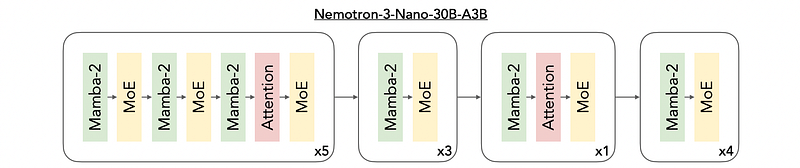
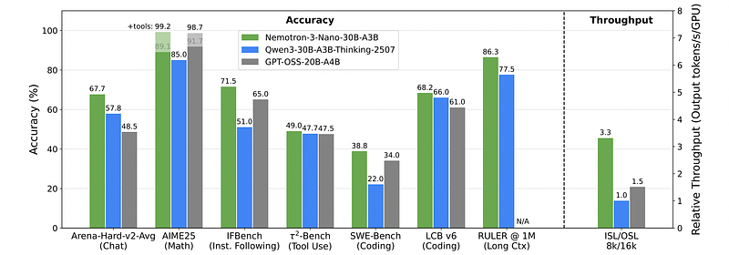
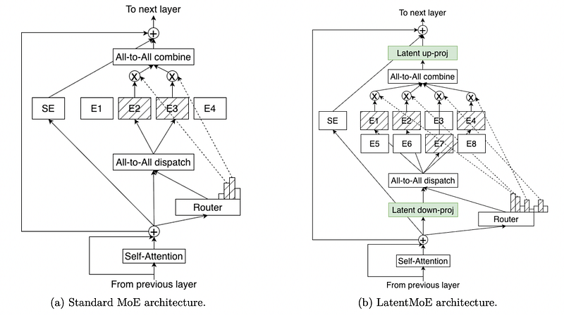
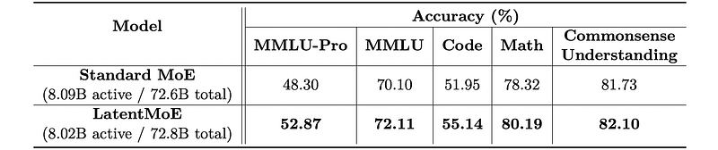
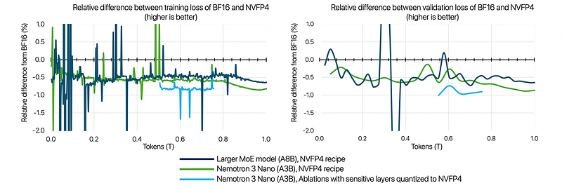
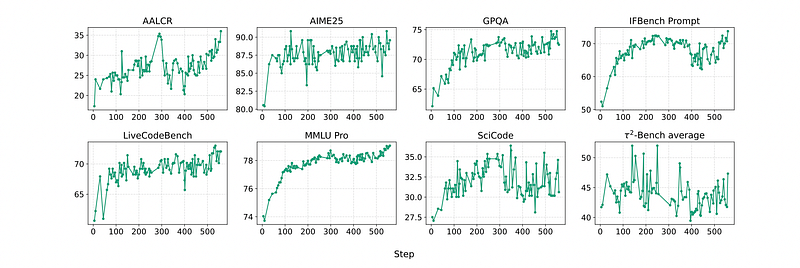
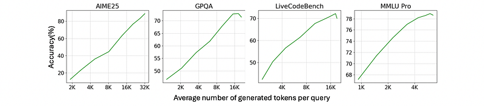

# Papers Explained 520 - Nemotron 3

The Nemotron 3 family of models utilize a hybrid Mamba-Transformer MoE architecture.

This page ingests the source article into the wiki and connects it to [[Papers Explained Corpus]], [[Large Language Models]], [[Mixture of Experts]], [[Model Compression and Efficiency]], [[Reasoning Models]], [[Code Models]].

## Source Metadata

- Source file: `raw/2026-01-09_Papers-Explained-520--Nemotron-3-62e863712b21.html`
- Source title: Papers Explained 520: Nemotron 3
- Published: 2026-01-09
- Canonical: [https://medium.com/@ritvik19/papers-explained-520-nemotron-3-62e863712b21](https://medium.com/@ritvik19/papers-explained-520-nemotron-3-62e863712b21)

## Key Ideas

- Nemotron 3 models predominantly interleave mixture-of-expert (MoE) layers with cheaper Mamba-2 layers which require storing only a constant state during generation. Only a select few attention layers are included in Nemotron 3 models.
- By minimizing expensive self-attention layers, Nemotron 3 models can achieve higher inference throughput compared to similarly-sized Transformer MoEs for common reasoning workloads (e.g., 8k input sequence length / 16k output sequence length).
- Both models have 8 billion active and 73 billion total parameters, trained for 1 trillion tokens with identical hyperparameters.
- Multi-Token Prediction (MTP) has emerged as a highly effective technique for improving both the accuracy and the inference efficiency of large language models.
- Integrating MTP leads to consistent gains across validation loss and a broad range of downstream benchmarks, including general knowledge, code generation, common-sense understanding, reading comprehension, and math.

## Notes

The Nemotron 3 family of models consists of Nano, Super, and Ultra. The models use a Mixture-of-Experts hybrid Mamba–Transformer architecture to provide best-in-class throughput and context lengths of up to 1M tokens. Super and Ultra models are trained with NVFP4 and incorporate LatentMoE, a novel approach that improves model quality. They also include MTP layers for faster text generation. All Nemotron 3 models are post-trained using multi-environment reinforcement learning enabling reasoning, multi-step tool use, and support granular reasoning budget control.

## Hybrid MoE

The Nemotron 3 family of models utilize a hybrid Mamba-Transformer MoE architecture.

Nemotron 3 models predominantly interleave mixture-of-expert (MoE) layers with cheaper Mamba-2 layers which require storing only a constant state during generation. Only a select few attention layers are included in Nemotron 3 models. This differs from interleaving MoE layers with expensive self-attention layers which need to attend over a linearly increasing KV Cache during generation.

By minimizing expensive self-attention layers, Nemotron 3 models can achieve higher inference throughput compared to similarly-sized Transformer MoEs for common reasoning workloads (e.g., 8k input sequence length / 16k output sequence length).

## LatentMoE

*Figure: Standard MoE vs. LatentMoE architectures.*

Transformer models are deployed in two settings: latency-focused, prioritizing response time, and throughput-focused, maximizing token processing capacity. Mixture of Experts (MoE) layers face different bottlenecks in each scenario. In latency-focused deployments, processing tens to hundreds of tokens at a time, MoE computation is memory-bandwidth-bound due to the cost of reading expert weights from memory. Reducing memory bandwidth costs requires decreasing either the model hidden dimension (𝑑) or the expert FFN intermediate dimension (𝑚). In throughput-focused deployments, processing thousands of tokens per iteration, the primary bottleneck is the all-to-all communication needed to dispatch tokens to experts and aggregate results. The communication volume scales linearly with the number of top-𝐾 active experts and the hidden dimension 𝑑, but is independent of 𝑚. The expressive power of FFN layers is controlled by the effective nonlinear budget, proportional to 𝐾 × 𝑚.

To improve model quality without compromising inference throughput or latency, the LatentMoE architecture is introduced. It shrinks the routed expert input dimension 𝑑 to reduce communication and memory costs and reinvests the saved capacity into increasing the nonlinear budget and expert diversity by scaling up the number of experts (𝑁) and the top-𝐾 active experts per token. LatentMoE projects token embeddings from the original hidden dimension 𝑑 into a smaller latent dimension ℓ, routes them to an expanded set of experts operating in the latent space, and then projects them back to 𝑑. This reduces per-expert weight loads and communication payloads by a factor of 𝑑/ℓ. The savings are used to increase the number of experts from 𝑁 to 𝑁′ = 𝑁·𝑑/ℓ and the top-𝐾 active experts per token from 𝐾 to 𝐾′ = 𝐾·𝑑/ℓ, enabling higher model quality at similar computational and communication budgets. Non-routed computations remain in the original hidden dimension 𝑑.

*Figure: Comparison of downstream task accuracy between Standard MoE and LatentMoE.*

Both models have 8 billion active and 73 billion total parameters, trained for 1 trillion tokens with identical hyperparameters. The Standard MoE uses a hidden dimension 𝑑 = 4096 with 128 total experts and 6 active experts, while LatentMoE uses a latent dimension ℓ = 1024 with 512 total experts and 22 active experts. LatentMoE consistently outperforms the Standard MoE baseline across all evaluated tasks.

## Multi-Token Prediction (MTP)

Multi-Token Prediction (MTP) has emerged as a highly effective technique for improving both the accuracy and the inference efficiency of large language models. Predicting multiple future tokens provides richer training signals and encourages models to plan several steps ahead. These auxiliary predictions also serve naturally as draft tokens for speculative decoding, enabling substantial end-to-end acceleration without requiring a separate draft model.

Integrating MTP leads to consistent gains across validation loss and a broad range of downstream benchmarks, including general knowledge, code generation, common-sense understanding, reading comprehension, and math. The predictions produced by MTP exhibit high agreement with the base model, enabling fast, low-latency generation, particularly beneficial in batch-size–1 and long-form generation scenarios.

## NVFP4 Training

NVFP4 features fine-grained micro-block scaling, block scaling factors, a global FP32 scale, and a specific element format. Nemotron 3 utilizes 2D block scaling for weight quantization, Random Hadamard Transforms (RHTs) on inputs to wgrad, and stochastic rounding on gradients.

- To maintain stability, the last 15% of the network is kept in high precision.

- Latent projections and MTP layers are kept in BF16 due to minimal impact on step-time and preservation of MTP capabilities.

- Attention layers in Nemotron 3 models are kept in BF16 to preserve fidelity.

- Mamba output projection layers are kept in MXFP8 to prevent information loss due to high flushes to zero.

*Figure: Relative difference in train loss (left) and validation loss (right) between models trained with NVFP4 and BF16.*

Combining the above modifications resulted in improved train and validation loss compared to keeping all layers in low precision.

- On Nano, the relative loss difference between NVFP4 and BF16 is less than 1%.

- This gap decreases to less than 0.6% for larger models with 8B active parameters.

- Downstream task evaluations show comparable performance between models trained in BF16 and NVFP4.

## Long Context

Rotary Position Embeddings (RoPE) are a known hurdle to extending context beyond the training length. Since Mamba layers provide implicit positional information, Nemotron 3 models do not use RoPE in attention layers and therefore do not suffer from out-of-distribution RoPE issues during context extension. For Nemotron 3 Nano, a continued pre-training (CPT) stage at a 512k sequence length, and supervised fine-tuning (SFT) was performed at a 256k sequence length. In addition, a long-context environment in the reinforcement learning stage with inputs up to 32k tokens is included. All three stages included synthetic data designed to support long-range retrieval, multi-hop reasoning, multi-document information aggregation, and related capabilities. The MoE hybrid architecture adopted for the Nemotron 3 models has better context extension capability compared to the dense hybrid architecture used in Nemotron 2 Nano.

## Multi-environment Reinforcement Learning Post-training

To teach Nemotron 3 the capabilities needed to succeed across such a broad range of tasks, a diverse set of reinforcement learning (RL) environments are created, covering mathematical and scientific reasoning, competitive coding, instruction following, software engineering, search, chat, general agentic tool use, long context, and more. Unlike previous models where separate training stages for different tasks were used, Nemotron 3 models are trained on all of these tasks simultaneously.

Simultaneous training is found to be more stable, less prone to reward hacking, and overall better compared to previous staged approaches. To improve sampling efficiency, an asynchronous RL architecture is employed that decouples training from inference and leverages multi-token prediction to accelerate rollout generation. For stable training, GRPO with masked importance sampling is used to account for discrepancies between the training and rollout policies. .

## Granular Reasoning Budget Control at Inference Time

*Figure: Accuracy-efficiency trade-off with reasoning budget control at inference time.*

Similar to Nemotron 2 Nano, the Nemotron 3 models are trained to work with inference-time budget control. Given a user-specified budget on the max number of tokens to use in a thinking trace and when the model reaches the budget, one can append the </think> token to the sequence and let the model continue to generate. The model will generate the response based on the partial thinking trace.

## Paper

NVIDIA Nemotron 3: Efficient and Open Intelligence [2512.20856](https://arxiv.org/abs/2512.20856)

## Figures

Figures from the Medium HTML export (`raw/2026-01-09_Papers-Explained-520--Nemotron-3-62e863712b21.html`); local copies under `wiki/assets/papers-explained-520-nemotron-3/` when download succeeded.

| Figure | Caption |
|--------|---------|
|  | Title card: Nemotron 3. |
|  | The Nemotron 3 family of models utilize a hybrid Mamba-Transformer MoE architecture. |
|  | By minimizing expensive self-attention layers, Nemotron 3 models can achieve higher inference throughput compared to similarly-sized... |
|  | Standard MoE vs. LatentMoE architectures. |
|  | Comparison of downstream task accuracy between Standard MoE and LatentMoE. |
|  | Relative difference in train loss (left) and validation loss (right) between models trained with NVFP4 and BF16. |
|  | Simultaneous training is found to be more stable, less prone to reward hacking, and overall better compared to previous staged approaches. |
|  | Accuracy-efficiency trade-off with reasoning budget control at inference time. |
## Related

- [[Papers Explained Corpus]]
- [[Large Language Models]]
- [[Mixture of Experts]]
- [[Model Compression and Efficiency]]
- [[Reasoning Models]]
- [[Code Models]]
- [[Papers Explained 519 - Nemotron-Parse 1.1]]
- [[Papers Explained 521 - Nemotron Nano V2 VL]]

#summary #topic
