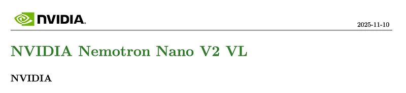
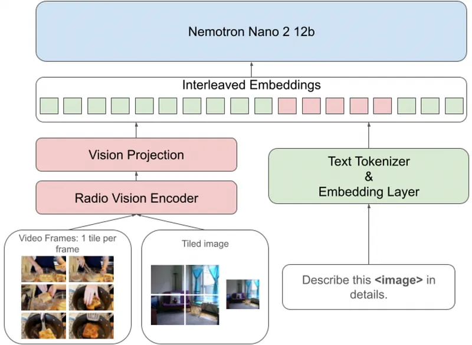
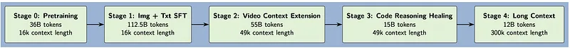
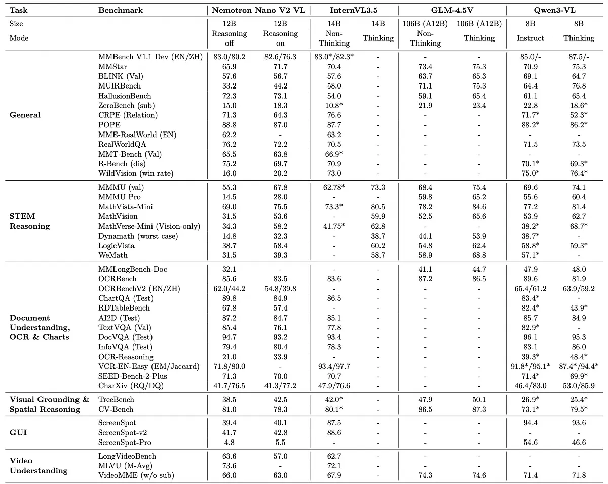
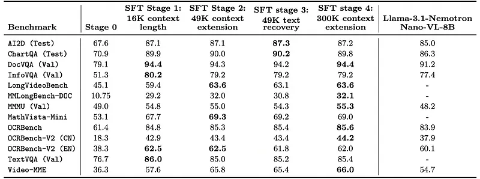
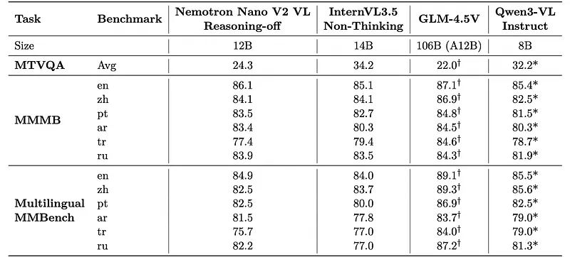
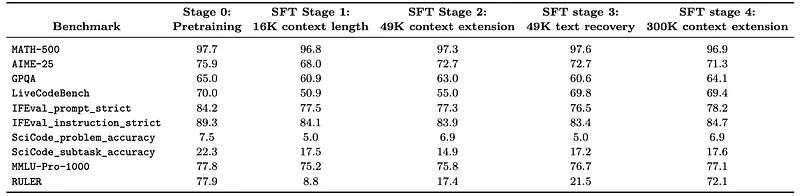
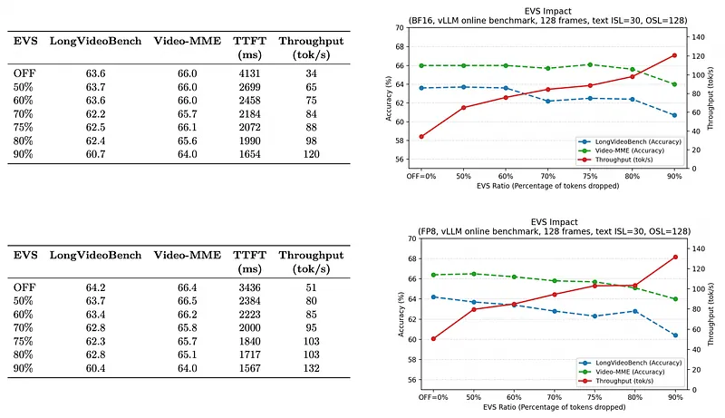

# Papers Explained 521 - Nemotron Nano V2 VL

Nemotron Nano V2 VL builds on Nemotron Nano V2, a hybrid Mamba-Transformer LLM and is designed for strong real-world document understanding, long video comprehension, and reasoning tasks.

This page ingests the source article into the wiki and connects it to [[Papers Explained Corpus]], [[Large Language Models]], [[Document AI]], [[Model Compression and Efficiency]], [[Reasoning Models]], [[Multilingual Models]], [[Supervised Fine-Tuning]].

## Source Metadata

- Source file: `raw/2026-01-12_Papers-Explained-521--Nemotron-Nano-V2-VL-80cdd141c3c8.md`
- Source title: Papers Explained 521: Nemotron Nano V2 VL
- Published: 2026-01-12
- Canonical: [https://medium.com/@ritvik19/papers-explained-521-nemotron-nano-v2-vl-80cdd141c3c8](https://medium.com/@ritvik19/papers-explained-521-nemotron-nano-v2-vl-80cdd141c3c8)

## Key Ideas

- The models are available on [HuggingFace](https://huggingface.co/collections/nvidia/nvidia-nemotron-v2/).
- The goal is to warm up the MLP connector to establish cross-modal alignment between the language and vision domains.
- Image Captioning: OpenImages, TextCaps, TextVQA, PixMo-cap.
- Video Captioning: Localized Narratives, YouCook2, VaTeX.
- General Visual QA: TextVQA, VQAv2, OK-VQA, GQA, CLEVR, CLEVR-Math, TallyQA, Dolly-15K, ScreenQA, VizWiz, MapQA, ScienceQA, PMC-VQA, MetaMathQA, UniGeo, CMM-Math, Geo-170K, VisualWebInstruct, LRV-Instruction, OCR-VQA, EST-VQA, ST-VQA, PixMo-AskModelAnything...

## Notes

Nemotron Nano V2 VL builds on Nemotron Nano V2, a hybrid Mamba-Transformer LLM and is designed for strong real-world document understanding, long video comprehension, and reasoning tasks. It delivers significant improvements over Llama-3.1-Nemotron-Nano-VL-8B, across all vision and text domains through major enhancements in model architecture, datasets, and training recipes. It uses innovative token reduction techniques to achieve higher inference throughput in long document and video scenarios.

The models are available on [HuggingFace](https://huggingface.co/collections/nvidia/nvidia-nemotron-v2/).

## Model Architecture

*Figure: VLM architecture.*

Nemotron Nano V2 VL consists of three modules: a vision encoder, an MLP projector, and a language model. The vision encoder is initialized using the c-RADIOv2-VLM-H version of the RADIOv2 vision encoder and the language model with Nemotron-Nano-12B-V2. A tiling strategy is adopted to handle varying image resolutions. First, each image is resized following the aspect ratio matching strategy employed by InternVL so that its width and height are multiples of 𝑠. Then it is divided into non-overlapping tiles of size 𝑠×𝑠. In this work, 𝑠= 512 is set. With a patch size of 16, this results in 1024 visual tokens per tile. For scalability, pixel shuffle with 2x downsampling is employed to reduce the token count further to 256. During training, the maximum number of tiles is set to 12. Additionally, a single-tile thumbnail of the image is used to capture global image context. For video inputs, each input frame is limited to a single tile.

## Training Recipe & Datasets

*Figure: Overview of the training stages for the VLM.*

### Stage 0

The goal is to warm up the MLP connector to establish cross-modal alignment between the language and vision domains. The vision encoder and language model weights are frozen and only the MLP connector is trained on a diverse multimodal subset of the Stage 1 SFT dataset, consisting of approximately 2.2M samples (up to 36B tokens) spanning multiple tasks, including captioning, visual question answering, visual grounding, OCR, and document extraction.

### SFT Stage 1: 16K context length

In this and all subsequent stages, all model components are unfrozen for training. This stage is trained on approximately 32.5 million samples (about 112.5 billion tokens). To preserve the text comprehension capabilities, a subset of the text reasoning data used in its Stage 1 SFT training is incorporated, comprising approximately 6.5 million samples (around 40 billion tokens) spanning diverse domains and tasks such as mathematics, science, code, multilingual understanding, multi-turn dialogue, tool-use, and safety. In addition, multimodal datasets totaling 26 million samples (approximately 72 billion tokens) drawn from various tasks and sources, including, are included.

- Image Captioning: OpenImages, TextCaps, TextVQA, PixMo-cap.

- Video Captioning: Localized Narratives, YouCook2, VaTeX.

- General Visual QA: TextVQA, VQAv2, OK-VQA, GQA, CLEVR, CLEVR-Math, TallyQA, Dolly-15K, ScreenQA, VizWiz, MapQA, ScienceQA, PMC-VQA, MetaMathQA, UniGeo, CMM-Math, Geo-170K, VisualWebInstruct, LRV-Instruction, OCR-VQA, EST-VQA, ST-VQA, PixMo-AskModelAnything, ALLaVA-4v, SLAKE, VQA-RAD, DreamSim, Spot-the-Diff, NLVR2.

- Video QA: CLEVRER, Perception Test, ALFRED, NextQA, VCG+112K.

- Visual Grounding: RefCOCO.

- OCR, Table & Document Extraction: SynthDog-en, SynthTabNet, DocLayNet, WebSight, TabRecSet, FinTabNet, PubTables-1M, TextOCR, HierText, FUNSD, CASIA-HWDB2, RCTW-17 , ReCTS-19, human-annotated CommonCrawl samples, synthetically generated tables, arXiv paper annotations generated using the NVPDFTex pipeline and translated to several other languages using mBART-large-50, and multilingual Wikimedia dumps.

- Document, Chart, Table and GUI QA: ChartQA, InfoVQA , AI2D, DocVQA, FigureQA, ECD-10K, ArXivQA, PlotQA, PixMo-Docs, TabMWP, SlideVQA, Docmatix, DocReason25K, UniChart, SimChart9K, MMTab, VisText, ScreenQA, WaveUI-25K, as well as synthetic QA labels generated for FinTabNet, HierText and CommonCrawl PDF samples transcribed using Nemo Retriever Parse.

- Visual Grounding: Visual7W, OpenImages.

- Function Calling: Glaive function calling, xLAM-60K.

The corpus is augmented with both human-annotated reasoning traces and model-generated traces produced by Qwen2.5-VL-32B-Instruct, GLM-4.1V, and GLM-4.5V across multiple datasets to reinforce the extended reasoning ability of the model in reasoning-on mode. Additionally, for datasets lacking explicit QA labels, synthetic question–answer pairs are generated from existing OCR extractions or captions using LLMs from the Qwen2.5 and Qwen3 families.

### SFT Stage 2: 49K context extension

The model is trained on approximately 11M samples (around 55B tokens), including a 25% subset of the Stage 1 dataset. Video and multi-image datasets comprising approximately 1.4 million samples (around 17 billion tokens) cover a diverse range of tasks across several data sources. These include:

- Video Classification: Kinetics

- Dense Video Captioning: YouCook2, HiREST ActivityNet

- Video Captioning: EgoExoLearn

- Temporal Action Localization: Breakfast Actions, Perception Test, HiREST, HACS Segment, FineAction, Ego4D-MQ, ActivityNet

- Video Temporal Grounding: YouCook2, QuerYD, MedVidQA, Ego4D-NLQ, DiDeMo

- General Video QA: LLaVA-Video-178K, Ego4D, TVQA, Perception Test, NextQA, EgoExoLearn, CLEVRER, and relabeling of the following datasets with Qwen2.5-VL-72B-Instruct into MCQ and open-ended questions: TAPOS, HC-STVG, EgoProceL, CrossTask.

- Multi-page QA: Synthetic multi-page QA data constructed from CommonCrawl PDF documents using Nemo Retriever Parse extractions.

- Multi-image captions: Mementos.

All the non-QA data is converted into QA formats. For video classification, temporal action localization and temporal grounding data, template questions are used to generate QA pairs. For video captioning and multi-page OCR captions, existing LLM models from the Qwen2.5 family synthesize both the questions and answers given the captions.

### SFT stage 3: 49K text recovery

After SFT Stages 1 and 2, a substantial drop in the LiveCodeBench score is observed compared to the LLM backbone, despite including the text reasoning data from Nemotron Nano 2. To recover this loss, an additional SFT Stage 3 is introduced, trained using only code reasoning data totaling 1M samples or 15B tokens.

### SFT stage 4: 300K context extension

The model’s context is extended and incorporates long-context data from the Stage 3 SFT stage of Nemotron Nano 2. This data accounts for around 74K samples or 12B tokens. The samples in this data are 160K tokens long on average, and training is conducted with a maximum sequence length of 311,296 to accommodate the longest samples.

### Training Details

The model is trained with FP8 precision at all stages to accelerate training. This configuration is applied to the LLM, vision encoder, and vision projection MLP, with the first and last layers of the LLM and the transformer blocks of the vision encoder kept in BF16.

For video inputs to the model, 2 frames per second are extracted, with a maximum of 128 frames for each video. If a video is longer than 64 seconds, 128 frames are uniformly sampled instead.

As text-only, image, and video samples vary significantly in sequence length, sequence packing reduces training time by minimizing the number of padding tokens required for batching.

For SFT stages 2, 3, and 4, context parallelism is employed in the LLM. Context parallelism partitions the LLM input along the sequence dimension, mitigating out-of-memory issues at longer sequence lengths. 2-way and 8-way context parallelism are used for SFT stages 2–3 and stage 4, respectively.

## Evaluation

*Figure: Comparison of Nemotron Nano V2 VL with existing open-source multimodal models.*

- Nemotron Nano V2 VL achieves competitive or strong performance across many multimodal benchmarks compared to InternVL3.5, GLM-4.5V, and Qwen3-VL of similar scale.

*Figure: Vision benchmarks after each training stage of Nemotron Nano V2 VL with reasoning-off.*

- Nemotron Nano V2 VL consistently outperforms Llama-3.1-Nemotron-Nano-VL-8B across all reported vision benchmarks.

- Long-context SFT stages (2 and 4) significantly improve long-context video and document benchmarks.

*Figure: Comparison of Nemotron Nano V2 VL with SOTA multimodal models on multimodal multilingual benchmarks.*

- On multilingual multimodal benchmarks, Nemotron Nano V2 VL shows strong accuracy across multiple languages, comparable to or better than other open-source models of similar size.

*Figure: Text benchmarks with reasoning on for the different stages*

After Stage 1 (16K context + vision), text reasoning degrades:

- LiveCodeBench drops from 70.0 (Stage 0) to ~50.9.

- RULER (long-context text) drops from ~77.9 to ~8.8.

Stage 2 (49K context extension) partially recovers long-context but not fully:

- LiveCodeBench ~55.0, RULER ~17.4.

Stage 3 (code reasoning recovery) and Stage 4 (300K context extension) restore text performance:

- LiveCodeBench ~69.4, RULER ~72.1, close to Stage 0 levels.

Vision benchmarks remain stable between Stages 2 and 3 , indicating that code-focused recovery does not harm vision.

*Figure: EVS Ablation.*

Building upon Efficient Video Sampling (EVS), it is integrated directly into the video-processing pipeline. EVS reduces the number of visual tokens by identifying and pruning temporally static patches — spatial regions that remain nearly unchanged between consecutive frames, while preserving positional identity and semantic consistency. This enables the model to process substantially longer videos with lower latency and memory consumption, without requiring architectural changes or retraining.

- As EVS ratio increases, TTFT decreases and throughput increases substantially, while accuracy on Video‑MME and LongVideoBench remains nearly unchanged, with only minor drops at high pruning ratios.

## Paper

NVIDIA Nemotron Nano V2 VL [2511.03929](https://arxiv.org/abs/2511.03929)

## Figures

Figures from the Medium HTML export (`raw/2026-01-12_Papers-Explained-521--Nemotron-Nano-V2-VL-80cdd141c3c8.md`); local copies under `wiki/assets/papers-explained-521-nemotron-nano-v2-vl/` when download succeeded.

| Figure | Caption |
|--------|---------|
|  | Title card: Nemotron Nano V2 VL. |
|  | VLM architecture. |
|  | Overview of the training stages for the VLM. |
|  | Comparison of Nemotron Nano V2 VL with existing open-source multimodal models. |
|  | Vision benchmarks after each training stage of Nemotron Nano V2 VL with reasoning-off. |
|  | Comparison of Nemotron Nano V2 VL with SOTA multimodal models on multimodal multilingual benchmarks. |
|  | Text benchmarks with reasoning on for the different stages. |
|  | EVS Ablation. |
## Related

- [[Papers Explained Corpus]]
- [[Large Language Models]]
- [[Document AI]]
- [[Model Compression and Efficiency]]
- [[Reasoning Models]]
- [[Multilingual Models]]
- [[Supervised Fine-Tuning]]
- [[Papers Explained 520 - Nemotron 3]]
- [[Papers Explained 522 - ToolOrchestra]]

#summary #topic
