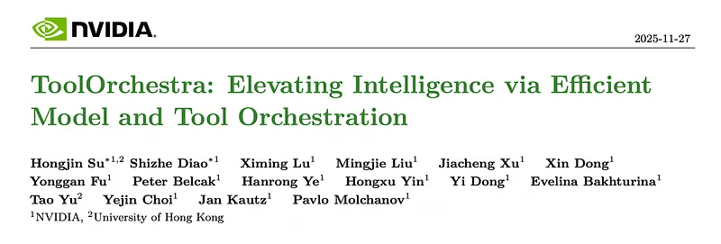
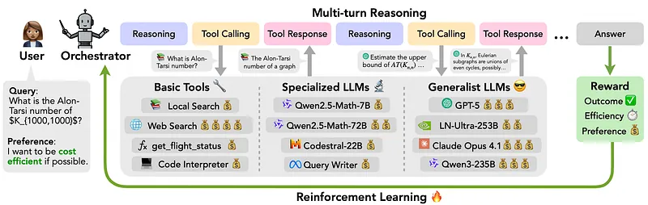
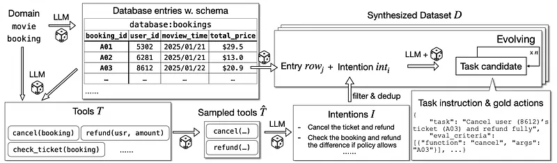
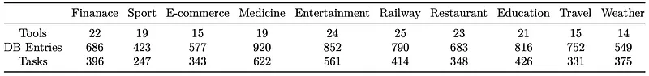
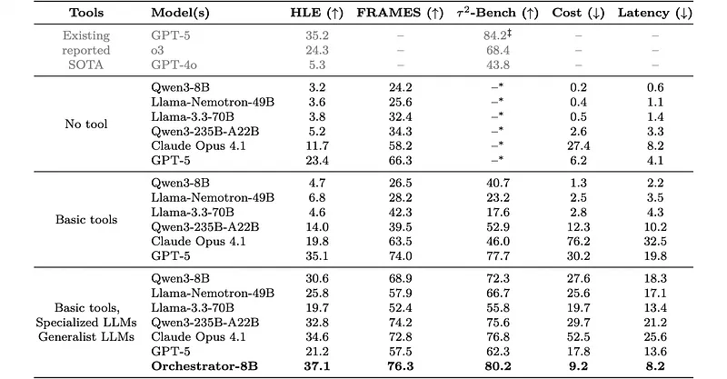

# Papers Explained 522 - ToolOrchestra

ToolOrchestra is a method for training small orchestrators that coordinate intelligent tools. It explicitly uses reinforcement learning with outcome-, efficiency-, and user-preference-aware rewards. Using ToolOrchestra, an 8B model called Orchestrator is developed.

This page ingests the source article into the wiki and connects it to [[Papers Explained Corpus]], [[Reinforcement Learning Topic]], [[Agentic AI]], [[Reasoning Models]], [[Model Compression and Efficiency]], [[Code Models]], [[Reinforcement Learning]].

## Source Metadata

- Source file: `raw/2026-01-13_Papers-Explained-522--ToolOrchestra-fc50eb47177f.md`
- Source title: Papers Explained 522: ToolOrchestra
- Published: 2026-01-13
- Canonical: [https://medium.com/@ritvik19/papers-explained-522-toolorchestra-fc50eb47177f](https://medium.com/@ritvik19/papers-explained-522-toolorchestra-fc50eb47177f)

## Key Ideas

- ToolOrchestra is a method for training small orchestrators that coordinate intelligent tools. It explicitly uses reinforcement learning with outcome-, efficiency-, and user-preference-aware rewards.
- The model and data are available [here](https://research.nvidia.com/labs/lpr/ToolOrchestra/).
- Given a user task, Orchestrator produces a solution via an iterative rollout that interleaves tool use with environment feedback to form a trajectory of turns. The rollout is initialized with a predefined system prompt and the question;
- Chain-of-thought (reasoning). Orchestrator analyzes the current state and plans the next action.
- Tool call (action). Based on its reasoning, Orchestrator selects a tool from the available set (e.g., APIs, specialized models, code interpreters) and specifies parameters.

## Notes

ToolOrchestra is a method for training small orchestrators that coordinate intelligent tools. It explicitly uses reinforcement learning with outcome-, efficiency-, and user-preference-aware rewards. Using ToolOrchestra, an 8B model called Orchestrator is developed.

The model and data are available [here](https://research.nvidia.com/labs/lpr/ToolOrchestra/).

## Agentic Problem Formulation

### Task Formulation

Multi-turn tool-use agentic tasks are formalized as a Markov Decision Process (MDP) ℳ= (𝒰,𝒮,𝒜,𝒪,𝒯,𝒵,𝑟,𝜌,𝛾). An instruction 𝑢∈𝒰, user action preferences 𝑝= (0 ≤𝑝𝑎 ≤1 for 𝑎∈𝒜), an initial state drawn from 𝜌(·|𝑢), an initial observation 𝑜0 ∈𝒪, and the environment state space 𝒮 are given. At step 𝑘, the Orchestrator chooses an action 𝑎𝑘 ∈𝒜according to a policy 𝜋𝜃(𝑎𝑘|ℎ𝑘) where ℎ𝑘 = (𝑢,𝑜0,𝑎0,𝑜1,…,𝑎𝑘−1,𝑜𝑘) is the interaction history. The environment transitions according to 𝒯(𝑠𝑘+1 |𝑠𝑘,𝑎𝑘) and emits an observation 𝑜𝑘+1 ∼𝒵(·|𝑠𝑘+1,𝑎𝑘). Actions 𝑎𝑖 come at costs 𝑐𝑖 and operational latency 𝑙𝑖, and the alignment of each action with user preferences is 𝑝𝑎𝑖. After 𝑁 interaction steps, the Orchestrator has traced the trajectory 𝜏 = ℎ𝑁 and the environment provides a reward 𝑟(𝜏) ∈[0,1] based on its correctness. The goal is to maximize the correctness reward 𝑟(𝜏) and the overall user preference alignment ∑︀𝑝𝑎𝑖 while minimizing the total cost ∑︀𝑐𝑖 and the aggregate latency ∑︀𝑙𝑖.

### Multi-Turn Rollout

Given a user task, Orchestrator produces a solution via an iterative rollout that interleaves tool use with environment feedback to form a trajectory of turns. The rollout is initialized with a predefined system prompt and the question; the model (assistant role) then generates an initial step that ends with an EOS token. Each turn follows a reasoning–action–observation loop:

- Chain-of-thought (reasoning). Orchestrator analyzes the current state and plans the next action.

- Tool call (action). Based on its reasoning, Orchestrator selects a tool from the available set (e.g., APIs, specialized models, code interpreters) and specifies parameters.

- Tool response (observation). If a tool call is present, the tool-call block is extracted and executed by the environment; the resulting output is appended to the context under the user role and fed back to the model for the next turn.

This process repeats until Orchestrator receives a termination signal from the environment or the rollout reaches a maximum of 50 turns.

## ToolOrchestra

*Figure: Overview of Orchestrator.*

### Unified Tool Calling

The toolset is broadened to include domain-specialized models and all tools are exposed through a single, unified interface. Tools are specified in JSON as a list of objects; each object defines the tool name, description, and a typed parameter schema (names and descriptions). When LLMs are used as tools, their descriptions are obtained with the following steps:

- Randomly sample 10 training tasks

- Obtain the trajectories of LLMs to finish these tasks

- Ask another LLM to write the description based on the task instructions, LLM trajectories and whether LLMs complete the tasks.

The complete catalog of tools used:

- Query writer: GPT-5, GPT-5-mini, meta-llama/Llama-3.3–70B-Instruct, meta-llama/Llama-3.1–8B-Instruct, deepseek-ai/DeepSeek-R1, nvidia/Llama-3_1-Nemotron-Ultra-253B-v1, microsoft/Phi-4-mini-instruct, google/gemma-3–27b-it, Qwen/Qwen3–32B.

- Web search:Tavily search API is used to provide orchestrator real-time web access.

- Local search: Faiss index with Qwen/Qwen3-Embedding-8B.

- Code writer + interpreter: GPT-5, GPT-5-mini, bigcode/starcoder2–15b, and Qwen/Qwen2.5-Coder-32B-Instruct are used as code expert models to write code. A Python sandbox is implemented to execute the code.

- Math models: Qwen/Qwen2.5-Math-72B, Qwen/Qwen2.5-Math-7B.

- Generalist models: GPT-5, GPT-5-mini, meta-llama/Llama-3.3–70B-Instruct, meta-llama/Llama-3.1–8B-Instruct, deepseek-ai/DeepSeek-R1, nvidia/Llama-3_1-Nemotron-Ultra-253B-v1, microsoft/Phi-4-mini-instruct, Qwen/Qwen3–32B.

### Reward design

Outcome, efficiency and preference rewards are used for the training.

For outcome reward, each rollout trajectory 𝜏 in a rollout batch T receives a binary accuracy reward 𝑟outcome(𝜏) ∈{0,1} based on whether 𝜏 solves the task. GPT-5 is leveraged as a judge to compare the answers, e.g., a name, a date, etc., providing greater flexibility in handling diverse predictions.

To encourage efficient solutions, the model under training is penalized for excessive compute or latency with the following rewards: 𝑟compute(𝜏) =−$(𝜏), 𝑟latency(𝜏) =−Clock(𝜏), where $(𝜏) is the monetary cost of 𝜏 and Clock(𝜏) is the consumed wall-clock time by 𝜏. To establish a unified measurement on the compute of both open-sourced and proprietary models, both the input tokens and output tokens are converted to monetary costs following the third-party API pricing systems.

Preference reward is designed to encourage models to consider user preferences when choosing tools at each step. For each trajectory τ, a metric vector M(τ) is constructed that captures:

- Tool-use counts: how many times each tool t₁…tₙ is invoked in τ.

- Outcome: a binary accuracy signal r_outcome(τ) ∈ {0, 1} indicating whether τ solves the task.

- Efficiency: the compute cost r_compute(τ) = −$(τ) and latency r_latency(τ) = −Clock(τ).

To make these metrics comparable across trajectories in a rollout batch T, each element of M(τ) is normalized to [0, 1] using min–max scaling over the batch. If a metric has the same min and max in the batch (i.e., no variance), its contribution is set to 0 to avoid noisy or degenerate signals.

A user specifies preferences via a vector P = [p_t₁, p_t₂, …, p_tₙ, p_outcome, p_compute, p_latency], with each component in [0, 1]. These weights express how much the user wants to prioritize each aspect. For instance:

- p_t₁ = 1 indicates a strong preference to use tool t₁ more frequently.

- p_outcome = 1 and p_compute = 0 indicate maximizing accuracy while ignoring compute cost.

The preference reward for a trajectory τ is the dot product of the normalized metrics and the preference vector, gated by task success.

### Training Procedure

Orchestrator is fine-tuned using Group Relative Policy Optimization (GRPO). Each trajectory 𝜏 ∈T is assigned a scalar reward 𝑅(𝜏),and GRPO normalizes this reward within its group to compute an advantage:

The policy is then updated to maximize the clipped surrogate objective:

where ratio 𝜃(𝜏) =𝜋𝜃(𝜏) / 𝜋old (𝜏) is the likelihood ratio between the current and previous policy.

To stabilize RL training and avoid KL loss explosion for this agent system, the following are performed during backward propagation:

- Homogeneity filtering: when the standard deviation of rewards in a rollout batch is smaller than 0.1, because this indicates that most rollouts in a batch exhibit similar behaviors, and provides weak training signals

- Format consistency filtering: when the example output is not aligned with the tool call format

- Invalid output filtering: when the example does not produce a valid answer or output.

## Data Synthesis

*Figure: Overview of ToolScale data synthesis pipeline.*

To generate verifiable data for agentic tool-call tasks, a two-step process is used:

- Simulating rich user-agent-tool environments, including creating database schemas and tool APIs;

- Generating diverse user tasks together with their corresponding ground truth solutions based on the environment.

To simulate real-world user-agent-tool environments scalably, a domain 𝐷 is chosen and an LLM is asked to generate a database which includes schema, major subjects to focus on and database entries. Based on the given domain 𝐷, the LLM proposes frequently-used tools. To increase the diversity of the task instructions, the LLM first proposes diverse intents frequently seen in domain 𝐷, and then converts them to specific tasks based on detailed database information. Each generated task consists of task instruction 𝐼, golden function calls 𝐴= 𝑎1,𝑎2,…,𝑎𝑙, and short information 𝑜 that must be mentioned during the process to solve the task. To enhance the difficulty of the generated tasks, an additional LLM is leveraged to complicate tasks by adding more complexities such as more constraints.

To ensure the quality of the synthesized data, the data is filtered to remove a task if:

- the execution of golden function calls reports an error

- LLMs cannot solve it in pass@8

- the task can be solved without any actions.

*Figure: Statistics of ToolScale.*

User preference

To train Orchestrator to account for preferences in tool selection, pairs of preference instruction 𝑃𝐼 and preference vectors 𝑃 are constructed. These indicate the extent a user would like to optimize certain features, e.g., latency, or the frequency to use a particular tool. Given a tool set {𝑡1,𝑡2,…,𝑡𝑛}, and the corresponding configuration metadata (e.g., tool price, latency), an LLM proposes diverse pairs of (𝑃𝐼,𝑃), which are then validated by another LLM to verify consistency. The pairs are then split into two sets Pairs𝑡𝑟𝑎𝑖𝑛 and Pairs𝑒𝑣𝑎𝑙 for training and evaluation, respectively. The generated preference instruction is concatenated to the example instruction, and training and testing data are augmented with user preference.

General tool configuration

To emulate heterogeneous user access, the subset of tools available in each training instance is randomized, encouraging Orchestrator to optimize under varying constraints rather than relying on a fixed toolkit. Pricing schedules are also varied across training instances to reflect heterogeneous tool costs, exposing the model to different cost configurations so it learns to adapt its optimization strategy as prices change.

## Training Configuration

Qwen3–8B serves as the backbone LLM and is trained on the GeneralThought-430K 3 dataset in conjunction with synthetic data. The training configuration utilizes a maximum input sequence length of 24,000, and a maximum generation length of 8,000, with a training batch size of 16 and a rollout batch size of 8. A maximum of 50 turns are allowed for the Orchestrator to finish a task during rollout.

## Evaluation

The following tool set is fixed in the evaluation for fair comparison:

- Basic tools: Tavily web search API, Python sandbox (code interpreter), Faiss index with Qwen3-Embedding-8B for local search, plus domain-specific functions (e.g., get_flight_status)

- Specialized LLMs: GPT-5 / GPT-5-mini as code writers, Qwen2.5-Coder-32B-Instruct as another code writer, Qwen2.5-Math-72B and Qwen2.5-Math-7B as math experts

- Generalist LLMs: GPT-5, GPT-5-mini, Llama-3.3–70B-Instruct, Qwen3–32B

Baselines

Prompt-based orchestrators built from LLMs

Off-the-shelf monolithic LLM systems:

- Without tools

- With basic tools

- With expanded tools (including specialized and strong generalist models)

Baseline models include GPT-5, Claude Opus 4.1, Llama-3.3–70B-Instruct, Qwen3–235B-A22B, Llama-3.3-Nemotron-Super-49B-v1, Qwen3–8B

Benchmarks: Humanity’s Last Exam (HLE), FRAMES, and τ²-Bench, all targeting complex reasoning

*Figure: Comparison of Orchestrator-8B with baselines.*

- Large monolithic models without tools (e.g., Qwen3–235B-A22B, Llama-3.3–70B) perform poorly, showing that HLE, FRAMES, and τ²-Bench require tool use or advanced reasoning mechanisms.

- τ²-Bench cannot be solved at all without tools.

Tool access improves some models but with high cost and latency:

- Claude Opus 4.1: HLE 11.7 → 19.8 and FRAMES 58.2 → 63.5 when using tools, but with ~2.8× cost and ~4× latency increase.

- Smaller models like Qwen3–8B remain weak (e.g., 4.7 on HLE), indicating basic tools alone are insufficient.

Adding specialized and generalist models generally boosts performance but inconsistently and with substantial overhead:

- Qwen3–235B-A22B: HLE 14.0 → 32.8, FRAMES 39.5 → 74.2 when using tools + models, at >2× cost and latency.

- GPT-5 with tools + models can suffer performance drops due to biases (e.g., over-reliance on GPT-5-mini).

Orchestrator-8B achieves:

- HLE: 37.1 (best among all compared systems)

- FRAMES: 76.3 (best among all compared systems)

- τ²-Bench: 43.8, outperforming GPT-5 with basic tools by 2.5% absolute

It consistently beats strong baselines:

- +2.0 points over GPT-5 with tools on HLE (35.1 → 37.1)

- +4.3 points over Qwen3–235B-A22B with tools + models on HLE (32.8 → 37.1)

These gains come with only a small fraction of the cost and latency compared to large monolithic or tool-augmented systems.

## Paper

ToolOrchestra: Elevating Intelligence via Efficient Model and Tool Orchestration [2511.21689](https://arxiv.org/abs/2511.21689)

## Figures

Figures from the Medium HTML export (`raw/2026-01-13_Papers-Explained-522--ToolOrchestra-fc50eb47177f.md`); local copies under `wiki/assets/papers-explained-522-toolorchestra/` when download succeeded.

| Figure | Caption |
|--------|---------|
|  | Title card: ToolOrchestra. |
|  | Overview of Orchestrator. |
|  | The preference reward for a trajectory τ is the dot product of the normalized metrics and the preference vector, gated by task success. |
|  | The policy is then updated to maximize the clipped surrogate objective. |
|  | The policy is then updated to maximize the clipped surrogate objective. |
|  | Overview of ToolScale data synthesis pipeline. |
|  | Statistics of ToolScale. |
|  | Comparison of Orchestrator-8B with baselines. |
## Related

- [[Papers Explained Corpus]]
- [[Reinforcement Learning Topic]]
- [[Agentic AI]]
- [[Reasoning Models]]
- [[Model Compression and Efficiency]]
- [[Code Models]]
- [[Reinforcement Learning]]
- [[Papers Explained 521 - Nemotron Nano V2 VL]]
- [[Papers Explained 523 - Meta CLIP]]

#summary #topic
