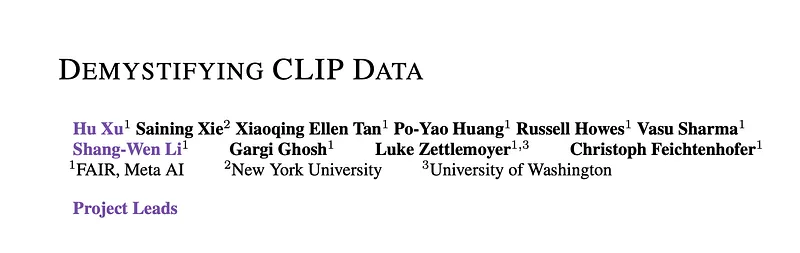
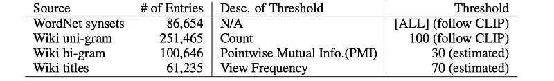
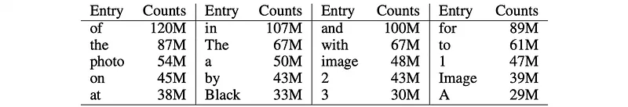
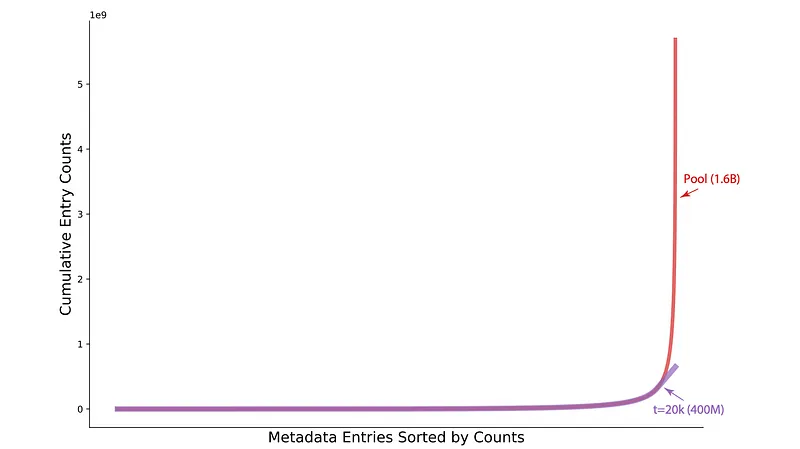
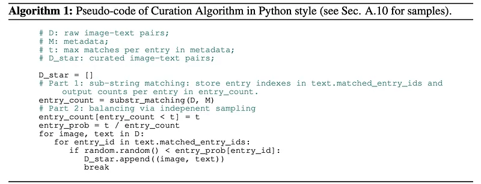
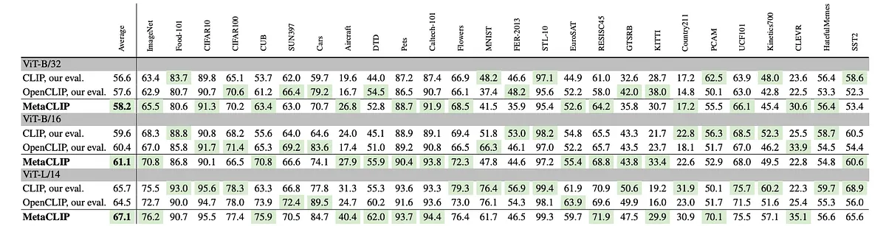
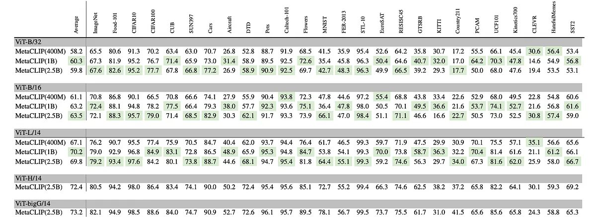

# Papers Explained 523 - Meta CLIP

This work intends to reveal CLIP’s data curation approach and, in pursuit of making it open to the community, introduce Metadata-Curated Language-Image Pre-training (MetaCLIP). MetaCLIP takes a raw data pool and metadata (derived from CLIP’s concepts) and yields a balanced subset over the metadata distribution.

This page ingests the source article into the wiki and connects it to [[Papers Explained Corpus]], [[Vision Language Models]], [[Embedding and Retrieval]], [[Agentic AI]].

## Source Metadata

- Source file: `raw/2026-01-14_Papers-Explained-523--Meta-CLIP-29a47642feff.md`
- Source title: Papers Explained 523: Meta CLIP
- Published: 2026-01-14
- Canonical: [https://medium.com/@ritvik19/papers-explained-523-meta-clip-29a47642feff](https://medium.com/@ritvik19/papers-explained-523-meta-clip-29a47642feff)

## Key Ideas

- This work intends to reveal CLIP’s data curation approach and, in pursuit of making it open to the community, introduce Metadata-Curated Language-Image Pre-training (MetaCLIP).
- The project is available on [GitHub](https://github.com/facebookresearch/MetaCLIP/).
- The goal is to uncover CLIP’s data curation process, which involves preserving signals in the data while minimizing noise. CLIP’s WIT400M is curated with an information retrieval method, quoting the CLIP paper:
- Starting by re-building CLIP’s 500,000-query metadata
- The base query list is all words occurring at least 100 times in the English version of Wikipedia. This is augmented with bi-grams with high pointwise mutual information as well as the names of all Wikipedia articles above a certain search volume.

## Notes

This work intends to reveal CLIP’s data curation approach and, in pursuit of making it open to the community, introduce Metadata-Curated Language-Image Pre-training (MetaCLIP). MetaCLIP takes a raw data pool and metadata (derived from CLIP’s concepts) and yields a balanced subset over the metadata distribution.

The project is available on [GitHub](https://github.com/facebookresearch/MetaCLIP/).

## MetaCLIP

The goal is to uncover CLIP’s data curation process, which involves preserving signals in the data while minimizing noise. CLIP’s WIT400M is curated with an information retrieval method, quoting the CLIP paper:

> To address this, we constructed a new dataset of 400 million (image, text) pairs collected from a variety of publicly available sources on the Internet. To attempt to cover as broad a set of visual concepts as possible, we search for (image, text) pairs as part of the construction process whose text includes one of a set of 500,000 queries We approximately class balance the results by including up to 20,000 (image, text) pairs per query.

### Metadata Construction: M= {entry}

Starting by re-building CLIP’s 500,000-query metadata

> The base query list is all words occurring at least 100 times in the English version of Wikipedia. This is augmented with bi-grams with high pointwise mutual information as well as the names of all Wikipedia articles above a certain search volume. Finally all WordNet synsets not already in the query list are added.

The metadata, comprised of ‘queries’ or ‘entries’, consists of four components:

- all synsets of WordNet

- uni-grams from the English version of Wikipedia occurring at least 100 times

- bi-grams with high pointwise mutual information

- titles of Wikipedia articles above a certain search volume.

These components are rebuilt from WordNet and Wikipedia.

*Figure: Composition of MetaCLIP Metadata.*

### Sub-String Matching: text →entry

After constructing the metadata, CLIP’s curation aligns a pool of image-text pairs with metadata entries through sub-string matching. The sub-string matching step retains only high-quality matching texts, automatically filtering out various types of noises that a typical filter system would consider on a case-by-case basis.

> We also restrict this step in CLIP to text-only querying for sub-string matches while most webly supervised work uses standard image search engines …

The pool size used by CLIP’s curation is unknown (“a variety of publicly available sources”). CommonCrawl (CC) is adopted as the source to build such a pool and sub-string matching is re-applied to this source. This resulted in a pool of 1.6B image-text pairs (5.6B counts of sub-string matches). One text can have multiple matches of entries and there are 3.5 matches per text on average. As a result, sub-string matching builds the mapping txt →entry. This step has two outcomes:

- low-quality text is dropped

- unstructured text now has a structured association with metadata.

For all English text,∼50% image-text pairs are kept in this stage. This approach looks for quality matches and automatically gets rid of some type of noise (such as date strings) that a typical filter system would remove consider case-by-case (e.g., regular expression on dates, ids etc.).

### Inverted Indexing: entry →text

Following sub-string matching, CLIP builds an inverted index of the data pool. All texts associated with each metadata entry are aggregated into lists, creating a mapping from each entry to the corresponding texts, entry →text.

*Figure: Summary of counts for entries.*

- Out of 500K entries, 114K entries have no matches. This signifies the importance of knowing the training data distribution since it is very likely the training data does not have certain visual concepts.

- Only 16K entries had counts higher than 20K, accounting for only 3.2% (16K/500K) of the entries, but their counts made up 94.5% (5.35B/5.6B) of the total counts of all entries.

*Figure: Top-20 entries with counts.*

### Query and Balancing with t ≤20K

The key secret behind OpenAI CLIP’s curation is to balance the counts of matched entries. For each metadata entry, the associated list of texts (or image-text pairs) is sub-sampled, ensuring that the resulting data distribution is more balanced. This step aims to mitigate noise and diversify the distribution of data points, making the data more task-agnostic as foundation data for pre-training.

The magic number t = 20k is a threshold used to limit the number of texts/pairs for each entry. Entries with fewer than t pairs (tail entries) retain all associated pairs, while entries with more than t pairs (head entries) are sub-sampled to t pairs. The selection is based on the density of information in texts; texts with more matched entries have a higher chance of being curated (recall that the average is 3.5 matches per text).

*Figure: Cumulative sum of counts on entries from tail to head on a data pool with 1.6B image-text pairs (5.6B match counts).*

- Interestingly, the value of t = 20k seemingly represents the transition from tail to head entries, when the head entries start exhibiting an exponential growth rate.

- By applying a max count of t, the growth rate of total counts (i.e., the scale of resulting data points) is reduced to linear.

- This significantly flattens (and balances) the training data distribution.

In summary, balancing yields three interesting outcomes:

- It reduces dominance and noise from head entries, like common web terms. E.g., out of 400M pairs, only 20k texts containing “photo” are kept (while there are 54M “photo” instances in the pool).

- It diversifies the data distribution and balances tail/head entries, leading to a more task-agnostic foundation.

- Sampling for each entry ensures that data points with more matched entries or denser information are prioritized for curation.

## A Simple Algorithm For Curation

It is assumed that CLIP curation constructs an inverted index that maps entries to documents (image-text pairs) to enable efficient search for each entry. In contrast, the algorithm approaches the balancing process through independent sampling. This avoids the need to build an inverted index that could potentially store hundreds of millions of concrete pairs for popular entries, thereby improving efficiency and scalability.

The algorithm takes three inputs: metadata M, a data pool D, and a hyper-parameter t. It aims to find a subset D∗with a balanced distribution over M, denoted as D∗←f (D; M, t). The algorithm consists of two parts, each corresponding to a specific stage of the curation process.

### Part 1: Entry Counts from Sub-string Matching

The substr_matching function outputs the total counts of matches per entry, entry_count, represented as a NumPy array indexed by entry_id. Each text is associated with matched_entry_ids that contains a list of matched entries.

### Part 2: Balancing via Independent Sampling

Instead of building an expensive inverted index with associated lists of texts for each entry, each data point is sampled independently. The probability of sampling each entry, entry_prob, is computed. Tail entries (entry_count < t) have a probability equal to 1, and head entries have a probability less than 1. Image-text pairs are iterated through and each pair is sampled/curated. When an image-text pair has a matched entry sampled/selected, that pair is included in D∗.

## Experiment Setup

Two pools of data are collected. Pool 1 contains 1.6 billion image-text pairs with a total of 5.6 billion counts of matches. This pool was used to estimate a target of 400M image-text pairs, collected from 15 snapshots of Common-Crawl (CC) from January 2021 to January 2023.

Pool 2 aims to scale curation in the data pipeline. All 90 CC snapshots from 2013 to April 2023 are parsed, using an algorithm to curate from a pool of 10.7B matched image-text pairs that are originally from a large set of URL-text pairs, which have undergone de-duplication, English Language IDentification (LID) and sub-string matching. However, (expensive) image downloading, storing, and transferring are only performed for data points that are distribution-calibrated and selected by the algorithm.

For balancing, two scenarios are considered on this data: (i) t = 170k, which is resulting in 2.5B image-text pairs. This t = 170k configuration has tail counts amounting to 6% of the total counts, the same tail/head ratio that the 400M Pool 1 data has, produced by applying t = 20k on the 1.6B Pool 1 data. (ii) The t = 20k threshold applied to Pool 2 which results in 1B image-text pairs and compared to the 400M set from Pool 1 only increases tail metadata matches (head counts are capped at 20k).

## Results

*Figure: MetaCLIP-400M vs. CLIP (WIT400M data) and OpenCLIP (LAION-400M data)*

MetaCLIP consistently outperforms OpenAI CLIP across three model sizes on ImageNet and on the average over 26 tasks:

- ViT-B/32 (400M data): +2.1% on ImageNet, +1.6% average over 26 tasks.

- ViT-B/16: +2.5% on ImageNet, +1.5% average.

- ViT-L/14: +0.7% on ImageNet, +1.4% average.

*Figure: Scaling MetaCLIP from 400M (t=20k) to 1B (t=20k) and 2.5B (t=170k) training data.*

- Scaling from 400M to 1B and 2.5B image–text pairs yields large gains over 400M, even with the same number of training iterations.

- Overall average accuracies for 1B and 2.5B are similar (e.g., 70.2% vs 69.8% for ViT-L), indicating diminishing returns in average accuracy beyond 1B under fixed compute.

- 1B (more balanced, tail-focused) improves downstream accuracy on tasks with specific/rare categories (e.g., CUB fine-grained birds, Flowers, KITTI, PCAM).

- 2.5B (more long-tail, more head entries) yields broader but smaller improvements across many datasets.

- On ImageNet with 2.5B training data, ViT-B/32: 67.6% accuracy, surpassing previously believed saturation for B/32 models (ViT-L/14: 79.2%, ViT-H/14: 80.5%, ViT-bigG/14: 82.1%)

## Paper

Demystifying CLIP Data [2309.16671](https://arxiv.org/abs/2309.16671)

## Figures

Figures from the Medium HTML export (`raw/2026-01-14_Papers-Explained-523--Meta-CLIP-29a47642feff.md`); local copies under `wiki/assets/papers-explained-523-meta-clip/` when download succeeded.

| Figure | Caption |
|--------|---------|
|  | Title card: Meta CLIP. |
|  | Composition of MetaCLIP Metadata. |
|  | Summary of counts for entries. |
|  | Top-20 entries with counts. |
|  | Cumulative sum of counts on entries from tail to head on a data pool with 1.6B image-text pairs (5.6B match counts). |
|  | The algorithm takes three inputs: metadata M, a data pool D, and a hyper-parameter t. |
|  | MetaCLIP-400M vs. CLIP (WIT400M data) and OpenCLIP (LAION-400M data). |
|  | Scaling MetaCLIP from 400M (t=20k) to 1B (t=20k) and 2.5B (t=170k) training data. |
## Related

- [[Papers Explained Corpus]]
- [[Vision Language Models]]
- [[Embedding and Retrieval]]
- [[Agentic AI]]
- [[Papers Explained 522 - ToolOrchestra]]
- [[Papers Explained 524 - Meta CLIP 2]]

#summary #topic
