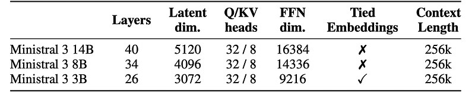
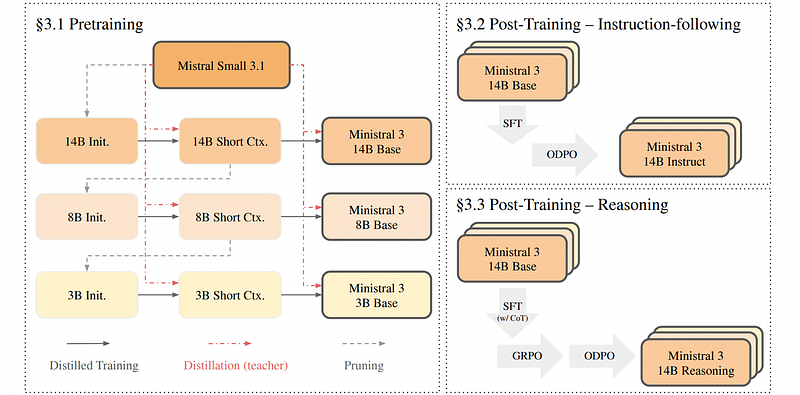
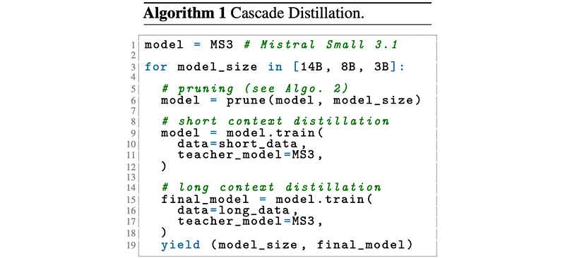
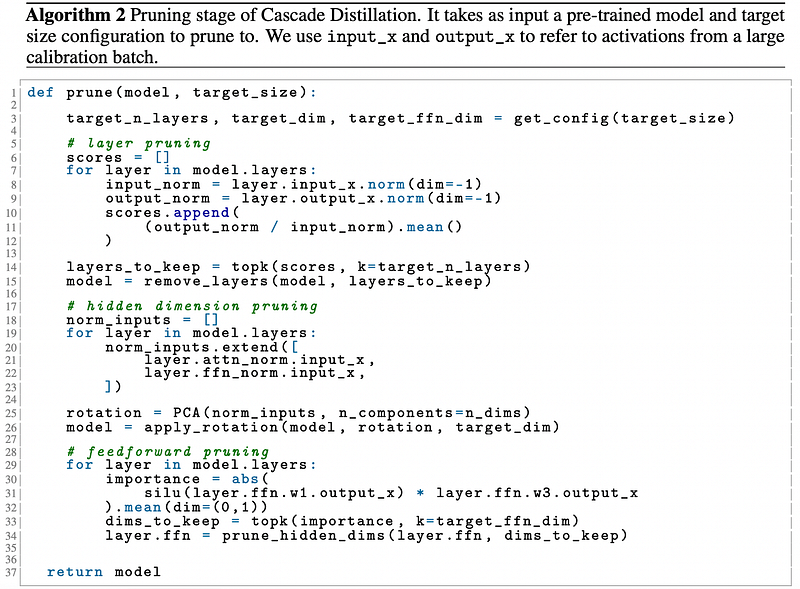
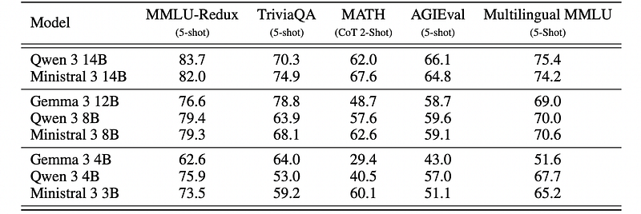
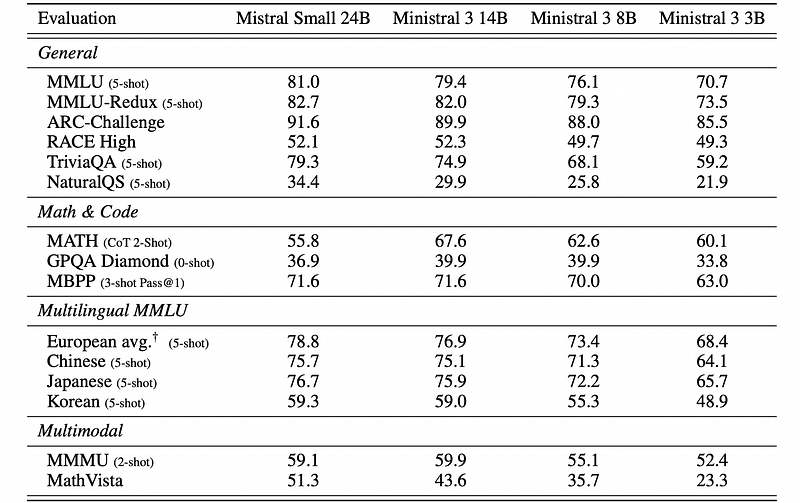
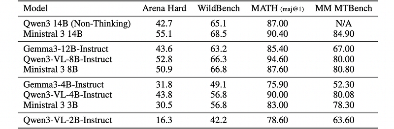
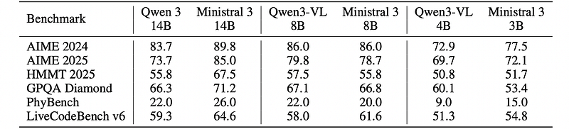

# Papers Explained 526 - Ministral 3

The models are available at [HuggingFace](https://huggingface.co/collections/mistralai/ministral-3).

This page ingests the source article into the wiki and connects it to [[Papers Explained Corpus]], [[Large Language Models]], [[Model Compression and Efficiency]], [[Vision Language Models]], [[Embedding and Retrieval]], [[Computer Vision]], [[Model Distillation]].

## Source Metadata

- Source file: `raw/2026-01-19_Papers-Explained-526--Ministral-3-81f394784f92.html`
- Source title: Papers Explained 526: Ministral 3
- Published: 2026-01-19
- Canonical: [https://medium.com/@ritvik19/papers-explained-526-ministral-3-81f394784f92](https://medium.com/@ritvik19/papers-explained-526-ministral-3-81f394784f92)

## Key Ideas

- The Ministral 3 family is based on the decoder-only transformer architecture. All models share a common architectural foundation with size-specific scaling.
- Other architectural choices include Grouped Query Attention with 32 query heads and 8 key-value heads, RoPE positional embeddings, SwiGLU activation, and RMSNorm.
- All Ministral 3 models use a 410M parameter ViT as a vision encoder for image understanding that is copied from Mistral Small 3.1 Base and kept frozen, with the same architecture described in Pixtral.
- Pretraining of the Ministral 3 models starts from the Mistral Small 3.1 Base model. A Cascade Distillation, an iterative “prune-distill-repeat” approach, is used.
- Prune: initialize the weights of a child model via pruning a larger pre-trained model.

## Notes

Ministral 3 series is a family of parameter-efficient dense language models designed for compute and memory constrained applications. These models are trained through Cascade Distillation, an iterative pruning and continued training with distillation technique. The Ministral 3 series is available in three model sizes: 3B, 8B, and 14B parameters. For each model size, three variants are released: a pretrained base model for general-purpose use, an instruction finetuned model, and a reasoning model for complex problem-solving.

The models are available at [HuggingFace](https://huggingface.co/collections/mistralai/ministral-3).

## Model Architecture

The Ministral 3 family is based on the decoder-only transformer architecture. All models share a common architectural foundation with size-specific scaling.

*Figure: Architectural specifications and hyperparameters for the Ministral 3 family.*

Other architectural choices include Grouped Query Attention with 32 query heads and 8 key-value heads, RoPE positional embeddings, SwiGLU activation, and RMSNorm. For long-context extension, YaRN and position-based softmax temperature scaling in the attention layer are used. The 3B model uses tied input-output embeddings to avoid embedding parameters dominating the overall parameter count. All models use a vocabulary of 131K tokens and support context lengths up to 256K tokens.

All Ministral 3 models use a 410M parameter ViT as a vision encoder for image understanding that is copied from Mistral Small 3.1 Base and kept frozen, with the same architecture described in Pixtral. The pretrained projection layer from the ViT to language model’s space is discarded and a new projection is trained for every model.

## Training Recipe

*Figure: Overview of Ministral 3 training recipe.*

### Pretraining

Pretraining of the Ministral 3 models starts from the Mistral Small 3.1 Base model. A Cascade Distillation, an iterative “prune-distill-repeat” approach, is used.

- Prune: initialize the weights of a child model via pruning a larger pre-trained model.

- Distill: up-train the freshly pruned model via distillation from the teacher model’s logits.

- Repeat: apply this strategy repeatedly to shrink the child model into something even smaller.

Pruning

Pruning strategies are designed to preserve the most critical components of the original model (over a validation dataset) while reducing its size. The following key pruning techniques are employed:

- Layer Pruning: Unlike Minitron, which relies on counterfactual downstream perplexities from removing individual layers, a simpler yet strong proxy for layer importance is found in the ratio of input to output activation norms.

- Hidden Dimension Pruning: Principal Component Analysis (PCA) is applied to concatenated activations from attention normalization and feed-forward normalization layers across all layers. This yields a single rotation matrix consistent across the entire network that projects the model to a lower-dimensional space while maximizing explained variance.

- Feedforward Dimension Pruning: For MLPs with gated-linear activation functions such as SwiGLU, expressed as W2(SiLU(W1x) ∗ W3x) given a very large batch x, the dimension of the matrices W1,W2,W3 is pruned. To determine the columns of W1,W3 to keep, the importance score defined as the averaged absolute value of each dim of the expression above is computed. Only the corresponding rows of W2 with the indices yielded above are kept.

Distillation

After weight initialization, each child model is trained on a mixture of text-only and interleaved text with image data with logit distillation from a teacher model. Training with just the forward KL distillation objective outperforms tuning the coefficients of an objective that weights the distillation objective and the next token prediction objective differently. For all stages and model sizes, the parent model is used as the teacher model. The pretraining phase consists of a two-stages:

- A short context stage with a context window of length 16,384. The output of this phase is the input to the pruning phase of the next child model.

- A long context stage to extend the context window from 16,384 to 262,144 using YaRN and position-based temperature scaling.

### Post-Training: Ministral Instruct

The fine-tuning phase consists of two stages: Supervised Fine-Tuning (SFT) and Online Direct Preference Optimization (ODPO).

Supervised Fine-tuning is run with fp8 quantization, using a logit distillation loss from a strong teacher. Each model is distilled from Mistral Medium 3 model. Similar to the pretraining phase, the vision encoder remains frozen while the adapter is trainable.

The Online Direct Preference Optimization stage samples two candidate responses from the current policy with temperature T=0.7, and uses a text-based reward model to rank the responses. This method relies on a Pairwise Reward Model (PWRM) to dynamically rank candidate responses. The PWRM is trained via supervised fine-tuning (SFT) on structured pairwise data: given a conversation history and two candidate responses, it predicts which response is preferred. Additionally, the classic DPO loss is refined by incorporating the binomial probabilistic output of the PWRM, replacing hard winner/loser labels with a two-sided loss that weights each response by its probability of being preferred. Two additional changes stabilize the learning process:

- the PWRM temperature is adjusted to calibrate the win / loss probabilities

- a β-rescaling technique is employed, allowing for a more beta-invariant rescaling of dpo loss.

In practice, the online variant is particularly important for mitigating model-induced artifacts, such as infinite generations.

### Post-Training: Ministral Reasoning

Post-training for reasoning models begins from the pre-trained checkpoint. The model is trained for inference-time scaling using a three-stage pipeline composed of SFT, GRPO and ODPO.

In the Reasoning Supervised Fine-Tuning stage, the model is finetuned on a mixture of short and long CoT samples. Short samples are derived from a general SFT data mixture whereas the latter consists of reasoning traces prefixed with a reasoning specific system prompt. The reasoning traces come from a diverse set of domains including mathematics, coding, general dialogue, instruction following, multilingual tasks, tool use, and visual reasoning. Lightweight filtering is applied to remove poorly formatted examples, excessive repetition, or undesirable language switching, ensuring the model is exposed to clean and well-structured chains of thought. For the 3B model, vanilla SFT led to a brittle, overly verbose model with lots of repetition and infinite generations in its output. Logit distillation with Magistral Small 1.2 as teacher was used to mitigate this, reducing verbosity and stabilizing subsequent RL training.

Reinforcement Learning training is conducted in two stages: STEM RL and General RL. In the first stage, STEM RL, the model is trained on math, code and visual-reasoning tasks. Question-answer pairs are collected from a diverse set of open and proprietary sources and filtered and cleaned using a rigorous multi-step pipeline to remove invalid, incomplete and very easy/hard problems. In the second stage, General RL, the scope broadens beyond STEM problems. Atomic grading rubrics are generated for a diverse set of prompts including general chat, instruction-following, and open-ended reasoning tasks. During GRPO, an LLM judge evaluates each model rollout against these rubrics (e.g., faithfulness to the prompt, response quality) and the final reward is set to the fraction of satisfied heuristics. This stage improves the instruction following and general chat capabilities of the model while maintaining, and sometimes even improving, the performance on the STEM benchmarks.

Finally, Online Direct Preference Optimization is applied as a post-RL alignment stage to better align with user preferences and polish the model’s conversational and instructional behavior. The overall procedure follows the same setup as used for non-reasoning instruct models, with one modification — The thinking chunks are stripped from the model’s generations before sending them to the reward model for scoring.

## Results

Pretraining: comparison to Gemma 3 and Qwen 3

*Figure: Comparing Ministral 3 Base models against the Gemma 3 base models and the Qwen 3 base models on pretraining benchmarks.*

At 14B scale, Ministral 3 Base:

- Outperforms Qwen 3 14B on TriviaQA and MATH, and is competitive on other benchmarks.

- Is “significantly better” than Gemma 3 12B across all reported benchmarks.

At 8B scale, Ministral 3 Base:

- Shows a similar performance trend to 14B: competitive or better than Qwen 3 8B.

- Outperforms the larger Gemma 3 12B on most benchmarks (except TriviaQA), indicating strong parameter efficiency.

At 3B scale:

- The same relative ordering persists (Ministral 3 competitive vs Qwen 3 and Gemma 3), but performance gaps between models become more pronounced at this smaller size.

Pretraining: comparison to teacher model (Mistral Small 3.1 24B)

*Figure: Evaluation results of the Ministral 3 Base family compared to the teacher model Mistral Small 3.1 24B.*

- Performance of Ministral 3 Base models scales smoothly with model size (3B → 8B → 14B), following the teacher’s trend.

- Pruned Ministral 3 variants retain a large fraction of the teacher model’s capability despite substantial parameter reductions.

Post-training: Instruct models vs Qwen 3 and Gemma 3

*Figure: Performance comparison of Ministral 3 instruct models against instruction-tuned baselines from the Qwen 3 and Gemma 3 families.*

- Ministral 3 Instruct models generally outperform or match size-matched Qwen 3 and Gemma 3 instruct baselines on instruction-following and reasoning-oriented benchmarks.

- At 14B: Ministral 3 14B achieves higher Arena Hard and WildBench scores than Qwen3 14B (Non-Thinking) and Gemma3–12B-Instruct, indicating stronger post-training alignment and robustness. It also performs competitively on MATH (maj@1) and MM MTBench.

- At 8B and 3B: Ministral 3 8B and 3B are competitive with or better than Qwen3-VL-8B/4B/2B-Instruct and Gemma3–4B-Instruct on Arena Hard, WildBench, MATH, and MM MTBench, again highlighting parameter efficiency.

Post-training: Reasoning models vs Qwen 3 on math, science, and code

*Figure: Comparison of Ministral 3 reasoning models with size-matched Qwen 3 reasoning counterparts.*

- Ministral 3 Reasoning models are evaluated against Qwen 3 reasoning counterparts using the same pipeline, with pass@16 (and pass@5 for LiveCodeBench) to reduce variance.

- At 14B: Ministral 3 14B surpasses Qwen 3 14B on AIME 2024, AIME 2025, HMMT 2025, GPQA Diamond, PhyBench, and LiveCodeBench, indicating stronger specialized reasoning and coding performance.

- At 8B: Ministral 3 8B is generally competitive with Qwen 3 8B, often matching or slightly exceeding performance on several benchmarks, though not uniformly superior.

- At smaller scales (4B/3B): Ministral 3 3B remains competitive with Qwen 3 4B on these reasoning tasks, again underscoring parameter efficiency and robustness at low parameter counts.

## Paper

Ministral 3 [2601.08584](https://arxiv.org/abs/2601.08584)

## Figures

Figures from the Medium HTML export (`raw/2026-01-19_Papers-Explained-526--Ministral-3-81f394784f92.html`); local copies under `wiki/assets/papers-explained-526-ministral-3/` when download succeeded.

| Figure | Caption |
|--------|---------|
|  | Title card: Ministral 3. |
|  | Architectural specifications and hyperparameters for the Ministral 3 family. |
|  | Overview of Ministral 3 training recipe. |
|  | Pretraining of the Ministral 3 models starts from the Mistral Small 3.1 Base model. |
|  | Pruning strategies are designed to preserve the most critical components of the original model (over a validation dataset) while reducing... |
|  | Comparing Ministral 3 Base models against the Gemma 3 base models and the Qwen 3 base models on pretraining benchmarks. |
|  | Evaluation results of the Ministral 3 Base family compared to the teacher model Mistral Small 3.1 24B. |
|  | Performance comparison of Ministral 3 instruct models against instruction-tuned baselines from the Qwen 3 and Gemma 3 families. |
|  | Comparison of Ministral 3 reasoning models with size-matched Qwen 3 reasoning counterparts. |
## Related

- [[Introducing Mistral 3]] — official Mistral AI Ministral 3 / Large 3 family launch blog (Dec 2025).
- [[Papers Explained Corpus]]
- [[Large Language Models]]
- [[Model Compression and Efficiency]]
- [[Vision Language Models]]
- [[Embedding and Retrieval]]
- [[Computer Vision]]
- [[Model Distillation]]
- [[Papers Explained 525 - NaturalReasoning]]
- [[Papers Explained 527 - TranslateGemma]]

#summary #topic
