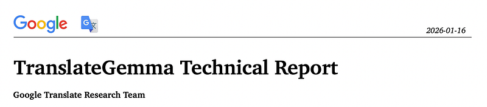
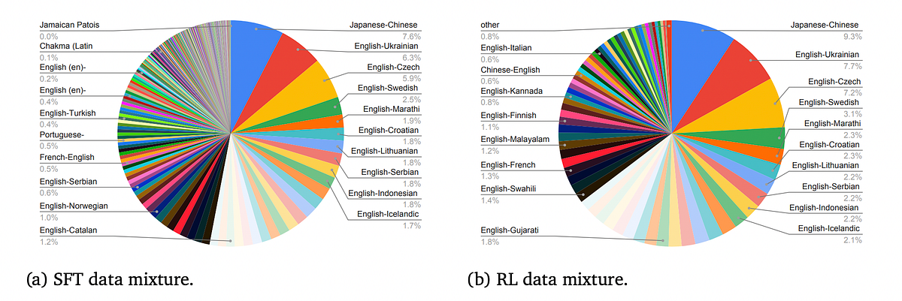
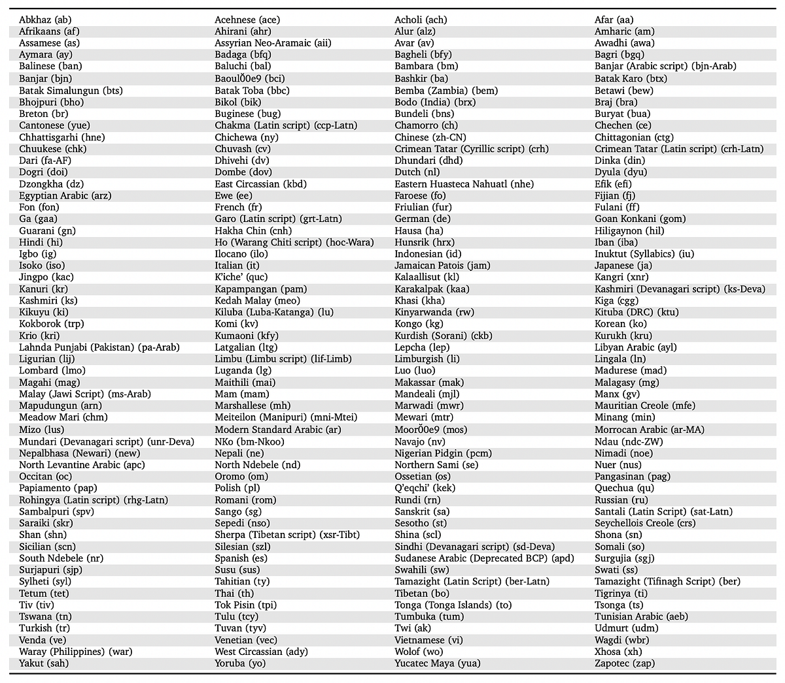
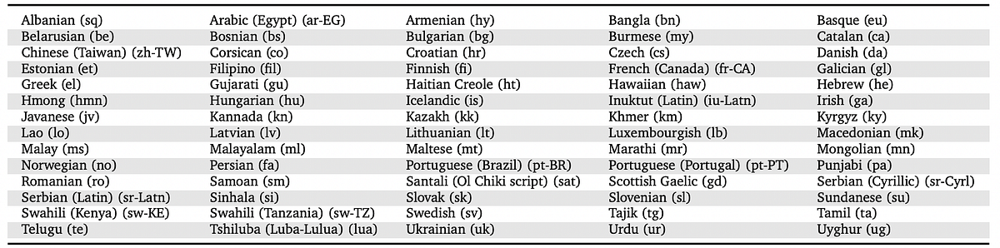
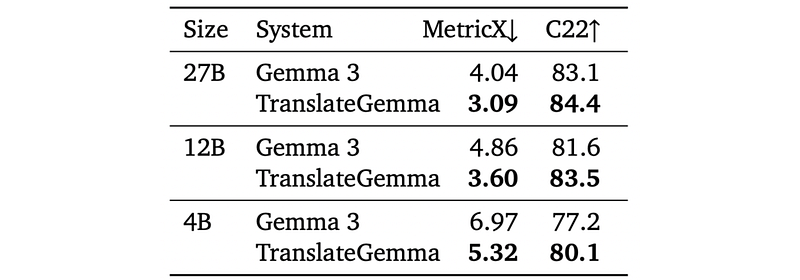
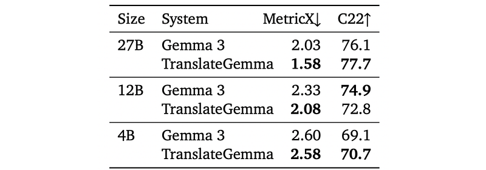
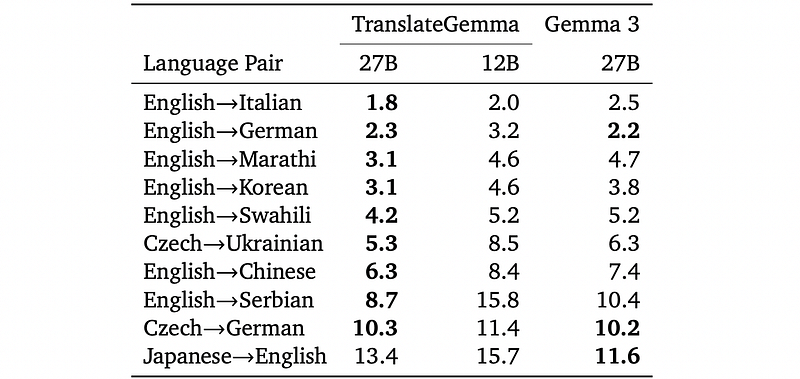

# Papers Explained 527 - TranslateGemma

The models are available on [HuggingFace](https://huggingface.co/collections/google/translategemma).

This page ingests the source article into the wiki and connects it to [[Papers Explained Corpus]], [[Large Language Models]], [[Reinforcement Learning Topic]], [[Multilingual Models]], [[Evaluation and Benchmarks]], [[Synthetic Data]], [[Supervised Fine-Tuning]], [[Reinforcement Learning]].

## Source Metadata

- Source file: `raw/2026-01-20_Papers-Explained-527--TranslateGemma-016d61e37245.html`
- Source title: Papers Explained 527: TranslateGemma
- Published: 2026-01-20
- Canonical: [https://medium.com/@ritvik19/papers-explained-527-translategemma-016d61e37245](https://medium.com/@ritvik19/papers-explained-527-translategemma-016d61e37245)

## Key Ideas

- The primary source of monolingual data is the MADLAD-400 corpus. The goal is to produce up to 10,000 synthetic examples per language pair.
- For each selected source segment, 128 samples are generated using Gemini 2.5 Flash. The best-performing examples are selected based on MetricX 24-QE scores.
- To increase the diversity, human-generated parallel data for lower-resource languages is included. This data comes from the SMOL and GATITOS datasets. SMOL covers 123 languages and GATITOS covers 170.
- The SFT mixture includes 30% generic instruction-following data from the original Gemma 3 mixture.
- For supervised fine-tuning, the Gemma 3 27B, 12B and 4B checkpoints are used as a starting point. All model parameters are updated, but the embedding parameters are frozen.

## Notes

TranslateGemma is a suite of open machine translation models based on the Gemma 3 foundation models trained via a two-stage fine-tuning process. First, supervised fine-tuning is performed using a rich mixture of high-quality large-scale synthetic parallel data generated via state-of-the-art models and human-translated parallel data. This is followed by a reinforcement learning phase, where translation quality is optimized using an ensemble of reward models, including MetricX-QE and AutoMQM, targeting translation quality.

The models are available on [HuggingFace](https://huggingface.co/collections/google/translategemma).

## Training data

### Synthetic Gemini-Generated Translation Data

The primary source of monolingual data is the MADLAD-400 corpus. The goal is to produce up to 10,000 synthetic examples per language pair.

Original source segments are grouped by length. 1 million source segments are randomly sampled from each length bucket for each language pair. Two samples are generated for each source segment using Gemini 2.5 Flash: one with greedy decoding and one with a temperature of 1.0. The source segment is retained if the sample with temperature 1.0 achieves a significantly higher score according to MetricX 24-QE (Juraska et al., 2024) compared to the greedy decoding sample. This step aims to select sources that are likely to benefit most from 128-sample QE decoding.

For each selected source segment, 128 samples are generated using Gemini 2.5 Flash. The best-performing examples are selected based on MetricX 24-QE scores. Translations are generated for both individual sentences and text blobs up to 512 tokens to support both short and long text translations. An additional filtering step is applied using Gemini 2.5 Flash to ensure proper formatting and avoid erroneous translations.

### Human-Generated Translation Data

To increase the diversity, human-generated parallel data for lower-resource languages is included. This data comes from the SMOL and GATITOS datasets. SMOL covers 123 languages and GATITOS covers 170.

### Language distribution

*Figure: Languages paired with English in both directions.*

*Figure: Languages from English.*

*Figure: Non-English language pairs.*

### Generic Instruction-Following Data

The SFT mixture includes 30% generic instruction-following data from the original Gemma 3 mixture.

## Training

### Supervised Fine-Tuning

For supervised fine-tuning, the Gemma 3 27B, 12B and 4B checkpoints are used as a starting point. All model parameters are updated, but the embedding parameters are frozen. This approach was found to be helpful for translation performance for languages and scripts not covered in the SFT data mix, according to preliminary experiments.

### Reinforcement Learning

Reinforcement learning was performed on top of the SFT checkpoint, using an ensemble of metrics as reward models, to further boost translation quality.

- MetricX-24-XXL-QE: This learned, regression-based translation metric produces a floating-point score between 0 (best) and 25 (worst), aligning with the Multidimensional Quality Metrics (MQM) score range. It was used as a quality estimation (QE) metric by passing in an empty reference. Scores were linearly rescaled (5.0 — score) for reward computation, where higher scores indicate better quality.

- Gemma-AutoMQM-QE: This fine-tuned AutoMQM model was initialized from the Gemma 3–27B-IT checkpoint and trained on MQM ratings data from WMT2020-WMT2023. It utilizes default MQM weights to compute (token-level) rewards from AutoMQM outputs, ignoring the reference translation.

- ChrF: This lexical overlap-based translation metric was the only model that utilized the synthetic references. ChrF scores were scaled by a factor of two to be on a similar scale as the other rewards.

- Naturalness Autorater: This in-house developed autorater uses the base RL policy model as a prompted LLM-as-a-Judge. It penalizes spans in the machine-translated text that sound unnatural, ensuring the errors stem from the output and not an unnatural source input.

- Generalist Reward Model: This model covers various tasks like reasoning, instruction following, and multilingual abilities, adapted from the general Gemma 3 post-training setup.

## Evaluation

Automatic evaluation setup (text translation): Evaluate Gemma 3 vs. TranslateGemma at 4B, 12B, and 27B parameters using MetricX 24 and Comet22 on WMT24++.

*Figure: Automatic evaluation results using MetricX and Comet22 (C22) on WMT24++.*

TranslateGemma consistently outperforms baseline Gemma 3 across all model sizes and both metrics.

MetricX (lower is better) improves substantially:

Comet22 (higher is better) also improves, despite not being explicitly optimized in RL:

Larger models perform better overall in both Gemma 3 and TranslateGemma series, but TranslateGemma’s gains are large enough that:

- 12B TranslateGemma surpasses 27B baseline Gemma 3.

- 4B TranslateGemma is comparable to 12B baseline Gemma 3.

Improvements are consistent across all 55 evaluated language pairs.

Automatic evaluation setup (image translation): Use the Vistra benchmark; select 264 images that contain a single text instance (per reference).

*Figure: Automatic evaluation results using MetricX and Comet22 (C22) for image translation performance, on the Vistra corpus.*

TranslateGemma retains the image-processing capabilities of Gemma 3 and generally improves translation quality for image text:

- MetricX improvements of ~0.5 points for 27B and ~0.25 for 12B.

- 4B shows only small gains, likely due to limited capacity.

Comet22 mostly confirms improvements, with the exception of the 12B model where Comet22 does not improve.

Human evaluation protocol: Use MQM with professional translators marking error spans with severity and category; scores derived via weighted error counts. Evaluate 10 language pairs from 3 source languages (English, Czech, Japanese), covering high- and low-resource languages and diverse scripts:

- English→{German, Italian, Chinese (Simplified), Korean, Serbian (Cyrillic), Swahili (Kenyan), Marathi}

- Czech→{Ukrainian, German}

- Japanese→English

*Figure: MQM results of the human evaluation for TranslateGemma and Gemma 3.*

For most language pairs, MQM confirms automatic metric trends: TranslateGemma (27B and 12B) clearly outperforms Gemma 3 27B. Exceptions:

- English→German: TranslateGemma and Gemma 3 are on par.

- Japanese→English: TranslateGemma shows a regression, mainly due to worse named-entity translation, though other error categories improve.

Improvements are particularly strong for low-resource pairs:

- English→Marathi: +1.6 MQM points (better).

- English→Swahili: +1.0.

- Czech→Ukrainian: notable improvement (exact value in Table 3).

Human evaluation also confirms:

- 27B TranslateGemma > 12B TranslateGemma.

- 12B TranslateGemma remains competitive with 27B Gemma 3, especially for high-resource languages.

## Paper

TranslateGemma Technical Report [2601.09012](https://arxiv.org/abs/2601.09012)

## Figures

Figures from the Medium HTML export (`raw/2026-01-20_Papers-Explained-527--TranslateGemma-016d61e37245.html`); local copies under `wiki/assets/papers-explained-527-translategemma/` when download succeeded.

| Figure | Caption |
|--------|---------|
|  | Title card: TranslateGemma. |
|  | To increase the diversity, human-generated parallel data for lower-resource languages is included. |
|  | Languages paired with English in both directions. |
|  | Languages from English. |
|  | Non-English language pairs. |
|  | Automatic evaluation results using MetricX and Comet22 (C22) on WMT24++. |
|  | Automatic evaluation results using MetricX and Comet22 (C22) for image translation performance, on the Vistra corpus. |
|  | MQM results of the human evaluation for TranslateGemma and Gemma 3. |
## Related

- [[Papers Explained Corpus]]
- [[Large Language Models]]
- [[Reinforcement Learning Topic]]
- [[Multilingual Models]]
- [[Evaluation and Benchmarks]]
- [[Synthetic Data]]
- [[Supervised Fine-Tuning]]
- [[Reinforcement Learning]]
- [[Papers Explained 526 - Ministral 3]]
- [[Papers Explained 528 - FlexOlmo]]

#summary #topic
