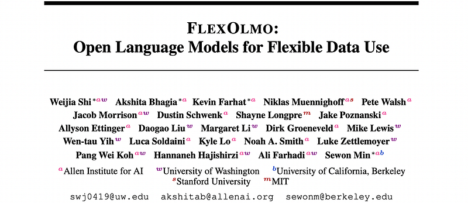
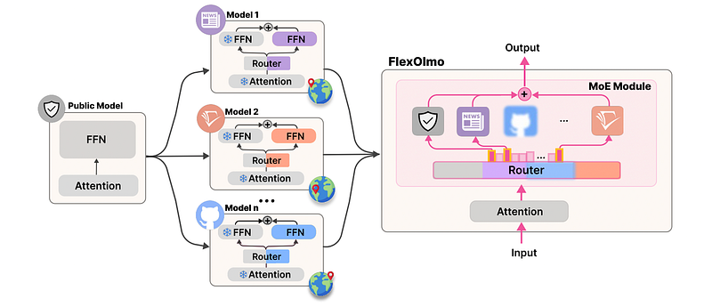
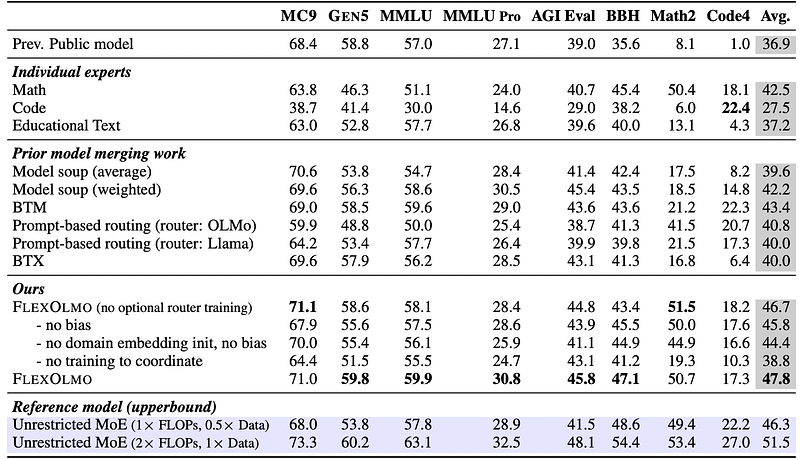
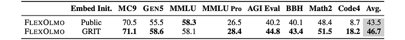
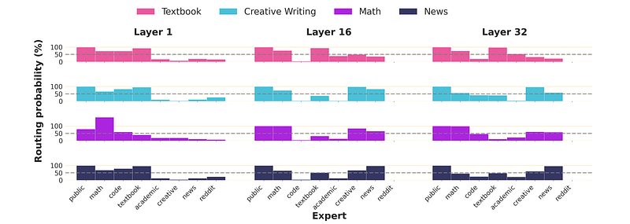

# Papers Explained 528 - FlexOlmo

FlexOlmo is a new class of language models that employs a mixture-of-experts (MoE) architecture where each expert is trained independently on closed datasets and later integrated through a new domain-informed routing without any joint training. This allows FlexOlmo to support

This page ingests the source article into the wiki and connects it to [[Papers Explained Corpus]], [[Mixture of Experts]], [[Large Language Models]], [[Synthetic Data]].

## Source Metadata

- Source file: `raw/2026-01-21_Papers-Explained-528--FlexOlmo-27651ea5bf26.html`
- Source title: Papers Explained 528: FlexOlmo
- Published: 2026-01-21
- Canonical: [https://medium.com/@ritvik19/papers-explained-528-flexolmo-27651ea5bf26](https://medium.com/@ritvik19/papers-explained-528-flexolmo-27651ea5bf26)

## Key Ideas

- FlexOlmo is a new class of language models that employs a mixture-of-experts (MoE) architecture where each expert is trained independently on closed datasets and later integrated through a new domain-informed routing without any joint training.
- Distributed training without data sharing, where different model parameters are independently trained on closed datasets
- Data-flexible inference, where these parameters along with their associated data can be flexibly included or excluded from model inferences with no further training.
- FlexOlmo is trained on FlexMix, a corpus comprising publicly available datasets alongside seven domain-specific sets, representing realistic approximations of closed sets.
- Let Mpub be a model trained on a publicly available dataset Dpub, and D= {D1,D2,…,Dn} represent a collection of locally maintained datasets with separate owners.

## Notes

FlexOlmo is a new class of language models that employs a mixture-of-experts (MoE) architecture where each expert is trained independently on closed datasets and later integrated through a new domain-informed routing without any joint training. This allows FlexOlmo to support

- Distributed training without data sharing, where different model parameters are independently trained on closed datasets

- Data-flexible inference, where these parameters along with their associated data can be flexibly included or excluded from model inferences with no further training.

FlexOlmo is trained on FlexMix, a corpus comprising publicly available datasets alongside seven domain-specific sets, representing realistic approximations of closed sets.

## Problem Setup

Let Mpub be a model trained on a publicly available dataset Dpub, and D= {D1,D2,…,Dn} represent a collection of locally maintained datasets with separate owners. The objective is a single model Mfinal, which is constructed via composing Mpub and a set of modules {M1,M2,…,Mn}, where each Mi is independently trained by the owner of Di, who also has access to Mpub.

This model satisfies two requirements:

- Training Mfinal does not require anyone to have joint access to the full dataset collection D, as each Mi is trained independently by the owner of dataset Di

- Removing any module Mi from Mfinal guarantees complete removal of its associated data Di.

The key modeling challenges are:

- To develop an algorithm that creates Mi using Di and Mpub

- To design the merging algorithm that combines Mpub,M1,M2,…,Mn into Mfinal.

## FlexOlmo: LMs with Flexible Data Use

### Architecture

FlexOlmo follows the standard MoE architecture: it replaces the feedforward network (FFN) in each transformer block with a router and n small FFNs called expert modules {Mpub,M1,…,Mn}. Given a processed input token embedding x ∈Rh, the MoE module computes output representation y:

where the router function r computes the expert probabilities from x. Unlike standard MoEs where experts are trained jointly, the experts are trained asynchronously on distinct datasets {D1,…,Dn}.

*Figure: An overview of FlexOlmo.*

### Training Experts to Coordinate

A straightforward way to train each expert would be to directly continue to train each expert Mi on its own data Di. This method causes the experts to diverge too much from one another and from the original seed model, which makes merging after isolated training difficult. To prevent such divergence, experts are trained independently while teaching them to coordinate.

Mpub serves as an anchor that teaches experts to coordinate with Mpub and, by extension, with each other. During training, for dataset Di, a MoE model with two expert modules, both initialized from the same FFNs from Mpub, is constructed.

During training, Mpub expert and the shared attention layer are frozen, while the other expert (Mi) is trained on Di. As each data owner updates only their own FFNs while keeping all other parameters (those inherited from Mpub such as attention layer) frozen, the learned FFNs are designed to naturally coordinate with each other later during merging at inference time. Importantly, with this approach, a router is learned so that each expert can be integrated into a MoE architecture without additional training.

### Domain-Informed Router

The router plays a critical role in MoE: the router function r maps an input vector x to a distribution over expert modules, including the public model as one of the experts:

In typical MoEs, Wr is trained end-to-end alongside all expert modules, using access to the full training dataset. Instead, Wr is decomposed into individual expert-specific router embeddings, where each row ri represents the router embedding for expert Mi, learned only from Di.

These router embeddings can be initialized by averaging domain-specific embeddings of samples from each Di, obtained by encoding subsets of data using an off-the-shelf embedder E that maps a document into an h-dimensional vector.

During coordinated training of experts, the router embeddings are learned in pairs: [rpub,ri]. The public embedding rpub remains frozen across all experts, while ri is finetuned separately alongside the parameters of Mi. At inference time, merging the expert embeddings into the complete router matrix Wr directly integrates all expert modules into one unified MoE. Furthermore, experts can be flexibly added or removed by simply adding or removing their corresponding router embedding.

Unlike standard router learning that is learned among all experts jointly, coordinated training of experts only learns pairwise routing decisions between one expert and the public model. This means the model never directly compares experts M1 and M2 during training, potentially limiting generalization during inference. To alleviate this issue, a negative bias term bi is added for each independent trained expert {M1,M2,…,Mn}. Expert Mi is selected when:

Otherwise, default to Mpub. This helps the later merging process, where each expert competes not just with the public model but with all other experts.

### Optional Router Training on Proxy Data

With the proposed model design, expert modules can be merged without any additional training. If data owners are willing to identify proxy samples within the public dataset Mpub that resemble their closed data, a lightweight router tuning step can be optionally performed after merging, using only public data from Dpub. Specifically, each data owner selects a small proxy set ˆDi ⊆Dpub, where |ˆDi|≪0.01 ×|Di|, chosen to approximate the distribution of their closed dataset Di. To construct ˆDi, a binary classifier is trained to distinguish Di from Dpub and public samples with the highest predicted likelihood of belonging to Di are selected. After merging, the router embeddings r1,···,rn,rpub are tuned on the combined setˆD1,···, Dn, and Dpub, sampled uniformly.

### Training Data

Public Mix:

- Based on Common Crawl (CC) Baseline, excluding news and creative writing.

- Publicly accessible without restrictions.

Closed Datasets:

- News: News articles from DCLM-Baseline, classified using a specific classifier. Many original sources are subject to closed access.

- Creative Writing: Creative content from DCLM-Baseline, classified using the same classifier.

- Code: Code repositories from Starcoder with additional quality filtering.

- Academic: Open-access academic papers from peS2o, S2ORC, reprocessed using olmOCR for cleaner text.

- Educational Text: Educational text from digitized PDFs, converted to plain text using olmOCR.

- Math: Math-related content from Dolmino Math Mix and FineMath4+, including web pages and problem sets.

- Reddit: Posts and comments originally sourced by Dolma, further filtered and processed. Currently inaccessible due to Reddit’s policy change.

These datasets are designed to represent:

- Historically closed and not publicly available data.

- Previously publicly available data that is now closed.

- Domains with scarce high-quality public data.

### Training Setup

A dense model with 7 billion parameters following the OLMo 2 architecture is used for the public model Mpub. This model contains 32 layers with a hidden dimension of 4,096 and is trained on a public mix for 1 trillion tokens. Each data owner then takes this checkpoint and performs continued-pretraining for 50 billion tokens on their own data, totaling 400B tokens across all experts. For optional router training, 5 billion tokens are used in total. The final FlexOlmo, trained on 8 sets, has 37 billion total parameters with 20 billion active (4 active experts out of 8).

## Evaluation Setup

General-purpose benchmarks:

- MC9: Nine multiple-choice datasets covering various domains like reading comprehension, common sense reasoning, and question answering.

- GEN5: Five generative tasks focusing on question answering, text summarization, and logical reasoning.

- MMLU & MMLU-Pro: Large-scale benchmark datasets evaluating mathematical and scientific reasoning abilities.

- AGIEval: 20 tasks simulating college admission essay evaluation.

- BBH: 23 challenging tasks from the BIG-Bench benchmark.

Domain-specific benchmarks:

- Math2: Two specialized math benchmarks (GSM8K and MATH) to assess mathematical reasoning.

- Code4: Four coding benchmarks (MBPP, MBPPPlus, HumanEval, and HumanEvalPlus) to evaluate coding capabilities.

- SciRIFF5: Five subtasks from the SciRIFF benchmark to measure scientific literature understanding.

- NewsG: News generation task evaluated by an LM judge.

- PoemG: Poem generation task evaluated by an LM judge.

### Baselines

- Unrestricted Training: This serves as an upper bound, training a sparse MoE initialized from a public-only dense model on the combined dataset (all closed sets and Public Mix). It’s compared with compute-controlled and data-controlled versions to assess the impact of data access.

- Prompt-based Routing: Uses an LM-based domain classifier (Llama-3.1–8B-Instruct or OLMo-2–1124–7B-Instruct) to route each query to the most suitable pre-trained dense model, which is then used exclusively.

- Model Soup: Averages (either simple or weighted) the parameters of all pre-trained dense models. Weights are determined by the log-likelihoods of each model on the test example.

- Branch-Train-Merge (BTM): Ensembles models by computing a weighted average of their output probabilities. Weights are derived from the log-likelihoods of each model on the test example. Top-k models can be selected for ensembling.

- BTX: Upcycles a MoE from independently trained dense models. Dense model parameters are copied to MoE experts, while non-expert parameters (like attention layers) are averaged. Post-merge training is performed on the public dataset only.

*Figure: Evaluation of FlexOlmo trained on four sets (public mix, math, educational text and code), tested on 24 tasks with 100 samples per subtask.*

- Domain-specific experts achieve the best scores on their own benchmarks (e.g., Math expert on math tasks, Code expert on coding tasks).

- They degrade substantially on out-of-domain tasks; the Code expert performs poorly on general benchmarks.

- FlexOlmo improves over the public-only model with an average ~41% relative gain.

- FlexOlmo matches or exceeds specialized experts on their own domains (e.g., BBH, Math2).

- All merging baselines beat the public-only model, but Model soup and BTX are generally weak.

- Prompt-based routing is unstable: strong when the classifier picks the right expert, but degrades sharply otherwise.

- BTM is the strongest baseline among prior methods. FlexOlmo outperforms BTM by ~10.1% relative on average, attributed to MoE-style per-layer selective expert activation that better combines complementary strengths.

- FlexOlmo outperforms the unrestricted MoE in the FLOP-controlled setting (1× FLOPs, 0.5× data).

- It slightly underperforms the unrestricted MoE in the data-controlled setting (2× FLOPs, 1× data).

- This shows FlexOlmo can achieve strong performance without direct access to closed data, relying only on shared expert weights and supporting opt-in/opt-out.

*Figure: Impact of embedding initialization methods on model performance.*

- Removing any of: learning-to-coordinate, router initialization, or bias term leads to performance drops.

- Random router embedding initialization causes learned embeddings to collapse (become similar), making expert merging harder.

- Additional router training on proxy data improves performance.

- Using an external embedder (GRIT) for router initialization consistently outperforms using public model embeddings.

*Figure: Routing pattern analysis.*

- The router tends to activate the domain-appropriate expert (e.g., math inputs → math expert), showing effective domain identification.

- The public expert is frequently activated, reflecting the coordinated training where experts complement the public expert.

- Different expert combinations are activated at different layers, indicating layer-specific specialization and higher expressivity than single-expert routing schemes.

## Paper

FlexOlmo: Open Language Models for Flexible Data Use [2507.07024](https://arxiv.org/abs/2507.07024)

## Figures

Figures from the Medium HTML export (`raw/2026-01-21_Papers-Explained-528--FlexOlmo-27651ea5bf26.html`); local copies under `wiki/assets/papers-explained-528-flexolmo/` when download succeeded.

| Figure | Caption |
|--------|---------|
|  | Title card: FlexOlmo. |
|  | The key modeling challenges are:: where the router function r computes the expert probabilities from x. |
|  | An overview of FlexOlmo. |
|  | The key modeling challenges are. |
|  | In typical MoEs, Wr is trained end-to-end alongside all expert modules, using access to the full training dataset. |
|  | The key modeling challenges are:: Otherwise, default to Mpub. |
|  | Evaluation of FlexOlmo trained on four sets (public mix, math, educational text and code), tested on 24 tasks with 100 samples per subtask. |
|  | Impact of embedding initialization methods on model performance. |
|  | Routing pattern analysis. |
## Related

- [[Papers Explained Corpus]]
- [[Mixture of Experts]]
- [[Large Language Models]]
- [[Synthetic Data]]
- [[Papers Explained 527 - TranslateGemma]]
- [[Papers Explained 529 - DR Tulu]]

#summary #topic
