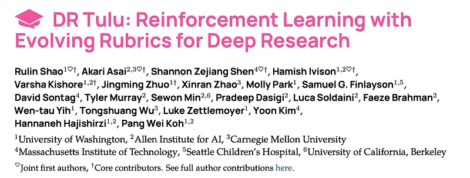
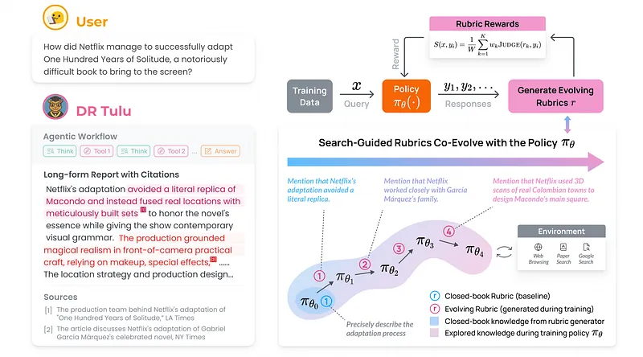
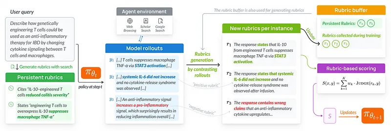
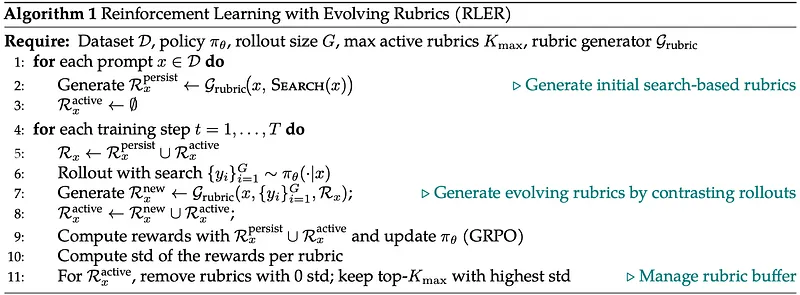
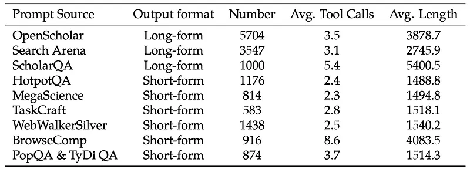
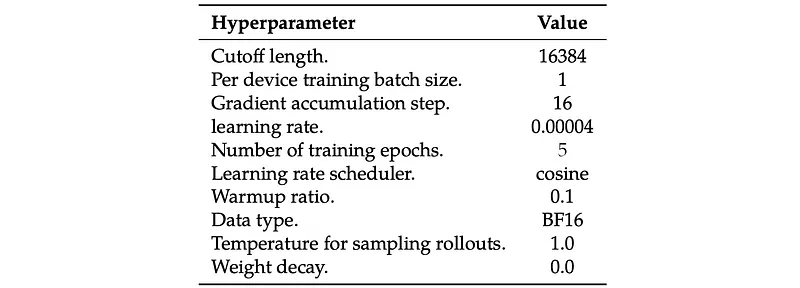
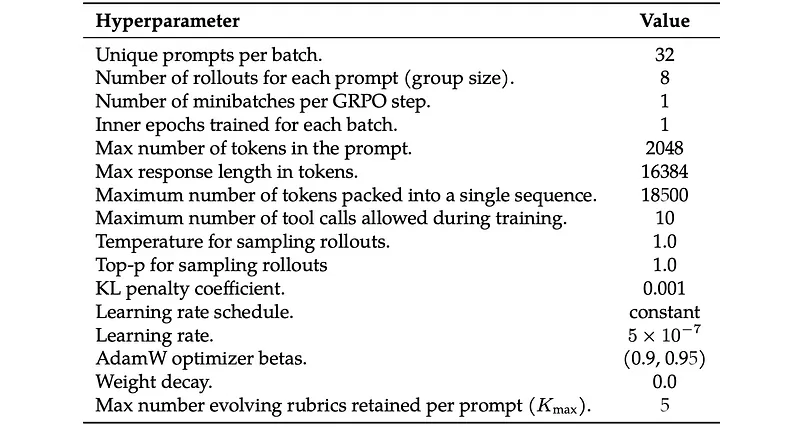
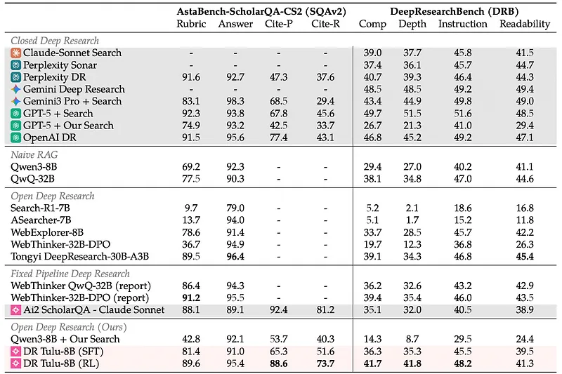
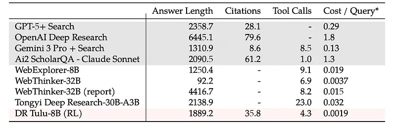

# Papers Explained 529 - DR Tulu

The datasets and models are available at [HuggingFace](https://huggingface.co/collections/rl-research/dr-tulu).

This page ingests the source article into the wiki and connects it to [[Papers Explained Corpus]], [[Agentic AI]], [[Reinforcement Learning Topic]], [[Large Language Models]], [[Safety and Alignment]], [[Reasoning Models]], [[Verifier-Bounded Learning]], [[Reinforcement Learning]].

## Source Metadata

- Source file: `raw/2026-01-22_Papers-Explained-529--DR-Tulu-123b031776c5.md`
- Source title: Papers Explained 529: DR Tulu
- Published: 2026-01-22
- Canonical: [https://medium.com/@ritvik19/papers-explained-529-dr-tulu-123b031776c5](https://medium.com/@ritvik19/papers-explained-529-dr-tulu-123b031776c5)

## Key Ideas

- The core of the system is a language model capable of understanding and generating text. A set of tools (T = {T1, T2, …}) are available to the model.
- The model’s policy (πθ) with parameters θ operates autoregressively over a sequence of text (s). The initial state (s0) is set to x, which represents the task and system instructions.
- The model’s action space consists of four possible actions:
- think (<think></think>): The LM uses its own capabilities to plan the next steps based on the current state and information.
- tool (<call_tool></call_tool>): The model invokes a specific search tool. The tool is chosen by setting the “name” attribute and tool-specific arguments.

## Notes

Most open deep research models are trained easily verifiable short-form QA tasks via reinforcement learning with verifiable rewards (RLVR), which does not extend to realistic long-form tasks. Deep Research Tulu (DR Tulu-8B) addresses this with Reinforcement Learning with Evolving Rubrics (RLER), in which rubrics are constructed and maintained that co-evolve with the policy model during training; this allows the rubrics to incorporate information that the model has newly explored and to provide discriminative, on-policy feedback.

The datasets and models are available at [HuggingFace](https://huggingface.co/collections/rl-research/dr-tulu).

## Problem Formulation for Deep Research

The core of the system is a language model capable of understanding and generating text. A set of tools (T = {T1, T2, …}) are available to the model. Each tool takes a query (q) and optional arguments (α) and returns textual resources (o) that can be cited in the model’s answer, Formally: o = Tk(q; α)

The model’s policy (πθ) with parameters θ operates autoregressively over a sequence of text (s). The initial state (s0) is set to x, which represents the task and system instructions.

The model’s action space consists of four possible actions:

- think (<think></think>): The LM uses its own capabilities to plan the next steps based on the current state and information.

- tool (<call_tool></call_tool>): The model invokes a specific search tool. The tool is chosen by setting the “name” attribute and tool-specific arguments. Example: <call_tool name=”google_- search” k=”10" lang=”en”>query</call_tool> The tool’s output is appended to the context for subsequent steps.

- answer (<answer></answer>): The model produces the final response and terminates the process.

- cite (<cite id=”SOURCE_ID”></cite>): This action is used within the final answer to wrap claims in citation tags that point to the supporting source. Ideally, these citations should be as specific as possible (e.g., to a snippet within a webpage).

At each step (i), the model samples an action (ai) and its content or arguments (ζi) according to the policy πθ:

(ai, ζi) ∼ πθ(· | si)

where ai specifies the action type:

- ai = think for generating reasoning text;

- ai = tool for calling the corresponding tool Tk with query (qi, αi);

- ai = answer for producing the final answer;

- ai = cite for wrapping claims in citations within the final answer.

- If ai ∈ {think, answer, cite}, the output ζi is appended to the context, forming si+1 = si ⊕ ⟨ai, ζi⟩.

- If ai = tool, the model executes the tool call, receives oi = Tk(qi; αi), and updates the state as si+1 = si ⊕ ⟨ai, ζi, oi⟩.

The process continues until aτ = answer, where ζτ contains the final answer.

## RLER: Reinforcement Learning with Evolving Rubrics

*Figure: Overview of training a deep research model with reinforcement learning with evolving rubrics.*

Given a question x and its set of corresponding rubrics Rx = {(rx,k,wx,k)}K k=1, where each rx,k is a rubric (item) and wx,k is its corresponding weight, the quality of the response y is assessed with the rubric-based scoring function

where, for each rubric rx,k, a separate judge LM is used that returns 0, 0.5, or 1 depending on the extent to which rx,k is satisfied by the final answer in y. This rubric score is computed using only the final answer.

Existing work instantiates the rubric set Rx in two main ways:

General Rubrics

- A single, general rubric is used to score all responses.

- This approach, while simple, suffers from reward hacking, where the model learns to exploit biases in the rubric rather than developing meaningful behaviors.

Closed-Book Rubrics

- An LM generates question-specific rubrics.

- A separate LM (or the same one) then evaluates responses based on these rubrics in a checklist-style manner.

- These rubrics are referred to as “closed-book” because they are generated by a model with limited knowledge, potentially missing the necessary information to assess DR outputs effectively.

### Evolving Rubrics

*Figure: Training with RLER.*

Rubrics are constructed that co-evolve with the policy model and are grounded on searched knowledge from the internet. Instead of trying to exhaustively enumerate all possible desiderata, the method generates rubrics tailored to the current policy model’s behaviors, offering on-policy feedback the model can effectively learn from. Furthermore, the rubrics are generated with retrieval, ensuring it can cover the needed knowledge to assess the generation.

Initial Search-Based Rubrics:

For each training prompt, relevant context is retrieved from the internet using a search engine. This retrieved context, combined with the original prompt, is fed into a language model (Grubric) to generate a set of initial rubrics that will be persistently used throughout the training process.

Evolving Rubrics During Training:

During each training step, new evolving rubrics are generated based on the current policy model’s responses to the prompt. These evolving rubrics are categorized into two types:

- Positive Rubrics: Capture strengths and novel knowledge explored by the model that are not yet reflected in the initial rubrics.

- Negative Rubrics: Summarize common undesirable behaviors, such as reward hacking, verbatim copying of retrieved results, or excessive length to gain points.

Rubric Buffer Management:

To prevent an excessive number of rubrics, a buffer management strategy is employed to filter, merge, and rank rubrics based on their discriminative power. Rubrics with zero variance in rewards are removed, and the remaining rubrics are ranked by their standard deviation. Only the top Kmax rubrics with the highest standard deviation values are retained.

Auxiliary Rewards:

- Format Rewards: Encourage adherence to formatting instructions.

- Search Rewards: Promote the use of search to retrieve relevant information.

- Citation Rewards: Incentivize the provision of high-quality citations supporting all claims.

Final Training Reward:

The final training reward is a combination of rubric rewards and auxiliary rewards, with small weights assigned to the auxiliary components.

## DR Tulu

Qwen3–8B is used as the base model.

### Supervised Fine-Tuning for Cold Start

RLER relies on meaningful exploration over tool-augmented trajectories, but a generic base model does not yet know how to plan, invoke tools, or produce citations in the expected format, leading to low-quality rollouts. To make this feasible, SFT is conducted on trajectories produced by a strong teacher model acting as a tool-augmented deep research agent, which gives DRTulu a reasonable initial search and citation strategy before online RL.

For long-form, naturally occurring information-seeking questions, prompts are derived from publicly available user-assistant interaction data:

- SearchArena contains 24K real-world conversations between users and search-augmented LMs across diverse domains

- Open-Scholar provides 55K scientific research-oriented queries collected from a deep research assistant demo.

A moderate amount of short-form, verifiable QA is mixed in: HotpotQA, TaskCraft, WebWalker-Silver, and MegaScience, and additional challenging synthetic prompts are generated inspired by PopQA.

Given each curated prompt, a full trajectory (model “thinking” traces, tool calls, tool outputs, and the final response) is generated in an end-to-end manner. GPT-5 is provided with a detailed system prompt that defines the deep research workflow and exposes a general web search tool, a paper search tool, and a web browsing tool, and is asked to produce the entire trajectory. Because GPT-5 does not expose its native internal reasoning, it is instructed to generate explicit mock thinking tokens before each tool call or answer tokens. Two lightweight rejection-sampling filters are then applied to ensure that the trajectories strictly satisfy requirements: (1) for all prompts, trajectories verify that they follow the expected tool-calling and answer formats; and (2) for short-form prompts, trajectories whose final answer does not match the gold answer are discarded. As a result, 16K SFT data points, including both short and long-form tasks, are curated.

*Figure: SFT data stats.*

*Figure: Hyperparameters used for SFT training.*

### Online RL with Asynchronous Tool Calls

A customized variant of GRPO with RLER is used, in which agentic rollouts are iteratively generated using real tool calls, and the model’s final answer is scored against the evolving rubrics.

Approximately 5K new prompts are collected from SearchArena and OpenScholar, following the same LM-based filtering procedure used in long-form SFT data curation. Additionally, 4K prompts are sampled from RaR to enhance data diversity.

The basic GRPO loss is used, albeit using token-level loss aggregation like DAPO. Two further optimizations are applied: sample packing to pack multiple rollouts into single training passes with minimal padding, and 1-step asynchronous training, which means generation and training steps are performed at the same time (training on rollouts from a policy one step behind the current policy), reducing training time. Tool output tokens are also masked out from the loss. A small KL penalty (0.001) is found to be useful for stabilizing training. After generating rollouts and computing rewards, rubric buffer management steps are performed. The citation reward is turned off after 650 training steps, as it converged and did not further add to performance, whilst dramatically slowing down RL training.

During RL training, an asynchronous tool call setup is used, wherein tool requests are sent the second a given rollout triggers them, as opposed to waiting for the full batch to finish generating before sending tool calls. Once a tool call is sent, the given generation request is placed to sleep, allowing the inference engine to potentially continue to work on generating other responses while waiting for the tool response. This results in the generation and tool calling being overlapped wherever possible.

*Figure: Hyperparameters used for GRPO training.*

## Results

*Figure: Performance breakdown for Asta-ScholarQA-CS2 and DeepResearchBench.*

DR Tulu-8B outperforms all open deep research models on long-form tasks

- Across four long-form benchmarks, DR Tulu-8B beats all existing open deep research models by 13.7–53.4 points on average, including larger 30B models.

- Open models designed for short-form tasks (e.g., Search-R1, ASearcher) perform poorly on realistic long-form report generation.

- Larger 32B WebThinker models underperform on long-form tasks when used with their default pipeline.

- Concurrent WebExplorer and prior SOTA Tongyi Deep Research are surpassed by both DR Tulu-8B SFT and RL variants.

Citation capability is critical and differentiates DR Tulu-8B

- None of the open baselines produce citations, leading to low overall scores (~40) on SQAv2, where citation quality is central.

- DR Tulu-8B, which produces citations, achieves much higher scores.

*Figure: Comparison of model usage statistics on SQAv2.*

DR Tulu-8B beats heavily engineered fixed-pipeline open systems

- Fixed-pipeline systems (e.g., WebThinker report mode, Ai2 ScholarQA) rely on complex, human-designed workflows for report generation.

DR Tulu-8B uses a single, flexible inference pipeline and still:

- Outperforms WebThinker-32B (report mode) on all tasks, despite WebThinker being 4× larger and producing much longer answers.

- Achieves the best overall average performance across long-form benchmarks, even compared to Ai2 ScholarQA and Tongyi Deep Research.

Fixed-pipeline systems generalize poorly:

- They attempt long-form reports even for simple factoid questions (e.g., SimpleQA), failing at short-form QA.

- DR Tulu-8B can handle both long-form and short-form questions effectively.

DR Tulu-8B matches or outperforms proprietary deep research systems

- OpenAI Deep Research performs similarly on the four long-form benchmarks but: Produces answers ~3× longer and ~2× more citations than DR Tulu-8B.

- DR Tulu-8B also outperforms: Claude Sonnet Search, Perplexity Sonar (high-reasoning mode), Perplexity Deep Research.

- GPT-5 and Gemini3 Pro with internal search sometimes beat their own deep research variants, likely due to stronger base LMs (o3/o4, Gemini2.5+), underscoring the importance of base model quality.

- Despite being only 8B, DR Tulu-8B is competitive with or better than these latest proprietary systems.

## Paper

DR Tulu: Reinforcement Learning with Evolving Rubrics for Deep Research [2511.19399](https://arxiv.org/abs/2511.19399)

## Figures

Figures from the Medium HTML export (`raw/2026-01-22_Papers-Explained-529--DR-Tulu-123b031776c5.md`); local copies under `wiki/assets/papers-explained-529-dr-tulu/` when download succeeded.

| Figure | Caption |
|--------|---------|
|  | Title card: DR Tulu. |
|  | Overview of training a deep research model with reinforcement learning with evolving rubrics. |
|  | where ai specifies the action type. |
|  | Training with RLER. |
|  | Initial Search-Based Rubrics. |
|  | SFT data stats. |
|  | Hyperparameters used for SFT training. |
|  | Hyperparameters used for GRPO training. |
|  | Performance breakdown for Asta-ScholarQA-CS2 and DeepResearchBench. |
|  | Comparison of model usage statistics on SQAv2. |
## Related

- [[Papers Explained Corpus]]
- [[Agentic AI]]
- [[Reinforcement Learning Topic]]
- [[Large Language Models]]
- [[Safety and Alignment]]
- [[Reasoning Models]]
- [[Verifier-Bounded Learning]]
- [[Reinforcement Learning]]
- [[Papers Explained 528 - FlexOlmo]]
- [[Papers Explained 530 - BroRL]]

#summary #topic
