# Papers Explained 53 - Galactica

Galactica is an LLM specializing in scientific knowledge, surpasses existing models on a variety of scientific tasks, excelling in technical knowledge probes like LaTeX equations and reasoning tasks, while achieving new state-of-the-art results on PubMedQA, MedMCQA, and despite not being trained on a general corpus, it outperforms BLOOM...

This page ingests the source article into the wiki and connects it to [[Papers Explained Corpus]], [[Large Language Models]], [[Reasoning Models]], [[Synthetic Data]], [[Code Models]].

## Source Metadata

- Source file: `raw/2023-08-29_Papers-Explained-53--Galactica-1308dbd318dc.md`
- Source title: Papers Explained 53: Galactica
- Published: 2023-08-29
- Canonical: [https://medium.com/@ritvik19/papers-explained-53-galactica-1308dbd318dc](https://medium.com/@ritvik19/papers-explained-53-galactica-1308dbd318dc)

## Key Ideas

- Galactica is an LLM specializing in scientific knowledge, surpasses existing models on a variety of scientific tasks, excelling in technical knowledge probes like LaTeX equations and reasoning tasks, while achieving new state-of-the-art results on PubMedQA...
- The corpus consists of 106 billion tokens from papers, reference material, encyclopedias, and other scientific sources.
- Tokenization is an important part of dataset design given the different modalities present. For example, protein sequences are written in terms of amino acid residues, where character-based tokenization is appropriate.
- Citations are wrapped with special reference tokens [START_REF] and [END_REF].
- Step-by-Step Reasoning is wrapped with a working memory token, mimicking an internal working memory context.

## Notes

Galactica is an LLM specializing in scientific knowledge, surpasses existing models on a variety of scientific tasks, excelling in technical knowledge probes like LaTeX equations and reasoning tasks, while achieving new state-of-the-art results on PubMedQA, MedMCQA, and despite not being trained on a general corpus, it outperforms BLOOM and OPT-175B on BIG-bench.

## Dataset

The corpus consists of 106 billion tokens from papers, reference material, encyclopedias, and other scientific sources. Natural language sources, such as papers and textbooks, and natural sequences, such as protein sequences and chemical formulae are combined. LATEX is processed wherever captured, and academic code is also included to capture computational science.

*Figure: The Galactica Corpus*

### Tokenization

Tokenization is an important part of dataset design given the different modalities present. For example, protein sequences are written in terms of amino acid residues, where character-based tokenization is appropriate. To achieve the goal of specialized tokenization, specialized tokens are used for different modalities:

- Citations are wrapped with special reference tokens [START_REF] and [END_REF].

- Step-by-Step Reasoning is wrapped with a working memory token, mimicking an internal working memory context.

- For mathematical content, with or without LaTeX, ASCII operations are split into individual characters. Parentheses are treated as digits. Unsplit repetitions are allowed for the rest of the operations. Operation characters include !”#$%&’*+,-./:;?^_’|, and parentheses are ()[]{}.

- Numbers are split into individual digits.

- SMILES formulas are wrapped with [START_SMILES] and [END_SMILES] and character-based tokenization is used.

- Amino acid sequences are wrapped with [START_AMINO] and [END_AMINO] and character-based tokenization is used.

- DNA sequences are wrapped with [START_DNA] and [END_DNA] and character-based tokenization is used.

### Working Memory Token <work>

Transformer models have trouble with tasks needing multiple steps due to a lack of working memory. Researchers have tackled this by using the model’s output context as an external working memory, akin to human use of scratchpads. This method has drawbacks like finding optimal prompts and forcing the model into non-ideal computations. To counter these, Galactica introduces a “<work>” token for working memory, embedding step-by-step reasoning within “<work></work>” tags in datasets. While a significant architectural shift might be necessary for full support, this approach offers a bridge to that goal, despite current dataset limitations.

*Figure: An example answer with the working memory token. It performs exact steps for rearranging the equation, and when it reaches a calculation that it cannot solve reliably in a forward pass, it writes a program, which can then be offloaded to a classical computer.*

*Figure: Reasoning Datasets (to train the model to use a “work” token)*

### Prompt Pre-Training

The Galactica paper introduces a novel method for enhancing language models by incorporating prompts into pre-training alongside general data. This approach is motivated by findings that training token count and prompt tuning impact performance. Smaller fine-tuned models excel in some tasks due to world knowledge but lack task-context knowledge. To address this, Galactica suggests augmenting pre-training data with task prompts, potentially obviating the need for larger datasets or models. The largest model, 120 billion parameters, performs well on popular tasks and maintains generality while boosting task-specific performance. This approach is akin to ExT5 but doesn’t replace instruction tuning, which could further enhance performance on various tasks.

*Figure: “Pre-training weighs all tokens equally as part of the self-supervised loss. This leads to a weak relative signal for tasks of interest, meaning the model scale has to be large to work. Instruction tuning boosts performance post hoc, and can generalize to unseen tasks of interest, but it risks performance in tasks that are distant from instruction set tasks. Prompt pre-training has a weaker task of interest bias than instruction tuning but less risk of degrading overall task generality.”*

*Figure: Pre-training Prompts*

## Architecture

Galactica uses a Transformer architecture in a decoder-only setup, with the following modifications:

- GeLU activations for all model sizes.

- A 2048 length context window for all model sizes.

- No Biases in any of the dense kernels or layer norms.

- Learned Positional Embeddings are used. ALiBi was experimented with at smaller scales but did not observe large gains.

- A vocabulary of 50k tokens is constructed using BPE, from a randomly selected 2% subset of the training data

*Figure: Details of the models trained*

## Results

### LaTeX Equations

A dataset of 434 popular LaTeX equations from the fields of chemistry, physics, mathematics, statistics, and economics is curated to evaluate Galactica’s Zero Shot Memorisation of Equations.

*Figure: LaTeX Equations Probe*

*Figure: Results on LaTeX equation*

### Domain Probes

- AminoProbe: a dataset of names, structures, and properties of the 20 common amino acids.

- BioLAMA: a dataset of biomedical factual knowledge triples.

- Chemical Reactions: a dataset of chemical reactions.

- Galaxy Clusters: a dataset of galaxy clusters with their constellation classifications.

- Mineral Groups: A dataset of minerals and their mineral group classifications

*Figure: Chemical Reactions.*

*Figure: Results on Domain Probes*

### Reasoning

*Figure: Results on Mathematics MMLU.*

*Figure: Results on MATH.*

- Galactica is evaluated without few-shot examples.

- With both the chain-of-thought and token prompts, Galactica exceeds PaLM’s performance with 18 times less capacity.

- The use of the <work> token appears to boost performance over Chinchilla, even for the smaller 30B Galactica model.

### Downstream Scientific NLP

*Figure: Question Answering Results*

- Chinchilla appears to be stronger in a subset of tasks that are less mathematical, more memorization-intensive tasks.

- Galactica tends to perform better in mathematical and graduate-level tasks.

- Galactica corpus is biased toward graduate scientific knowledge, given it consists mostly of papers, which explains lagging performance in high-school subjects.

### Citation Accuracy

3 datasets are curated to evaluate the model’s capability to cite:

- PWC Citations: a dataset with 644 pairs of machine learning concepts and papers that introduced them. Concepts consist of methods (e.g. ResNet) and datasets (e.g. ImageNet) from Papers with Code.

- Extended Citations: a dataset with 110 pairs of non-machine learning concepts and papers that introduced them. Examples of concepts include Kozac sequence and Breit-Wigner distribution.

- Contextual Citations: a dataset with 1,869 pairs of references and contexts from our arXiv validation set. The dataset is constructed by sampling 1,000 random references and collecting their contexts.

For the PWC Citations and Extended Citations datasets, the citation prediction task is framed as a text generation task. The model is given a prompt like “In this paper, we use ResNet method [START_REF]” in order to generate a prediction for the ResNet concept. For Contextual Citations, prompts are provided after the input context for the citation, where the context is concluded with [START_REF].

Galactica is compared to sparse and dense retrieval-based approaches on this task.

- In the sparse baseline approach, an index is created using ElasticSearch with references’ titles, abstracts, and contextual snippets. When given a text query, the system retrieves the top references based on matching scores across the selected fields.

- The dense retrieval approach involves encoding each reference’s title and abstract, encoding the text query using the same model, and returning the matching references using an FAISS index.

*Figure: Citation Prediction Accuracy.*

### General Capabilities

Galactica is evaluated on 57 BIG-bench tasks with 5-shot using the default prompt style from BIG-Bench.

*Figure: BIG-bench 57 Task Results.*

- Galactica outperforms general open models at smaller scales.

### IUPAC Name Prediction

SMILES (Simplified Molecular Input Line Entry System) is a notation that represents chemical structures as character sequences.

A test is conducted to predict the IUPAC name of a compound given its SMILES formula.

*Figure: Results on IUPAC Naming*

- The accuracy of the model increases with the scale of the training data.

- To understand what the model is learning, the authors visualize the average atomic attention during prediction. The results show that the model attends to the correct chemical groups when predicting a name, indicating that it is inferring names from the molecular structure.

### MoleculeNet

The goal is to explore traditional drug discovery tasks by creating an interface between natural language and scientific modalities like SMILES to navigate the chemical space. The MoleculeNet classification benchmarks are used to evaluate this approach.

*Figure: MoleculeNet datasets used for evaluation*

To evaluate, the training sets are included in pre-training by converting them to a text format. Prompt randomization is used, varying how the question is posed. For datasets like BBBP, the training prompt takes different forms. This method is not comparable to direct fine-tuning or supervision but can be considered a form of weak supervision.

*Figure: BBBP Prompt. We include the SMILES and pose the classification problem in natural language.*

For certain MoleculeNet datasets, other modalities are implicitly present. For example, in the Tox21 dataset, the bioassays focus on specific receptors such as the androgen receptor (AR). As an experiment, the task is framed in a text format that includes the protein sequence and the SMILES as part of the prompt.

*Figure: Tox21 Prompt. We include the protein sequence and the SMILES formula and pose the classification problem in natural language.*

The SMILES representations are Kekulized to match PubChem representations. The recommended splits from the DeepChem library are used for evaluation.

*Figure: Results on MoleculeNet Classification. Results are scored by ROC-AUC.*

The implications for future work suggest that drug discovery tasks can be learned using natural language prompts. If the relationships can be learned automatically in a document context with rich signals, such as online chemical databases, it could reduce the reliance on supervised datasets for performing these tasks. Additionally, attention heads can be averaged across layers to visualize where the model focuses its attention during prediction, particularly in the SMILES sequence (atomic attention).

### Sequence Validation Perplexity

Although Galactica doesn’t explicitly consider the 3D structure of proteins, it focuses on the linear amino acid sequence and its relationship to protein function.

Thus, performance is evaluated using perplexity on multiple holdout sets, indicating strong generalization except for sequences highly similar to training data. The model’s overfitting on certain datasets highlights potential challenges with diverse “out-of-domain” proteins, suggesting future enhancements like reducing repetition and increasing protein diversity in training.

*Figure: Protein Validation Perplexity. Validation sets with higher potential sequence similarity with the training set have lower perplexity than the restricted sets (CASP validation sets).*

### Functional Keyword Prediction

This task focuses on translating protein sequences into natural language, specifically for tasks like protein annotation. Galactica is used to infer UniProt keywords from the protein sequences.

However, the capability of inferring keywords seemed to depend on the similarity of the sequences to those in the training set, as indicated by saturation for the CASPSimSeq. Galactica utilized its knowledge of similar proteins from different organisms to aid in annotation.

Galactica has learned an implicit measure of sequence similarity that it uses to associate predicted keywords but cannot directly interpret where it attends to. This differs from their chemistry analysis, where attention was interpretable in terms of the underlying atomic structure.

*Figure: Protein Keyword Prediction. The metric shown is F1 score. Performance increases with scale across the holdout sets. Note we do not include CASPSeq as these do not have UniProt keywords we can test against.*

*Figure: Protein Keyword Prediction.*

### Protein Function Description

The task is to generate free-form descriptions of protein functions from the sequence. UniProt function descriptions are compared to Galactica-generated descriptions.

*Figure: Protein Function Prediction. The metric shown is ROUGE-L. Performance increases with scale.*

As with the keyword prediction task, Galactica appears to be learning based on matching sequences with similar ones it has seen in training and using this to form a description. This suggests language models for protein sequences could serve as useful alternatives to existing search methods such as BLAST and MMseqs2

*Figure: Protein Description Prediction.*

## Paper

Galactica: A Large Language Model for Science [2211.09085](https://arxiv.org/abs/2211.09085)

## Figures

Figures from the Medium HTML export (`raw/2023-08-29_Papers-Explained-53--Galactica-1308dbd318dc.md`); local copies under `wiki/assets/papers-explained-53-galactica/` when download succeeded.

| Figure | Caption |
|--------|---------|
| 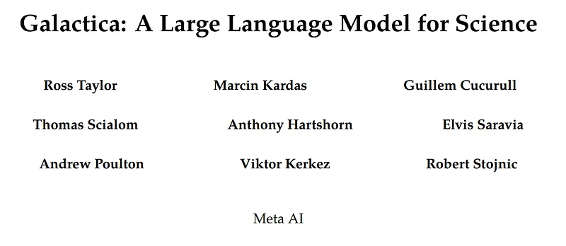 | Title card: Galactica. |
| 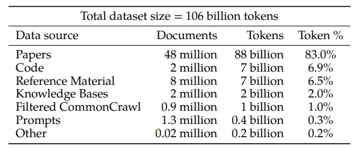 | The Galactica Corpus. |
| 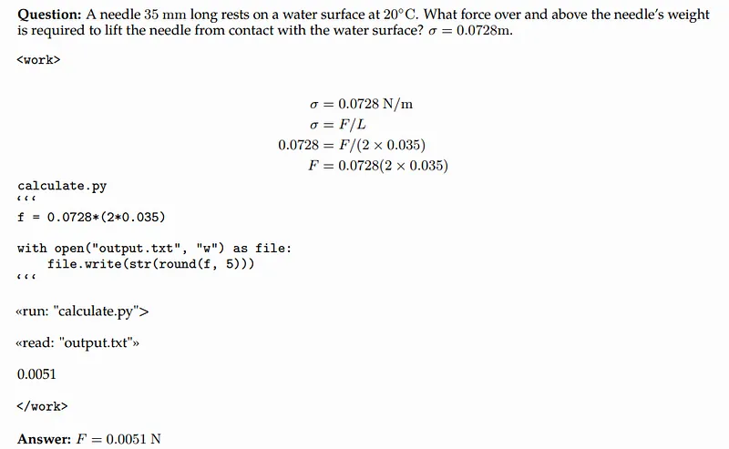 | An example answer with the working memory token. It performs exact steps for rearranging the equation, and when it reaches a calculation that it cannot solve reliably in a forward pass, it writes a program, which can then be offloaded to a classical computer. |
| 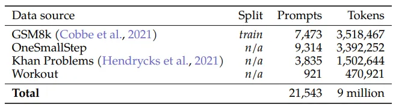 | Reasoning Datasets (to train the model to use a “work” token). |
| 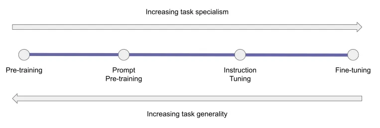 | “Pre-training weighs all tokens equally as part of the self-supervised loss. This leads to a weak relative signal for tasks of interest, meaning the model scale has to be large to work. Instruction tuning boosts performance post hoc, and can generalize to unseen tasks of interest, but it risks performance in tasks that are distant from instruction set tasks. Prompt pre-training has a weaker task of interest bias than instruction tuning but less risk of degrading overall task generality.”. |
| 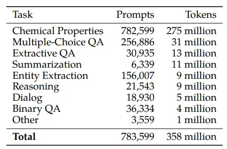 | Pre-training Prompts. |
| 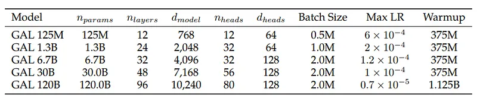 | Details of the models trained. |
| 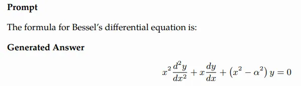 | LaTeX Equations Probe. |
| 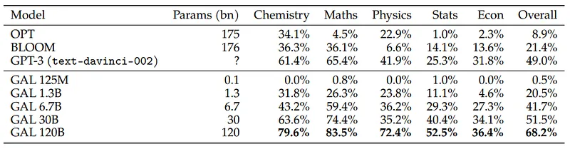 | Results on LaTeX equation. |
| 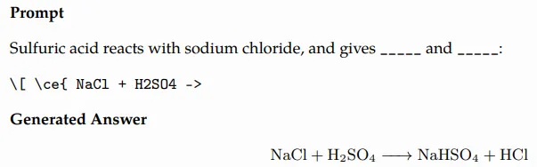 | Chemical Reactions. |
| 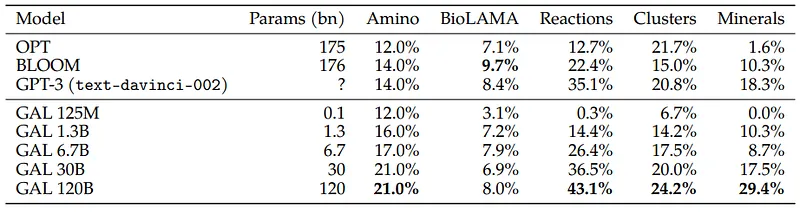 | Results on Domain Probes. |
| 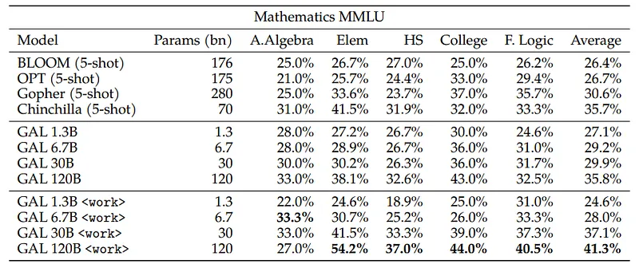 | Results on Mathematics MMLU. |
| 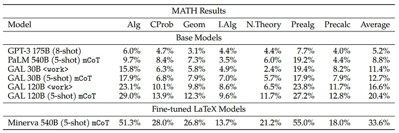 | Results on MATH. |
| 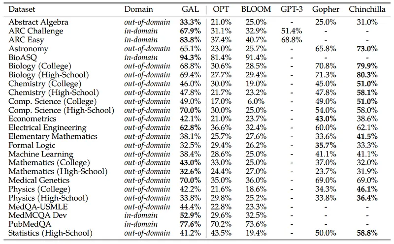 | Question Answering Results. |
| 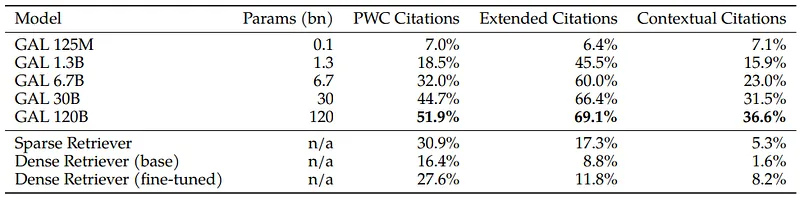 | Citation Prediction Accuracy. |
| 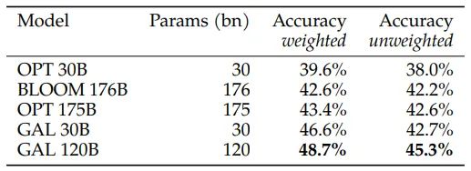 | BIG-bench 57 Task Results. |
| 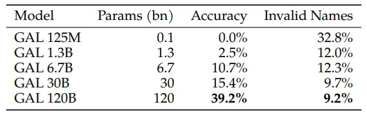 | Results on IUPAC Naming. |
| 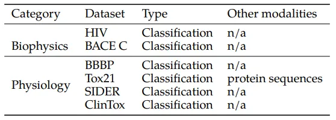 | MoleculeNet datasets used for evaluation. |
| 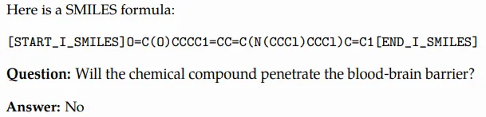 | BBBP Prompt. We include the SMILES and pose the classification problem in natural language. |
| 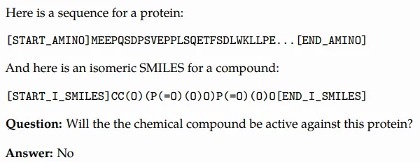 | Tox21 Prompt. We include the protein sequence and the SMILES formula and pose the classification problem in natural language. |
| 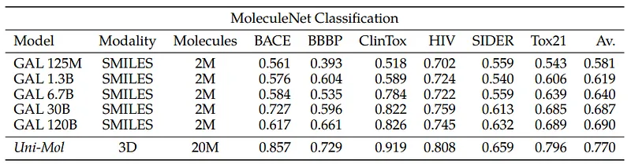 | Results on MoleculeNet Classification. Results are scored by ROC-AUC. |
| 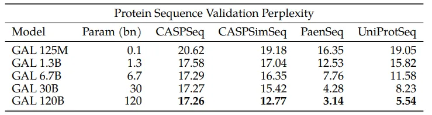 | Protein Validation Perplexity. Validation sets with higher potential sequence similarity with the training set have lower perplexity than the restricted sets (CASP validation sets). |
| 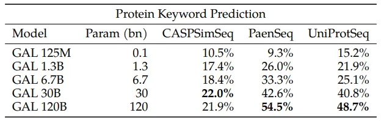 | Protein Keyword Prediction. The metric shown is F1 score. Performance increases with scale across the holdout sets. Note we do not include CASPSeq as these do not have UniProt keywords we can test against. |
| 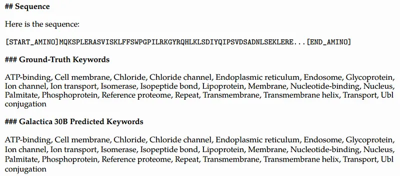 | Protein Keyword Prediction. |
| 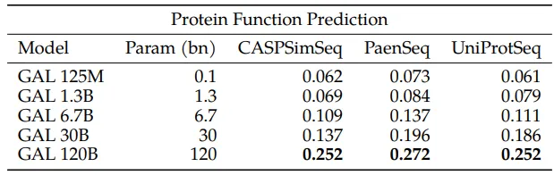 | Protein Function Prediction. The metric shown is ROUGE-L. Performance increases with scale. |
| 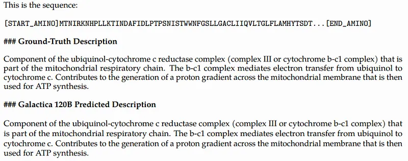 | Protein Description Prediction. |
## Related

- [[Papers Explained Corpus]]
- [[Large Language Models]]
- [[Reasoning Models]]
- [[Synthetic Data]]
- [[Code Models]]
- [[Papers Explained 52 - BLOOM]]
- [[Papers Explained 54 - ChatGPT]]

#summary #topic
