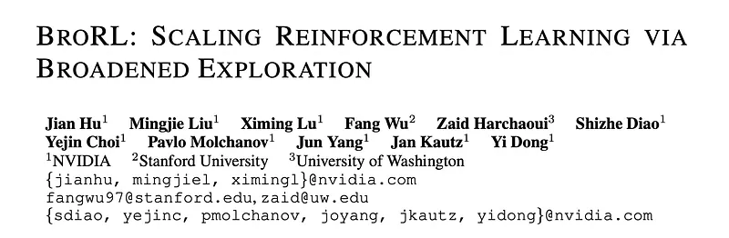
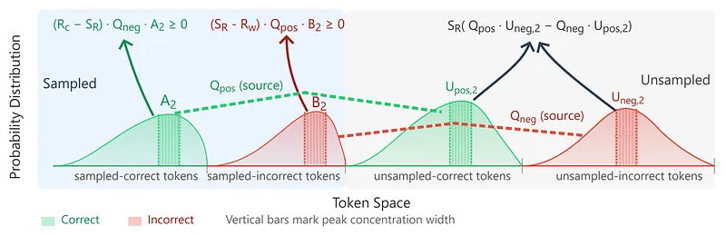
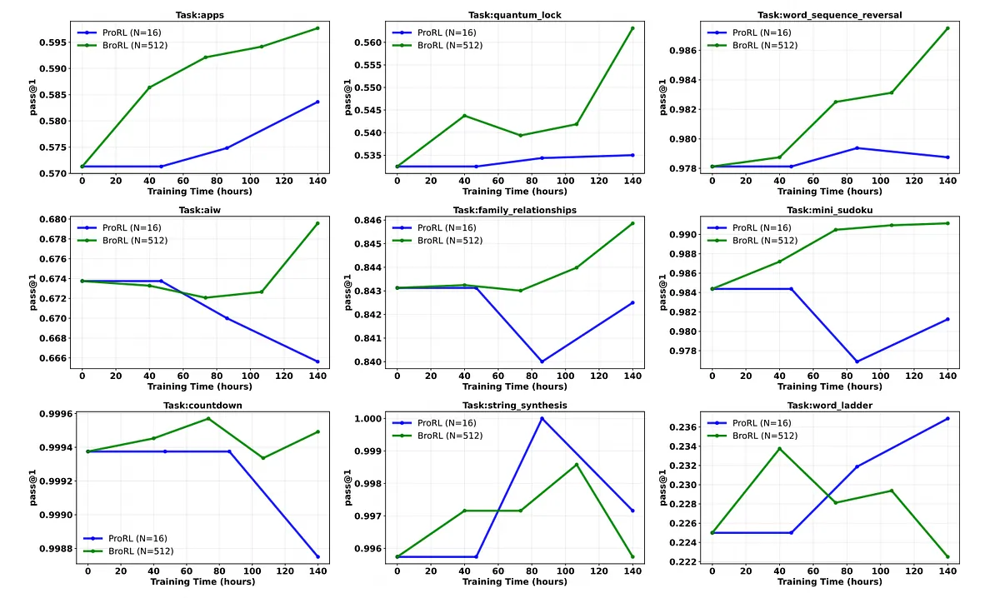
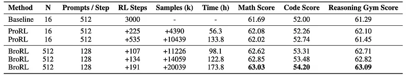
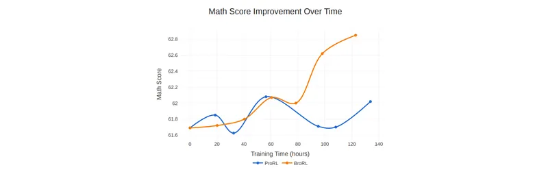
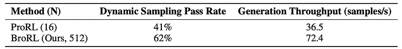

# Papers Explained 530 - BroRL

Existing methods like ProRL plateau in performance after thousands of training steps, showing diminishing returns. BroRL (Broaden exploration) aims to overcome this by broadening exploration through exhaustive rollouts.

This page ingests the source article into the wiki and connects it to [[Papers Explained Corpus]], [[Reinforcement Learning Topic]], [[Safety and Alignment]], [[Vision Language Models]], [[Reinforcement Learning]].

## Source Metadata

- Source file: `raw/2026-01-23_Papers-Explained-530--BroRL-da46c4caec8f.md`
- Source title: Papers Explained 530: BroRL
- Published: 2026-01-23
- Canonical: [https://medium.com/@ritvik19/papers-explained-530-brorl-da46c4caec8f](https://medium.com/@ritvik19/papers-explained-530-brorl-da46c4caec8f)

## Key Ideas

- A mass balance equation analysis reveals that sampled rollout tokens always contribute to the probability mass of correct tokens.
- This research adopts the prolonged reinforcement learning (RL) framework from ProRLv2. This approach is centered around a clipped Proximal Policy Optimization (PPO) algorithm, with the objective function:
- where rθ(τ) is the probability ratio and A(τ) is the advantage. A key feature is its REINFORCE++ style decoupled advantage normalization.
- To further improve performance and exploration, the framework integrates several key techniques.
- where N is the number of rollout samples per prompt, Mi is the prediction and I(·) is the indicator function.

## Notes

Existing methods like ProRL plateau in performance after thousands of training steps, showing diminishing returns. BroRL (Broaden exploration) aims to overcome this by broadening exploration through exhaustive rollouts.

A mass balance equation analysis reveals that sampled rollout tokens always contribute to the probability mass of correct tokens. Unsampled tokens can have varying effects, but their influence diminishes as the number of rollouts (N) increases, ensuring overall correct-mass expansion.

## BroRL: Broad Reinforcement Learning

This research adopts the prolonged reinforcement learning (RL) framework from ProRLv2. This approach is centered around a clipped Proximal Policy Optimization (PPO) algorithm, with the objective function:

where rθ(τ) is the probability ratio and A(τ) is the advantage. A key feature is its REINFORCE++ style decoupled advantage normalization. First, the advantage Aτ for a trajectory τ with return Rτ is computed by subtracting the mean return of its corresponding group for each prompt. This value is then normalized across the entire global sample batch:

To further improve performance and exploration, the framework integrates several key techniques. A core component is Dynamic Sampling, which filters out trivial trajectories that are either entirely correct or entirely incorrect to focus training on the most informative samples. For a batch B of trajectories τ, the filtered batch B′ is:

where N is the number of rollout samples per prompt, Mi is the prediction and I(·) is the indicator function. Other methods include periodic resets of the reference policy, exploration enhancements via Clip-Higher (εhigh > εlow) , and truncated importance sampling to correct off-policy mismatch between the inference engine and the training engine.

BroRL is predicated on the principled scaling of the rollout size per prompt N. Consequently, in contrast to conventional approaches, BroRL employs a significantly large N to substantially increase the rollout diversity for each prompt. This rollout size N scaling robustifies the learning signal by minimizing the variance and potential negativity arising from unsampled portions of the action space. This ensures a more consistent and stable policy optimization process, directly translating theoretical guarantees into a more effective training regime for complex reasoning tasks.

## Experiment Setup

This work builds upon the publicly available ProRLv2 checkpoint and five task families: math, code, science, IFEval and reasoning gym. This model, having already undergone 3,000 RL training steps with a context length of 8,192 tokens, provides a strong starting point. To further enhance its capabilities, especially for tasks requiring long-context reasoning, its context window was expanded to 16,384 tokens for all subsequent training phases. The number of generated samples per prompt was increased from a baseline of 16 to N=512. For baseline comparison, RL training was also extended on top of ProRLv2 checkpoint using the original ProRL recipe under the same compute budget.

To maintain training stability while accommodating the significantly larger effective batch size resulting from the increased rollout size (N), the learning rate was adjusted while keeping the number of PPO mini-batches per step unchanged. Specifically, the learning rate was scaled proportionally to the square root of the increase in the batch size. Let η0 be the base learning rate for a reference batch size B0. Our new learning rate ηnew for a new, larger batch size Bnew is determined by the formula: ηnew = η0 × sqrt(Bnew/B0). This principled adjustment ensures that the magnitude of parameter updates remains well-controlled.

## Analysis

### Pass@1 Trajectories

*Figure: Pass@1 comparison of BroRL vs. ProRL, normalized by training compute.*

- Under equalized training compute, three typical Pass@1 trajectories emerge:

- Both ProRL and BroRL improve, but BroRL consistently outperforms ProRL.

- ProRL degrades over time while BroRL continues to improve, showing greater robustness.

- Both fail to gain consistently, suggesting (N = 512) may still be insufficient for the hardest tasks.

- Most benchmarks fall into the first two (favorable) patterns for BroRL.

- A paired t-test over >10,000 problem instances at the final checkpoint (~140 hours) shows a small but statistically significant Pass@1 improvement for BroRL (Δ = 0.0033, t = 4.84, one-tailed p = 6.5×10⁻⁷), rejecting the null that BroRL and ProRL perform equally.

- Even modest gains are meaningful given the strong baseline and short additional training (100 steps), indicating BroRL yields more reliable progress and better generalization.

### Breaking the Plateau via Rollout Scaling

*Figure: Efficiency and Performance Comparison.*

ProRL:

- Shows small initial gains (e.g., Math 62.08, Reasoning Gym 62.10) but then stagnates and degrades (Math 62.02, Reasoning Gym 61.45) after ~133.8 hours.

- Code score increases only slightly (to 52.74).

BroRL:

- Achieves steady, monotonic improvements across all benchmarks, reaching Math 63.03, Code 54.20, Reasoning Gym 63.09.

- Surpasses ProRL’s final performance on all metrics after only 98.1 hours — about 35 hours less compute.

- Gains come from fewer but higher-quality gradient updates (same PPO mini-batches per step, larger (N)), not from more updates.

Conclusion: Scaling rollout size is more effective and time-efficient than simply increasing training steps for saturated models.

### GPU Compute Efficiency

*Figure: Algorithmic and Hardware Efficiency Metrics.*

BroRL improves both algorithmic and hardware efficiency in the sample generation phase, the main bottleneck in RLVR for long CoT reasoning.

Algorithmic level:

- Larger rollout size (N = 512) increases Dynamic Sampling Pass Rate from 41% (ProRL, N=16) to 62%, meaning a higher fraction of generated samples are useful for training and less compute is wasted.

Hardware level:

- Generation throughput nearly doubles (36.5 → 72.4 samples/s) when moving from (N = 16) to (N = 512).

- Larger batches shift generation from being memory-bound (idle compute cores) to more compute-bound, improving arithmetic intensity and GPU utilization, aided by higher prefix cache hit rates.

Overall conclusion: BroRL not only improves learning dynamics and generalization but also uses GPU hardware more efficiently by exploiting large-batch generation.

## Paper

BroRL: Scaling Reinforcement Learning via Broadened Exploration [2510.01180](https://arxiv.org/abs/2510.01180)

## Figures

Figures from the Medium HTML export (`raw/2026-01-23_Papers-Explained-530--BroRL-da46c4caec8f.md`); local copies under `wiki/assets/papers-explained-530-brorl/` when download succeeded.

| Figure | Caption |
|--------|---------|
|  | Title card: BroRL. |
|  | A mass balance equation analysis reveals that sampled rollout tokens always contribute to the probability mass of correct tokens. |
|  | This research adopts the prolonged reinforcement learning (RL) framework from ProRLv2. |
|  | where rθ(τ) is the probability ratio and A(τ) is the advantage. |
|  | To further improve performance and exploration, the framework integrates several key techniques. |
|  | Pass@1 comparison of BroRL vs. ProRL, normalized by training compute. |
|  | Efficiency and Performance Comparison. |
|  | ProRL. |
|  | Algorithmic and Hardware Efficiency Metrics. |
## Related

- [[Papers Explained Corpus]]
- [[Reinforcement Learning Topic]]
- [[Safety and Alignment]]
- [[Vision Language Models]]
- [[Reinforcement Learning]]
- [[Papers Explained 529 - DR Tulu]]
- [[Papers Explained 531 - OctoThinker]]

#summary #topic
