# Papers Explained 531 - OctoThinker

This work investigates how mid-training strategies shape RL dynamics, focusing on two representative model families: Qwen and Llama. The study reveals that

This page ingests the source article into the wiki and connects it to [[Papers Explained Corpus]], [[Reasoning Models]], [[Large Language Models]], [[Synthetic Data]].

## Source Metadata

- Source file: `raw/2026-01-26_Papers-Explained-531--OctoThinker-bdec24e27301.md`
- Source title: Papers Explained 531: OctoThinker
- Published: 2026-01-26
- Canonical: [https://medium.com/@ritvik19/papers-explained-531-octothinker-bdec24e27301](https://medium.com/@ritvik19/papers-explained-531-octothinker-bdec24e27301)

## Key Ideas

- high-quality mathematical corpora, such as MegaMath-Web-Pro, significantly improve both base model and RL performance, while existing alternatives (e.g., FineMath-4plus) fail to do so
- further adding QA-styled data, particularly long chain-of-thought (CoT) reasoning examples, enhances RL outcomes, and instruction data further unlocks this effect
- while long-CoT improves reasoning depth, it can also induce verbosity of model responses and instability of RL training, underscoring the importance of data formatting
- scaling mid-training consistently leads to stronger downstream RL performance.
- Building on these insights, a two-stage mid-training strategy, “Stable-then-Decay” is introduced in which base models are first trained on 200B tokens with a constant learning rate, followed by 20B tokens across three CoT-focused branches with learning rate...

## Notes

This work investigates how mid-training strategies shape RL dynamics, focusing on two representative model families: Qwen and Llama. The study reveals that

- high-quality mathematical corpora, such as MegaMath-Web-Pro, significantly improve both base model and RL performance, while existing alternatives (e.g., FineMath-4plus) fail to do so

- further adding QA-styled data, particularly long chain-of-thought (CoT) reasoning examples, enhances RL outcomes, and instruction data further unlocks this effect

- while long-CoT improves reasoning depth, it can also induce verbosity of model responses and instability of RL training, underscoring the importance of data formatting

- scaling mid-training consistently leads to stronger downstream RL performance.

Building on these insights, a two-stage mid-training strategy, “Stable-then-Decay” is introduced in which base models are first trained on 200B tokens with a constant learning rate, followed by 20B tokens across three CoT-focused branches with learning rate decay. This yields OctoThinker, a family of models demonstrating strong RL compatibility.

## Exploring Key Factors through Controllable Mid-training

This section examines the effects of data quality of math web corpora, the inclusion or exclusion of QA-format data, the nature of the QA data itself, the presence of general instruction-following data in mid-training, as well as the pre-training token budget.

Mid-training is performed with Llama-3.2–3B-Base, within a 20B-token training budget. A cosine learning rate scheduler without warmup is used, with a peak learning rate of 3e-5 and a minimum learning rate set to one-tenth of the peak. The default sequence length is 8,192.

*Figure: Statistics and Types of different datasets used in the experiments.*

For the OpenR1 dataset, the question and the thinking process enclosed within <think> and </think> are concatenated using a line break. For the general instruction following datasets, only high-quality conversations, such as those derived from GPT-4, are retained and formatted as “User:{}\nAssistant:{}”.

The Curation of MegaMath-Web-Pro-Max

Millions of documents were randomly sampled from MegaMath-Web, stratified by publication year. Each document was graded for its usefulness in studying mathematics on a scale of 0 to 5 using Llama-3.1–70B-instruct. A custom classifier was trained using FastText for efficiency. Documents scoring below 3 were labeled as negative examples, while those scoring 3 or above were considered positive. Text preprocessing steps included lowercasing, filtering excessively long words, and removing line breaks and extraneous characters. The quality of the recalled corpus was evaluated under different recall thresholds. A threshold of 0.4 was chosen, balancing data quantity and quality. The selected documents were further refined using a prompt inspired by MegaMath-Web-Pro, leveraging Llama-3.1–70B-instruct.

The resulting dataset, MegaMath-Web-Pro-Max, contains approximately 5.5 times more tokens than MegaMath-Web-Pro, while maintaining

### On the Inclusion and Data Quality of Math Web Corpora

The systematic analysis is conducted by performing mid-training on different math web corpora, while holding other factors constant.

*Figure: The effect of different math web corpora during mid-training.*

- Mid-training on math web data improves performance over the base model, with MegaMath-Web-Pro and MegaMath-Web-Pro-Max showing slightly better gains than FineMath-4plus.

- After RL training, mid-training on math web corpora improves RL performance to varying degrees. MegaMath-Web-Pro and MegaMath-Web-Pro-Max bring significant gains for Llama in RL training

- While FineMath-4plus yields only marginal improvements. Models trained on FineMath-4plus exhibited abnormal behavior, with response lengths rapidly increasing until reaching the maximum limit of 4,096 tokens. The outputs typically begin with “\boxed{}” and devolve into repetitive “Solution” statements.

> High-quality math pre-training corpora play a dominant role in RL scaling. MegaMath-Web-Pro and MegaMath-Web-Pro-Max are adopted in this work.

### On the Inclusion and Nature of QA-Format Data

The hypothesis posits that QA data’s short Chain-of-Thought (short-CoT, from MegaMath-QA) and long-CoT(fromOpenR1-Math-220K) reasoning, which may include self-reflection and backtracking, enhance base model performance and RL training. Maximum response lengths were 8,192 tokens for long-CoT models and 4,096 for others.

*Figure: Impact of incorporating CoT data with varying characteristics during mid-training (9:1 mixture ratio).*

- Incorporating QA data into mid-training generally yields performance gains for the base model, though these gains are marginal.

- After RL training, incorporating short-CoT data into mid-training shows no improvements compared to mid-training on web data alone, possibly due to the data distribution gap while long-CoT data brings significant performance gains.

- However, incorporating long-CoT data introduces challenges with unstable RL training, evidenced by sudden performance drops and sharp increases in response length.

> QA data could aid RL scaling, but gains depend on its distribution gap with downstream tasks. LongCoT patterns often induce excessive responses and sudden performance drops in RL-tuned models.

### On the Inclusion of Instruction-following Data

Instruction-following data is incorporated alongside web data and QA data in a 1:89:10 ratio. This involves combining these high-quality datasets with appropriate filtering and formatting: TULU3-sft-personas-instruction-following, WildChat, and UltraChat-200K, totaling approximately 0.8B tokens.

Incorporating instruction-following data into the short-CoT mid-training mixture

*Figure: Impact of incorporating instruction-following data during mid-training with a mixture of web, short-CoT and instruction data in a ratio of 89: 10: 1.*

After RL training, incorporating instruction-following data unlocks the potential of short-CoT data, showing performance advantages over the exclusion case after 200 steps. Additionally, this inclusion helps stabilize response length, resulting in smoother increases compared to when instruction-following data is excluded.

Incorporating instruction-following data into the long-CoT mid-training mixture

*Figure: Impact of incorporating instruction-following data during mid-training with a mixture of web, long-CoT and instruction data in a ratio of 89: 10: 1.*

Incorporating instruction-following data shows performance improvements after 150 steps. However, this addition still fails to prevent the overall decline in RL performance and the rapid increase in response length.

> Introducing a small amount of instruction-following data can help unlock the potential of QA data and mitigate RL training collapse caused by long CoT. This is addressed by modifying the RL prompt template and applying a progressive maximum response length scheduler.

### On the Issue of Mid-training Budget

A 100B-token mid-training run is conducted on MegaMath-Web-Pro-Max using a default cosine learning rate scheduler. Three intermediate checkpoints, trained on 20B, 70B, and 100B tokens, respectively, are selected and RL training is performed.

*Figure: Impact of scaling up the mid-training budget.*

- When evaluating the base models, the 70B and 100B checkpoints achieved comparable performance, both significantly outperforming the 20B model.

- After RL training, increasing the mid-training token count consistently leads to improvements on RL performance despite varying degrees, whether moving from 20B to 70B or from 70B to 100B tokens.

> Increasing the mid-training budget can improve RL performance, even if such gains are not evident in base model evaluations.

## OctoThinker-Base

A two-stage (stable-then-decay) mid-training strategy is adopted to achieve both:

- steady improvements in mathematical reasoning ability in the first stage

- diversified model behaviors via branching in the second decay stage.

### Recipe for the First Stage: Building Strong Reasoning Foundations

In the first phase, reliance is placed primarily on high-quality web corpora such as MegaMath-Web-Pro-Max and DCLM-Baselines, supplemented with a small portion of synthetic data to enable the model to improve steadily at scale. A WSD-style learning rate scheduler is adopted, replacing the cosine learning rate with a constant learning rate. The resulting mid-training models are referred to as OctoThinker-Base-Stable.

*Figure: Dataset composition and weights in the first-stage.*

*Figure: Hyper-parameters in stable stage.*

### Branching at the Second Stage: Seeking Perfect Blend for RL Scaling

Before entering the decay stage, a series of controlled 10B-token mid-training experiments are conducted on the OctoThinker-3B-Base-Stable model — each followed by RL training — to investigate how different QA datasets affect downstream performance. Experiments are conducted with three QA datasets — MegaMath-QA, OpenR1-Math-220K, and OpenMathInstruct-2 (OMI2) — in varying proportions (10%, 20%, 30%, and 40%) while holding constant 5% DCLM-Baselines data, 10% instruction data, and the remainder from MegaMath-Web-Pro.

*Figure: RL dynamics under different QA datasets and mixing ratios during the decay stage.*

- The origin of QA data plays a critical role. Specifically, OpenR1-Math-220K and OMI2 are derived from structured downstream datasets (e.g., GSM8K, MATH), while MegaMath-QA is sourced from less curated web documents.

- In light of this, OpenMathInstruct-2, OpenR1-Math-220K (and further the a-m-team’s distilled dataset), and NuminaMath-1.5 are adopted as primary QA datasets for the decay stage, due to their closer resemblance to competition-style, reasoning-intensive benchmarks.

- Increasing the QA data ratio leads to improved RL performance, which aligns with expectations due to the format similarity with RL objectives. However, gains begin to plateau beyond a 30% QA mix, with 40% showing diminishing returns across most benchmarks.

- As a result, 30% QA is adopted as the optimal ratio, balancing performance and data efficiency.

For the decay stage, two learning rate (LR) scheduler variants are explored:

- Constant LR decay, where the LR remains fixed at 10% of the final LR used in the stable stage.

- Cosine decay to 10%, where the LR gradually decays to 10% of the stable-stage final LR.

Based on mid-training evaluation results, the cosine decay strategy demonstrates more consistent performance. Therefore, it is adopted as the default scheduler for the decay stage.

*Figure: Hyper-parameters for decay stage.*

During the decay stage, the mid-training is branched into three distinct variants based on data composition:

- OctoThinker-Long (long-reasoning data)

- OctoThinker-Short (short-reasoning data)

- OctoThinker-Hybrid (a mix of both) with decayed learning rate.

*Figure: Specific data mixture for each branch in the decay stage.*

## OctoThinker-Zero Families

All OctoThinker base models spanning different decay branches and model sizes (1B and 3B) are further trained through a reinforcement learning stage. The final RL-tuned models fall into three categories, each reflecting the data mixture used during decay and the distinct behaviors shaped during RL: OctoThinker-Short-Zero, OctoThinker-Hybrid-Zero, and OctoThinker-Long-Zero.

*Figure: The RL training dynamics across different branches for OctoThinker-1B series.*

*Figure: The RL training dynamics across different branches for OctoThinker-3B series.*

To address “To what extent can our OctoThinker models close the performance gap between the Llama-3.2 series and the stronger Qwen2.5 models in the RL setting”, three 3B-scale base models are compared: Llama-3.2–3B-Base, OctoThinker-Long-3B-Base, and Qwen2.5–3B-Base. OctoThinker-Long-3B consistently outperforms the original Llama-3.2–3B model. Remarkably, it reaches performance on par with Qwen2.5–3B.

*Figure: RL training dynamics among Llama-3.2–3B-Base, OctoThinker series and Qwen2.5-Base.*

## Paper

OctoThinker: Mid-training Incentivizes Reinforcement Learning Scaling [2506.20512](https://arxiv.org/abs/2506.20512)

## Figures

Figures from the Medium HTML export (`raw/2026-01-26_Papers-Explained-531--OctoThinker-bdec24e27301.md`); local copies under `wiki/assets/papers-explained-531-octothinker/` when download succeeded.

| Figure | Caption |
|--------|---------|
| 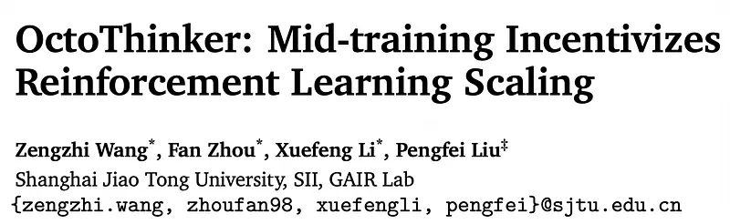 | Title card: OctoThinker. |
| 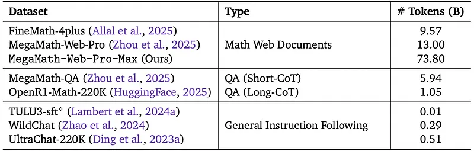 | Statistics and Types of different datasets used in the experiments. |
| 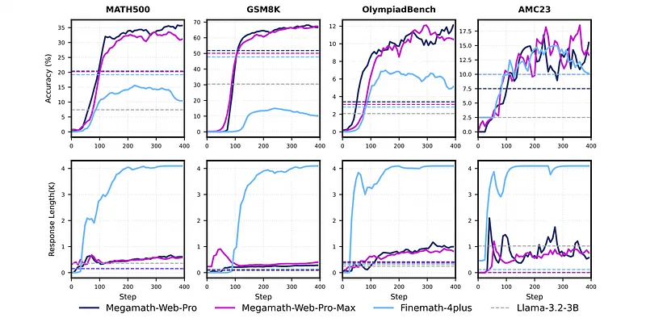 | The effect of different math web corpora during mid-training. |
| 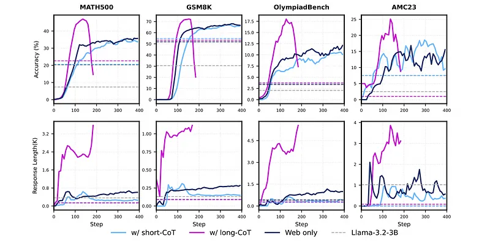 | Impact of incorporating CoT data with varying characteristics during mid-training (9:1 mixture ratio). |
| 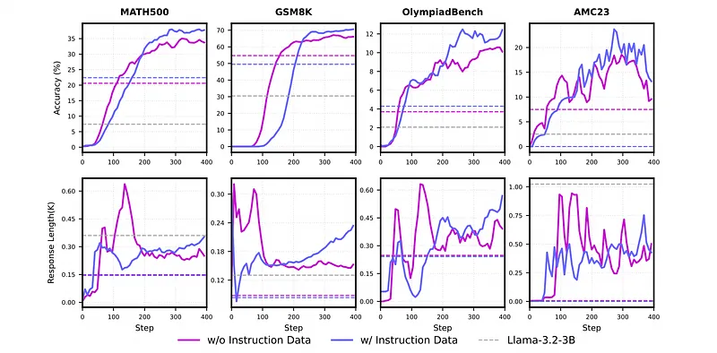 | Impact of incorporating instruction-following data during mid-training with a mixture of web, short-CoT and instruction data in a ratio of 89: 10: 1. |
| 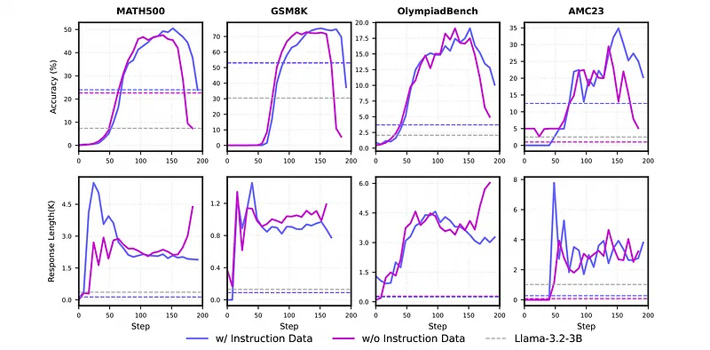 | Impact of incorporating instruction-following data during mid-training with a mixture of web, long-CoT and instruction data in a ratio of 89: 10: 1. |
| 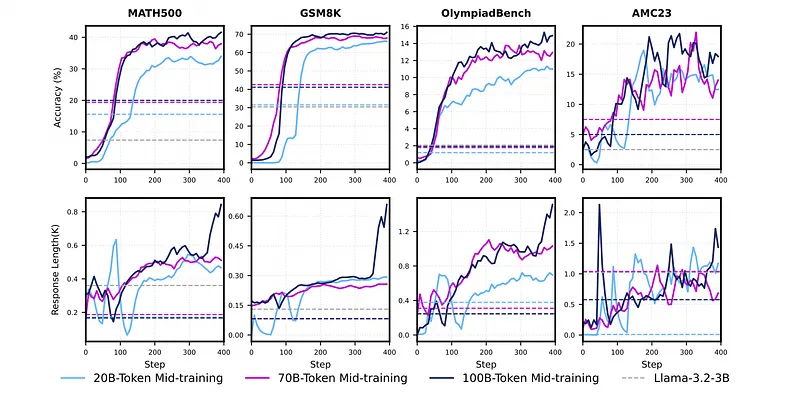 | Impact of scaling up the mid-training budget. |
| 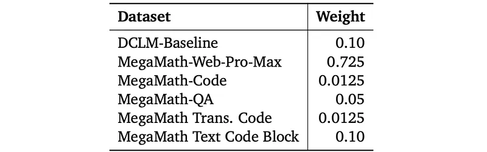 | Dataset composition and weights in the first-stage. |
| 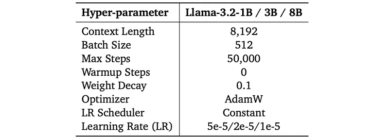 | Hyper-parameters in stable stage. |
| 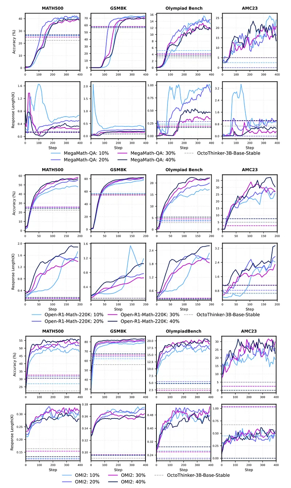 | RL dynamics under different QA datasets and mixing ratios during the decay stage. |
| 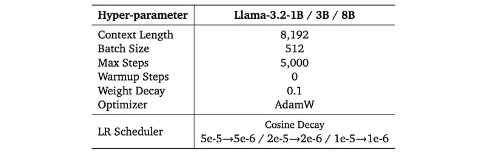 | Hyper-parameters for decay stage. |
| 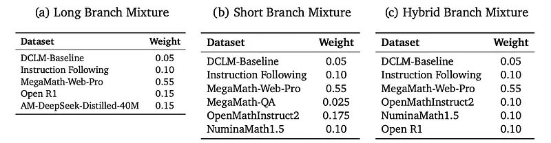 | Specific data mixture for each branch in the decay stage. |
| 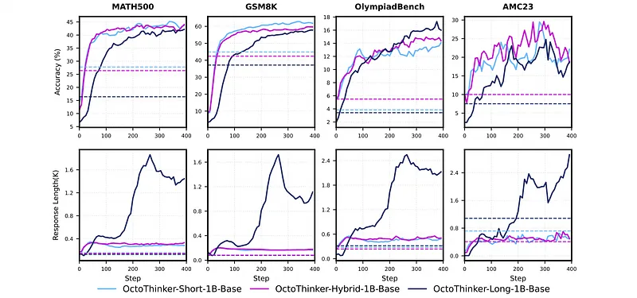 | The RL training dynamics across different branches for OctoThinker-1B series. |
| 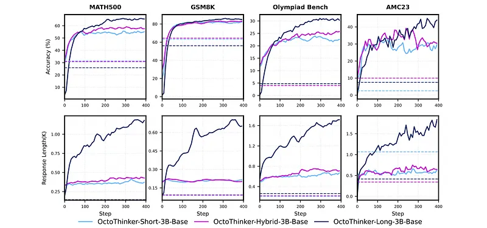 | The RL training dynamics across different branches for OctoThinker-3B series. |
| 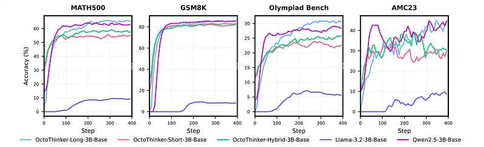 | RL training dynamics among Llama-3.2–3B-Base, OctoThinker series and Qwen2.5-Base. |
## Related

- [[Papers Explained Corpus]]
- [[Reasoning Models]]
- [[Large Language Models]]
- [[Synthetic Data]]
- [[Papers Explained 530 - BroRL]]
- [[Papers Explained 532 - Jina-VLM]]

#summary #topic
