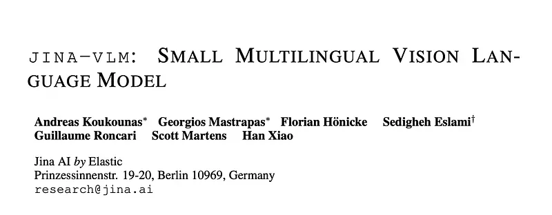
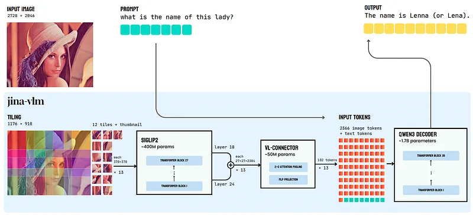
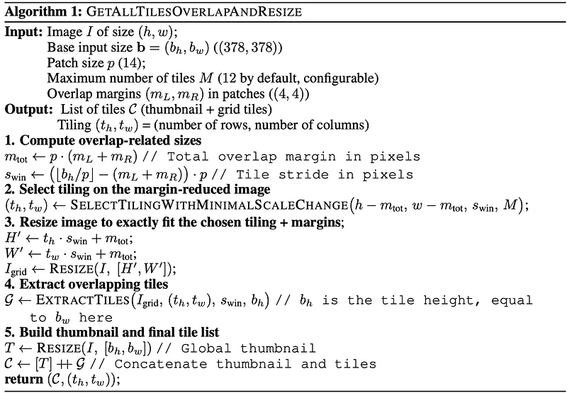
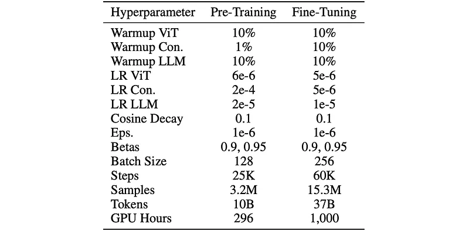
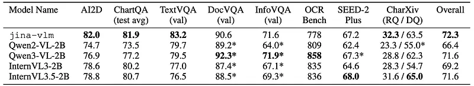
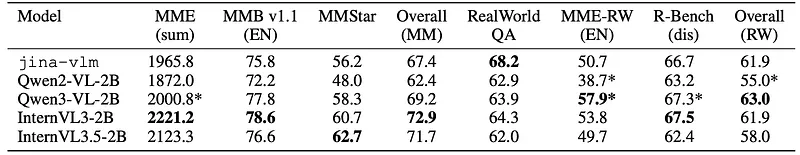
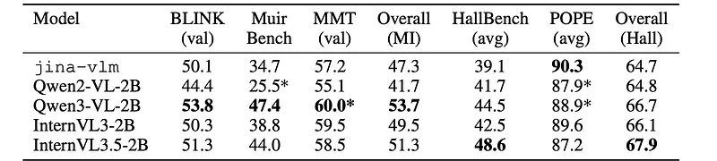
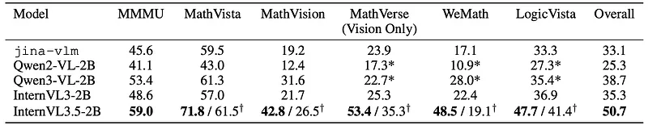
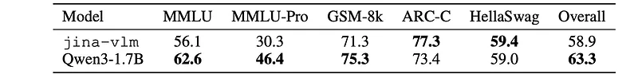
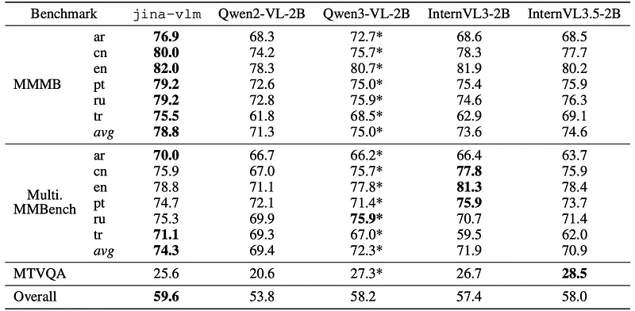

# Papers Explained 532 - Jina-VLM

Jina-VLM is a 2.4B parameter vision-language model that achieves state-of-the-art multilingual visual question answering among open 2B-scale VLMs. The model couples a SigLIP2 vision encoder with a Qwen3 language backbone through an attention-pooling connector that enables token-efficient processing of arbitrary-resolution images.

This page ingests the source article into the wiki and connects it to [[Papers Explained Corpus]], [[Vision Language Models]], [[Large Language Models]], [[Synthetic Data]], [[Multilingual Models]], [[Reasoning Models]].

## Source Metadata

- Source file: `raw/2026-01-27_Papers-Explained-532--Jina-VLM-3d83a03005ca.md`
- Source title: Papers Explained 532: Jina-VLM
- Published: 2026-01-27
- Canonical: [https://medium.com/@ritvik19/papers-explained-532-jina-vlm-3d83a03005ca](https://medium.com/@ritvik19/papers-explained-532-jina-vlm-3d83a03005ca)

## Key Ideas

- Jina-VLM is a 2.4B parameter vision-language model that achieves state-of-the-art multilingual visual question answering among open 2B-scale VLMs.
- The models are available on [HuggingFace](https://huggingface.co/collections/jinaai/jina-vlm/).
- where Ni contains the four patches at positions (2ix, 2iy), (2ix + 1, 2iy), (2ix, 2iy + 1), and (2ix + 1, 2iy + 1) and M = N/4
- The language decoder is initialized from Qwen3–1.7B-Base, which empirically outperformed the instruction-tuned variant in this setting.
- Training proceeds in two stages, both updating all model components (encoder, connector, and decoder) without freezing.

## Notes

Jina-VLM is a 2.4B parameter vision-language model that achieves state-of-the-art multilingual visual question answering among open 2B-scale VLMs. The model couples a SigLIP2 vision encoder with a Qwen3 language backbone through an attention-pooling connector that enables token-efficient processing of arbitrary-resolution images.

The models are available on [HuggingFace](https://huggingface.co/collections/jinaai/jina-vlm/).

## Model Architecture

*Figure: Architecture of Jina-VLM.*

The model uses overlapping image tiling, combined with attention-based token pooling to reduce sequence length while preserving spatial information. The vision encoder, SigLIP2-So400M/14–384, is a 27-layer Vision Transformer with 400M parameters that processes 378×378 pixel inputs as 27×27 grids of 14×14 patches. To handle arbitrary resolutions, each image is decomposed into overlapping tiles of this size and each tile is processed independently through the encoder. A global thumbnail, the full image resized to 378×378, provides context alongside the tile representations. A default of 12 tiles is used during training; this limit can be increased at inference or during continued training to handle higher resolutions, with memory scaling linearly with tile count.

### Vision Language Connector

Rather than using the final ViT output, jina-vlm concatenates features from two intermediate layers: the third-to-last and ninth-to-last, corresponding to layers 24 and 18 of the 27-layer encoder. This captures both fine-grained spatial details from earlier layers and high-level semantics from later layers. The connector then applies attention pooling over 2×2 patch neighborhoods, using mean-pooled features as queries. This reduces the token count by 4×while preserving local structure. A SwiGLU projection layer maps the pooled representations to the language model’s embedding dimension.

where Ni contains the four patches at positions (2ix, 2iy), (2ix + 1, 2iy), (2ix, 2iy + 1), and (2ix + 1, 2iy + 1) and M = N/4

### Language Decoder

The language decoder is initialized from Qwen3–1.7B-Base, which empirically outperformed the instruction-tuned variant in this setting. Three special tokens are introduced to structure visual inputs: <im start> and <im end> delimit image and thumbnail sequences, while <im col> marks row boundaries within the patch grid, where tokens are arranged left-to-right and top-to-bottom. Input and output embedding weights are not tied.

## Training

Training proceeds in two stages, both updating all model components (encoder, connector, and decoder) without freezing. The combined data comprises approximately 5M multimodal samples and 12B text tokens across 30+ languages, with roughly half in English and the remainder spanning high- and moderate-resource languages.

The first stage focuses on cross-language semantic grounding rather than task-specific objectives. Training data consists primarily of caption datasets (PixmoCap, PangeaIns) spanning diverse visual domains: natural scenes, documents, infographics, and diagrams. 15% text-only data from PleiAS/common corpus is included to mitigate degradation on text-only tasks. The connector uses a higher learning rate and shorter warmup than the encoder and decoder.

The second stage trains instruction-following for VQA and reasoning tasks. A mixture of public dataset collections, including LLaVA OneVision, Cauldron, Cambrian, PangeaIns, and FineVision, is combined with text-only instruction data from Aya Dataset. The mixture covers academic VQA, document understanding, OCR, mathematics, and reasoning.

*Figure: Model training hyperparameters across pre-training and fine-tuning stages.*

## Evaluation

*Figure: Comparison of general visual question answering performance.*

- On eight VQA benchmarks, jina-vlm achieves the highest average score (72.3) among compared models.

- It is particularly strong in diagram interpretation and text extraction tasks.

*Figure: Comparison of generic multimodal understanding and real-world understanding performance.*

- On multimodal comprehension benchmarks, jina-vlm scores 67.4 on average.

- On real-world understanding benchmarks, jina-vlm scores 61.9, with the best RealWorldQA score (68.2) among 2B-scale peers.

*Figure: Comparison of multi-image and hallucination performance.*

- On multi-image reasoning benchmarks, jina-vlm scores 47.3 overall, which is lower than some competitors and is attributed to limited multi-image training data.

- On hallucination benchmarks, jina-vlm achieves the best POPE score (90.3), indicating low hallucination rates and strong resistance to fabricating visual details.

*Figure: Comparison of multimodal reasoning and mathematical problem-solving performance.*

- On structured reasoning and visual math benchmarks, jina-vlm’s overall performance (33.1) is competitive for a 2B-scale model.

*Figure: Comparison of Text-only benchmarks.*

Compared to its text backbone Qwen3–1.7B, jina-vlm shows:

- Similar or better performance on commonsense/short reasoning tasks (ARC-C, HellaSwag).

- Mostly preserved performance on MMLU and GSM-8K.

- Substantial degradation on MMLU-Pro (from 46.4 to 30.3), which stresses extended multi-step reasoning.

*Figure: Comparison of multilingual multimodal understanding performance.*

- On multilingual multimodal benchmarks (MMMB, Multilingual MMBench, MTVQA), jina-vlm achieves state-of-the-art performance among 2B-scale VLMs.

- It attains the highest averages on MMMB (78.8) and Multilingual MMBench (74.3), indicating strong multilingual visual-language understanding.

## Paper

Jina-VLM: Small Multilingual Vision Language Model [2512.04032](https://arxiv.org/abs/2512.04032)

## Figures

Figures from the Medium HTML export (`raw/2026-01-27_Papers-Explained-532--Jina-VLM-3d83a03005ca.md`); local copies under `wiki/assets/papers-explained-532-jina-vlm/` when download succeeded.

| Figure | Caption |
|--------|---------|
|  | Title card: Jina-VLM. |
|  | Architecture of Jina-VLM. |
|  | The model uses overlapping image tiling, combined with attention-based token pooling to reduce sequence length while preserving spatial... |
|  | Vision Language Connector. |
|  | where Ni contains the four patches at positions (2ix, 2iy), (2ix + 1, 2iy), (2ix, 2iy + 1), and (2ix + 1, 2iy + 1) and M = N/4. |
|  | where Ni contains the four patches at positions (2ix, 2iy), (2ix + 1, 2iy), (2ix, 2iy + 1), and (2ix + 1, 2iy + 1) and M = N/4. |
|  | where Ni contains the four patches at positions (2ix, 2iy), (2ix + 1, 2iy), (2ix, 2iy + 1), and (2ix + 1, 2iy + 1) and M = N/4. |
|  | Model training hyperparameters across pre-training and fine-tuning stages. |
|  | Comparison of general visual question answering performance. |
|  | Comparison of generic multimodal understanding and real-world understanding performance. |
|  | Comparison of multi-image and hallucination performance. |
|  | Comparison of multimodal reasoning and mathematical problem-solving performance. |
|  | Comparison of Text-only benchmarks. |
|  | Comparison of multilingual multimodal understanding performance. |
## Related

- [[Papers Explained Corpus]]
- [[Vision Language Models]]
- [[Large Language Models]]
- [[Synthetic Data]]
- [[Multilingual Models]]
- [[Reasoning Models]]
- [[Papers Explained 531 - OctoThinker]]
- [[Papers Explained 533 - OpenVision 3]]

#summary #topic
