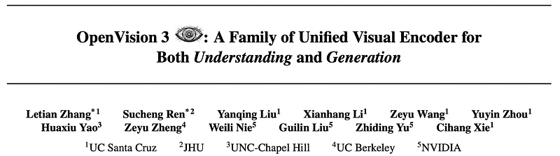
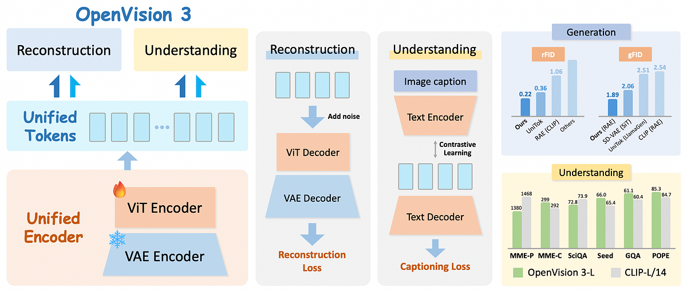
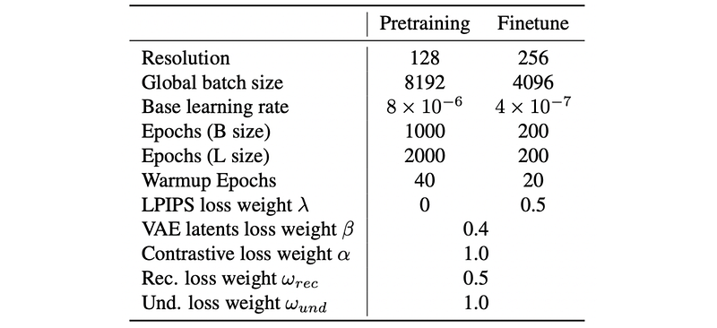
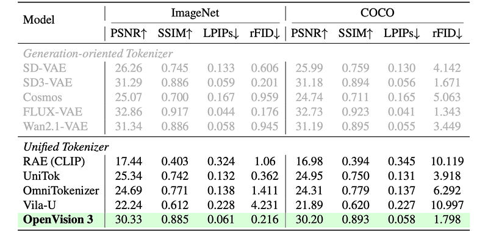
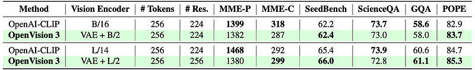
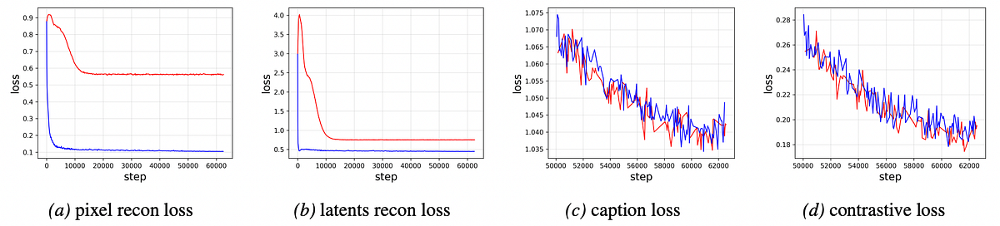
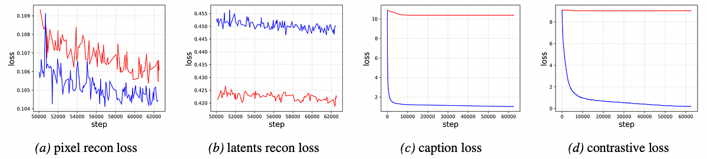

# Papers Explained 533 - OpenVision 3

OpenVision 3 is a family of advanced vision encoders that learn a single, unified visual representation that can serve both image understanding and image generation.

This page ingests the source article into the wiki and connects it to [[Papers Explained Corpus]], [[Vision Language Models]], [[Computer Vision]], [[Model Compression and Efficiency]], [[Large Language Models]].

## Source Metadata

- Source file: `raw/2026-01-28_Papers-Explained-533--OpenVision-3-87bc2a984c68.html`
- Source title: Papers Explained 533: OpenVision 3
- Published: 2026-01-28
- Canonical: [https://medium.com/@ritvik19/papers-explained-533-openvision-3-87bc2a984c68](https://medium.com/@ritvik19/papers-explained-533-openvision-3-87bc2a984c68)

## Key Ideas

- The project is available [here](https://ucsc-vlaa.github.io/OpenVision3/).
- An image with height H, width W, and channels C is given as input.
- The image is first passed through a VAE encoder, which converts it into a latent representation; it downsamples the spatial resolution by a factor of 8 in both height and width. The output is a latent tensor with D_vae (latent channels of the VAE) channels.
- The VAE latents are then fed into a Vision Transformer encoder, which uses a patch size of 2×2 on the VAE latent grid. This effectively gives an overall compression of 16× in height and width relative to the original image (8× from VAE, then 2× from ViT).
- These unified features are the core representation used for both generation and understanding.

## Notes

OpenVision 3 is a family of advanced vision encoders that learn a single, unified visual representation that can serve both image understanding and image generation.

The core architecture is simple: VAE-compressed image latents are fed to a ViT encoder and trained to support two complementary roles. First, the encoder output is passed to the ViT-VAE decoder to reconstruct the original image, encouraging the representation to capture generative structure. Second, the same representation is optimized with contrastive learning and image-captioning objectives, strengthening semantic features. By jointly optimizing reconstruction- and semantics-driven signals in a shared latent space, the encoder learns representations that synergize and generalize well across both regimes.

The project is available [here](https://ucsc-vlaa.github.io/OpenVision3/).

## Method

An image with height H, width W, and channels C is given as input.

The image is first passed through a VAE encoder, which converts it into a latent representation; it downsamples the spatial resolution by a factor of 8 in both height and width. The output is a latent tensor with D_vae (latent channels of the VAE) channels.

The VAE latents are then fed into a Vision Transformer encoder, which uses a patch size of 2×2 on the VAE latent grid. This effectively gives an overall compression of 16× in height and width relative to the original image (8× from VAE, then 2× from ViT). The ViT outputs unified visual features with D_u (dimension of unified features) channels.

These unified features are the core representation used for both generation and understanding.

### Reconstruction Branch

Before decoding, OpenVision 3 adds noise to the unified features to improve generalization for generation:

A noise tensor is sampled from a standard Gaussian distribution, with intensity value sampled uniformly from a range [0, tau] for each instance.

A ViT decoder with a patch size of 1×1 and a linear layer is used to convert the noised unified feature˜ zu back into VAE latentsˆ zvae. Next, the VAE decoder is applied to decode theˆ zvae into reconstruction imageˆ x.

The reconstruction branch is trained using a combination of:

- Image reconstruction loss: Measures the difference between the original image and the reconstructed image (e.g., using L1 distance).

- Latent reconstruction loss: Measures the difference between the original VAE latents and the reconstructed VAE latents (also typically L1).

- Perceptual loss (LPIPS): A perceptual similarity loss that compares images in a deep feature space to better capture visual quality.

### Understanding branch

The understanding branch is designed to make the unified features useful for vision-language understanding tasks, such as contrastive learning and image captioning.

Contrastive Learning

A text encoder is used to encode captions into text features. The unified visual features from the ViT encoder are paired with the corresponding text features. A contrastive loss is computed between visual and text features.

Image Captioning

A text decoder is used to generate captions from the unified visual features. The model performs autoregressive prediction of caption tokens. A captioning loss (e.g., cross-entropy over tokens) is computed between the generated captions and ground-truth or synthetic captions.

Formally, the understanding loss can be formulated as:

The overall training objective is:

ωund is configured as double that of ωrec during the training process.

## Training settings

A progressive training strategy is employed for the tokenizer, transitioning from low-resolution to high-resolution inputs. The tokenizer is first pre-trained at 128×128, and then fine-tuned with 224×224 or 256×256. The epoch distribution for the two training stages is maintained at around a 10:1 ratio.

Pre-trained FLUX.1 VAE is used and frozen during the whole training process. All other components (including ViT encoder, ViT decoder, text encoder, text decoder, and linear layer) are randomly initialized and remain unfrozen throughout the training. The model is trained on the DataComp dataset recaptioned by LLaVA-Llama-3, which ensures the high quality of the training data.

*Figure: Parameter configs for two stages of training.*

## Evaluation

### Reconstruction performance

*Figure: Reconstruction performance of visual tokenizers.*

- OpenVision 3 significantly outperforms existing unified tokenizers (RAE, UniTok, OmniTokenizer, Vila-U) on reconstruction metrics, and is competitive with or better than specialized generation-oriented tokenizers (SD-VAE, SD3-VAE, Cosmos, FLUX-VAE, Wan2.1-VAE).

- Similar strong gains are observed on COCO, indicating that the VAE–ViT hybrid design effectively reduces information loss while maintaining semantic alignment.

### Generation performance

*Figure: Class-conditional image generation on ImageNet 256x256.*

- On class-conditional ImageNet 256×256, OpenVision 3 paired with RAE achieves the best overall generation metrics among compared tokenizers and generators.

- This shows that a unified tokenizer can match or surpass both low-level (SD-VAE) and semantic (CLIP) tokenizers in generative fidelity and diversity.

### Understanding performance

*Figure: Comparison of OpenVision 3 with OpenAI CLIP under LLaVA-1.5 framework.*

- When integrated into LLaVA-1.5 with the same number of image tokens as OpenAI CLIP, OpenVision 3 matches or exceeds CLIP on several multimodal understanding benchmarks.

- Overall, OpenVision 3 is comparable to the understanding-oriented CLIP in semantic comprehension, with clear advantages on some tasks, demonstrating that strong understanding can be retained in a unified tokenizer.

### Interaction between understanding and reconstruction

Training with only semantic (understanding) loss:

*Figure: Loss visualization with only semantic loss.*

- Pixel-level and latent-level reconstruction losses still decrease substantially, indicating that semantic objectives alone improve reconstruction.

- Adding reconstruction loss does not harm caption or contrastive losses, showing no negative interference.

Training with only reconstruction loss:

*Figure: Loss visualization with only reconstruction loss.*

- Without semantic supervision, contrastive loss barely improves and caption loss only slightly decreases, suggesting reconstruction alone weakly supports semantic tasks.

- Adding semantic loss improves image reconstruction loss, indicating semantic supervision enhances reconstruction.

Reconstruction and understanding objectives are mutually beneficial rather than conflicting; semantic supervision helps reconstruction, and reconstruction helps generative-style semantic tasks, enabling a balanced unified tokenizer.

## Paper

OpenVision 3: A Family of Unified Visual Encoder for Both Understanding and Generation [2601.15369](https://arxiv.org/abs/2601.15369)

## Figures

Figures from the Medium HTML export (`raw/2026-01-28_Papers-Explained-533--OpenVision-3-87bc2a984c68.html`); local copies under `wiki/assets/papers-explained-533-openvision-3/` when download succeeded.

| Figure | Caption |
|--------|---------|
|  | Title card: OpenVision 3. |
|  | The project is available here. |
|  | The VAE latents are then fed into a Vision Transformer encoder, which uses a patch size of 2×2 on the VAE latent grid. |
|  | A noise tensor is sampled from a standard Gaussian distribution, with intensity value sampled uniformly from a range [0, tau] for each... |
|  | The reconstruction branch is trained using a combination of. |
|  | Formally, the understanding loss can be formulated as. |
|  | The overall training objective is. |
|  | Parameter configs for two stages of training. |
|  | Reconstruction performance of visual tokenizers. |
|  | Class-conditional image generation on ImageNet 256x256. |
|  | Comparison of OpenVision 3 with OpenAI CLIP under LLaVA-1.5 framework. |
|  | Loss visualization with only semantic loss. |
|  | Loss visualization with only reconstruction loss. |
## Related

- [[Papers Explained Corpus]]
- [[Vision Language Models]]
- [[Computer Vision]]
- [[Model Compression and Efficiency]]
- [[Large Language Models]]
- [[Papers Explained 532 - Jina-VLM]]
- [[Papers Explained 534 - PubMed-OCR]]

#summary #topic
