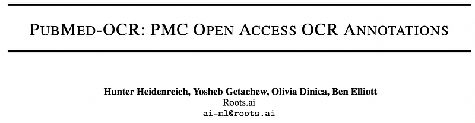
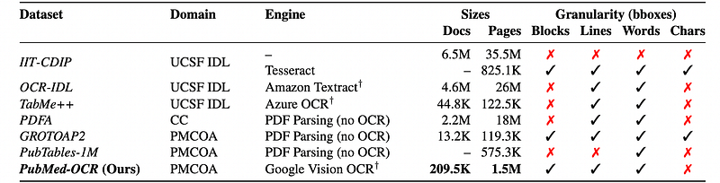
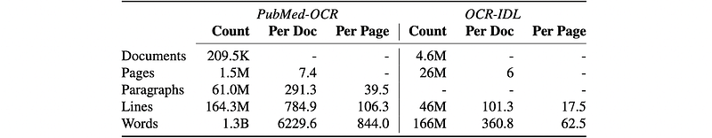
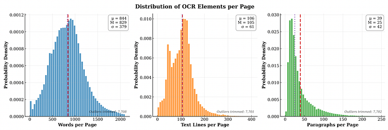
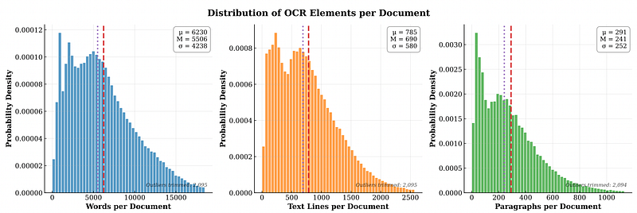
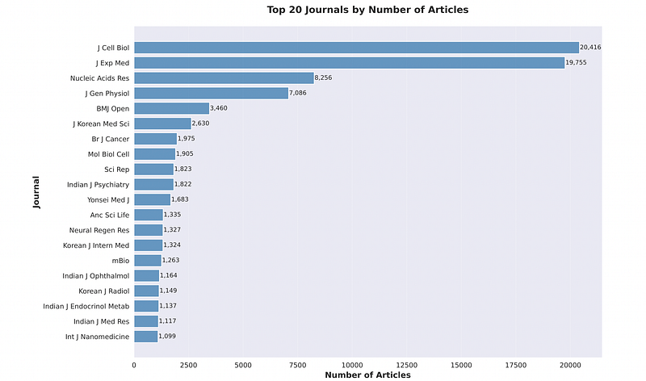

# Papers Explained 534 - PubMed-OCR

PubMed-OCR is an OCR-centric corpus of scientific articles derived from PubMed Central Open Access PDFs. Each page image is annotated with Google Cloud Vision and released in a compact JSON schema with word-, line-, and paragraph-level bounding boxes. The corpus spans 209.5K articles (1.5M pages;

This page ingests the source article into the wiki and connects it to [[Papers Explained Corpus]], [[Document AI]], [[Safety and Alignment]], [[Synthetic Data]], [[Evaluation and Benchmarks]].

## Source Metadata

- Source file: `raw/2026-01-29_Papers-Explained-534--PubMed-OCR-704ef959e98e.html`
- Source title: Papers Explained 534: PubMed-OCR
- Published: 2026-01-29
- Canonical: [https://medium.com/@ritvik19/papers-explained-534-pubmed-ocr-704ef959e98e](https://medium.com/@ritvik19/papers-explained-534-pubmed-ocr-704ef959e98e)

## Key Ideas

- PubMed-OCR is an OCR-centric corpus of scientific articles derived from PubMed Central Open Access PDFs. Each page image is annotated with Google Cloud Vision and released in a compact JSON schema with word-, line-, and paragraph-level bounding boxes.
- The dataset is available on [HuggingFace](https://huggingface.co/datasets/rootsautomation/pubmed-ocr).
- PMCOA PDFs were downloaded via the official FTP/OAI endpoints. Redistribution was restricted to articles whose licenses permit sharing derivative artifacts. Approximately 60% of the ∼2 million PDFs met this criterion (∼1.2 million).
- 209.5k documents were sampled uniformly at random and each page was annotated with the Google Vision API (December 19, 2024 release), priced at $1.50 per 1000 pages. This amounted to a cost of ∼$2.3k (with the cost of full OCR at roughly 5x, or $12k).
- For each document, OCR JSON is released (always) and, where permitted, the original PDF. The metadata CSV records the license (e.g., CC BY, CC BY-SA, CC BY-NC, CC BY-NC-SA), a direct PMCID/PMID link, and allowed use (e.g., commercial use = true/false).

## Notes

PubMed-OCR is an OCR-centric corpus of scientific articles derived from PubMed Central Open Access PDFs. Each page image is annotated with Google Cloud Vision and released in a compact JSON schema with word-, line-, and paragraph-level bounding boxes. The corpus spans 209.5K articles (1.5M pages; 1.3B words) and supports layout-aware modeling, coordinate-grounded QA, and evaluation of OCR-dependent pipelines.

The dataset is available on [HuggingFace](https://huggingface.co/datasets/rootsautomation/pubmed-ocr).

## PubMed-OCR Dataset

### Data Collection

PMCOA PDFs were downloaded via the official FTP/OAI endpoints. Redistribution was restricted to articles whose licenses permit sharing derivative artifacts. Approximately 60% of the ∼2 million PDFs met this criterion (∼1.2 million).

209.5k documents were sampled uniformly at random and each page was annotated with the Google Vision API (December 19, 2024 release), priced at $1.50 per 1000 pages. This amounted to a cost of ∼$2.3k (with the cost of full OCR at roughly 5x, or $12k).

For each document, OCR JSON is released (always) and, where permitted, the original PDF. The metadata CSV records the license (e.g., CC BY, CC BY-SA, CC BY-NC, CC BY-NC-SA), a direct PMCID/PMID link, and allowed use (e.g., commercial use = true/false). OCR annotations are licensed under the same terms as the source article.

### OCR Processing and Normalization

Each PDF page is rendered as an image at 150 DPI and Google Cloud Vision’s document_text_detection is run on the image bytes. From the resulting full_text_annotation, pages →blocks →paragraphs →words are traversed, extracting each word’s text and its four-vertex polygon. Vertices are canonicalized to axis-aligned bounding boxes by the {top-left, bottom-right}. Paragraph text is formed by concatenating its words; the paragraph bounding box is the axis-aligned rectangle spanning all word vertices.

Line reconstruction is achieved by clustering words that are vertically aligned with a coarse heuristic:

- For each word w, let ymin(w) and ymax(w) be the minimum and maximum y of its vertices, and xmin(w), xmax(w) the min/max x.

- Maintain line groups with representatives (¯ ymin,¯ ymax). A word joins an existing group iff |ymin(w)− ¯ ymin|≤5 and |ymax(w)− ¯ ymax|≤5 pixels; otherwise start a new group.

- To avoid cross-column or cross-paragraph merges, any group containing words from different paragraphs is split according to the paragraph indices returned in the original Google Vision OCR, so each line is contained within a single paragraph.

- Within each group, words are sorted by xmin(w) (left-to-right) and concatenated to form the line text. The line bounding box is minw xmin(w), minw ymin(w), maxw xmax(w), maxw ymax(w).

Standardized output for each page includes a JSON and the raw PDF. Each page JSON contains text.words, text.lines, and text.paragraphs, where each item’s polygon is converted to an axis-aligned box [X1,Y1,X3,Y3] (top-left, bottom-right). Basic image metadata (path, width, height, dpi) used to produce the OCR is also included for reproducibility.

## Data Statistics

*Figure: Comparison of text resources by size and annotation granularity.*

- IIT-CDIP is the largest in absolute size but, in its native form, lacks bounding boxes altogether; overlays such as the Tesseract pass add boxes only for a 825K-page subset.

- OCR-IDL and TabMe++ demonstrate the value of commercial OCR at scale in the UCSF IDL domain but omit paragraph- or character-level boxes.

- Parser-derived PMCOA datasets (GROTOAP2, PubTables-1M, PDFA) recover text/regions from digital PDFs rather than page images, a process prone to reduced recall for non-digital documents.

- In contrast, PubMed-OCR is OCR-first on PMCOA and provides paragraph-, line-, and word-level boxes, filling a gap between parser-derived PMCOA resources and OCR-first corpora in other domains.

*Figure: PubMed-OCR corpus statistics versus reported statistics from OCR-IDL.*

- The release comprises 209.5K documents and 1.5M pages (mean 7.4 pages/doc).

- On average, each page contains 39.5 paragraphs, 106.3 lines, and 844 words, corresponding to 291.3 paragraphs, 784.9 lines, and 6,229.6 words per document.

- Comparing these statistics with the statistics reported by OCR-IDL, it is observed that despite having fewer documents and pages, PubMed-OCR has almost 4x the number of line annotations and 10x the number of word annotations.

*Figure: Distribution of number of words, lines, and paragraphs per page.*

*Figure: Distribution of number of words, lines, and paragraphs per document.*

- Both per-page and per-document counts with right tails reflect the mix of short communications and long articles. This combination of scale and grounded granularity (paragraphs/lines/words with boxes) is designed to support layout-aware modeling, document QA with page coordinates, and robust evaluation across heterogeneous article lengths.

*Figure: Top 20 journals represented in PubMed-OCR.*

- The PMCOA composition induces a head of high-volume journals. The top three titles: Journal of Cell Biology (9.7%), Journal of Experimental Medicine (9.4%), and Nucleic Acids Research (3.9%), account for roughly 23% of documents.

- Despite this skew, 2,478 journals are represented across the dataset. Singleton journals (journals represented with a singular document) make up 637 of the 2,478 journals, roughly 25.7% of journals and 0.3% of documents.

## Paper

PubMed-OCR: PMC Open Access OCR Annotations [2601.11425](https://arxiv.org/abs/2601.11425)

## Figures

Figures from the Medium HTML export (`raw/2026-01-29_Papers-Explained-534--PubMed-OCR-704ef959e98e.html`); local copies under `wiki/assets/papers-explained-534-pubmed-ocr/` when download succeeded.

| Figure | Caption |
|--------|---------|
|  | Title card: PubMed-OCR. |
|  | Comparison of text resources by size and annotation granularity. |
|  | PubMed-OCR corpus statistics versus reported statistics from OCR-IDL. |
|  | Distribution of number of words, lines, and paragraphs per page. |
|  | Distribution of number of words, lines, and paragraphs per document. |
|  | Top 20 journals represented in PubMed-OCR. |
## Related

- [[Papers Explained Corpus]]
- [[Document AI]]
- [[Safety and Alignment]]
- [[Synthetic Data]]
- [[Evaluation and Benchmarks]]
- [[Papers Explained 533 - OpenVision 3]]
- [[Papers Explained 535 - LongMagpie]]

#summary #topic
