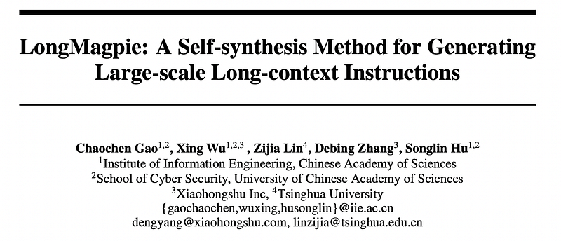
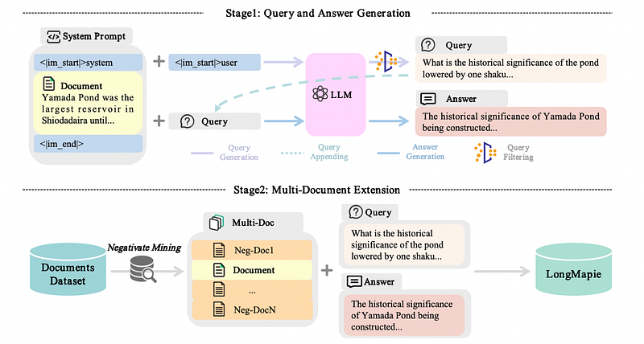
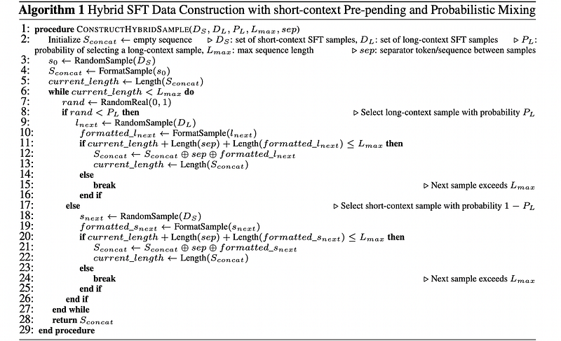
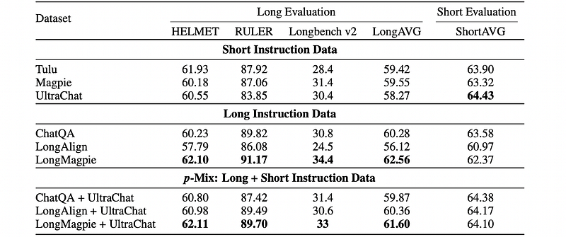

# Papers Explained 535 - LongMagpie

LongMagpie is a self-synthesis framework that automatically generates large-scale long-context instruction data. The key insight is that aligned long-context LLMs, when presented with a document followed by special tokens preceding a user turn, auto-regressively generate contextually relevant queries.

This page ingests the source article into the wiki and connects it to [[Papers Explained Corpus]], [[Document AI]], [[Synthetic Data]], [[Long Context]], [[Safety and Alignment]], [[Large Language Models]], [[Supervised Fine-Tuning]].

## Source Metadata

- Source file: `raw/2026-01-30_Papers-Explained-535--LongMagpie-88810df48680.html`
- Source title: Papers Explained 535: LongMagpie
- Published: 2026-01-30
- Canonical: [https://medium.com/@ritvik19/papers-explained-535-longmagpie-88810df48680](https://medium.com/@ritvik19/papers-explained-535-longmagpie-88810df48680)

## Key Ideas

- LongMagpie is a self-synthesis framework that automatically generates large-scale long-context instruction data.
- The foundation of LongMagpie is a key observation about aligned long-context LLMs: when provided with a document followed by tokens that typically precede a user query (without the query itself), these models generate contextually relevant queries about that...
- This behavior stems from the fact that long-context understanding often involves document-based question answering tasks such as RAG and long document QA.
- This capability allows for the synthesis of diverse, high-quality instruction data without human annotation, predefined templates, or seed questions.
- Diverse documents, with an average length of approximately 1.6k tokens from various domains and lengths, are collected primarily using curated resources like Fineweb.

## Notes

LongMagpie is a self-synthesis framework that automatically generates large-scale long-context instruction data. The key insight is that aligned long-context LLMs, when presented with a document followed by special tokens preceding a user turn, auto-regressively generate contextually relevant queries.

## Method

*Figure: LongMagpie pipeline overview.*

The foundation of LongMagpie is a key observation about aligned long-context LLMs: when provided with a document followed by tokens that typically precede a user query (without the query itself), these models generate contextually relevant queries about that document.

This behavior stems from the fact that long-context understanding often involves document-based question answering tasks such as RAG and long document QA. During instruction tuning, models like Qwen and Llama internalize document-query relationship patterns, enabling them to auto-regressively predict meaningful questions when presented with document-only contexts.

This capability allows for the synthesis of diverse, high-quality instruction data without human annotation, predefined templates, or seed questions.

### Query and Answer Generation

Diverse documents, with an average length of approximately 1.6k tokens from various domains and lengths, are collected primarily using curated resources like Fineweb.

For each document D, an input sequence X= D⊕Tpre is constructed, where Tpre contains tokens preceding a user query in the model’s instruction template. X is passed to the aligned LLM and a completion Q is sampled until an end-of-template token is generated or a maximum length is reached. This completion represents a contextually relevant query. By generating multiple queries per document with different sampling parameters, diverse document-query pairs that naturally vary in complexity are created.

For each document-query pair (D,Q), a standard instruction prompt is constructed by combining the document, query, and tokens that precede an assistant response. A response R is then generated, forming a complete instruction triplet (D,Q,R) for long-context training.

In query generation, LLMs occasionally continue the input document rather than generate queries, particularly when the model size is small. To ensure the quality of the generated queries, two filtering strategies are applied:

- queries that end with a question mark are retained as a simple heuristic to identify interrogative sentences;

- generated texts longer than 1.5k characters are discarded, as they are typically descriptive passages rather than valid queries.

### Multi-Document Extension

To enhance task diversity and real-world applicability, LongMagpie is extended to multi-document settings.

- Negative documents are obtained via random sampling, where x documents {D1,…,Dx} are drawn, with x drawn uniformly from 0 to n (with n= 0 reducing to the standard single-document QA setting).

- Documents are concatenated using a special separator token (e.g., <|doc_sep|> ) to form Dmulti = D1 ⊕<|doc_sep|> ⊕···⊕Dx.

- Queries and responses are generated as in the single-document pipeline, producing triples (Dmulti,Q,R) requiring cross-document reasoning.

### p-Mix: Balancing Long-Context and Short-Context Capabilities

The core idea of p-Mix is twofold.

- First, to emulate the typical non-contextual start of general tasks, a short-context instruction is sampled at the beginning of each training sequence.

- Second, subsequent data segments are appended probabilistically to construct a mixed-context sequence up to length Lmax.

With probability PL, a long-context instruction (generated by LongMagpie) is chosen; otherwise, with probability 1−PL, another short-context sample is chosen. This process repeats until approaching the target sequence length, ensuring each instance starts with a short, context-free instruction followed by a dynamically mixed sequence of long and short segments. This prepares the model for diverse real-world scenarios.

## Evaluation

Using the LongMagpie pipeline, a long-context instruction dataset is generated using Qwen2.5–70B-Instruct, with documents sampled from FineWeb-Edu, comprising 1.3 trillion tokens extracted from educational web content. Llama-3–8B-NExtLong-512K-Base is selected as the base model, which has undergone extensive long-context continued pre-training.

*Figure: Main experimental results comparing LongMagpie with other methods on long-context and short-context benchmarks.*

- Models trained solely on LongMagpie achieve the best long-context performance within the Long Instruction Data group:

- Long mixed datasets (p-Mix: Long + Short Instruction Data), LongMagpie + UltraChat achieves:

- Best or tied-best long-context scores: HELMET 62.11, RULER 89.70, LongAVG 61.60.

- Competitive short-context performance: ShortAVG 64.10 (only 0.33 below the best overall ShortAVG).

## Paper

LongMagpie: A Self-synthesis Method for Generating Large-scale Long-context Instructions [2505.17134](https://arxiv.org/abs/2505.17134)

## Figures

Figures from the Medium HTML export (`raw/2026-01-30_Papers-Explained-535--LongMagpie-88810df48680.html`); local copies under `wiki/assets/papers-explained-535-longmagpie/` when download succeeded.

| Figure | Caption |
|--------|---------|
|  | Title card: LongMagpie. |
|  | LongMagpie pipeline overview. |
|  | p-Mix: Balancing Long-Context and Short-Context Capabilities. |
|  | Main experimental results comparing LongMagpie with other methods on long-context and short-context benchmarks. |
## Related

- [[Papers Explained Corpus]]
- [[Document AI]]
- [[Synthetic Data]]
- [[Long Context]]
- [[Safety and Alignment]]
- [[Large Language Models]]
- [[Supervised Fine-Tuning]]
- [[Papers Explained 534 - PubMed-OCR]]
- [[Papers Explained 536 - DeepSeek-OCR 2]]

#summary #topic
