# Papers Explained 537 - ScaleRL

This research presents the first large-scale systematic study, amounting to more than 400,000 GPU-hours, that defines a principled framework for analyzing and predicting RL scaling in LLMs.

This page ingests the source article into the wiki and connects it to [[Papers Explained Corpus]], [[Reasoning Models]], [[Model Compression and Efficiency]], [[Synthetic Data]], [[Safety and Alignment]], [[Reinforcement Learning Topic]], [[KL Regularization]], [[Reinforcement Learning]].

## Source Metadata

- Source file: `raw/2026-02-10_Papers-Explained-537--ScaleRL-14ccd31f7d63.md`
- Source title: Papers Explained 537: ScaleRL
- Published: 2026-02-10
- Canonical: [https://medium.com/@ritvik19/papers-explained-537-scalerl-14ccd31f7d63](https://medium.com/@ritvik19/papers-explained-537-scalerl-14ccd31f7d63)

## Key Ideas

- Not all recipes yield similar asymptotic performance
- Details such as loss aggregation, normalization, curriculum, and off-policy algorithm primarily modulate compute efficiency without materially shifting the asymptote
- Stable, scalable recipes follow predictable scaling trajectories, enabling extrapolation from smaller-scale runs.
- Combining these insights, a best-practice recipe, ScaleRL, is proposed and demonstrated to be effective by successfully scaling and predicting validation performance on a single RL run scaled up to 100,000 GPU-hours.
- Experiments focus on the “RL for reasoning” domain, where the model produces a thinking trace enclosed in special tokens and a final solution. A sequence length of 16,384 tokens is used (12,288 for thinking, 2,048 for the solution, and 2,048 for the prompt).

## Notes

This research presents the first large-scale systematic study, amounting to more than 400,000 GPU-hours, that defines a principled framework for analyzing and predicting RL scaling in LLMs. Sigmoidal compute-performance curves are fit for RL training and a wide range of common design choices are ablated to analyze their effects on asymptotic performance and compute efficiency. The study observes:

- Not all recipes yield similar asymptotic performance

- Details such as loss aggregation, normalization, curriculum, and off-policy algorithm primarily modulate compute efficiency without materially shifting the asymptote

- Stable, scalable recipes follow predictable scaling trajectories, enabling extrapolation from smaller-scale runs.

Combining these insights, a best-practice recipe, ScaleRL, is proposed and demonstrated to be effective by successfully scaling and predicting validation performance on a single RL run scaled up to 100,000 GPU-hours.

## Setup

LLMs are trained with prompts sampled from a data distribution D. GPUs are divided into generators for high-throughput rollout generation and trainers for training the model backend (FSDP). Two separate model instances exist: πθgen on generators and πθtrain on trainers. The old policy (πθoldgen) on generator GPUs generates candidate completions for each prompt. These completions are assigned scalar rewards. Policy optimization maximizes a clipped surrogate objective, considering expectations over prompts from D and rollouts from the old policy.

Experiments focus on the “RL for reasoning” domain, where the model produces a thinking trace enclosed in special tokens and a final solution. A sequence length of 16,384 tokens is used (12,288 for thinking, 2,048 for the solution, and 2,048 for the prompt). The Polaris-53K dataset is used for math RL experiments with a batch size of 768. Scaling RL compute involves running multiple epochs over the training prompts.

A base algorithm resembling GRPO (without KL regularization) is used:

- Asymmetric DAPO clipping is included to avoid entropy collapse and maintain output diversity.

- Importance Sampling ratios are calculated for each completion, considering the old and new policies.

- Asymmetric clipping thresholds are applied to the IS ratios.

- The surrogate objective is defined as the expectation over prompts and rollouts, incorporating clipped advantages and IS ratios.

- Interruptions are used to forcibly stop overly long generations, preventing training instability and inefficiency.

### Predictive compute-scaling and fitting curves

Instead of the typical power-law used in pre-training, a sigmoidal function is used to model the relationship between pass rate and compute. The sigmoidal curve captures the concept of “saturating returns” — initial slow growth in performance with increasing compute, followed by a sharp acceleration in the mid-range, and finally, saturation at high compute levels.

Similar to previous studies, the authors exclude the early, low-compute regime from the scaling analysis, as it often leads to unstable fits. The analysis typically begins after approximately 1.5k GPU hours.

The sigmoidal function has parameters (A, B, Cmid) that influence the curve’s shape. B and Cmid primarily affect the efficiency of the training process, while A represents the asymptotic performance achievable at large compute scales.

To measure the predictive performance of the model, a held-out validation set of 1,000 prompts from the Polaris-53k dataset is used. The scaling curves are fitted based on the average pass rate on this validation set, measured every 100 training steps with 16 generations per prompt.

## An Empirical Study of RL Scaling

RL experiments are conducted using an 8B dense model on verifiable math problems. The study examines two design axes in terms of their predictable compute-scaling behavior:

- asymptotic performance (A)

- compute efficiency (B).

Experiments are structured in three stages.

- Design choices are ablated on top of the baseline at 3.5k to 4k GPU-hours since some experimental choices destabilize beyond this scale. Whenever a design change proved stable, it was trained for longer.

- The best choices are combined into ScaleRL and leave-one-out (LOO) experiments are run for 16k GPU-hours.

- To demonstrate predictable scaling with ScaleRL, training setups with larger batch sizes, mixture-of-experts model, multiple tasks (math and code), and longer sequence lengths are also considered.

### Asynchronous RL Setup

The choice of asynchronous off-policy RL setup governs training stability and efficiency, generally independent of all other design choices. Two approaches for off-policy learning are considered:

PPO-off-policy-k is the default approach for asynchronous RL and has been used previously by Qwen3 and ProRL. In this setup, the old policy πθold_gen generates reasoning traces for a batch of B prompts. Each gradient update processes a mini-batch of ˆB prompts, resulting in k= B/^B gradient updates per batch. In experiments, ˆB = 48 prompts (with 16 generations each), and k∈{1,8} by setting B= k×48.

PipelineRL-k is a recent approach from ServiceNow and used by Magistral. In this regimen, generators continuously produce reasoning traces in a streaming fashion. Whenever trainers finish a policy update, the new parameters are immediately pushed to the generators, which continue generating with the updated weights but a stale KV cache from the old policy. Once a full batch of traces is generated, it is passed to the trainers for the next update. In this setup, a parameter k is introduced: the trainers wait if they get k steps ahead of the generators.

*Figure: (a) Comparing “compute-scaling” of asynchronous off-policy RL setups. (b) Different max off-policyness with PipelineRL.*

PipelineRL and PPO-off-policy achieve similar asymptotic performance, but PipelineRL substantially improves the compute efficiency; thus reaching the ceiling faster. This is because PipelineRL reduces the amount of idle time in the training process. This choice yields reliable gains with fewer tokens, making larger sweeps at a lower compute budget possible. The maximum off-policyness for PipelineRL is also varied, and k= 8 is found to be optimal.

### Algorithmic Choices

Building on the results above, PipelineRL-8 is adopted as the updated baseline. Six additional algorithmic axes are then studied:

Loss type

The asymmetric DAPO loss is compared with two recently proposed alternatives: GSPO and CISPO. GSPO applies importance sampling at the sequence level as opposed to GRPO’s token-level formulation. Specifically, GSPO alters the token-level IS ratio to sequence-level ratios: ρi(θ) =πtrain(yi|x,θ) /πgen(yi|x,θold ). CISPO simply combines truncated IS with vanilla policy gradient, where sg is the stop-gradient function.

*Figure: (a) Comparing popular loss functions (b) Using FP32 precision in the final layer (LM head)*

Both GSPO and CISPO substantially outperform DAPO, improving the asymptotic pass-rate A by a large margin. CISPO exhibits a prolonged near-linear reward increase, and is marginally better than GSPO later in training, so CISPO is selected as the best loss type.

FP32 Precision for LLM logits

The generators and trainers rely on different kernels for inference and training, leading to small numerical mismatches in their token probabilities. RL training is highly sensitive to such discrepancies, since they directly affect the IS ratio in the surrogate objective. MiniMax identified that these mismatches are especially pronounced at the language model head, and mitigate this by FP32 computations at the head for both the generator and trainer. The precision fix dramatically improves the asymptotic performance A from 0.52 to 0.61. Given this clear benefit, the FP32 precision fix is included in the ScaleRL recipe.

Loss Aggregation

Three strategies for aggregating the RL loss are evaluated:

- Sample average where each rollout contributes equally

- Prompt average where each prompt contributes equally

- Token average where all token losses in the batch are averaged directly, without intermediate grouping.

Prompt-average achieves the highest asymptotic performance and therefore is used for ScaleRL.

Advantage Normalization

Three variants of advantage normalization are compared:

- Prompt level where advantages are normalized by the standard deviation of rewards from the rollouts of the same prompt

- Batch level where advantages are normalized by the standard deviation across all generations in the batch.

- No normalization where advantages are computed as raw rewards centered by the mean reward of the prompt’s generations, without variance scaling.

All three methods are observed to yield similar performance. Batch-level normalization is therefore adopted as it is theoretically sound and marginally better.

Zero-Variance Filtering

Within each batch, some prompts yield identical rewards across all their generations. These “zero-variance” prompts have zero advantage and therefore contribute zero policy gradient. The default baseline includes such prompts in loss computation, but it is unclear whether they should be included in the effective batch. To test this, the default setting is compared against an effective batch approach, where only prompts with non-zero variance are included in the loss calculation.

Note that zero-variance filtering differs from dynamic sampling in DAPO. The former merely drops the prompts, while the latter resamples more prompts until the batch is full.

*Figure: “Zero” variance filtering.*

Using the effective batch performs better asymptotically; and it is adopted in the ScaleRL recipe.

Adaptive Prompt Filtering

A number of data curriculum strategies have been proposed for RL training to improve sample efficiency. A simple variant observes that once a prompt becomes too easy for a policy, it typically remains easy. Since such prompts consume some compute but no longer contribute useful gradient signal, it is better to exclude them from future training. This is implemented by maintaining a history of pass rates and permanently removing any prompt with a pass rate ≥0.9 from subsequent epochs–this is called No-Positive-Resampling.

*Figure: Adaptive prompt sampling.*

The curriculum improves scalability and the asymptotic reward A.

## ScaleRL

ScaleRL is an asynchronous RL recipe that uses PipelineRL with 8 steps off-policyness, interruption-based length control for truncation, FP32 computation for logits, and optimizes the JScaleRL(θ) loss. This loss combines prompt-level loss aggregation, batch-level advantage normalization, truncated importance-sampling REINFORCE loss (CISPO) , zero-variance filtering, and no-positive resampling:

where sg is the stop-gradient function, ˆAstd is the standard deviation of all advantages ˆAi in a batch and pass_rate(x) denotes the historical pass rate of a prompt x. For forced interruptions, the end-of-thinking phrase: “Okay, time is up. Let me stop thinking and formulate a final answer now. </think>” is used.

To validate that these choices remain optimal when combined, leave-one-out (LOO) experiments are conducted: starting from ScaleRL, one axis at a time is reverted to its baseline counterpart.

*Figure: Leave-One-Out (LOO) Experiments.*

ScaleRL is the most compute-efficient configuration

- Across all LOO axes, ScaleRL consistently remains the best configuration, slightly outperforming LOO variants in either Asymptotic reward, or Compute efficiency.

- Most LOO variants reach similar asymptotic pass rates; the main difference is efficiency, where ScaleRL has the highest slope B.

Stability and predictability of scaling behavior

- Extrapolated scaling curves (fit to 8000 GPU-hours and extended to 16000 GPU-hours) align closely with actual training and extended points.

- This indicates that ScaleRL and similar stable recipes exhibit predictable scaling under large-scale RL training.

Design choices that look redundant still matter (loss type, FP32)

- Some design choices (e.g., loss type, FP32 precision) appear less critical in the combined ScaleRL recipe when evaluated via LOO on a dense 8B model.

- Example: reverting to DAPO loss yields similar asymptotic performance to CISPO within ScaleRL.

- Example: FP32 precision fix shows little difference for dense 8B with ScaleRL.

- However, these components provide stability and robustness that become important in other regimes or with other losses.

CISPO loss preferred over DAPO

- Within ScaleRL, CISPO and a carefully tuned DAPO can achieve similar asymptotic performance.

- CISPO is more robust to the choice of IS-clipping parameter ϵmax, reducing sensitivity to hyperparameter tuning.

- CISPO is also more compute-efficient than DAPO in LOO experiments: CISPO: B = 2.01 vs. DAPO: B = 1.77.

*Figure: (a) Variance in scaling fits. (b) FP32 LOO on Scout.*

Estimating error margins via multiple ScaleRL runs

- Run three independent ScaleRL trainings to measure variance in fitted scaling coefficients.

- Observed an error margin of ±0.02 in asymptotic performance A.

- This empirical variance is used as an error margin to judge whether differences in efficiency or asymptotic performance between runs are statistically meaningful.

FP32 precision improves scalability in other settings

- FP32 precision at the LM head mitigates numerical instabilities and yields large gains for GRPO/DAPO-style losses.

- On the Scout 17Bx16 MoE model, a LOO experiment shows that adding the FP32 precision fix improves overall scalability.

## Predictable Scaling Returns Across RL Compute Axes

Given a fixed or growing compute budget, the scaling knob context length, batch size, generations per prompt, and model size, which buys the most reliable performance gain? How early can that return be predicted? This is answered by

- fitting the saturating power-law

- extrapolating to the target budget

- extending training to verify the forecast.

*Figure: Predicatably Scaling RL compute to 100,000 GPU Hours.*

Model size (MoE) — Larger MoE models scale predictably and more efficiently

- Training a larger 17B×16 Llama-4 Scout MoE with ScaleRL shows the same stable, predictable scaling behavior as the 8B model, with low truncation rates and no instability.

- The extended training points for the 17B×16 MoE align with the early-fitted curve, supporting model-scale invariance of the scaling recipe.

- The 17B×16 MoE achieves much higher asymptotic RL performance than the 8B dense model, and does so using only about 1/6 of the 8B model’s RL training compute.

*Figure: Scaling RL Generation Length.*

Generation length / context budget — Longer context raises the performance ceiling

- Increasing generation length from 14k to 32k tokens slows early progress (lower B, higher Cmid) but consistently increases the fitted asymptote (A), leading to higher final performance once enough compute is used.

- This supports the view that long-context RL is a “ceiling-raising” knob, not just an efficiency trade-off.

- Early-fit extrapolations correctly predict that the 32k-token run will surpass the 14k run when training is extended.

*Figure: Scaling RL batch size.*

Global batch size — Larger batches improve asymptotic performance and stability

- Smaller-batch runs show early stagnation on downstream benchmarks even while in-distribution validation continues to improve.

- Larger global batch sizes reliably increase the asymptotic performance and avoid the downstream stagnation seen in smaller batches.

- At mid-scale, small batches can look better early but are overtaken as compute grows.

- In the largest math run, increasing batch size to 2048 prompts both stabilized training and produced a fit that extrapolated accurately from 50k to 100k GPU hours.

Generations per prompt (at fixed total batch) — Largely a second-order choice at moderate batch

- Sweeping generations per prompt (8, 16, 24, 32) while adjusting the number of prompts to keep total batch size fixed leaves the fitted scaling curves essentially unchanged.

- At moderate batch sizes, the allocation between prompts vs generations per prompt is a second-order effect for both the asymptote (A) and the efficiency parameter (B).

- The authors note that clearer differences might appear at much larger batch sizes (e.g., 2k+), which is left for future work.

## Paper

The Art of Scaling Reinforcement Learning Compute for LLMs [2510.13786](https://arxiv.org/abs/2510.13786)

## Figures

Figures from the Medium HTML export (`raw/2026-02-10_Papers-Explained-537--ScaleRL-14ccd31f7d63.md`); local copies under `wiki/assets/papers-explained-537-scalerl/` when download succeeded.

| Figure | Caption |
|--------|---------|
| 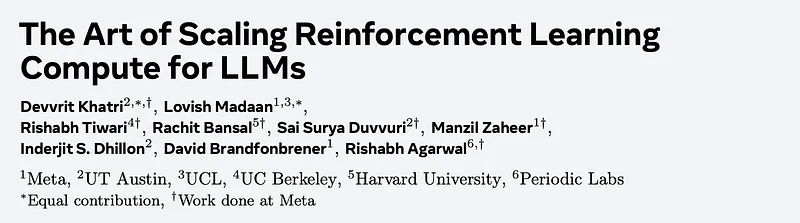 | Title card: ScaleRL. |
| 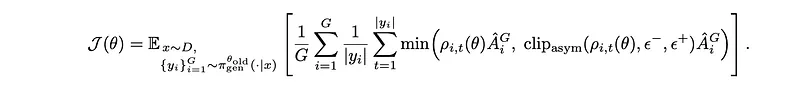 | A base algorithm resembling GRPO (without KL regularization) is used. |
| 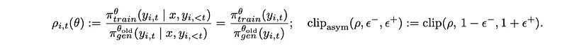 | A base algorithm resembling GRPO (without KL regularization) is used. |
|  | A base algorithm resembling GRPO (without KL regularization) is used. |
| 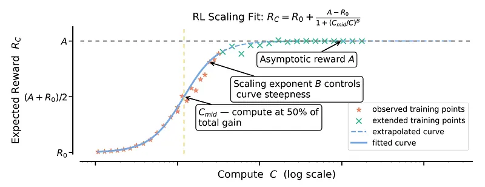 | To measure the predictive performance of the model, a held-out validation set of 1,000 prompts from the Polaris-53k dataset is used. |
|  | To measure the predictive performance of the model, a held-out validation set of 1,000 prompts from the Polaris-53k dataset is used. |
| 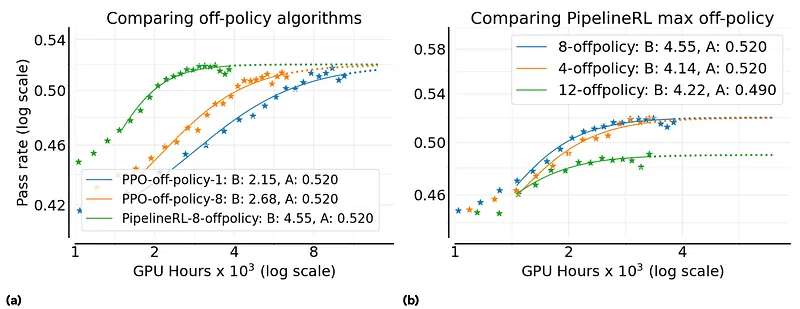 | (a) Comparing “compute-scaling” of asynchronous off-policy RL setups. (b) Different max off-policyness with PipelineRL. |
| 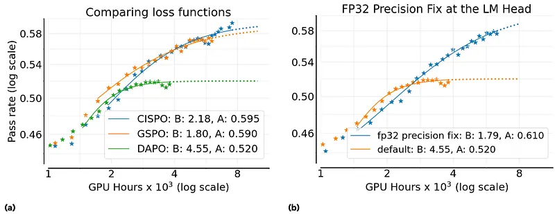 | (a) Comparing popular loss functions (b) Using FP32 precision in the final layer (LM head). |
| 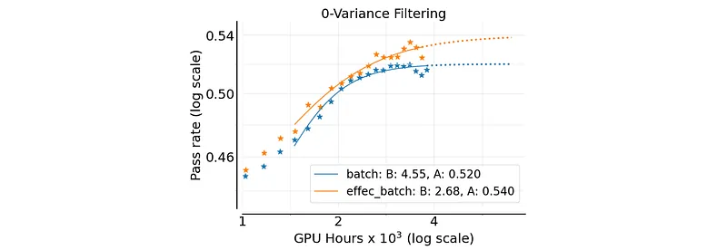 | “Zero” variance filtering. |
| 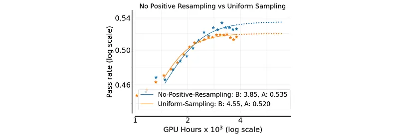 | Adaptive prompt sampling. |
| 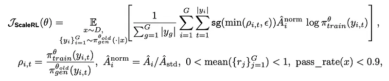 | Adaptive Prompt Filtering. |
| 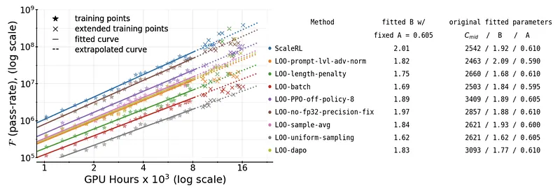 | Leave-One-Out (LOO) Experiments. |
| 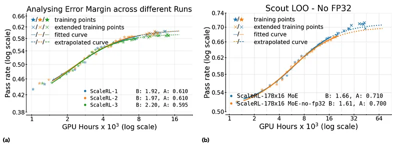 | (a) Variance in scaling fits. (b) FP32 LOO on Scout. |
| 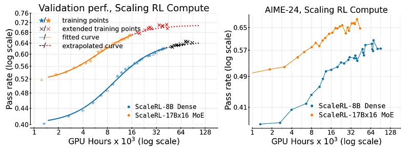 | Predicatably Scaling RL compute to 100,000 GPU Hours. |
| 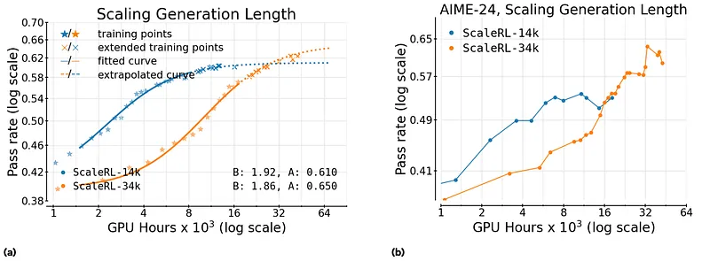 | Scaling RL Generation Length. |
| 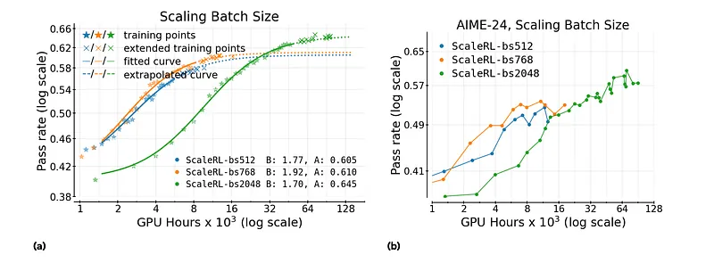 | Scaling RL batch size. |
## Related

- [[Papers Explained Corpus]]
- [[Reasoning Models]]
- [[Model Compression and Efficiency]]
- [[Synthetic Data]]
- [[Safety and Alignment]]
- [[Reinforcement Learning Topic]]
- [[KL Regularization]]
- [[Reinforcement Learning]]
- [[Papers Explained 536 - DeepSeek-OCR 2]]
- [[Papers Explained 538 - Code World Model]]

#summary #topic
