# Papers Explained 538 - Code World Model

Code World Model (CWM) is a 32-billion-parameter dense, decoder-only LLM trained with a context size of up to 131 k tokens.

This page ingests the source article into the wiki and connects it to [[Papers Explained Corpus]], [[Code Models]], [[Large Language Models]], [[Reasoning Models]], [[Synthetic Data]], [[Reinforcement Learning Topic]], [[Verifier-Bounded Learning]], [[Beyond Standard LLMs]], [[Code World Models]].

## Source Metadata

- Source file: `raw/2026-02-11_Papers-Explained-538--Code-World-Model-2c5959944cfd.html`
- Source title: Papers Explained 538: Code World Model
- Published: 2026-02-11
- Canonical: [https://medium.com/@ritvik19/papers-explained-538-code-world-model-2c5959944cfd](https://medium.com/@ritvik19/papers-explained-538-code-world-model-2c5959944cfd)

## Key Ideas

- The models are available at [HuggingFace](https://huggingface.co/collections/facebook/cwm-68acbc3eb02570bd89b3aae8).
- Two large-scale data collections empower CWM’s world modeling capabilities: Python execution traces and ForagerAgent.
- A core prerequisite for capturing Python execution traces and agentic trajectories in real-world software engineering tasks is executing code in repositories at scale.
- An LLM-backed agent, RepoAgent, is tasked with setting up the development environment of a target repository. It identifies test files and ensures a significant number of them can run and pass.
- The Activ (Act in virtual) pipeline repurposes GitHub Actions CI execution for building executable repository images. It runs GitHub Actions workflows locally using the act library.

## Notes

Code World Model (CWM) is a 32-billion-parameter dense, decoder-only LLM trained with a context size of up to 131 k tokens. To improve code understanding beyond what can be learned from training on static code alone, CWM is mid-trained on a large amount of observation-action trajectories from Python interpreter and agentic Docker environments, and performs extensive multi-task reasoning RL in verifiable coding, math, and multi-turn software engineering environments.

The models are available at [HuggingFace](https://huggingface.co/collections/facebook/cwm-68acbc3eb02570bd89b3aae8).

## Datasets

Two large-scale data collections empower CWM’s world modeling capabilities: Python execution traces and ForagerAgent.

### Executable repository images: building repositories at scale

A core prerequisite for capturing Python execution traces and agentic trajectories in real-world software engineering tasks is executing code in repositories at scale. For isolation and repeatability, these repositories are built as Docker containers, referred to as executable repository images. As manually building arbitrary GitHub repositories cannot scale to the desired dataset size, both LLM- and CI-assisted methods are applied.

An LLM-backed agent, RepoAgent, is tasked with setting up the development environment of a target repository. It identifies test files and ensures a significant number of them can run and pass. RepoAgent is supported by human-readable documentation extracted from the target repository, although this documentation can suffer from inaccuracies due to lack of verifiability and insufficient maintenance.

The Activ (Act in virtual) pipeline repurposes GitHub Actions CI execution for building executable repository images. It runs GitHub Actions workflows locally using the act library. To adapt workflows not designed for third-party execution or limited to CI builds, the target repository’s source code is modified to trigger an early exit after a single successful build.

State Capture: Since GitHub Actions workflow jobs run simultaneously in individual containers with transient build states, the repository’s pytest configuration files are modified. This injects a fixture that automatically runs at test-execution time to capture the build state of the container running unit tests. The resulting image from each repository is then committed and pushed.

By running both the RepoAgent and Activ methods in parallel, over 35,000 unique executable repository images were successfully created.

### Python tracing: neural code interpretation data

*Figure: CWM format for Python traces.*

Memory tracing of Python programs involves gathering executable functions or executable repository images, and running them using different IO pairs or CI tests, while capturing the state of the memory, chiefly the local variables, after each line is executed. This process enables the alignment of code and execution trace to simulate observation-action data within the computational environment.

The CWM format for Python traces is structured as follows:

- It begins with a source code context.

- A marker indicates the trace’s starting point.

- The model then predicts a series of stack frames, which represent program states. These are formatted as JSON dictionaries containing local variables.

- Alongside the stack frames, the model predicts actions, which are the specific parts of the code being executed.

- Custom tokens are used to represent frame, action, and argument separators, as well as the trace context start indicator.

Data Sources:

- Function-level Tracing: A dataset of Python functions is collected from online sources. Input-output pairs are automatically generated with a combination of fuzzing and prompting Llama3–70B-Instruct.

- CodeContests solutions tracing: Llama-3.1–70B-Instruct is used to generate Python solutions to training set problems in CodeContests. Generations are filtered to ensure a balance of incorrect and correct submissions, leading to an overall count of 262 k. These solutions are traced with inputs from the provided unit tests and filtered out long traces with more than 10 k line events or large traces taking up more than 1 MB disk space. This leaves 33 k effective code snippets and 70 k traces.

- Repository-level Tracing: Unit tests of over 21,000 available and traceable repository images. For a subset of these repositories, additional commits prior to the built commit are randomly selected from the repository’s git log. While up to 40 historical commits per repository were attempted, successful traces were capped at 4 commits per repository to prevent over-representation. Approximately 70,000 execution-traced commits were obtained. Function-level traces are extracted from raw pytest traces with configurable stack depth and a stochastic step-in probability. When stochastic step-in occurs, function calls are probabilistically included in their parent trace instead of being separate episodes, simulating variable execution depth. The necessary source code context from the target repository is gathered and compressed. The same CWM formatting is applied to the resulting context-trace pair.

- Natural Language Tracing: To generate step-by-step descriptions of Python code execution in natural language, rather than the strict JSON-like format, data is generated by prompting Qwen3–32B-FP8 (without thinking) to re-write execution traces. The re-written traces originate from the function-level and CodeContests trace datasets. Cases where Qwen’s final output prediction diverges from the ground truth trace are removed. This process yields 75 million trajectories from standalone Python functions and 110,000 from CodeContests data.

### ForagerAgent: agentic midtraining data generation

Mid-training CWM on a large-scale dataset of interactions between an LLM-based software engineering agent and a computational environment. This data is generated with the so-called ForagerAgent, which collects multi-step trajectories by prompting an LLM with a software engineering task to solve in the context of a particular code repository. The actions available to the agent are derived from the standard SWE-Agent toolset: (i) create a file, (ii) edit a file, (iii) run a bash command, and (iv) view or navigate inside a file. The trajectory is concluded once the LLM, either Llama3–70B-Instruct or Qwen3–235B-A22B (w/o thinking), believes the task has been solved or the number of tokens, turns, or API costs exceed a hard limit. Like the repository-level tracing data, ForagerAgent relies on the set of executable repository images to seed problem generation.

Mutate-fix tasks

For mutate-fix tasks, a working codebase is started with and then a bug is synthetically introduced for the agent to fix. Functions that can be verified using the repository test suite are identified. As a first step, these functions are filtered to the subset for which all unit tests pass successfully. The following set of mutations is then considered to synthetically introduce a bug into these functions:

- Functions: remove either a portion of the function or the entire function.

- Arguments: remove arguments from the function definition or randomly re-order function call arguments.

- Variables: sample a pair of variables in the function and swap all their occurrences.

- Statements: remove an import or return statement.

- Operators: replace operators (binary, unary, or boolean) in statements in the function.

Mutations that cannot be applied for a given function are filtered out by parsing the corresponding abstract syntax tree (AST). Candidate mutations are then verified to cause the associated unit tests to fail. This mutation can be used as a starting point for agentic data collection. The agent is instructed to inspect the mutated function, run its unit tests, and resolve the failing tests by fixing the bug.

Issue-fix tasks

For issue-fix tasks, the model is prompted to fix real issues in a set of repositories. Both issue and pull request data from GitHub are used. Commits preceding bug-fixing PRs are checked out and the agent is tasked with resolving failing unit tests. The corresponding GitHub issue descriptions are provided for context. Unit tests are ensured to be failing before the PRs and that their resolution is necessary and sufficient for addressing the issues.

Post-processing

To avoid overfitting to repetitive interactions, near-deduplication of trajectories foraged from the same source repository is applied. This process first represents a trajectory by the concatenation of its actions. Then, the trajectory is encoded using MinHash. Lastly, trajectories are dropped such that the pairwise Jaccard similarity for all encoded trajectories kept is less than 0.5.

*Figure: Statistics of ForagerAgent trajectories.*

## Architecture

*Figure: The CWM Transformer architecture and the main types of data introduced in the different training steps and used at inference time.*

CWM is a 32-billion-parameter dense decoder-only model. A dense architecture is chosen over sparse alternatives for ease-of-use in downstream open source research. CWM uses an alternating pattern of local and global attention blocks interleaved in a 3 : 1 ratio with sliding window sizes of 8192 and 131 072 tokens respectively. Transformer blocks use Grouped-Query-Attention with 48 query heads and 8 key-value heads. SwiGLU activation functions, RMSNorm with pre-normalization, Rotary Positional Embedding (RoPE) are used and training is done with full document-causal masking. To support long-context modeling, Scaled RoPE with θ = 1 M and scale factor 16 is applied from mid-training onwards.

*Figure: Key hyper-parameters of the 32 B CWM.*

CWM uses the Llama 3 tokenizer which is a fast Byte-Pair Encoding tokenizer implemented with TikToken. The vocabulary contains 128,000 regular tokens as well as 256 reserved tokens. Control tokens from Llama 3 are kept and unused reserved tokens are leveraged to support tracing and reasoning use cases.

## Pre-Training

CWM pre-training consists of two stages sharing learning-rate scheduler and optimizer states but differing in datamix and maximum document lengths.

General pre-training begins with an initial pre-training phase on 8 T tokens from a diverse range of mostly English sources, with an emphasis on coding data (making up about 30 % of the mix) as well as STEM and general knowledge. The model is pre-trained with a context length of 8192 tokens.

Code world model mid-training then takes place for an additional 5 T tokens. This departs from the more generalist pre-training datamix and introduces a number of datasets in support of code world modeling objectives. Mid-training is conducted with a maximum context length of 131 k tokens.

For mid-training, the ForagerAgent and Python execution tracing data are introduced as the main CWM datasets. Additionally, code- and reasoning-related data such as datasets derived from GitHub pull requests similar to SWE-RL, data from compiler intermediate representations, Triton PyTorch kernels, and formal mathematics in Lean covering statement and proof translation, as well as world modeling are included. CWM-specific data makes up 30 % of the overall mid-training datamix. The fraction of general code data is further increased to 40 % and 30 % is kept for rehearsal of the initial pre-training datamix.

## Post-training: SFT, RL algorithms and environments

### SFT

SFT is performed for 100B tokens with a 32k token sequence length. Training occurs on a diverse mix of internal and open-access data, including standard instruction-following datasets. About 30% of the data mix is rehearsal from mid-training, which itself includes 30% pre-training data. This is to avoid overfitting to the SFT distribution ahead of RL and retain CWM capabilities taught in mid-training. The data mix also contains agentic SWERL trajectories, some of which have been rejection-sampled from earlier iterations of the CWM itself. External datasets with reasoning traces are included, as the performance benefit from them carries through to the final post-RL model. Specifically, the OpenMathReasoning and OpenCodeReasoning datasets that rely on DeepSeek-R1 are used.

For SFT training on reasoning data, <|reasoning_thinking_start|> and <|reasoning_thinking_end|> tokens are introduced to surround any reasoning text. Because the loss is masked on all <|reasoning_thinking_start|> tokens, the model does not learn to generate them. This enables both reasoning and non-reasoning behavior for the CWM-SFT model: non-reasoning mode is active by default and reasoning mode can be activated by injecting <|reasoning_thinking_start|> into the beginning of assistant responses.

### RL algorithm

A variant of Group Relative Policy Optimization (GRPO) is used to train CWM:

- Multi-turn: The system is adapted for multi-turn environments, incorporating both model- and environment-generated tokens after the prompt. This necessitates masking via Mi,t. Additionally, the return Ri (sum of rewards) is used in the advantage calculation instead of the individual reward ri.

- Asynchronous: Asynchronous RL is employed instead of the synchronous setup used in GRPO, leading to significantly higher throughput.

- No σ normalization: The advantage calculation utilizes a more conventional approach, ˆAi = (Ri−µ), avoiding the difficulty bias introduced by σ normalization in GRPO.

- No length normalization: Dividing the loss by the trajectory length, as done in GRPO, can lead to a length bias. To avoid this, the loss is divided by the maximum number of tokens in a trajectory, which matches the maximum context size of the model (N = 131072).

- Batching strategy: Batches are formed based on a maximum token limit rather than a fixed number of trajectories per batch. This aims to improve efficiency and stabilize training by reducing variance in batch size.

- Clip-higher: A higher upper clip value (εhigh = 0.25) and a lower clip value (εlow = 0.2) are used to prevent entropy collapse.

- No KL: Due to the use of clip-higher, KL regularization is deemed unnecessary.

- Skip zero-advantage trajectories: The effective batch size is determined by the number of tokens with non-zero advantage. Trajectories with all zero-advantage tokens are skipped to reduce variance in the effective batch size.

- Skip stale trajectories: To limit off-policyness, trajectories whose most recent tokens were generated from a policy more than 100 training steps behind the current policy are skipped.

- Weighted mean return: To avoid biasing the token-averaged return, the mean return (µ) is computed as a length-weighted average.

- Gibberish detection: Trajectories containing tokens that are both rare (id(yt) >100,000) and generated with low probability (logprob(yt) <−log(128,256)−2) are rejected to prevent the reinforcement of potentially harmful gibberish.

### RL Environments and Data

Four types of RL tasks are considered: Agentic software engineering (SWE), Coding, Agentic coding, and Mathematics. Each RL task is defined by a dataset (containing prompts, a verification suite like unit tests, and additional metadata) and an environment that the agent interacts with. These tasks are integrated into a joint RL training phase.

During reasoning RL, the use of SFT reasoning tokens is discontinued and replaced with clear-text <think></think> tags. Early RL experiments on top of the SFT model showed long initial reasoning traces and slow improvements. This is attributed to the SFT reasoning data, which enhances reasoning performance but limits exploration during RL training. Switching out reasoning tags resulted in shorter responses, higher starting entropies, and significantly improved final performance.

Agentic SWE

Each Software Engineering (SWE) Reinforcement Learning (RL) trajectory has a single human user turn (besides the system prompt) containing the issue description and multiple turns of agent-environment interactions. During training, long-horizon interaction is allowed, with a maximum of 128 turns over a context window of 131 k tokens. The agent is equipped with four tools to solve a given task:

• bash: executing commands in a stateful shell session.

• edit: modifying an existing file using the search/replace format used by Agentless and Aider.

• create: creating a new file in the sandbox.

• submit: marking something (e.g., a file path) as the final submission according to the task requirement.

*Figure: SWE RL self-bootstrapping.*

Iteratively, RL starts with the new SFT-ed model and collects higher-quality traces for the next round. Eventually, the final set of traces is included into the joint SFT mix to prepare for the final joint RL. This results in the final CWM SFT model. For each iteration, SFT is redone on the original mid-training checkpoint and old trajectories are discarded.

Executable repository images are reused from mid-training data generation efforts. Since issue solving requires additional metadata (e.g., issue text, base commit hashes, and diff patches), repositories are joined with publicly available issues and pull request metadata to create repository-issue pairs. The git log history enables the creation of one-to-many repository-issue pairs. Publicly available training data such as SWE-Gym and R2E-Gym are also included, further filtered for quality (e.g., removing non-verifiable instances whose tests cannot pass). All training data are decontaminated against SWE-bench Verified at repository-level granularity. This process yields 12.6 k unique training instances

Coding

The competitive programming environment presents the problem to the agent in the first turn and optionally allows follow-up attempts, during which the environment provides execution feedback. It supports multiple programming languages and provides detailed feedback on syntax errors, timeouts, and incorrect test outputs. The environment terminates either when the maximum number of turns is reached or when the agent produces a correct solution. In the joint RL run, the number of attempts is limited to one but up to 64 K tokens are allowed in responses to enable extensive reasoning. A reward of−1 is assigned for incorrect trajectories and 1 for correct ones. A trajectory is correct if it meets all of the following criteria:

- Contains exactly one </think> tag, signaling successful reasoning completion.

- Contains exactly one markdown block in the model’s generated answer.

- The code solution passes all unit tests within the specified time and memory limits. Unit tests are executed in parallel using an internal code execution service on remote machines.

Coding problems are sourced from various programming contest websites. The coding problems are decontaminated against test benchmarks and de-duplicated to ensure that each training problem is unique. MinHash-based similarity detection, applying word- or character-based matching depending on the length of each document, is used in both cases. Llama-3.3–70B-Instruct is used to identify and remove poorly posed problems, such as those containing gibberish, missing or truncated problem statements, or lacking input/output descriptions. After decontamination, the final code RL dataset has 81 k prompts.

Agentic coding

The agentic coding environment combines the reasoning and tool use features of the SWE RL environment with the competitive programming setup. Unlike SWE RL, there is no submit tool in this environment. Instead, the agent needs to provide the solution in its final response, which is then extracted for evaluation.

Mathematics

Mathematical reasoning is considered another reinforcement learning task to further strengthen and generalize CWM’s reasoning capabilities. A tool-enabled version of the math environment is included, here the agent may invoke the Python interpreter with custom code. Standard output and error contents will form the next observation and the agent is prompted to continue solving the task. A limit of 4 tool calls per episode and a 10 s timeout per call is imposed.

Every trajectory is classified as either correct (reward = 1) or incorrect (reward = −1). Correctness is defined as:

- Exactly one </think> tag, signaling successful reasoning completion.

- Exactly one $\boxed{}$ for the predicted answer.

- The verifier emits True for the comparison between the predicted answer and the ground-truth answer.

### Joint RL

Joint RL training is split into three distinct stages. Between stages, the task distribution is adapted and custom reward shaping techniques are employed.

Stage 1: Reasoning Format Bootstrapping

- The initial stage focuses on controlling generation length in math and coding tasks using a reward schedule.

- For competitive programming tasks (40% of the dataset), the model is trained across four environments: Python, C++, agentic coding Python, and agentic coding C++ (10% each).

- Challenging SWE tasks (4% of the overall tasks) are given hints and downsampled.

Stage 2: Increasing Task Diversity and Data Resampling

- After 14,125 gradient steps, the proportion of competitive programming tasks increases to 50%, while SWE tasks decrease to 30%.

- Additional code environments (Rust, Go, Java, JavaScript) are introduced, alongside existing Python and C++, making up 25% of the dataset.

- For SWE tasks, plugins are disabled with a 50% chance, forcing reliance on standard terminal commands.

- Hints are removed from challenging SWE tasks, and they are oversampled when plugins are used, and undersampled when disabled.

- Both competitive programming and SWE datasets are filtered to include instances with a solve rate between 0.1 and 0.7.

- For math tasks, Python tool calling is enabled for 2% of the dataset.

Stage 3: Fine-Grained Filtering and Length Control

- At 16,500 steps, solve rate filtering (0.1 to 0.7) is applied to the math dataset.

- For SWE data, fine-grained subsets are created for each 0.1 solve-rate interval, and harder examples are sampled more frequently.

- Context length is capped at 64k in both code and mathematics environments.

- A penalty is applied to reward for overly long correct solutions, gradually phased out over training. This encourages concise responses while still rewarding correctness.

## Evaluation

Mid‑training ablation

- Best overall performance across CruxEval and SWE-bench metrics occurs when all three datasets (PR, tracing, ForagerAgent) are used together, showing mid‑training data mix strongly influences final performance.

- PR data improves oracle SBV NLLs and SBV pass@1, but not agentic SBV NLLs or CruxEval.

- Execution trace data substantially improves CruxEval input/output prediction, but does not change SBV metrics.

- ForagerAgent data is the only component that improves agentic SBV NLLs and further boosts SBV pass@1 by +3.7%.

SWE-bench Verified

*Figure: SWE-bench Verified pass@1 scores.*

- CWM achieves 53.9% pass@1 without test-time scaling and 65.8% with best@k (k=16), outperforming open-weight models of similar size and competitive with larger/proprietary models.

- Majority voting alone reaches 58.4% pass@1, showing substantial gains from simple ensemble methods even without tools.

- pass@k rises monotonically with k, reaching 80.4% at k=40; best@k improves sharply up to k≈16 then plateaus; majority voting improves more gradually and plateaus at k≈24.

Alternative harnesses

*Figure: SWE-bench Verified resolve rates.*

- Resolve rates with third-party harnesses (Mini-SWE-Agent, OpenHands) are lower than CWM’s own 53.9% pass@1 but remain in the 36–42.6% range, indicating robust performance across different agent/tool implementations.

- Bash-only restriction still yields 42.1% resolve rate, showing resilience to reduced tool sets.

Aider Polyglot

*Figure: Results on Aider Polyglot.*

- CWM achieves 35.1% pass@1@2, comparable to Qwen3–32B (40.0%) and Gemini 2.0 Pro (35.6%) among “whole file” models.

- Shows good generalization across six languages.

- Models optimized for “diff” format (e.g., o3-pro, DeepSeek R1, Qwen3 235B) substantially outperform CWM, reflecting that CWM was not tuned for diff-style editing.

Terminal-Bench

*Figure: Results on Terminal-Bench for CWM and baselines from the official leaderboard.*

- CWM reaches 26.25% accuracy, below o4-mini but above Gemini 2.5 Pro, placing it mid‑pack on the leaderboard.

CruxEval trace vs reasoning

*Figure: Execution trace prediction.*

- Larger compute budgets (trace or reasoning) significantly improve CruxEval-output accuracy.

- CWM with natural-language reasoning achieves ~94% pass@1; full trace prediction achieves ~88% (CWM) and 87.3% (CWM SFT), showing trace prediction is competitive but slightly below free-form reasoning.

- Reasoning traces are more verbose (avg 1164 tokens) than full traces (497 tokens), indicating trace prediction is more token-efficient.

- Single-step trace prediction underperforms classic few-shot output prediction for both models.

HaltEval-prelim

*Figure: HaltEval-prelim pass@1 scores for different LLMs in different prompting settings.*

- Constant “always terminating” classifier yields 0.5 pass@1, serving as a baseline.

- Qwen3–32B outperforms CWM in direct and CoT modes, but with reasoning both CWM and Qwen3–32B reach ~0.94 pass@1, far above Llama-3–70B and the constant baseline.

- High scores suggest that, on small synthetic programs, reasoning-enabled models can reliably infer termination/non-termination, though this may not generalize to real-world software.

BigOBench

*Figure: BigOBench results.*

- Time complexity prediction: CWM achieves the best all@1 among compared models and ranks second overall on the public leaderboard.

- Time complexity generation: CWM leads all compared models on code-only pass@1, best@1, and all@1, and ranks second overall on the benchmark.

- Space complexity prediction: CWM lags behind Qwen3–32B.

- Space complexity generation: CWM is best on code-only pass@1 and second to Qwen3–32B on other metrics.

- CWM’s code-only performance degrades less when complexity constraints are added, suggesting it can respect constraints without losing core task performance.

## Paper

CWM: An Open-Weights LLM for Research on Code Generation with World Models [2510.02387](https://arxiv.org/abs/2510.02387)

## Figures

Figures from the Medium HTML export (`raw/2026-02-11_Papers-Explained-538--Code-World-Model-2c5959944cfd.html`); local copies under `wiki/assets/papers-explained-538-code-world-model/` when download succeeded.

| Figure | Caption |
|--------|---------|
| 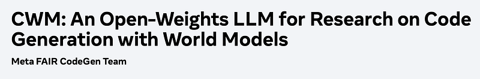 | Title card: Code World Model. |
| 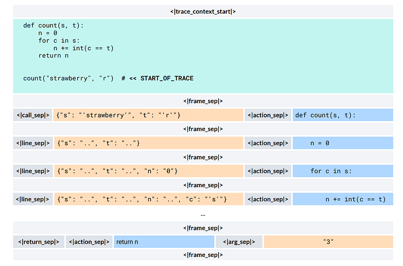 | CWM format for Python traces. |
| 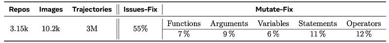 | Statistics of ForagerAgent trajectories. |
| 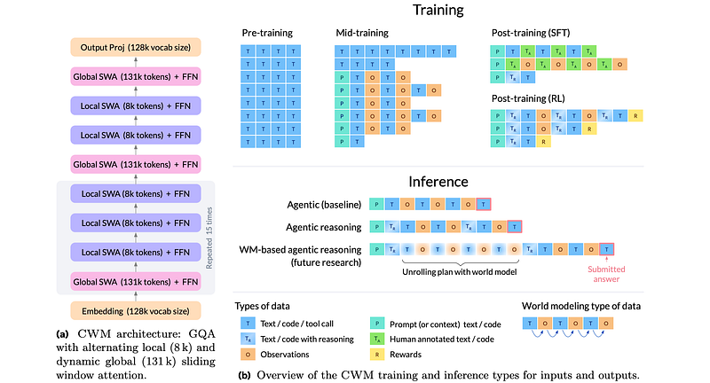 | The CWM Transformer architecture and the main types of data introduced in the different training steps and used at inference time. |
| 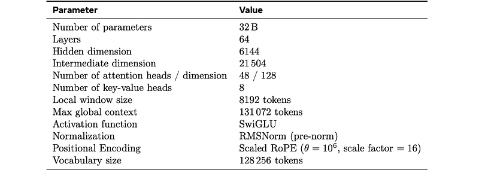 | Key hyper-parameters of the 32 B CWM. |
| 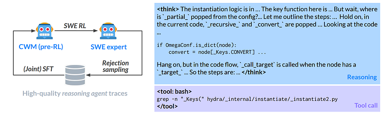 | SWE RL self-bootstrapping. |
| 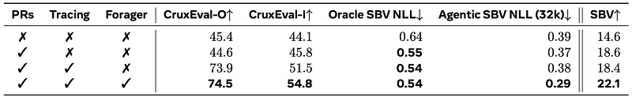 | Mid‑training ablation. |
| 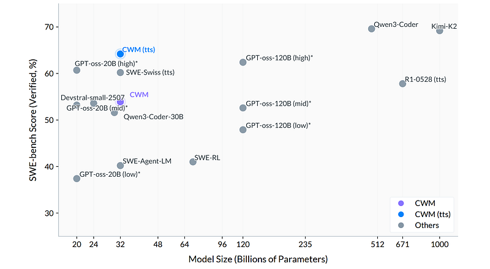 | SWE-bench Verified pass@1 scores. |
|  | SWE-bench Verified resolve rates. |
| 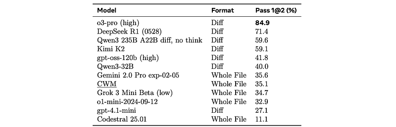 | Results on Aider Polyglot. |
| 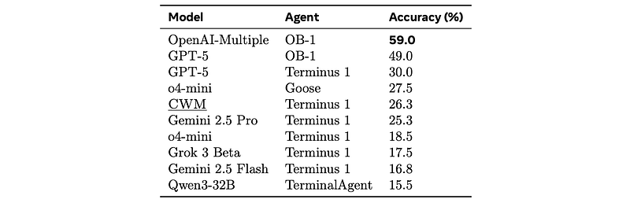 | Results on Terminal-Bench for CWM and baselines from the official leaderboard. |
|  | Execution trace prediction. |
| 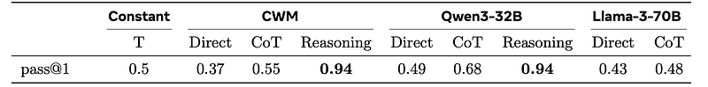 | HaltEval-prelim pass@1 scores for different LLMs in different prompting settings. |
| 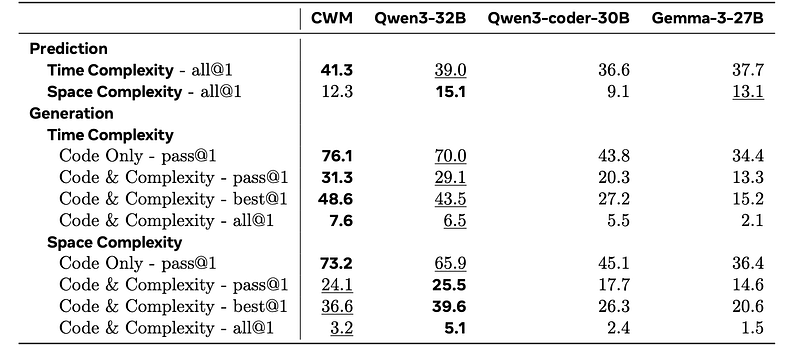 | BigOBench results. |
## Related

- [[Papers Explained Corpus]]
- [[Code Models]]
- [[Large Language Models]]
- [[Reasoning Models]]
- [[Synthetic Data]]
- [[Reinforcement Learning Topic]]
- [[Verifier-Bounded Learning]]
- [[Papers Explained 537 - ScaleRL]]
- [[Papers Explained 539 - Golden Goose]]

#summary #topic
