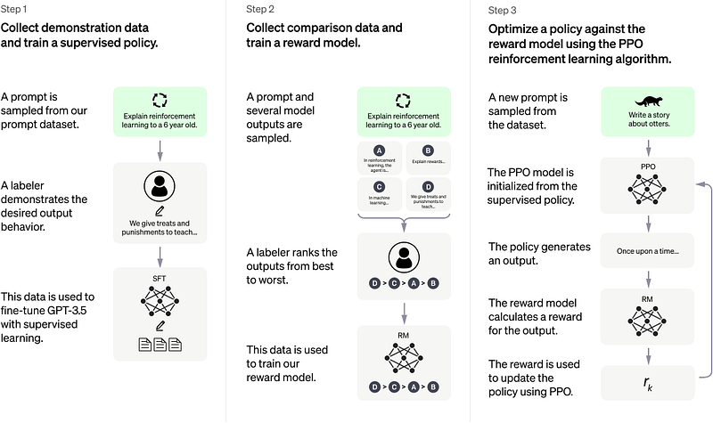

# Papers Explained 54 - ChatGPT

ChatGPT is an interactive model designed to engage in conversations. Its conversational format allows ChatGPT to respond to subsequent queries, acknowledge errors, question inaccurate assumptions, and decline inappropriate requests.

This page ingests the source article into the wiki and connects it to [[Papers Explained Corpus]], [[Large Language Models]], [[Code Models]].

## Source Metadata

- Source file: `raw/2023-09-04_Papers-Explained-54--ChatGPT-78387333268f.html`
- Source title: Papers Explained 54: ChatGPT
- Published: 2023-09-04
- Canonical: [https://medium.com/@ritvik19/papers-explained-54-chatgpt-78387333268f](https://medium.com/@ritvik19/papers-explained-54-chatgpt-78387333268f)

## Key Ideas

- ChatGPT is a fine-tuned version of a model from the GPT-3.5 series, which completed its training in early 2022. The GPT-3.5 series comprises models trained on a combination of text and code from before Q4 2021.
- ChatGPT is sensitive to tweaks to the input phrasing or attempting the same prompt multiple times. For example, given one phrasing of a question, the model can claim to not know the answer, but given a slight rephrase, can answer correctly.
- The model is often excessively verbose and overuses certain phrases, such as restating that it’s a language model trained by OpenAI.
- Ideally, the model would ask clarifying questions when the user provided an ambiguous query. Instead, our current models usually guess what the user intended.
- While efforts are made to make the model refuse inappropriate requests, it will sometimes respond to harmful instructions or exhibit biased behavior.

## Notes

ChatGPT is an interactive model designed to engage in conversations. Its conversational format allows ChatGPT to respond to subsequent queries, acknowledge errors, question inaccurate assumptions, and decline inappropriate requests. It is closely related to InstructGPT, a sibling model specifically trained to comprehend instructions provided in prompts and deliver comprehensive answers

## Chat GPT Training

*Figure: ChatGPT training methodology*

ChatGPT was trained using Reinforcement Learning from Human Feedback (RLHF), following similar methods as InstructGPT. However, there were slight differences in the data collection setup. Initially, a model was trained through supervised fine-tuning, where conversations were engaged by human AI trainers who played both the user and an AI assistant. Model-generated suggestions were provided to these trainers to assist them in composing their responses. This new dialogue dataset was combined with the InstructGPT dataset, which was transformed into a dialogue format.

To establish a reward model for reinforcement learning, comparison data needed to be gathered, which involved ranking two or more model responses based on their quality. The conversations that AI trainers had with the chatbot were utilized for this purpose. By randomly selecting a model-generated message, multiple alternative completions were sampled, and AI trainers were tasked with ranking them. The model was fine-tuned using Proximal Policy Optimization by employing these reward models. This process was repeated through several iterations.

ChatGPT is a fine-tuned version of a model from the GPT-3.5 series, which completed its training in early 2022. The GPT-3.5 series comprises models trained on a combination of text and code from before Q4 2021.

## Limitations of ChatGPT

- ChatGPT sometimes writes plausible-sounding but incorrect or nonsensical answers. Fixing this issue is challenging, as (1) during RL training, there’s currently no source of truth; (2) training the model to be more cautious causes it to decline questions that it can answer correctly; and (3) supervised training misleads the model because the ideal answer depends on what the model knows, rather than what the human demonstrator knows.

- ChatGPT is sensitive to tweaks to the input phrasing or attempting the same prompt multiple times. For example, given one phrasing of a question, the model can claim to not know the answer, but given a slight rephrase, can answer correctly.

- The model is often excessively verbose and overuses certain phrases, such as restating that it’s a language model trained by OpenAI. These issues arise from biases in the training data (trainers prefer longer answers that look more comprehensive) and well-known over-optimization issues.

- Ideally, the model would ask clarifying questions when the user provided an ambiguous query. Instead, our current models usually guess what the user intended.

- While efforts are made to make the model refuse inappropriate requests, it will sometimes respond to harmful instructions or exhibit biased behavior. The Moderation API is used to warn or block certain types of unsafe content, but we expect it to have some false negatives and positives for now.

## Paper

[Introducing ChatGPT](https://openai.com/blog/chatgpt)

## Figures

Figures from the Medium HTML export (`raw/2023-09-04_Papers-Explained-54--ChatGPT-78387333268f.html`); local copies under `wiki/assets/papers-explained-54-chatgpt/` when download succeeded.

| Figure | Caption |
|--------|---------|
|  | ChatGPT training methodology. |
## Related

- [[Papers Explained Corpus]]
- [[Large Language Models]]
- [[Code Models]]
- [[Papers Explained 53 - Galactica]]
- [[Papers Explained 55 - LLaMA]]

#summary #topic
