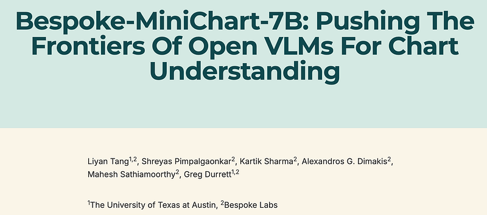
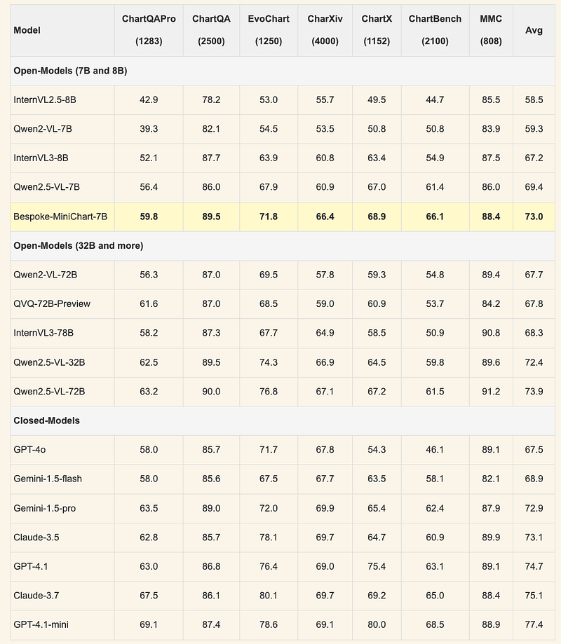
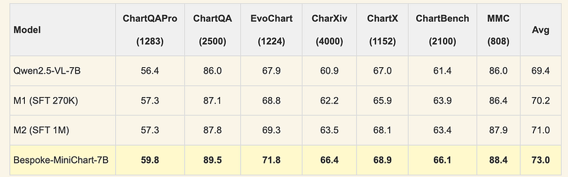

# Papers Explained 540 - Bespoke MiniChart 7B

Bespoke-MiniChart-7B is a 7B open chart understanding model that sets a new state-of-the-art in chart question answering for models of its size and matches larger models like Gemini-1.5-Pro and Claude-3.5 across seven benchmarks.

This page ingests the source article into the wiki and connects it to [[Papers Explained Corpus]], [[Evaluation and Benchmarks]], [[Document AI]], [[Synthetic Data]], [[Reasoning Models]], [[Large Language Models]], [[Verifier-Bounded Learning]].

## Source Metadata

- Source file: `raw/2026-02-13_Papers-Explained-540--Bespoke-MiniChart-7B-0621b15714b2.html`
- Source title: Papers Explained 540: Bespoke MiniChart 7B
- Published: 2026-02-13
- Canonical: [https://medium.com/@ritvik19/papers-explained-540-bespoke-minichart-7b-0621b15714b2](https://medium.com/@ritvik19/papers-explained-540-bespoke-minichart-7b-0621b15714b2)

## Key Ideas

- To address these challenges, a rigorous data generation pipeline was developed, aimed at curating a high-quality training dataset for chart question answering, utilizing real-world images.
- For each image, atomic facts were extracted using a large LVLM. These atomic facts serve as the basis for question generation and answer verification in subsequent steps.
- An LLM is prompted to generate step-by-step reasoning, such as mathematical computations and logical reasoning, from the atomic facts. The LLM then derived the final question from these intermediate steps.
- To generate an answer from atomic facts, two distinct LLMs were used to generate step-by-step CoT answers for each question. Only questions where both models agreed on the final answer were kept. In this step, 20% of questions were filtered out.
- Then, answers were further validated by prompting a LVLM to answer the question directly from the image.

## Notes

Bespoke-MiniChart-7B is a 7B open chart understanding model that sets a new state-of-the-art in chart question answering for models of its size and matches larger models like Gemini-1.5-Pro and Claude-3.5 across seven benchmarks.

## A Four-Step Pipeline to Curate High-Quality Chart QA Data

Existing training data for chart question answering does not reflect real-world complexities of charts and questions. Many datasets use synthetic images generated by models, which have limited visual diversity and are error prone due to the imperfect chart generation process. For questions, these datasets frequently use template-generated questions that primarily focus on basic information extraction and require limited reasoning. Modern LVLMs are already equipped with skills to handle relatively complex chart questions and do not benefit from training on such data.

To address these challenges, a rigorous data generation pipeline was developed, aimed at curating a high-quality training dataset for chart question answering, utilizing real-world images. 40K real-world images were collected from online sources and processed through a four-step pipeline to construct a high-quality synthetic dataset for chart QA.

### Step 1: Atomic Facts Extraction

For each image, atomic facts were extracted using a large LVLM. These atomic facts serve as the basis for question generation and answer verification in subsequent steps. To ensure consistency in model responses, images where the extracted facts contained uncertainty words (e.g., “approximately,” “roughly,” “about”) were removed; such facts were difficult to generate questions with uniquely specified answers in the rest of the pipeline. This filtered around 15% of all images.

### Step 2: Question Generation

An LLM is prompted to generate step-by-step reasoning, such as mathematical computations and logical reasoning, from the atomic facts. The LLM then derived the final question from these intermediate steps. This method resulted in questions that require more diverse reasoning skills. For each image, 12 questions were sampled using varying step length, and duplicated questions with the same answers were removed.

### Step 3: Answer Generation

To generate an answer from atomic facts, two distinct LLMs were used to generate step-by-step CoT answers for each question. Only questions where both models agreed on the final answer were kept. In this step, 20% of questions were filtered out.

Then, answers were further validated by prompting a LVLM to answer the question directly from the image. Only examples where the answers derived from atomic facts matched those obtained directly from the image were kept, removing an additional 20% of questions. This filtering ensures that the question is answerable from the image, and that the answer is consistent with the extracted atomic facts. By the end of Step 3, 60% of the original questions from Step 2 remained.

### Step 4: Question Augmentation

Each remaining question from Step 3 was augmented by replacing key entities in the question with alternative entities from the atomic facts. The same answer-generation and filtering pipeline from Step 3 was then used to these augmented questions. The final training dataset has 270K chart-question-CoT-answer tuples, which consists of a collection of 13K images, 91K curated unique question-answer pairs with 3 CoT traces each.

## Training Pipeline

Qwen2.5-VL-7B-Instruct was chosen as the base model due to its strong baseline performance across popular benchmarks. A three-stage framework was followed for training.

### Stage 1: Supervised Fine-tuning (SFT) warmup

An initial supervised fine-tuning phase was conducted using a curated dataset of 270K CoTs reasoning traces. This training phase produced the first model variant, M1.

### Stage 2: CoT Collection via Rejection Sampling

Rejection sampling was used to collect high-quality in-distribution training data. For each unique chart-question-answer tuple, 16 CoT traces were sampled from model M1. Only reasoning paths that reached the correct answer (up to 8 per question) were kept. For examples where the model did not produce a correct answer, an additional 16 CoTs were sampled each to collect correct CoTs. This process expanded the training corpus from 270K to 1M high-quality reasoning examples. A second round of SFT was then conducted on those 1M data to obtain model M2.

### Stage 3: DPO training

DPO training was used to further improve model performance. For model M2, 16 CoTs were sampled for each unique question-answer pair in the training dataset. The correctness of each CoT trace was evaluated and 240K DPO data was constructed. After 800 optimization steps, the final model, Bespoke-MiniChart-7B, was obtained.

## Results

- Training on synthetic data can improve a strong pre-trained LVLM

- DPO is important in refining models’ CoT reasoning

## Paper

[Bespoke-MiniChart-7B: Pushing The Frontiers Of Open VLMs For Chart Understanding](https://www.bespokelabs.ai/blog/bespoke-minichart-7b)

## Figures

Figures from the Medium HTML export (`raw/2026-02-13_Papers-Explained-540--Bespoke-MiniChart-7B-0621b15714b2.html`); local copies under `wiki/assets/papers-explained-540-bespoke-minichart-7b/` when download succeeded.

| Figure | Caption |
|--------|---------|
|  | Title card: Bespoke MiniChart 7B. |
|  | DPO training was used to further improve model performance. |
|  | DPO training was used to further improve model performance. |
## Related

- [[Papers Explained Corpus]]
- [[Evaluation and Benchmarks]]
- [[Document AI]]
- [[Synthetic Data]]
- [[Reasoning Models]]
- [[Large Language Models]]
- [[Verifier-Bounded Learning]]
- [[Papers Explained 539 - Golden Goose]]
- [[Papers Explained 541 - Phi 4 Reasoning Vision 15B]]

#summary #topic
