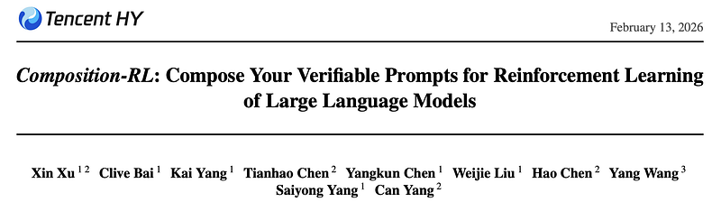
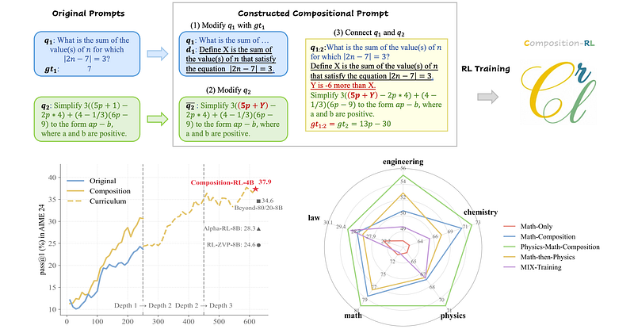
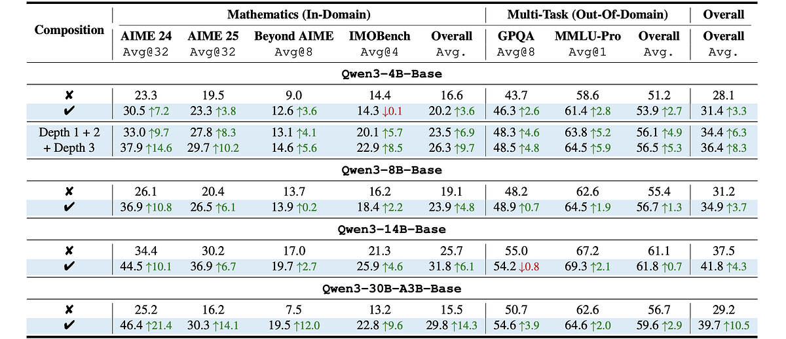
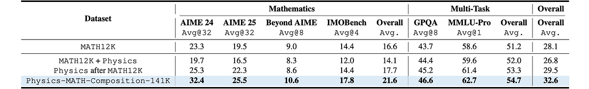

# Papers Explained 542 - Composition RL

Composition-RL is a simple yet useful approach for better utilizing limited verifiable prompts targeting pass-rate-1 prompts, by automatically composing multiple problems into a new verifiable question and using these compositional prompts for RL training.

This page ingests the source article into the wiki and connects it to [[Papers Explained Corpus]], [[Reinforcement Learning Topic]], [[Agentic AI]], [[Verifier-Bounded Learning]].

## Source Metadata

- Source file: `raw/2026-03-17_Papers-Explained-542--Composition-RL-f537cd947a10.html`
- Source title: Papers Explained 542: Composition RL
- Published: 2026-03-17
- Canonical: [https://medium.com/@ritvik19/papers-explained-542-composition-rl-f537cd947a10](https://medium.com/@ritvik19/papers-explained-542-composition-rl-f537cd947a10)

## Key Ideas

- The project is available at [GitHub](https://github.com/XinXU-USTC/Composition-RL).
- Given two prompts q1 and q2 with ground-truth answers gt1 and gt2, a composition operator Compose maps (q1,q2; gt1,gt2) to a composed prompt q1:2 with ground-truth answer gt1:2.
- The operator Compose consists of three steps:
- Extract a numeric value from gt1, denoted by v1. We then introduce a natural-language definition d1 that names this value in terms of (q1,gt1), and form ¯q1 = q1 ⊕d1
- For instance, if q1 is “What is the sum of the value(s) of n for which |2n−7|= 3?” and gt1 = 7, v1 = 7 is set and a definition such as: “Let X be the sum of the value(s) of nsatisfying |2n−7|= 3.” is added.

## Notes

Composition-RL is a simple yet useful approach for better utilizing limited verifiable prompts targeting pass-rate-1 prompts, by automatically composing multiple problems into a new verifiable question and using these compositional prompts for RL training. Performance can be further boosted with a curriculum variant of Composition-RL that gradually increases compositional depth over training. Additionally, Composition-RL enables more effective cross-domain RL by composing prompts drawn from different domains.

The project is available at [GitHub](https://github.com/XinXU-USTC/Composition-RL).

## Methodology: Sequential Prompt Composition

*Figure: Overview of Composition-RL.*

Given two prompts q1 and q2 with ground-truth answers gt1 and gt2, a composition operator Compose maps (q1,q2; gt1,gt2) to a composed prompt q1:2 with ground-truth answer gt1:2.

> q1:2, gt1:2 = Compose(q1, q2; gt1, gt2)

The operator Compose consists of three steps:

Modify q1 with gt1

Extract a numeric value from gt1, denoted by v1. We then introduce a natural-language definition d1 that names this value in terms of (q1,gt1), and form ¯q1 = q1 ⊕d1

For instance, if q1 is “What is the sum of the value(s) of n for which |2n−7|= 3?” and gt1 = 7, v1 = 7 is set and a definition such as: “Let X be the sum of the value(s) of nsatisfying |2n−7|= 3.” is added.

Modify q2.

Extract a numeric value from q2 and replace it with a new variable v2, yielding¯q2 = q2(v2).

If q2 is “Simplify 2((5p+1)−2p·4)+(4−1÷3)(6p−9) to the form ap−b, where a and bare positive,” one may choose the constant 1 as v2 and replace it with variable name Y, obtaining “Simplify 2((5p+Y)−2p·4)+(4−1÷3)(6p−9) to the form ap−b, where a and bare positive.”

Connect q1 and q2

Compute v1−v2 and express the resulting relation between the two variables as a natural language statement r.

Continuing the example above, with v1 = 7 and v2 = 1, v1−v2 = 6, so a constraint r such as: “Y is 6 less than X” can be added. The composed prompt is then q1:2 = ¯ q1 ⊕r⊕¯ q2. By construction, the ground-truth answer of the composed prompt is gt1:2 = gt2. This composition is asymmetric to the order of q1 and q2, and solving q1:2 requires solving q1 first and then q2.

Composing K Prompts

More generally, K prompts can be composed into one prompt. Given q1,…,qK with ground-truth answers gt1,…,gtK, Sequential Prompt Composition applies Compose recursively for K−1 steps. K is termed as the Compositional Depth.

## Experimental Setting

RL training is conducted using the VeRL codebase, with the following hyperparameters: batch size 256, learning rate 1 ×10−6, and no warm-up and rollout settings. Temperature is 1, top p 1, top k−1, 8 rollouts per problem, and a maximum output length of 16K tokens. Qwen3–4B-Base, Qwen3–8B-Base, Qwen3–14B-Base, and Qwen3–30B-A3B-Base are trained on the MATH training set. For the cross-topic experiments, the physics subset of MegaScience is used. Math-Verify, a rule-based verifier, is chosen for the verifier. Dynamic sampling is enabled to filter uninformative prompts, ensuring that the effective batch size at each step remains constant across experiments.

Composition-RL is compared with standard RLVR on MATH12K under the same number of gradient updates. For Composition-RL, approximately 199K compositional prompts, denoted as MATH-Composition-199K, are constructed.

RL-zero methods, including Beyond-80/20, AlphaRL, and RL-ZVP, are additionally reported as reference points for the curriculum-based Composition-RL.

Composition-RL is compared with two baselines: Mix Training (RL on a mixed dataset comprising MATH12K and the MegaScience Physics subset) and Math-then-Physics (continued RL on Physics starting from a MATH12K-trained checkpoint).

## Evaluation

*Figure: Results of Composition-RL across different benchmarks.*

Compositional prompts improve RLVR across domains

- RL on compositional prompts (MATH-Composition-199K) consistently outperforms RL on original MATH12K on both in-domain math and OOD multi-task benchmarks.

- Overall math performance gains: +3.6% (4B), +4.8% (8B), +6.1% (14B), +14.3% (30B-A3B).

- Large improvements on hard math benchmarks: AIME24 (up to +21.4%), AIME25 (up to +14.1%), BeyondAIME (up to +12.0%), IMOBench (up to +9.6%).

- OOD multi-task overall gains: +2.7%, +1.3%, +0.7%, +2.9% for 4B/8B/14B/30B-A3B, leading to overall average gains of +3.3%, +3.7%, +4.3%, +10.5%.

Benefits scale with model size

- Performance gains from Composition-RL increase with model size, especially for math: from +3.6%/+4.8%/+6.1% to +14.3% as model size grows from 4B to 30B.

- OOD multi-task gains are smaller but consistently positive across sizes.

- The MoE 30B-A3B model underperforms the 14B dense model overall (due to partial expert activation and sensitivity to routing/optimization), yet still benefits substantially from Composition-RL.

Curriculum Composition-RL leverages original prompts more fully

- Curriculum from Depth 1 (MATH12K) → Depth 2 yields substantial gains over the Depth 1 checkpoint, e.g., +9.7% on AIME24 and +5.9% on MMLU-Pro.

- Depth 1→2 curriculum outperforms training directly on MATH-Composition-199K by an additional +3.0% overall average.

- Adding a Depth 3 stage further improves both in-domain and OOD performance by another +2.0% overall.

*Figure: Results of cross-topic experiments across multiple benchmarks.*

Adding physics data improves multi-task reasoning

- Both Mix Training and Math-then-Physics improve GPQA and MMLU-Pro over math-only training.

- Average multi-task gains: +0.8% (Mix Training) and +2.1% (Math-then-Physics).

- Math-then-Physics also improves math reasoning, while Mix Training slightly harms math performance.

Cross-domain composition (physics + math) is superior to naive combination

- RL on Physics-MATH-Composition-141K outperforms all baselines:

- On MMLU-Pro: +1.3% over Math-then-Physics and +4.3% over MATH12K-only.

- On AIME24: +7.1% over Math-then-Physics and +9.1% over MATH12K-only.

## Paper

Composition-RL: Compose Your Verifiable Prompts for Reinforcement Learning of Large Language Models [2602.12036](https://arxiv.org/abs/2602.12036)

## Figures

Figures from the Medium HTML export (`raw/2026-03-17_Papers-Explained-542--Composition-RL-f537cd947a10.html`); local copies under `wiki/assets/papers-explained-542-composition-rl/` when download succeeded.

| Figure | Caption |
|--------|---------|
|  | Title card: Composition RL. |
|  | Overview of Composition-RL. |
|  | Results of Composition-RL across different benchmarks. |
|  | Results of cross-topic experiments across multiple benchmarks. |
## Related

- [[Papers Explained Corpus]]
- [[Reinforcement Learning Topic]]
- [[Agentic AI]]
- [[Verifier-Bounded Learning]]
- [[Papers Explained 541 - Phi 4 Reasoning Vision 15B]]
- [[Papers Explained 543 - Dr. SCI]]

#summary #topic
