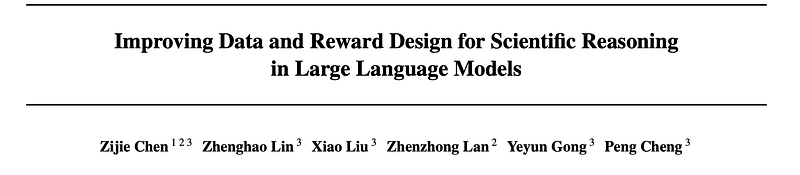
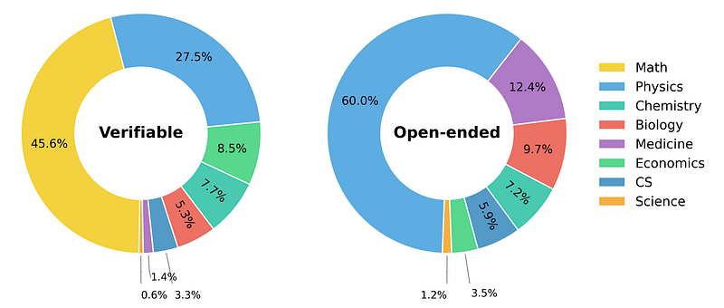
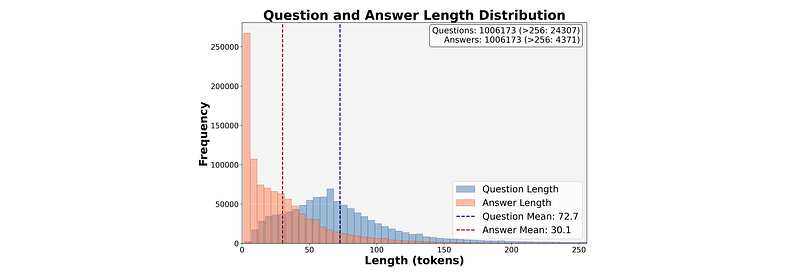
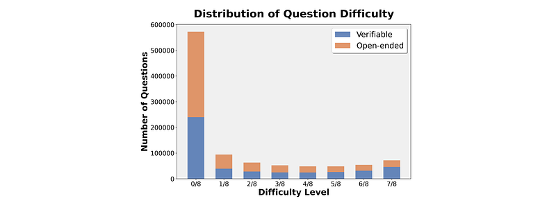
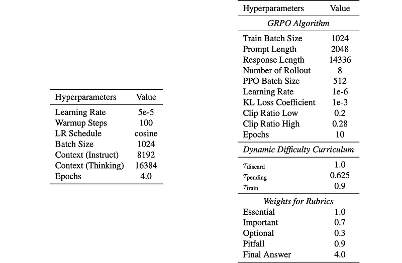
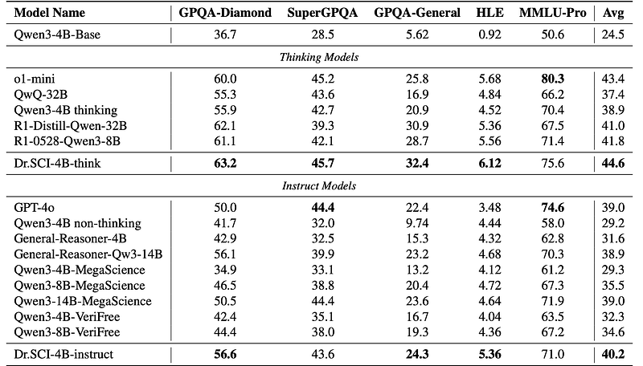
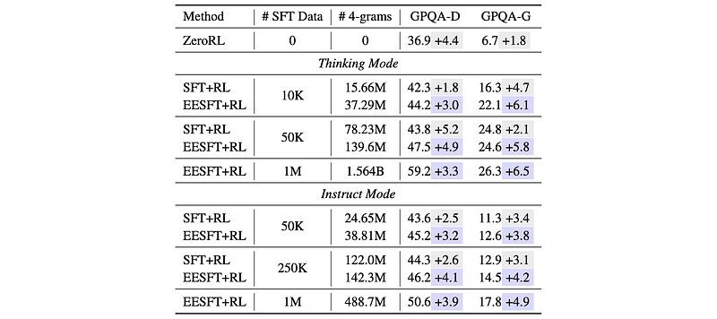

# Papers Explained 543 - Dr. SCI

Exploration-Expanding SFT, which broadens the model’s reasoning pattern coverage prior to RL

This page ingests the source article into the wiki and connects it to [[Papers Explained Corpus]], [[Reasoning Models]], [[Reinforcement Learning Topic]], [[Evaluation and Benchmarks]], [[Synthetic Data]], [[Verifier-Bounded Learning]], [[Reinforcement Learning]], [[Supervised Fine-Tuning]].

## Source Metadata

- Source file: `raw/2026-03-18_Papers-Explained-543--Dr--SCI-bbfaf7a332fd.html`
- Source title: Papers Explained 543: Dr. SCI
- Published: 2026-03-18
- Canonical: [https://medium.com/@ritvik19/papers-explained-543-dr-sci-bbfaf7a332fd](https://medium.com/@ritvik19/papers-explained-543-dr-sci-bbfaf7a332fd)

## Key Ideas

- Dynamic Difficulty Curriculum, which adapts training data to the model’s evolving scientific capability
- SciRubric-Guided RL, which enables stable reinforcement learning on open-ended scientific questions via rubric-based evaluation with explicit answer correctness.
- The research begins with high-quality, publicly available scientific datasets, including WebInstruct-Verified, NaturalReasoning, MegaScience, and RaR-Science.
- Samples with empty or malformed reference answers are removed. The remaining questions are assigned to one of seven STEM subjects: mathematics, physics, chemistry, biology, medicine, computer science, and economics.
- The dataset is deduplicated via exact and near-duplicate matching. Conflicting instances with identical questions but inconsistent reference answers are resolved through answer-equivalence verification, and contaminated samples overlapping with evaluation...

## Notes

This work develops a large-scale, systematic data processing pipeline that transforms heterogeneous open-source science data into the Dr. SCI dataset. The Dr. SCI dataset comprises 1M questions across eight STEM subjects, with explicit verifiable/open-ended splits, scalable difficulty annotation, and fine-grained rubrics that operationalize evaluation for open-ended answers. Building on this dataset, the Dr. SCI post-training pipeline is proposed. This pipeline redesigns the standard SFT→RL workflow through three components:

- Exploration-Expanding SFT, which broadens the model’s reasoning pattern coverage prior to RL

- Dynamic Difficulty Curriculum, which adapts training data to the model’s evolving scientific capability

- SciRubric-Guided RL, which enables stable reinforcement learning on open-ended scientific questions via rubric-based evaluation with explicit answer correctness.

## Dr. SCI Dataset

The research begins with high-quality, publicly available scientific datasets, including WebInstruct-Verified, NaturalReasoning, MegaScience, and RaR-Science.

Samples with empty or malformed reference answers are removed. The remaining questions are assigned to one of seven STEM subjects: mathematics, physics, chemistry, biology, medicine, computer science, and economics. Questions clearly STEM-related but not fitting into these categories are labeled as the general science domain.

Questions are then partitioned into two mutually exclusive classes: verifiable and open-ended. A question is considered verifiable if its reference answer admits deterministic validation (e.g., numerical values, mathematical expressions, or multiple-choice keys); all others are categorized as open-ended. For verifiable questions, reference answers are canonicalized into minimal checkable forms. Open-ended questions in mathematics are discarded as they are predominantly proof-based and empirically induce overlong responses during post-training.

The dataset is deduplicated via exact and near-duplicate matching. Conflicting instances with identical questions but inconsistent reference answers are resolved through answer-equivalence verification, and contaminated samples overlapping with evaluation benchmarks are removed to ensure reliable generalization.

Question difficulty is estimated using the non-thinking version of Qwen3–32B. For each question, eight independent rollouts are performed and the success rate is used as a difficulty proxy. Verifiable questions are evaluated via rule-based checkers, while open-ended questions are assessed using a generative verifier. 413K Questions solved in all attempts (8/8) are discarded as trivial, yielding the final Dr. SCI dataset of 1,006,701 instances.

To support structured supervision for open-ended scientific reasoning, fine-grained evaluation rubrics are generated for all open-ended questions. OpenAI o3 is prompted to analyze each question and attempt a solution to identify the key criteria that characterize a high-quality response. Each question is paired with 7–20 atomic rubric items, each labeled by importance as:

- Essential: critical fact or step; omission invalidates the answer.

- Important: key information or reasoning; absence severely weakens the response.

- Optional: secondary details or actions; doesn’t directly affect correctness.

- Pitfall: common vital mistakes that must be penalized.

Overall, this produces an average of 14.5 rubric items per open-ended question, including 4.3 Essential items, forming the basis for rubric-guided reinforcement learning.

*Figure: Subject distribution of Dr. SCI dataset.*

*Figure: Length Distribution of Dr. SCI dataset.*

*Figure: Difficulty Distribution of Dr. SCI dataset.*

## Dr. SCI Post Training

The Dr. SCI post-training pipeline integrates three complementary components.

- Exploration-Expanding SFT selects supervision to broaden the model’s reasoning-pattern repertoire prior to RL.

- Dynamic Difficulty Curriculum continuously adapts the training distribution to the model’s current capability frontier.

- SciRubric-Guided RL enables stable reinforcement learning on open-ended scientific questions through fine-grained, criterion-based evaluation with explicit final-answer correctness.

### Exploration-Expanding SFT

Scientific RL requires diverse reasoning strategies, which can be limited by the initial training of the LM.

The LM’s reasoning repertoire is deliberately expanded during SFT by selecting a diverse dataset of examples.

Lexical diversity is measured using 4-gram novelty. A higher number of unique 4-grams indicates exposure to a wider range of reasoning patterns.

- Questions are sourced from Dr. SCI, specifically MegaScience and WebInstruct-Verified.

- Multiple candidate responses are generated for each question using diverse open-source models, including both “thinking” (e.g., DeepSeek-R1–0528) and “instruct” (e.g., GLM-4.6) models.

- A subset of the candidate responses (D∗) is selected greedily to maximize incremental 4-gram coverage. This ensures the dataset includes examples that introduce novel reasoning patterns.

The base LM is fine-tuned on two separate subsets: D∗think (thinking-mode responses) and D∗inst (instruct-mode responses). This yields two initial policies for subsequent RL training.

### Dynamic Difficulty Curriculum

Scientific reasoning datasets are inherently imbalanced, with many simple questions and a smaller number of complex ones. Simply training on all data leads to diminishing returns on easy questions and unstable learning signals from difficult ones.

The Dr. SCI dataset is partitioned into three subsets based on difficulty:

- Ddiscard: Trivial instances (difficulty ≥ 1.0) removed from training.

- Dpending: Currently too-difficult instances (difficulty ≤ 0.625) deferred for later training.

- Dtrain: The initial active training set, consisting of instances with intermediate difficulty.

Curriculum Learning:

- Training starts with Dtrain.

- During each epoch, the average rollout accuracy (acc(x)) for each question is tracked.

- If acc(x) exceeds a threshold (0.9), the sample is considered mastered and replaced with the easiest instance from Dpending.

- This process gradually increases training difficulty as the model improves, ensuring informative rewards and avoiding prolonged exposure to easy or hard questions.

### SciRubric-Guided RL

Open-ended scientific questions lack simple rules for determining correctness, making traditional reward systems unreliable.

For each question, Dr. SCI provides a reference answer (y0) and a set of rubric items (ri) that define specific criteria for a good response.

Reward Calculation:

- Rubric Satisfaction: The model’s generated response (y) is evaluated against each rubric item using a lightweight verifier model, producing binary satisfaction indicators (ji).

- Final Answer Correctness: The final answer (yans) is extracted from the response and compared to the reference answer (y0) using the verifier, yielding a binary indicator (jans).

- Weighted Aggregation: Rubric satisfaction and final answer correctness are combined into a single reward signal (R(y)) using weighted aggregation. Weights (wans, wi) are assigned based on the rubric item’s importance category (Essential, Important, Optional, or Pitfall).

This rubric-guided reward system provides fine-grained feedback, ensuring that partial rubric satisfaction cannot compensate for an incorrect final answer. This leads to stable and well-differentiated rewards for open-ended scientific reasoning.

## Experiment Setup

Qwen3–4B-Base is adopted as the base model producing Dr. SCI-4B-think and Dr. SCI-4B-instruct. 1M examples are used for SFT and training runs for 4 epochs until convergence. RL is conducted with GRPO and runs for up to 10 epochs with the dynamic difficulty curriculum setting. For open-ended questions, Qwen3–4B (non-thinking mode) is employed as the verifier with a maximum verification length of 2048 tokens.

*Figure: Hyperparameters for SFT and RL algorithm*

Benchmarks: GPQA-diamond, SuperGPQA, MMLU-Pro, HLE, and the new GPQA-general (open-ended version of GPQA-diamond created by removing options and rewriting questions with GPT-4o).

Baselines: Qwen3–4B (thinking/non-thinking), R1 distill models, QwQ-32B, GPT-4o, o1-mini, General-Reasoner, MegaScience, and VeriFree models, all evaluated under matched settings.

## Results

*Figure: Full experiment results of models across scientific reasoning benchmarks.*

- Dr. SCI substantially improves over Qwen3–4B-Base in both thinking and instruct modes across all scientific reasoning benchmarks.

- On GPQA-General (open-ended), Dr. SCI-4B-think reaches 32.4 and Dr. SCI-4B-instruct 24.3, vs. 5.62 for the base model, representing large absolute gains and best performance among comparable-scale models.

- Dr. SCI-4B models consistently beat other 4B post-trained baselines and often surpass larger models up to 32B parameters.

- Dr. SCI-4B-think outperforms o1-mini on GPQA-Diamond, SuperGPQA, and HLE; Dr. SCI-4B-instruct outperforms GPT-4o on GPQA-Diamond, GPQA-General, and HLE, indicating gains not attributable to scale alone.

- Overall conclusion: Dr. SCI markedly enhances scientific reasoning, especially in open-ended settings where rule-based verification is insufficient.

*Figure: Ablation Study of Exploration Expanding SFT.*

EESFT selects SFT data to maximize reasoning-pattern diversity (measured via unique 4-grams), compared to random SFT data.

- In ablations vs. ZeroRL and standard SFT+RL, EESFT:

- Produces stronger SFT checkpoints.

- Yields larger performance gains after RL on both GPQA-Diamond and GPQA-General.

- At 50K SFT examples (thinking mode), EESFT uses 139.6M unique 4-grams vs. 78.23M for random sampling, and achieves higher final scores.

- Scaling to 1M SFT examples further increases unique 4-grams (1.564B thinking; 488.7M instruct) and yields the best final performance.

*Figure: Ablation of the dynamic difficulty curriculum.*

Compared to Random, No Easy, and Hard Only sampling (all with 100K verifiable questions per epoch), two curriculum variants are tested:

- Compute-efficient: 100K pool, trains on 13.1K examples/epoch (86.9% less per-epoch compute).

- Matched-compute: 461K pool, 82.4K examples/epoch, similar compute to baselines.

Results:

- Compute-efficient curriculum outperforms Random and matches No Easy/Hard Only despite far less per-epoch data.

- Matched-compute curriculum achieves the best performance on GPQA-Diamond and GPQA-General.

*Figure: Ablation of SciRubric-Guided RL.*

Ablation on 100K open-ended questions compares:

- GenRM (binary generative reward model) — leads to training collapse and worse-than-initial performance, indicating reward hacking.

- RaR (weighted average rubric satisfaction) — gives modest gains but encourages partial-credit accumulation and overly long answers rather than correct solutions.

- SciRubric-guided RL — uses structured, correctness-aware rubric rewards with strong emphasis on final-answer correctness.

- Unified RL — combines rule-based rewards on verifiable questions with rubric-guided rewards on open-ended questions.

Results:

- SciRubric-guided RL yields consistent improvements, especially on GPQA-General.

- Unified RL (verifiable + open-ended) achieves the best overall performance, surpassing RLVR-only and open-ended-only setups.

## Paper

Improving Data and Reward Design for Scientific Reasoning in Large Language Models [2602.08321](https://arxiv.org/abs/2602.08321)

## Figures

Figures from the Medium HTML export (`raw/2026-03-18_Papers-Explained-543--Dr--SCI-bbfaf7a332fd.html`); local copies under `wiki/assets/papers-explained-543-dr-sci/` when download succeeded.

| Figure | Caption |
|--------|---------|
|  | Title card: Dr. SCI. |
|  | Subject distribution of Dr. SCI dataset. |
|  | Length Distribution of Dr. SCI dataset. |
|  | Difficulty Distribution of Dr. SCI dataset. |
|  | Hyperparameters for SFT and RL algorithm. |
|  | Full experiment results of models across scientific reasoning benchmarks. |
|  | Ablation Study of Exploration Expanding SFT. |
|  | Ablation of the dynamic difficulty curriculum. |
|  | Ablation of SciRubric-Guided RL. |
## Related

- [[Papers Explained Corpus]]
- [[Reasoning Models]]
- [[Reinforcement Learning Topic]]
- [[Evaluation and Benchmarks]]
- [[Synthetic Data]]
- [[Verifier-Bounded Learning]]
- [[Reinforcement Learning]]
- [[Supervised Fine-Tuning]]
- [[Papers Explained 542 - Composition RL]]
- [[Papers Explained 544 - GEPA]]

#summary #topic
