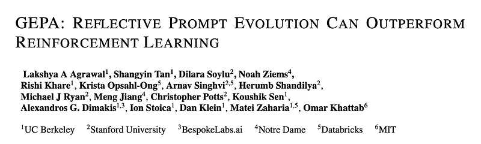
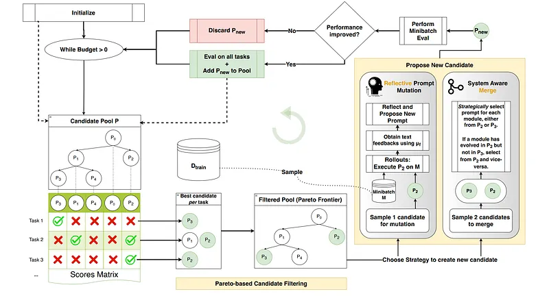
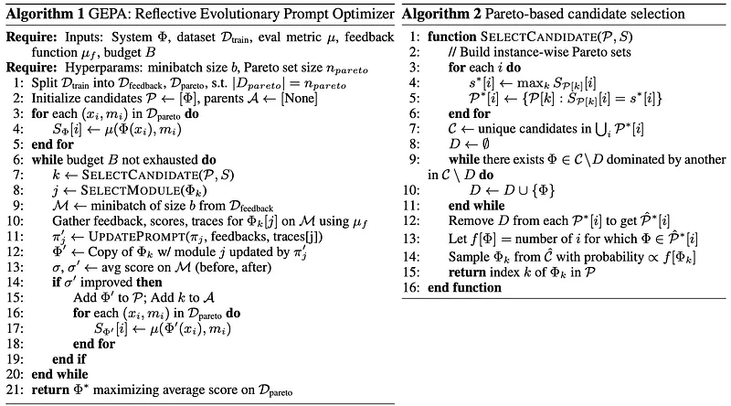
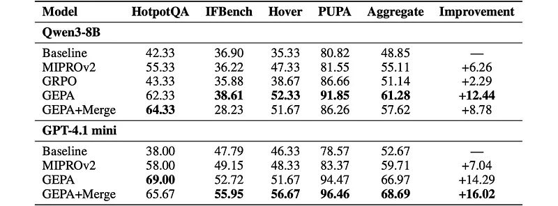
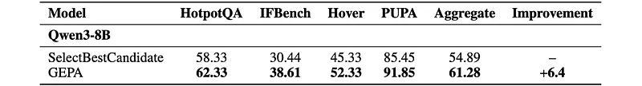
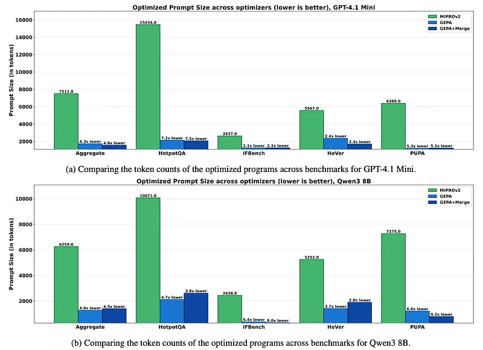

# Papers Explained 544 - GEPA

GEPA (Genetic-Pareto) is a prompt optimizer that thoroughly incorporates natural language reflection to learn high-level rules from trial and error.

This page ingests the source article into the wiki and connects it to [[Papers Explained Corpus]], [[Large Language Models]], [[Agentic AI]], [[Reasoning Models]], [[Evaluation and Benchmarks]].

## Source Metadata

- Source file: `raw/2026-03-19_Papers-Explained-544--GEPA-fa0f055c2e43.md`
- Source title: Papers Explained 544: GEPA
- Published: 2026-03-19
- Canonical: [https://medium.com/@ritvik19/papers-explained-544-gepa-fa0f055c2e43](https://medium.com/@ritvik19/papers-explained-544-gepa-fa0f055c2e43)

## Key Ideas

- The project is available on [GitHub](https://github.com/gepa-ai/gepa).
- A Compound AI System (Φ) is a modular system built from one or more Language Model (LLM) invocations, potentially interleaved with external tool calls, orchestrated by a control flow logic ©.
- Each LLM module (Mi) within Φ consists of:
- πi: System prompt including instructions and few-shot demonstrations.
- The control flow logic © orchestrates the sequencing and invocation of these modules, passing outputs between them, invoking modules conditionally, and leveraging tool APIs.

## Notes

GEPA (Genetic-Pareto) is a prompt optimizer that thoroughly incorporates natural language reflection to learn high-level rules from trial and error. Given any AI system containing one or more LLM prompts, GEPA samples system-level trajectories (e.g., reasoning, tool calls, and tool outputs) and reflects on them in natural language to diagnose problems, propose and test prompt updates, and combine complementary lessons from the Pareto frontier of its own attempts.

The project is available on [GitHub](https://github.com/gepa-ai/gepa).

## Problem Statement

Compound AI System:

A Compound AI System (Φ) is a modular system built from one or more Language Model (LLM) invocations, potentially interleaved with external tool calls, orchestrated by a control flow logic ©. This definition encompasses various real-world LLM-based systems like agents, multi-agent systems, and scaffolding techniques.

Each LLM module (Mi) within Φ consists of:

- πi: System prompt including instructions and few-shot demonstrations.

- θi: Underlying model weights.

- Xi, Yi: Input/output schemas.

The control flow logic © orchestrates the sequencing and invocation of these modules, passing outputs between them, invoking modules conditionally, and leveraging tool APIs.

Optimization:

The learnable parameters of a Compound AI System are the collection of all module prompts (ΠΦ) and the set of module weights (ΘΦ).

Given a task instance (x, m) where x maps to the input schema X and m contains evaluator metadata (e.g., gold answers, evaluation rubrics), the system induces an output y = Φ(x; ⟨Π,Θ⟩Φ). A metric µ measures the output quality (y) with respect to the metadata (m).

The optimization problem aims to find the parameters ⟨Π∗, Θ∗⟩Φ that maximize the expected output quality across a task distribution (T):

⟨Π∗, Θ∗⟩Φ = arg max ⟨Π,Θ⟩Φ E(x,m)∼T µ Φ(x; ⟨Π,Θ⟩Φ), m

Sample-Efficient Optimization:

In real-world scenarios, evaluating the system (rollouts) can be computationally expensive. The optimization problem is then constrained by a rollout budget (B):

⟨Π∗, Θ∗⟩Φ = arg max ⟨Π,Θ⟩Φ E(x,m)∼T µ Φ(x; ⟨Π,Θ⟩Φ), m s.t. #rollouts ≤B

This highlights the core challenge: extracting maximal learning signals from each expensive rollout to enable effective adaptation of complex, modular AI systems in low-data or budget-constrained settings.

## GEPA: Reflective Prompt Evolution

GEPA (Genetic-Pareto), a sample-efficient optimizer for compound AI systems, is motivated by three core principles: genetic prompt evolution, reflection using natural language feedback, and Pareto-based candidate selection. GEPA receives the following inputs: a compound AI system Φ instantiated with simple prompts to be optimized, a training dataset Dtrain (consisting of task instances (x,m), the standard evaluation metric µ for the task, a feedback function µf and the total rollout budget B.

### GEPA’s Optimization Loop

- Initialization: GEPA starts with a candidate pool containing only the base system’s parameters.

- Iteration: In each iteration, GEPA proposes new candidates by modifying existing ones through mutation or crossover, guided by learning signals from newly gathered rollouts.

- Candidate Selection: Promising candidates are selected from the pool based on their performance on a minibatch of tasks.

- Evaluation: New candidates are evaluated on a validation set (Dpareto).

- Candidate Addition: If a new candidate performs better than its parent(s) on the minibatch, it’s added to the candidate pool.

- Termination: Once the evaluation budget is exhausted, GEPA returns the candidate with the best aggregate performance on Dpareto.

### Reflective Prompt Mutation:

GEPA leverages natural language traces generated during system execution to understand module behavior and performance. This allows for “reflective prompt mutation,” where:

- A target module is selected for improvement.

- Rollouts are generated, and execution traces are analyzed.

- An LLM uses these traces to attribute successes or failures to elements of the target module’s prompt.

- New instructions are proposed for the target module based on the LLM’s analysis.

- A new candidate is created with the updated prompt.

Evaluation Trace as Diagnostic Signal: GEPA utilizes evaluation traces (e.g., from code evaluation environments) in addition to system execution traces to provide more comprehensive diagnostic information for reflective prompt updates.

### Pareto-Based Candidate Selection:

GEPA employs a Pareto-based “illumination” strategy to select candidates, balancing exploration and exploitation:

- A Pareto frontier of scores achieved by candidates on individual training instances is created.

- Candidates achieving the best score on at least one task are selected.

- Dominated candidates (outperformed in all aspects by others) are removed.

- A candidate is stochastically sampled from the remaining set, with higher probability assigned to candidates achieving the best score across more training instances.

This strategy helps GEPA escape local optima and efficiently explore the prompt space within the given budget.

## Experiment Setting

Each benchmark uses a standard three-way split: train, validation, and test.

Train split

- Fully accessible to the optimizers.

- Optimizers can read and use both text and labels of training instances for program tuning.

Validation split

- Optimizers may track performance scores on the validation set (e.g., for early stopping).

- Direct access to the content (text/instances themselves) of validation examples is restricted.

Test split

- Completely held out and inaccessible during optimization.

- Used only after optimization to assess final performance of the optimized program.

Benchmarks

- HotpotQA: A question-answering dataset requiring reasoning over multiple documents.

- IFBench: A benchmark designed to assess language models’ ability to follow precise instructions and output constraints.
- [[Papers Explained: IFBench]] explains the IFBench benchmark itself, including its held-out constraint taxonomy, IFTrain constraints, strict/loose accuracy metrics, and IF-RLVR training recipe.

- HoVer: A benchmark for multihop fact extraction and claim verification requiring complex reasoning across multiple documents.

- PUPA: A benchmark for Privacy-Conscious Delegation, addressing real-world user queries using trusted and untrusted models.

Models:

- Qwen3 8B: An open-source model for experiments with GRPO.

- GPT-4.1 Mini: A commercial model for comparison with large models.

Optimizers:

- Baseline: No optimization applied.

- MIPROv2: A widely used compound AI system prompt optimizer.

- GRPO: A reinforcement learning algorithm for optimizing compound AI systems.

- GEPA: The new optimizer proposed in this work, with variants including GEPA+Merge and ablations.

## Results

*Figure: Benchmark results.*

GEPA is highly sample-efficient and can outperform weight-space RL (GRPO)

- GEPA achieves higher test performance than GRPO on all four benchmarks while using up to 35× fewer rollouts; improvements up to 19% over GRPO.

- GEPA reaches optimal test performance with 6,438 (HotpotQA), 678 (IFBench), 6,858 (HoVer), and 2,157 (PUPA) rollouts, and matches GRPO’s best validation scores after only 402, 330, 1,179, and 306 rollouts, respectively (up to 78× more sample-efficient).

- When counting only training rollouts (those used for learning), GEPA needs as few as 6–737 rollouts to reach optimal performance, and 32–179 to match GRPO’s best validation scores.

- GEPA+Merge further widens the margin over GRPO by ~21% at similar rollout budgets, including +8.16% on IFBench with GPT-4.1 mini despite out-of-domain constraints.

Instruction-only optimization (GEPA) outperforms joint instruction+few-shot optimization (MIPROv2)

- GEPA consistently beats MIPROv2 on all tasks and both models, with margins up to 11.1% (GPT-4.1 mini) and 10.3% (Qwen3–8B).

- GEPA and GEPA+Merge more than double aggregate gains over baseline compared to MIPROv2 (+16.02% and +14.29% vs +7.04%).

- Reflectively evolved instructions now show a lower generalization gap (validation–test difference) than few-shot optimized prompts, indicating better generalization.

- GEPA’s optimized prompts tend to be detailed declarative instructions rather than quasi-exemplars, differing from prior instruction-optimization findings.

System-aware crossover (Merge) can yield gains, but budget allocation is model-dependent

- GEPA+Merge (which uses a system-aware crossover strategy) can outperform GEPA by up to 5%, adding ~2% aggregate improvement beyond GEPA’s strong baseline.

- Gains arise from merging distinct optimization lineages by selecting the best modules from each, forming a single superior candidate.

- GEPA+Merge works particularly well for GPT-4.1 mini but can degrade performance for Qwen3–8B under shared hyperparameters; Qwen3–8B still benefits on one of four tasks.

- Performance sensitivity is attributed to how rollout budget is split between mutation and crossover and when Merge is invoked; optimal use likely requires adaptive, model- and progress-aware scheduling.

*Figure: Benchmark results for different optimizers.*

Pareto-based candidate selection is crucial for effective optimization

- A naive strategy that always selects the current best candidate leads to poor exploration, local optima, and lower final performance.

- GEPA with Pareto-based sampling outperforms the SelectBestCandidate strategy by up to 8.17%, with an aggregate +6.4% margin across benchmarks.

- Pareto-based sampling maintains a diverse set of “winning” candidates, balancing exploration and exploitation and converging to better solutions within the same rollout budget.

*Figure: Final test set performance for aggregate and individual benchmarks.*

Instruction-optimized prompts are shorter, cheaper, and generalize better than few-shot prompts

- GEPA and GEPA+Merge produce prompts up to 9.2× shorter than MIPROv2’s few-shot demonstration prompts, while also achieving higher performance.

- Across optimizers, higher-performing methods tend to produce shorter prompts, improving runtime cost, latency, and overall serving efficiency (due to fewer input tokens).

- Reflectively evolved instructions thus offer both accuracy and efficiency advantages, especially for complex tasks where few-shot examples become very long.

## Paper

GEPA: Reflective Prompt Evolution Can Outperform Reinforcement Learning [2507.19457](https://arxiv.org/abs/2507.19457)

## Figures

Figures from the Medium HTML export (`raw/2026-03-19_Papers-Explained-544--GEPA-fa0f055c2e43.md`); local copies under `wiki/assets/papers-explained-544-gepa/` when download succeeded.

| Figure | Caption |
|--------|---------|
|  | Title card: GEPA. |
|  | Sample-Efficient Optimization. |
|  | This strategy helps GEPA escape local optima and efficiently explore the prompt space within the given budget. |
|  | Benchmark results. |
|  | Benchmark results for different optimizers. |
|  | Final test set performance for aggregate and individual benchmarks. |
## Related

- [[Papers Explained Corpus]]
- [[Large Language Models]]
- [[Agentic AI]]
- [[Reasoning Models]]
- [[Evaluation and Benchmarks]]
- [[Papers Explained 543 - Dr. SCI]]
- [[Papers Explained 545 - MiniCheck]]

#summary #topic
