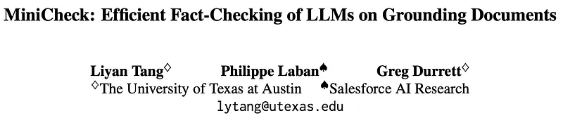
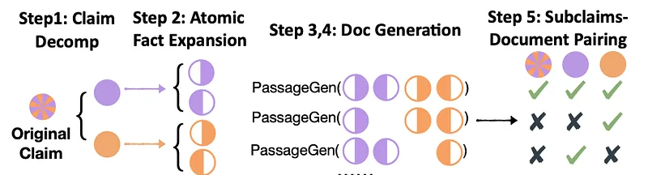
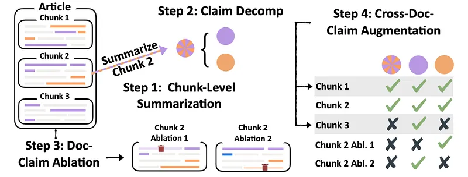
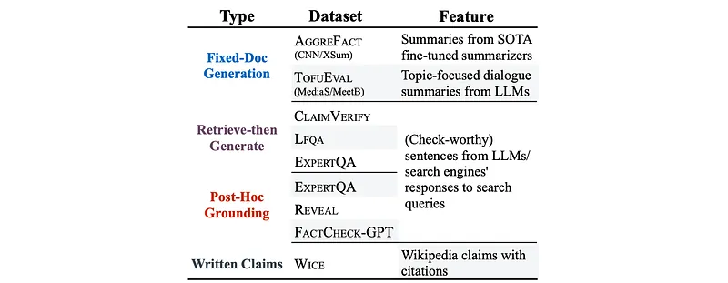
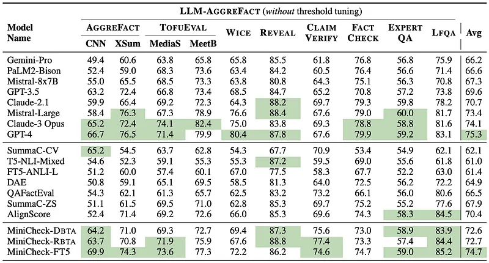

# Papers Explained 545 - MiniCheck

MiniCheck is an efficient, small fact-checking system designed to verify sentences against grounding documents in tasks like retrieval-augmented generation, summarization, and document-grounded dialogue.

This page ingests the source article into the wiki and connects it to [[Papers Explained Corpus]], [[Synthetic Data]], [[Large Language Models]], [[Document AI]], [[Model Compression and Efficiency]], [[Evaluation and Benchmarks]].

## Source Metadata

- Source file: `raw/2026-03-20_Papers-Explained-545--MiniCheck-08d4d5cb9c57.md`
- Source title: Papers Explained 545: MiniCheck
- Published: 2026-03-20
- Canonical: [https://medium.com/@ritvik19/papers-explained-545-minicheck-08d4d5cb9c57](https://medium.com/@ritvik19/papers-explained-545-minicheck-08d4d5cb9c57)

## Key Ideas

- The model is available on [HuggingFace](https://huggingface.co/bespokelabs/Bespoke-MiniCheck-7B).
- Existing datasets like MNLI and ANLI do not feature instances that reflect the complexity of LLM fact-checking. Annotation of real errors is challenging to scale.
- The Claim to Doc (C2D) method aims to generate synthetic documents that require models to perform multi-sentence reasoning to classify claims.
- A given claim (c) is decomposed into a set of atomic facts (a) using GPT-3.5.
- For each atomic fact (ai) in the claim, GPT-4 generates a pair of sentences (si,1, si,2) designed to support the fact only when combined.

## Notes

MiniCheck is an efficient, small fact-checking system designed to verify sentences against grounding documents in tasks like retrieval-augmented generation, summarization, and document-grounded dialogue. It is trained on synthetically generated, GPT-4-created data that introduces realistic and challenging factual errors, plus standard entailment data, enabling it to check multiple facts in a sentence across multiple evidence sentences without needing claim decomposition.

The model is available on [HuggingFace](https://huggingface.co/bespokelabs/Bespoke-MiniCheck-7B).

## Methodology: Training Data Synthesis

Existing datasets like MNLI and ANLI do not feature instances that reflect the complexity of LLM fact-checking. Annotation of real errors is challenging to scale. The goal is to construct a dataset of N instances of documents Di paired with claims ci with label yi ∈{0, 1}, using two novel synthetic data generation methods.

### Claim to Doc (C2D) Generation

The Claim to Doc (C2D) method aims to generate synthetic documents that require models to perform multi-sentence reasoning to classify claims.

Step 1: Claim Decomposition:

- A given claim (c) is decomposed into a set of atomic facts (a) using GPT-3.5.

Step 2: Atomic Fact Expansion:

- For each atomic fact (ai) in the claim, GPT-4 generates a pair of sentences (si,1, si,2) designed to support the fact only when combined.

Step 3: Supporting Document Generation:

- GPT-4 generates a document (D) that incorporates all the generated sentence pairs (s) in its own words. This document supports the original claim (c).

Step 4: Nonsupporting Document Generation:

- A new document (D′ai\j) is created by removing one sentence from each sentence pair in D. This document is likely to not support the original claim (c) because the information from both sentences is crucial for supporting the fact.

- An entailment check using GPT-4 verifies if the removed sentence is essential for supporting the fact. If it is, the document (D′ai\j) is retained.

Step 5: Pairing Subclaims and Generated Documents:

- The power set of atomic facts (Power(a)) is generated, including all possible subsets of facts.

- Augmented subclaims (Aug(c)) are created by merging atomic facts from each subset.

- Tuples (D, c′, 1) are created for each augmented subclaim (c′) in Aug(c), indicating that the document (D) supports the subclaim.

- For each D′ai\j, tuples (D′ai\j, Merge(a′), 1) are created if the atomic fact (ai) is not present in the subclaim (a′), indicating that the document still supports the subclaim.

- Conversely, tuples (D′ai\j, Merge(a′), 0) are created if (ai) is present in (a′), suggesting that the document does not support the subclaim due to the absence of (ai).

### Doc to Claim (D2C) Generation

The D2C method aims to generate diverse and realistic synthetic documents for training, reducing the distribution shift between training and real-world documents. It leverages human-written documents as a starting point and generates claims paired with relevant document excerpts.

Step 1: Chunk-level Summarization

- Human-written documents are divided into three equal-length chunks (D1, D2, D3).

- GPT-4 generates a summary sentence (c1, c2, c3) for each chunk.

- These summary sentences are assumed to be factually consistent with their corresponding chunks.

Step 2: Claim Decomposition and Subclaim Augmentation

- Each summary sentence (ci) is decomposed into atomic facts (ai).

- Augmented subclaims (Aug(ci)) are created by merging different combinations of atomic facts.

Step 3: Document-Claim Augmentation

- For each (Di, ci) pair, sentences are iteratively removed from Di to create new documents (D′i\j).

- Entailment labels (L−j (ai,k)) are determined for each atomic fact (ai,k) in ci based on the modified document (D′i\j).

- New tuples (D′i\j, Merge(a′i), 1) are created if all atomic facts are entailed by D′i\j.

- Conversely, tuples (D′i\j, Merge(a′i), 0) are created if any atomic fact is not entailed.

Step 4: Cross-Document-Claim Augmentation

- Chunks (Dj) from different documents are used to assess the entailment of claims (ci) and its atomic facts (ai,k).

- Entailment labels (LDj (ai,k)) are determined using chunks (Dj) where j ≠ i.

- Tuples (Dj, Merge(a′i), 1) are created if all atomic facts are entailed by Dj.

- Tuples (Dj, Merge(a′i), 0) are created if any atomic fact is not entailed.

*Figure: Statistics of synthetic training data.*

## MiniCheck Models

Three models with various model architectures are fine-tuned by leveraging synthetic data. The standard cross-entropy loss is used for all models.

MiniCheck-DBTA and MiniCheck-FT5: As models trained on the ANLI dataset have demonstrated strong performance, data is integrated with the ANLI dataset for fine-tuning deberta-v3-large and flan-t5-large. A subset (21K) of the ANLI training data is taken, selecting examples where their trained entailment models made incorrect predictions during dataset construction. Training on more of ANLI was not effective. Combining these 21K datapoints with a 14K-sized dataset, there are 35K training datapoints in total. The labels contradiction and neutral from ANLI are mapped to unsupported.

MiniCheck-RBTA: The possibility of improving upon the previous AlignScore system, the existing SOTA specialized fact-checking model, is explored. The tuned roberta-large model from AlignScore is fine-tuned with a binary classification head, on 14K synthetic datapoints.

Producing classification decisions: Although the task is framed as binary classification, in reality the models are of the form M (Di, ci) →z ∈ R, mapping each (document, claim) pair to a score in the range z ∈[vmin, vmax]. Each method is converted into a binary classifier M (Di, ci) →{0, 1} by picking a threshold t such that we predict 1 if M (Di, ci) > t and 0 otherwise. Unless otherwise specified, t = 0.5.

## LLM-AggreFact Benchmark

*Figure: 10 datasets in LLM-AggreFact.*

The LLM-AggreFact benchmark is a comprehensive evaluation platform for factual consistency in language models. It aggregates 10 diverse publicly available datasets, encompassing both closed-book and grounded generation settings.

Existing validation and test splits are utilized for datasets from AGGREFACT, TOFUEVAL, WICE, and CLAIMVERIFY. For REVEAL, FACTCHECK-GPT, EXPERTQA, and LFQA, random 50%/50% splits are created to ensure unique queries are not present in both sets.

A fixed threshold is set as the midpoint of the output score range (t = (vmin + vmax)/2) for all fact-checkers, avoiding per-dataset threshold tuning to promote zero-shot deployment across multiple tasks.

Balanced accuracy (BAcc) is used as the primary evaluation metric, following established practices in the field.

## Evaluation

*Figure: Performance of models on the test set of LLM-AGGREFACT without per-dataset threshold tuning.*

Synthetic data improves performance across architectures:

- MiniCheck models (RoBERTa, DeBERTa, Flan-T5 backbones) outperform prior specialized fact-checkers of similar scale on the LLM-AGGREFACT test sets.

- MiniCheck-FT5 achieves a 4.3% average BAcc improvement over AlignScore, winning on 6/10 datasets and tying on the remaining 4.

Comparison to LLM-based fact-checkers:

- Existing specialized fact-checkers (e.g., AlignScore, SummaC variants, QAFactEval) reach performance similar to non-frontier LLMs like Mistral-8x7B and GPT-3.5.

- MiniCheck-RBTA and MiniCheck-DBTA substantially surpass these non-frontier LLM-based fact-checkers.

- MiniCheck-FT5 matches the performance of Claude 3 Opus and is close to GPT-4 on average BAcc, despite being much smaller.

- Overall conclusion: synthetic-data-trained MiniCheck models can reach or approach frontier-LLM factuality performance with specialized, smaller architectures.

Model capacity vs. data quality:

- MiniCheck-FT5’s extra ~2% gain over MiniCheck-RBTA and MiniCheck-DBTA is attributed to its larger model size.

- However, larger models trained on generic NLI data (T5-NLI-Mixed, FT5-ANLI-L) underperform on most factuality benchmarks, highlighting that training data selection is as important as model capacity.

## Paper

MiniCheck: Efficient Fact-Checking of LLMs on Grounding Documents [2404.10774](https://arxiv.org/abs/2404.10774)

## Figures

Figures from the Medium HTML export (`raw/2026-03-20_Papers-Explained-545--MiniCheck-08d4d5cb9c57.md`); local copies under `wiki/assets/papers-explained-545-minicheck/` when download succeeded.

| Figure | Caption |
|--------|---------|
|  | Title card: MiniCheck. |
|  | Existing datasets like MNLI and ANLI do not feature instances that reflect the complexity of LLM fact-checking. |
|  | Step 5: Pairing Subclaims and Generated Documents. |
|  | Statistics of synthetic training data. |
|  | 10 datasets in LLM-AggreFact. |
|  | Performance of models on the test set of LLM-AGGREFACT without per-dataset threshold tuning. |
## Related

- [[Papers Explained Corpus]]
- [[Synthetic Data]]
- [[Large Language Models]]
- [[Document AI]]
- [[Model Compression and Efficiency]]
- [[Evaluation and Benchmarks]]
- [[Papers Explained 544 - GEPA]]
- [[Papers Explained 546 - Tiny Aya]]

#summary #topic
