# Papers Explained 546 - Tiny Aya

Tiny Aya is a family of efficient, open-weight multilingual language models centered on balanced performance across 70+ languages, especially underrepresented ones, using just 3.35B parameters. It includes:

This page ingests the source article into the wiki and connects it to [[Papers Explained Corpus]], [[Multilingual Models]], [[Model Compression and Efficiency]], [[Large Language Models]], [[Synthetic Data]].

## Source Metadata

- Source file: `raw/2026-03-23_Papers-Explained-546--Tiny-Aya-5eccbb462932.html`
- Source title: Papers Explained 546: Tiny Aya
- Published: 2026-03-23
- Canonical: [https://medium.com/@ritvik19/papers-explained-546-tiny-aya-5eccbb462932](https://medium.com/@ritvik19/papers-explained-546-tiny-aya-5eccbb462932)

## Key Ideas

- Tiny Aya Base (pretrained foundation model)
- Tiny Aya Global (instruction-tuned for consistent multilingual performance)
- Tiny Aya Earth (region-specialized variant for Africa & West Asia)
- Tiny Aya Fire (region-specialized variant for South Asia)
- Tiny Aya Water (region-specialized variant for Asia-Pacific & Europe)

## Notes

Tiny Aya is a family of efficient, open-weight multilingual language models centered on balanced performance across 70+ languages, especially underrepresented ones, using just 3.35B parameters. It includes:

- Tiny Aya Base (pretrained foundation model)

- Tiny Aya Global (instruction-tuned for consistent multilingual performance)

- Tiny Aya Earth (region-specialized variant for Africa & West Asia)

- Tiny Aya Fire (region-specialized variant for South Asia)

- Tiny Aya Water (region-specialized variant for Asia-Pacific & Europe)

## Multilingual Data Mixture

### Tokenizer data mixture

All models share a single massively multilingual tokenizer that covers all languages included in Tiny Aya in order to have the highest flexibility for different posttraining strategies including language grouping and model merging without the hassle of vocabulary transfer. The tokenizer is designed using a specialized data weighting, ensuring that all languages are fairly represented. For a language i, given wd_i and wb_i denote weights for data distribution and language bucket, respectively, the final weight in the tokenizer data mixture is computed as follows:

A vocabulary size of 262k is used. Fineweb-2 is used as the tokenizer training data, out of which 50GB of data is sampled for training according to the described weighting scheme. Finally, the GPT-4o regex is used for pre-tokenization and normalization is not used.

*Figure: Tokenization efficiency across scripts.*

- The tiny aya tokenizer achieves the lowest or near-lowest tokens-per-character ratio across the majority of scripts, particularly excelling on underrepresented scripts such as Khmer, Telugu, Gujarati, and Ge’ez, where competing tokenizers produce significantly more tokens.

- SmolLM3–3B consistently shows the highest fragmentation, especially for non-Latin scripts like Myanmar and Ge’ez, reflecting its more limited multilingual coverage.

### Pretraining data mixture

A large corpus of public and proprietary sources covering 70 languages alongwith programming languages datasets is used. To ensure high multilingual capacity, low-resource languages are carefully balanced based on language grouping used in the tokenizer data mixture. To increase the quality of the pretraining mixture, the training corpus is extensively filtered based on

- Language ID and stopword filtering

- Heuristic data cleaning from raw sources

- Deduplication

- Domain classification and quality filtering

Similar to SmolLM3–3B, a cooldown (mid-training) mixture is used where the highest quality datasets in the pretraining corpus are upsampled and further include instruction-style datasets.

## Post Training Data

Rather than treating languages as independent entities, they are organized into five clusters: Asia Pacific, Africa, South Asia, Europe, and West Asia, defined by linguistic, geographic, and resource considerations. A collection of high-quality and diverse source datasets from internal and external sources is assembled. Coverage for missing languages is extended by passing this data through a multi-stage data pipeline that involves translation, prompt-level transformations, and synthetic completion generation.

*Figure: Language coverage by region.*

### Synthetic Data Generation Pipeline

Translation as the starting point for multilingual augmentation

For datasets where both prompts and reference completions are deemed sufficiently strong, the full example is directly translated into the target language. In contrast, for datasets where the quality of the prompt completion pairs can further be improved, or there are no available gold completions, only the prompts are translated. Subsequently, these translated prompts are passed (1) through an optional prompt transformation stage, (2) followed by FusioN, where new completions are generated in the target language with a team of teachers.

Choosing a translator

For translation, two competitive translation models, command-a-translate and deepseek-v3, are relied upon. A representative development set spanning all languages is translated with both models. Translation quality is then assessed using xCOMET-XL and AfriCOMET as reference-free quality estimators wherever applicable to determine the preferred system for each language.

Prompt-level transformations

Prompt-level transformation strategies are adopted on a subset of conversational datasets to specifically improve the naturalness and richness of the model in each target language. Three complementary transformations are applied: Naturalness, which removes translation artifacts; Cultural Adaptation, which re-contextualizes prompts with locally relevant references and examples; and Difficulty Enhancement, which increases task complexity and specificity. Command A, and DeepSeek-V3 are used as transformation models to perform the transformations. The transformation model is selected on a per-language basis using translation performance as a proxy for fluency and generation capabilities in each target language.

FusioN of teacher responses

First, for a given prompt in a target language, each teacher generates one candidate completion. In the second step, FusioN is performed, where a judge LLM (the Fusor) takes all candidate completions and comparatively evaluates, extracts, and aggregates their strongest components. Gemma3–27B-It, Command A, and DeepSeek-V3 are chosen as teachers and Command A as the Fusor.

### Machine Translation Data

To improve machine translation and crosslingual generalization capabilities, a subset of few publicly available parallel corpora is collected and applied to a multi-stage filtering pipeline. This pipeline includes rule-based cleaning, FastText language identification, and quality-estimation filtering as described in Command A Translate. Difficulty filtering with Sentinel-25-src is used to prioritize challenging examples and discard the easiest ones. Backtranslation to the 23 languages supported by Command A is performed, and documents that obtain a higher quality estimation score than the original corpus reference are filtered out. The final data for fine-tuning contains 312k parallel documents of 98 different languages.

*Figure: Regional composition of posttraining data clusters.*

- English remains the highest represented language in each cluster.

- The European region has the largest number of languages, so it also forms the largest proportion of data in all but the South Asian cluster.

- The South Asian cluster has the smallest number of focus languages (nine languages in seven different scripts).

## Architecture

*Figure: Tiny Aya architecture summary.*

Tiny Aya closely follows the core design choices from Command A:

- Parallel Transformer blocks lead to a significant improvement in training efficiency without hurting model quality.

- Interleaved layers of sliding window attention and full attention are used in a 3:1 ratio. While each sliding window layer uses Rotary Positional Embeddings, each full attention layer uses No Positional Embeddings.

- SwiGLU activations lead to higher downstream performance than other activations. Additionally, all biases are removed from dense layers to improve training stability.

- Grouped-query attention is used where each KV head shares multiple Q heads to reduce inference-time memory footprint.

The Tiny Aya model is pre-trained for 6T tokens using a Warmup-Stable-Decay (WSD) learning rate schedule.

## Post Training

*Figure: Post Training pipeline and model construction.*

All models are trained for 3 epochs using a cosine decay learning rate schedule with a peak learning rate of 2.5 × 10−5 and a final learning rate of 1.2 × 10−6. A minimal preference tuning phase is applied on top of SFT for the Tiny Aya Global model. This lightweight alignment stage teaches the model its identity (including its name and supported language list) while maintaining multilingual safety.

Region-specialized post-training enhances performance on specific languages and tasks within a region but can negatively impact global instruction-following consistency and multilingual safety.

A predictive merge-selection method called SimMerge is used to determine the optimal merge operator and order. SimMerge analyzes checkpoint similarity features computed on a held-out multilingual probe corpus.

- For each region cluster (r), the region-specialized post-trained checkpoint is merged with the global post-trained checkpoint.

- All checkpoints share the same architecture and tokenizer, allowing direct parameter-space merging without additional training.

- Three merge operators (Linear interpolation, Slerp, and TIES merging) are employed, along with varying mixing strengths to control the balance between global and regional checkpoints.

Final Model Selection:

- The best merged checkpoint for each region is chosen based on a regional development suite, prioritizing average performance across representative languages and strong minimum performance to minimize language disparities.

- Multilingual safety metrics are also verified to ensure no regression.

The final released region models are the best-performing merged checkpoints, combining regional strengths (e.g., translation quality) with the global model’s consistent instruction-following and safety behavior.

## Evaluation

### Discriminative Tasks

Evaluated multiple-choice performance on three multilingual benchmarks: Global MMLU (42 languages), INCLUDE (44 languages), and Global PIQA (116 languages), using lm-eval harness defaults for the first two and internal generation with greedy decoding for Global PIQA.

*Figure: Discriminative benchmark results.*

- Tiny Aya does not achieve the top average score but performs within the range of other 3–4B models across Global MMLU, INCLUDE, and Global PIQA, indicating competitive discriminative performance at this scale.

### Generative Tasks

Evaluated open-ended generation and reasoning on mDolly (66 languages), mArenaHard (66), GlobalMGSM (35), and translation on Flores (66) and WMT24++ (61). Measured language confusion using FastText-based line-level language identification pass rates.

*Figure: Generative and translation benchmark summary.*

- Tiny Aya shows strong open-ended performance, especially on non-technical mDolly, and achieves the highest naturalness ratings across mDolly and mArenaHard.

- Competitors have large standard deviations across languages (reflecting missing language support), whereas Tiny Aya’s scores are more stable.

*Figure: Language confusion in open-ended generations and mathematical reasoning.*

- Tiny Aya has the highest language accuracy (94%) in its outputs, meaning its chain-of-thought is most likely to be in the prompt language; Gemma3–4B and Qwen3–4B produce ~5% more outputs in the wrong language.

- On GlobalMGSM, Tiny Aya is 2–7 points behind competitors on average, but outperforms all competitors on African languages (39.2% vs. Gemma3–4B’s 17.6% and Qwen3–4B’s 6.25%), showing a strong advantage in low-resource African settings.

### Translation

Evaluated English-to-target translation on Flores (restricted to Tiny Aya’s focus languages) and WMT24++ (all benchmark languages, including some unsupported by Tiny Aya).

*Figure: Translation quality on WMT24++.*

*Figure: Translation quality on focus languages from Flores.*

*Figure: Effect of regional specialization on translation.*

- Tiny Aya Global achieves the highest average translation performance on both Flores and WMT24++, with a large margin over Gemma3–4B, and wins on 46/61 languages on WMT24++.

- Tiny Aya excels particularly on lower-resourced languages, but lags behind on higher-resource European languages, their American varieties, and Thai.

- Against TranslateGemma-4B, Tiny Aya Global outperforms on 27/66 focus languages (and 43/66 when comparing against Gemma on the same task), despite being a general-purpose model rather than translation-specialized — highlighting the strength of its balanced training.

- Region-specific Tiny Aya models (Earth, Water, Fire) consistently outperform the Global model on English-to-target translation in their respective regions, with gains from +1.7 ChrF (Africa) up to +5.5 ChrF (South Asia).

### Safety

Evaluated safety using MultiJail (10 languages) and XSTest (English), measuring safe response rates, over-refusal, and under-refusal.

*Figure: Safety evaluation summary across benchmarks.*

- Tiny Aya Global is the safest model overall, with the highest minimum and mean safe response rates across MultiJail languages, though it is slightly more prone to over-refusal than competitors.

- Competitors, especially Qwen3–4B and Ministral-3–3B, show high rates of invalid and unsafe responses in some languages (e.g., for Swahili: 91% and 44% invalid, 7% and 37% unsafe, respectively), whereas Tiny Aya maintains high safe response rates (e.g., 94% for Swahili).

- Including SFT data in each language is crucial for safety; merging region-specific models with the Global variant via FusioN improves safety consistency across languages.

### Cultural Awareness Assessment: social norms (NormAd)

Evaluated Tiny Aya on NormAd, a social norm benchmark covering 75 countries and four domains (Basic Etiquette, Eating, Visiting, Gift-Giving). Provided only the country name as context to test internalized cultural knowledge.

Two settings: (1) original English stories, (2) stories translated into each country’s official language; only Yes/No-labeled items used.

*Figure: Cultural norm reasoning across countries on NormAd.*

*Figure: Impact of test-time reasoning on model performance evaluated on NormAd.*

- In 39 of 75 countries, a Tiny Aya variant outperforms Gemma3–4B when prompted in the local language, with notable gains from Tiny Aya Fire and Global, especially in West Asia, Asia-Pacific, and the Americas.

- CoT reasoning consistently improves accuracy for all Tiny Aya variants in both local-language and English settings, indicating effective use of test-time compute.

- Models (including competitors) still perform better when prompted in English, revealing remaining language disparities at this scale.

### Cultural Awareness Assessment: cultural commonsense (BLEnD SQA)

Evaluated on BLEnD short question answering: 52.6k commonsense QA pairs across 16 countries/regions and 13 languages. Two prompting settings per country: (1) in-language (source language), (2) English-only prompts; greedy decoding used.

Accuracy computed by comparing model outputs to BLEnD ground truth using Command A.

*Figure: Cultural commonsense on BLEnD SQA.*

*Figure: Effect of prompt language on BLEnD accuracy.*

- Tiny Aya outperforms Gemma3–4B in 8 of 16 BLEnD regions and is comparable elsewhere, with notable gains for Nigeria, West Java, Greece, Ethiopia, and Spain (languages: Hausa, Sundanese, Greek, Amharic, Spanish).

- Tiny Aya Fire shows the largest gains in low-resource regions (e.g., Nigeria, West Java), reflecting benefits of region-focused training.

- All models show better performance when prompted in English, with the largest prompt-language sensitivity in Africa and South Asia; sensitivity is smaller in Asia-Pacific, Europe, and the Americas.

- Tiny Aya Fire is particularly sensitive to English prompting in South Asia, likely due to a high proportion of English in its training mix.

- These patterns indicate that multilingual cultural performance depends not just on language coverage but on the balance and structure of the training mixture, and that reducing reliance on English as a pivot remains a key challenge.

## Paper

Tiny Aya: Bridging Scale and Multilingual Depth [2603.11510](https://arxiv.org/abs/2603.11510)

## Figures

Figures from the Medium HTML export (`raw/2026-03-23_Papers-Explained-546--Tiny-Aya-5eccbb462932.html`); local copies under `wiki/assets/papers-explained-546-tiny-aya/` when download succeeded.

| Figure | Caption |
|--------|---------|
| 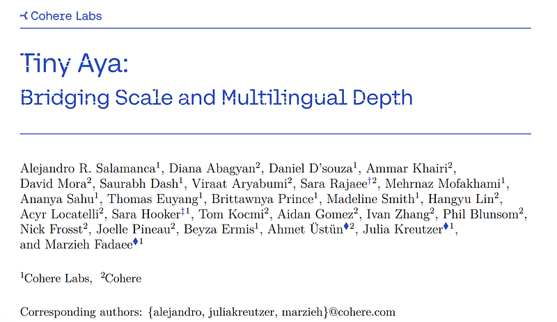 | Title card: Tiny Aya. |
|  | A vocabulary size of 262k is used. |
| 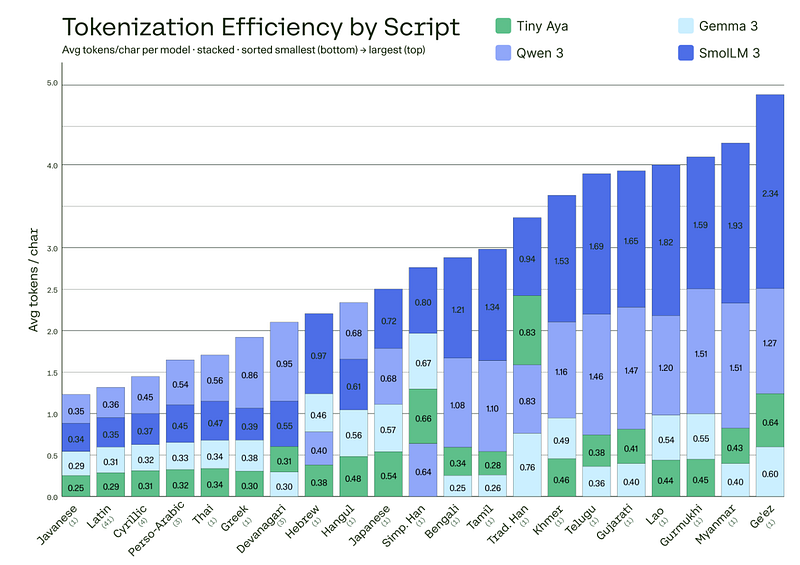 | Tokenization efficiency across scripts. |
| 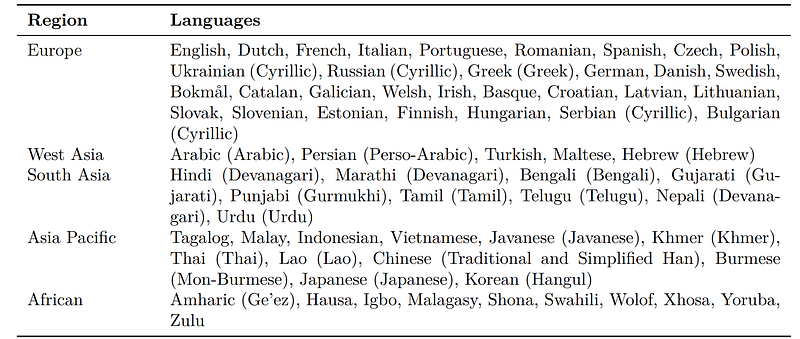 | Language coverage by region. |
| 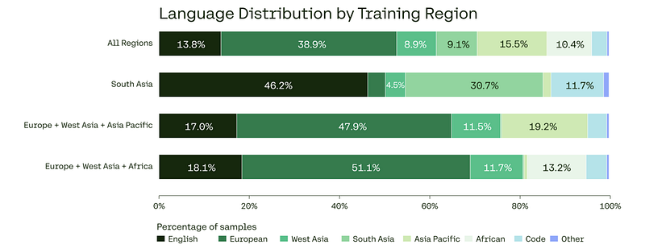 | Regional composition of posttraining data clusters. |
| 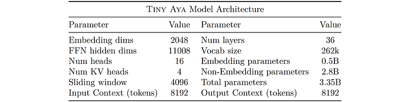 | Tiny Aya architecture summary. |
| 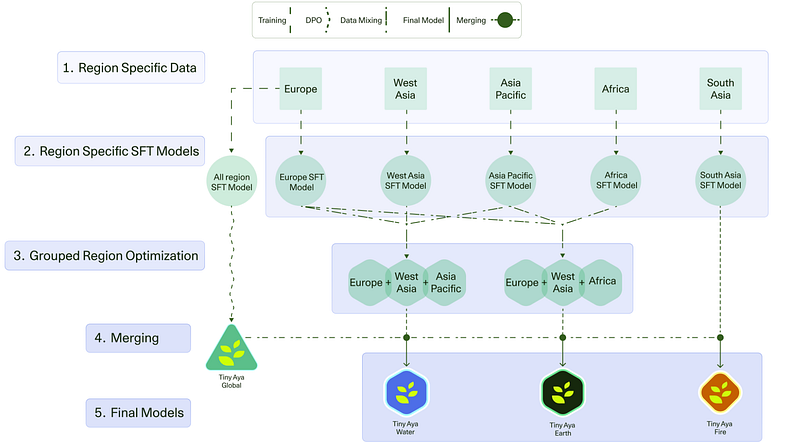 | Post Training pipeline and model construction. |
| 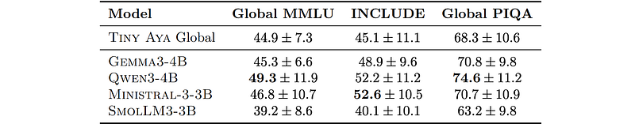 | Discriminative benchmark results. |
| 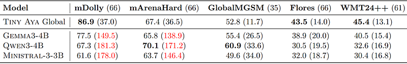 | Generative and translation benchmark summary. |
|  | Language confusion in open-ended generations and mathematical reasoning. |
| 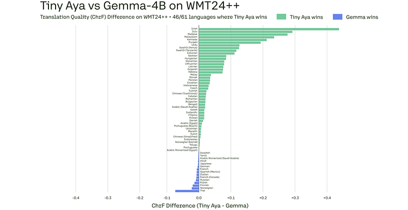 | Translation quality on WMT24++. |
| 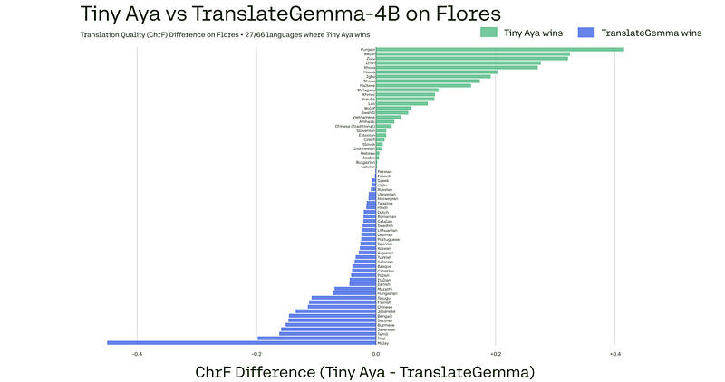 | Translation quality on focus languages from Flores. |
| 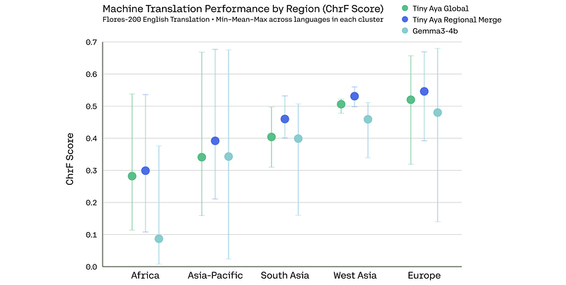 | Effect of regional specialization on translation. |
| 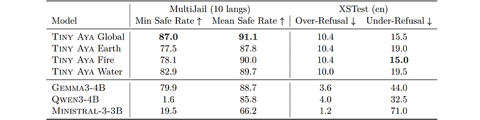 | Safety evaluation summary across benchmarks. |
| 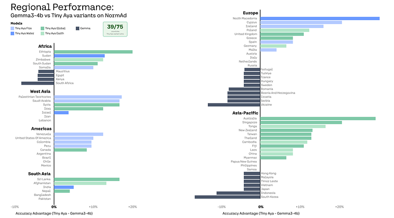 | Cultural norm reasoning across countries on NormAd. |
| 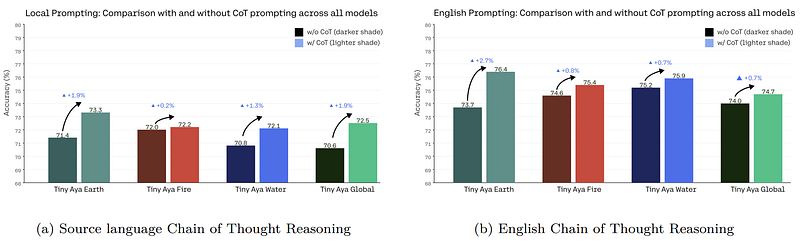 | Impact of test-time reasoning on model performance evaluated on NormAd. |
| 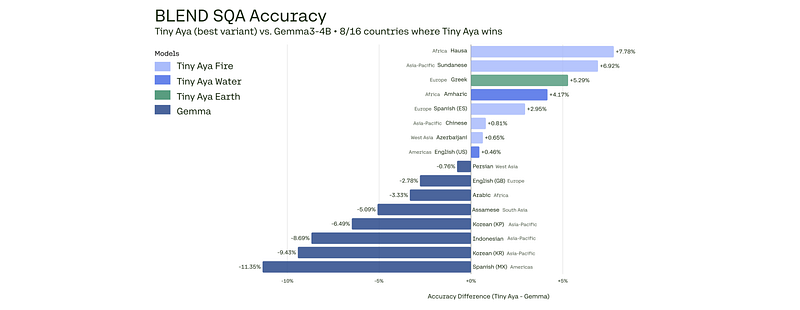 | Cultural commonsense on BLEnD SQA. |
| 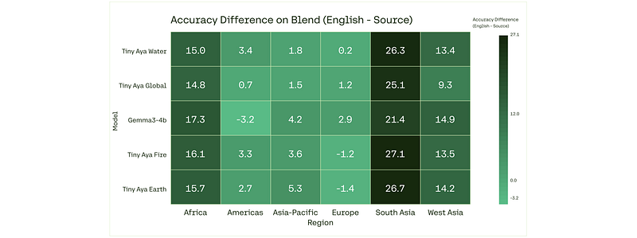 | Effect of prompt language on BLEnD accuracy. |
## Related

- [[Cohere Labs Launches Tiny Aya]] — official Cohere Labs blog announcement of the same model family.
- [[Papers Explained Corpus]]
- [[Multilingual Models]]
- [[Model Compression and Efficiency]]
- [[Large Language Models]]
- [[Synthetic Data]]
- [[Papers Explained 545 - MiniCheck]]
- [[Papers Explained 547 - Terminal-Bench]]

#summary #topic
