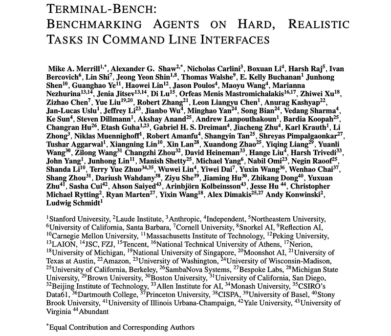
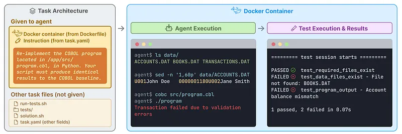
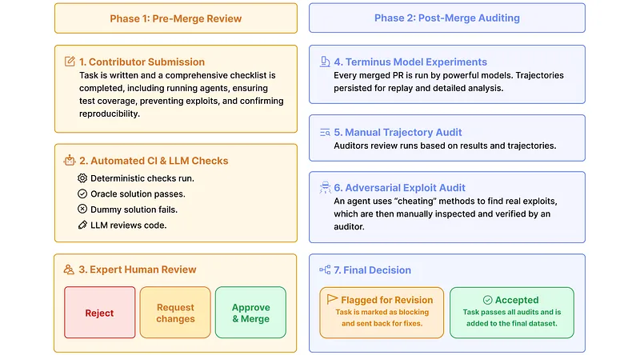
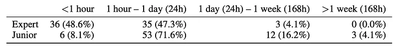
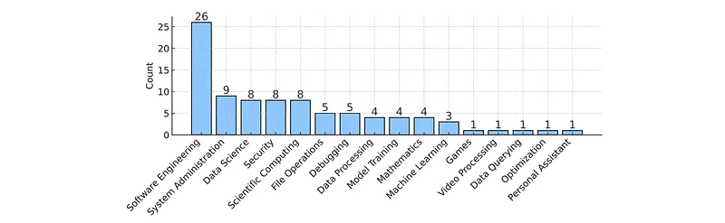
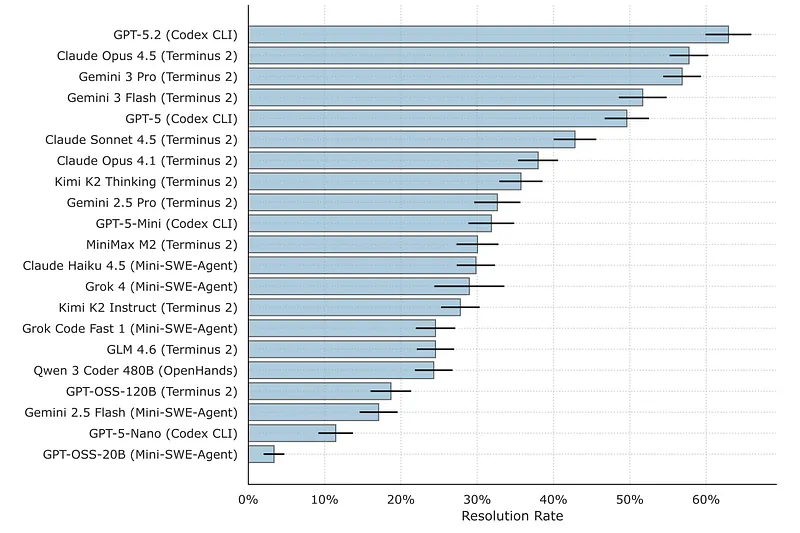
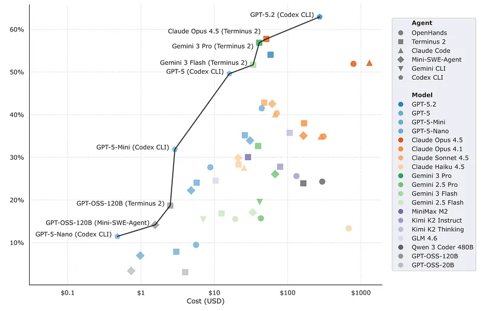
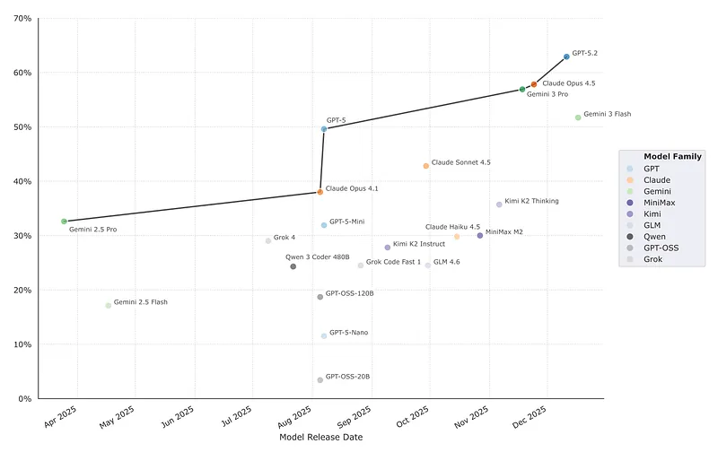

# Papers Explained 547 - Terminal-Bench

Terminal-Bench 2.0 is a carefully curated hard benchmark composed of 89 tasks in computer terminal environments. These tasks are inspired by problems from real workflows. Each task features a unique environment, a human-written solution, and comprehensive tests for verification.

This page ingests the source article into the wiki and connects it to [[Papers Explained Corpus]], [[Code Models]], [[Evaluation and Benchmarks]], [[Agentic AI]], [[Synthetic Data]], [[Model Compression and Efficiency]], [[Verifier-Bounded Learning]].

## Source Metadata

- Source file: `raw/2026-03-24_Papers-Explained-547--Terminal-Bench-67116f963f93.md`
- Source title: Papers Explained 547: Terminal-Bench
- Published: 2026-03-24
- Canonical: [https://medium.com/@ritvik19/papers-explained-547-terminal-bench-67116f963f93](https://medium.com/@ritvik19/papers-explained-547-terminal-bench-67116f963f93)

## Key Ideas

- Terminal-Bench 2.0 is a carefully curated hard benchmark composed of 89 tasks in computer terminal environments. These tasks are inspired by problems from real workflows.
- The dataset and evaluation harness is available [here](https://www.tbench.ai/).
- A Terminal-Bench task consists of an instruction, a Docker image, a set of tests, an example solution, and a time limit. The instruction describes the task that the agent must complete within the specified time limit in the Docker container.
- Terminal-Bench tasks are interactive. Once the instruction and Docker container are provided to an agent, it must explore and manipulate the environment by calling tools (e.g., editing files or running Bash commands) to complete the task.
- In order to design a diverse benchmark, tasks were crowd-sourced through open-source contributions. Ninety-three contributors created 229 tasks. Contributors assigned expert and junior-engineer completion time estimates to their tasks.

## Notes

Terminal-Bench 2.0 is a carefully curated hard benchmark composed of 89 tasks in computer terminal environments. These tasks are inspired by problems from real workflows. Each task features a unique environment, a human-written solution, and comprehensive tests for verification.

The dataset and evaluation harness is available [here](https://www.tbench.ai/).

## Terminal-Bench

### Task Formulation

*Figure: A Terminal-Bench task is composed of an instruction, a Dockerfile, a set of tests, and an oracle solution.*

A Terminal-Bench task consists of an instruction, a Docker image, a set of tests, an example solution, and a time limit. The instruction describes the task that the agent must complete within the specified time limit in the Docker container. The tests verify that all outcomes described in the instruction have been achieved by testing properties of the final container state; they do not test the agent’s commands or console output.

Terminal-Bench tasks are interactive. Once the instruction and Docker container are provided to an agent, it must explore and manipulate the environment by calling tools (e.g., editing files or running Bash commands) to complete the task. Tasks are specified using the Harbor task format and are run using the Harbor harness, which supports popular agents, including Claude Code, Codex CLI, OpenHands, and Mini-SWE-Agent, as well as Terminus 2, which was developed as a neutral testbed for comparing model performance.

### Dataset Construction

In order to design a diverse benchmark, tasks were crowd-sourced through open-source contributions. Ninety-three contributors created 229 tasks. Contributors assigned expert and junior-engineer completion time estimates to their tasks. Of those 229, 89 were selected for the Terminal-Bench 2.0 dataset based on the author’s difficulty assessment and a quality assessment by three experienced human reviewers.

[ APP H ]

### Verification

A task is considered verified if it meets three criteria:

- Specificity: The task instructions clearly define all acceptable end states, and the tests accurately capture these states.

- Solvability: A provided oracle solution script demonstrates a valid workflow that successfully passes all test cases.

- Integrity: The task design prevents agents from “cheating” by exploiting shortcuts not present in real-world scenarios.

*Figure: The task audit process.*

To ensure these criteria are met, a multi-stage verification process is employed:

- Automated Checks: An initial automated workflow verifies solvability and checks for common failure modes.

- Contributor Checklist: Contributors confirm they’ve manually reviewed their tasks for potential errors.

- Language Model Analysis: An automated tool using a language model identifies common mistakes in task specifications.

- Manual Review by Experienced Reviewers: A team of reviewers manually checks each task for quality standards.

- Agent Testing: Multiple language models and Terminus 2 are used to run each task. If an agent fails, the contributor determines if the failure is due to the agent’s limitations or a task issue. This process is repeated during a post-merge audit phase.

- Adversarial Exploit Detection: An agent designed to exploit design flaws is used to identify vulnerabilities that could allow agents to cheat.

- Final Audit: Two additional auditors manually review tasks to determine their inclusion in Terminal-Bench 2.0.

### Composition

*Figure: Distribution of task completion times for expert and junior engineers across all tasks in Terminal-Bench 2.0, as estimated by the task authors.*

*Figure: Tasks per category in Terminal-Bench 2.0.*

## Experiment Setup

A total of 32,155 trials are conducted, with at least five runs per agent-model combination across all supported models.

To mitigate biases inherent in many agent scaffolds, a simple scaffold called Terminus 2 is introduced. Terminus 2 utilizes a single tool, a headless terminal, and relies solely on Bash commands for task completion.

Three popular command-line agents (Claude Code, Codex CLI, and Gemini CLI) and three open-source software engineering agents (OpenHands, Mini-SWE-Agent, and Terminus 2) are evaluated.

Both closed-source (e.g., GPT-5.2, Claude Opus 4.5) and open-weight models (e.g., GPT OSS 120B, Llama 4 Maverick) are included, representing a wide range of capabilities.

Harbor, a framework for building and running agent evaluations at scale, is employed. Terminal-Bench tasks are implemented in Harbor’s task format and executed using its harness. Daytona container sandbox provider is utilized, running between 32 and 100 containers in parallel.

## Results

Overall model rankings and agent/model effects

*Figure: Task resolution rate per model on Terminal-Bench 2.0.*

- Codex CLI + GPT-5.2 achieves the highest average resolution rate (63%), followed by Terminus 2 + Claude Opus 4.5 (58%) and Ter-6 minus 2 + Gemini 3 Pro (57%).

- Proprietary models with various agents occupy the top 13 positions; best open-weight systems (Terminus 2 and Kimi K2 Thinking) resolve 36% of tasks on average.

- Switching from GPT-5-Nano to GPT-5.2 for Codex CLI increases resolution rate by 52%; pairing Gemini-2.5-Pro with Terminus 2 instead of OpenHands yields a 17% gain, indicating model choice is generally more important than agent scaffold for performance.

- Some tasks remain unsolved by all model–agent combinations.

Cost, interaction patterns, and efficiency

*Figure: The Pareto frontier of agent performance showing the tradeoff between performance and cost (log scale) on Terminal-Bench 2.0.*

- Running Terminal-Bench 2.0 ranges from about $1 to $100 per full run depending on model pricing.

- Most agents work on tasks for under 20 minutes, but some runs extend to ~2 hours, with hundreds of API calls and up to ~100M tokens on a single task, illustrating long-horizon task characteristics.

- There is essentially no correlation between average number of turns per trial and success rate, nor between higher token counts and better performance.

Performance trends over time

*Figure: Performance of each model with its best agent harness as a function of release date.*

- Newer model releases show clear performance improvements on Terminal-Bench 2.0.

- In roughly eight months (from Gemini 2.5 Pro to GPT-5.2), state-of-the-art performance nearly doubled.

- Authors expect that, if this trend continues, models may soon reliably and autonomously complete most well-defined terminal tasks, potentially saturating Terminal-Bench 2.0 within a year.

- Plans include ongoing evaluation at tbench.ai and releasing new, more challenging task sets.

## Paper

Terminal-Bench: Benchmarking Agents on Hard, Realistic Tasks in Command Line Interfaces [2601.11868](https://arxiv.org/abs/2601.11868)

## Figures

Figures from the Medium HTML export (`raw/2026-03-24_Papers-Explained-547--Terminal-Bench-67116f963f93.md`); local copies under `wiki/assets/papers-explained-547-terminal-bench/` when download succeeded.

| Figure | Caption |
|--------|---------|
|  | Title card: Terminal-Bench. |
|  | A Terminal-Bench task is composed of an instruction, a Dockerfile, a set of tests, and an oracle solution. |
|  | The task audit process. |
|  | Distribution of task completion times for expert and junior engineers across all tasks in Terminal-Bench 2.0, as estimated by the task authors. |
|  | Tasks per category in Terminal-Bench 2.0. |
|  | Task resolution rate per model on Terminal-Bench 2.0. |
|  | The Pareto frontier of agent performance showing the tradeoff between performance and cost (log scale) on Terminal-Bench 2.0. |
|  | Performance of each model with its best agent harness as a function of release date. |
## Related

- [[Papers Explained Corpus]]
- [[Code Models]]
- [[Evaluation and Benchmarks]]
- [[Agentic AI]]
- [[Agent Harness]]
- [[Synthetic Data]]
- [[Model Compression and Efficiency]]
- [[Verifier-Bounded Learning]]
- [[Continually Improving Our Agent Harness]]
- [[Introducing Composer 1.5]] — Cursor reports Composer 1.5 scores on Terminal-Bench 2.0 using the official Harbor harness (2 iterations averaged).
- [[Papers Explained 546 - Tiny Aya]]
- [[Papers Explained 548 - CHIMERA]]

#summary #topic
