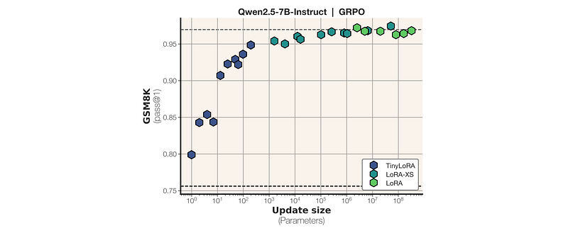
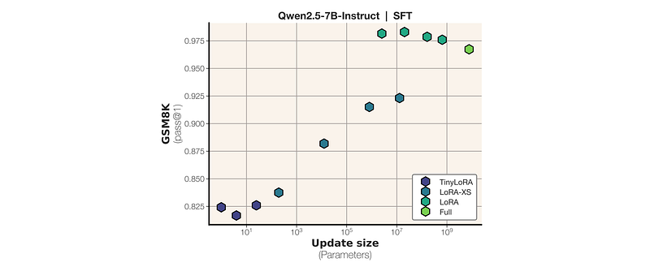
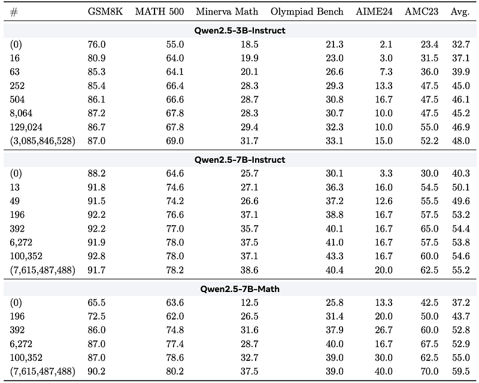
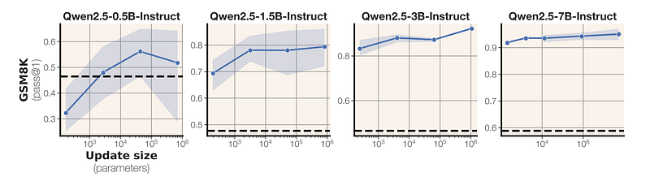
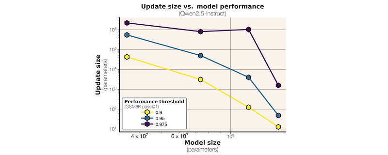
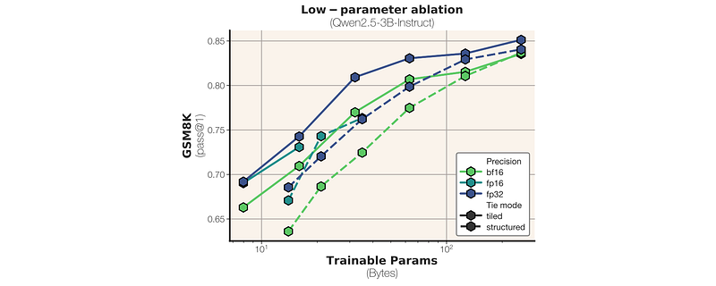

# Papers Explained 549 - TinyLoRA

TinyLoRA is an extra low-rank variant of LoRA that scales adapter size down arbitrarily, even to a single trained parameter, enabling extremely parameter-efficient reinforcement learning–based reasoning finetuning.

This page ingests the source article into the wiki and connects it to [[Papers Explained Corpus]], [[Model Compression and Efficiency]], [[Reinforcement Learning Topic]], [[Reasoning Models]], [[Synthetic Data]], [[Supervised Fine-Tuning]], [[Reinforcement Learning]].

## Source Metadata

- Source file: `raw/2026-03-27_Papers-Explained-549--TinyLoRA-e70da95c5d44.html`
- Source title: Papers Explained 549: TinyLoRA
- Published: 2026-03-27
- Canonical: [https://medium.com/@ritvik19/papers-explained-449-tinylora-e70da95c5d44](https://medium.com/@ritvik19/papers-explained-449-tinylora-e70da95c5d44)

## Key Ideas

- SFT: Trains on a dataset (X, Y) sampled from a distribution where the expected reward is high. The model learns by predicting the next token in a sequence (y<t) given the input (x) and the preceding tokens (y<t).
- RL: Trains on a batch of continuations (X, (Y, R)k) sampled from a distribution where Y are the model’s outputs and R are the rewards. The model learns by maximizing the expected reward (J(θ)).
- While RL presents more data, the information content of SFT data is generally considered higher. This is because SFT samples from a distribution where the expected reward is high, implying a stronger signal for learning.
- RL: The reward signal (R) is cleanly separated from noise. Reward-relevant features correlate with R, while irrelevant features do not. Resampling in RL amplifies this separation by accumulating correlated signal and canceling uncorrelated variation.
- SFT: The training signal in SFT is a demonstration (y) without reward annotations. The model cannot distinguish between task-relevant and irrelevant features of y.

## Notes

TinyLoRA is an extra low-rank variant of LoRA that scales adapter size down arbitrarily, even to a single trained parameter, enabling extremely parameter-efficient reinforcement learning–based reasoning finetuning.

## Update Capacity of SFT and RL

Training Data and Information Content:

- SFT: Trains on a dataset (X, Y) sampled from a distribution where the expected reward is high. The model learns by predicting the next token in a sequence (y<t) given the input (x) and the preceding tokens (y<t).

- RL: Trains on a batch of continuations (X, (Y, R)k) sampled from a distribution where Y are the model’s outputs and R are the rewards. The model learns by maximizing the expected reward (J(θ)).

While RL presents more data, the information content of SFT data is generally considered higher. This is because SFT samples from a distribution where the expected reward is high, implying a stronger signal for learning. In contrast, RL data contains noise as the continuations (Y) lack reward annotations, making it difficult to discern useful information.

Signal Separation:

- RL: The reward signal (R) is cleanly separated from noise. Reward-relevant features correlate with R, while irrelevant features do not. Resampling in RL amplifies this separation by accumulating correlated signal and canceling uncorrelated variation.

- SFT: The training signal in SFT is a demonstration (y) without reward annotations. The model cannot distinguish between task-relevant and irrelevant features of y. This lack of signal separation forces SFT to absorb all information, including noise, potentially leading to inefficiency.

Hypothesis:

The authors hypothesize that SFT requires more capacity in low-parameter regimes because it must absorb a large amount of information, only a fraction of which is relevant to task performance. RL, on the other hand, receives a sparser, cleaner signal, allowing it to learn effectively with less capacity.

## Parameter-Efficient Finetuning with TinyLoRA

Low-rank adaptation, or LoRA, adapts a frozen linear layer W ∈Rd×k with a low-rank update:

W′ = W + AB

where A∈Rd×r and B ∈Rr×k are trainable, and W remains frozen.

The number of trainable parameters scales as O(dr) per module. Applying LoRA to m modules across n layers yields O(nmdr) total parameters typically millions for billion-parameter models.

LoRA-XS reduces the per-module parameter count from O(dr) to O(r2):

W′ = W + UΣRV⊤

where U ∈Rd×r, Σ ∈Rr×r, and V ∈Rk×r are from the truncated SVD of W, and only R∈Rr×r is trainable.

This can be viewed as learning to recombine the dominant singular directions of W, and outperforms randomly-initialized LoRA in practice.

Even with r= 1, LoRA-XS requires at least one parameter per adapted module. This is reduced by replacing the r×r matrix R with a low-dimensional trainable vector v ∈Ru projected through a fixed random tensor P ∈Ru×r×r. The update rule for TinyLoRA is:

where U,Σ,V are from the truncated SVD of W, and Pi ∈Rr×r are fixed random matrices. Each module trains only u parameters. With weight tying across m modules in n layers, the total trainable parameters scale as O(nmu/ntie), reducing to a single parameter when all modules share weights.

Prior work showed that LoRA performs best when applied to both MLP and attention modules. In a typical transformer architecture such as LLaMA-3, LoRA is applied seven times per block: to the query, key, value, and output projections in self-attention, and to the up, down, and gate projections in the MLP. For a model like LLaMA-3 70B with 80 layers, even the minimal case of u = 1 (or r = 1 for LoRA-XS) requires 80 ×7 = 560 trainable parameters. We reduce parameter count further by sharing the trainable vector v across modules. We define the weight tying factor ntie as the number of modules sharing a single v, yielding nmu/ntie total trainable parameters for n layers and m modules per layer. With full weight tying (ntie = nm), all modules share a single v, reducing the total to just u parameters as few as one.

*Figure: Parameter usage comparison per-layer with m adapted modules per layer, model width d, rank r, and TinyLoRA projection dimension u.*

## Experiment Setup

Baselines: Full finetuning, LoRA, LoRA-XS, and TinyLoRA, with varying rank and layer sharing configurations. RL experiments utilize exact-match reward.

The methods are evaluated on two datasets: GSM8K (7,500 math word problems) and the more challenging MATH training set.

Two training approaches are explored: supervised finetuning (SFT) and reinforcement learning (RL) using Group Relative Policy Optimization (GRPO). Instruction-tuned language models from the Llama-3 and Qwen-2.5 families are used.

Training specifics differ for each dataset:

- GSM8K: No KL penalty, three epochs, 4 samples per problem, batch size 64, maximum generation length of 4096.

- MATH: Follows SimpleRL settings, including a larger dataset with difficulty-level partitioning, maximum prompt and response lengths, KL coefficient, temperature, batch size, and generations per response.

Evaluation is done on the GSM8K validation set and additional datasets like MATH500, Minerva, GAOKAO, OlympiadBench, CollegeMath, AIME 24, and AMC23, representing varying difficulty levels.

TinyLoRA implementation within the open-source VERL framework and vLLM is achieved by merging model weights for inference and using the true LoRA model only for the final forward pass, mitigating numerical mismatch through truncated importance sampling.

## Results

Efficiency of TinyLoRA on GSM8K

- Performance increases smoothly as the number of trained parameters grows from TinyLoRA to LoRA-XS to LoRA.

- 95% of the net performance improvement on GSM8K can be recovered with only 120 trained parameters.

- Training just a single parameter with TinyLoRA yields a 4% absolute performance increase over baseline.

Qwen vs. LLAMA and rank scaling

- For GSM8K, Qwen is more parameter-efficient than LLAMA at every scale:

- Qwen3–8B achieves 94.7% accuracy with only 13 trained parameters.

- With a single trained parameter, Qwen reaches ~82% (≈5% above baseline).

- Even with LoRA-XS (r=1), the maximum number of parameters is bounded by the number of linear layers, but Qwen still learns effectively with only a few hundred parameters.

- LLAMA is less responsive in the low-parameter regime, reaching only 85% with 1KB updates (≈500 bf16 parameters), and shows almost no improvement when training fewer than five parameters.

- Performance increases monotonically from r=1 to r=128 (update sizes 1KB to 8MB), with diminishing per-parameter gains but continued benefit up to ~2MB of updates.

RL vs. SFT efficiency

- RL is substantially more efficient than SFT at low parameter counts:

- At 13 parameters, RL reaches 91% (15% absolute improvement from a 76% baseline), while SFT reaches 83%.

- At 120 parameters, RL reaches 95%, while SFT reaches 84%.

- SFT shows a less smooth transition between LoRA-XS and LoRA, and its off-policy nature (training on answers rather than model outputs) may affect dynamics.

*Figure: Performance on math reasoning using Qwen2.5 models.*

Low-parameter RL on MATH

- Larger parameter counts generally achieve higher rewards and produce longer responses, but even very small updates (as few as 16 parameters) obtain non-trivial rewards.

- KL divergence between training and inference models is negligible, indicating that merging LoRA weights at each training step works as intended (no significant train–inference mismatch).

*Figure: TinyLoRA performance (on GSM8K GRPO).*

LoRA vs. LoRA-XS across backbone sizes

- LoRA-XS clearly outperforms standard LoRA on the smallest model, aligning with prior work.

- As model size increases, LoRA-XS’s advantage diminishes, and performance scales more directly with the number of trained parameters (likely due to the increased number of LoRA modules in larger models).

- Low-parameter adaptation generally works better on larger models; smaller adapters in large models approach the performance ceiling more closely.

Model size vs. programmability

- Across the Qwen2.5-Instruct family, as model size grows, fewer absolute parameters are needed to reach 95% of full-finetuning performance.

- This suggests that extremely large (trillion-parameter) models may be trainable for many tasks using only a handful of trainable parameters.

Bit-constrained regime and sharing strategies

- Tiled sharing outperforms structured sharing; sharing parameters across modules of the same type (e.g., query projections) provides no observed benefit.

- With all-layer sharing and float16 precision, Qwen still reaches ~70% on GSM8K, an absolute improvement of >10% over baseline, despite very small byte budgets.

- fp32 precision outperforms bf16 and float16 even after accounting for its larger (2×) byte cost, indicating that higher precision can be more effective than simply increasing parameter count at lower precision.

## Paper

Learning to Reason in 13 Parameters [2602.04118](https://arxiv.org/abs/2602.04118)

## Figures

Figures from the Medium HTML export (`raw/2026-03-27_Papers-Explained-549--TinyLoRA-e70da95c5d44.html`); local copies under `wiki/assets/papers-explained-549-tinylora/` when download succeeded.

| Figure | Caption |
|--------|---------|
|  | Title card: TinyLoRA. |
|  | Training Data and Information Content. |
|  | Training Data and Information Content. |
|  | Even with r= 1, LoRA-XS requires at least one parameter per adapted module. |
|  | Parameter usage comparison per-layer with m adapted modules per layer, model width d, rank r, and TinyLoRA projection dimension u. |
|  | Training specifics differ for each dataset:: Efficiency of TinyLoRA on GSM8K. |
|  | Qwen vs. |
|  | Performance on math reasoning using Qwen2.5 models. |
|  | TinyLoRA performance (on GSM8K GRPO). |
|  | LoRA vs. |
|  | Model size vs. |
## Related

- [[Papers Explained Corpus]]
- [[Model Compression and Efficiency]]
- [[Reinforcement Learning Topic]]
- [[Reasoning Models]]
- [[Synthetic Data]]
- [[Supervised Fine-Tuning]]
- [[Reinforcement Learning]]
- [[Papers Explained 548 - CHIMERA]]
- [[Papers Explained 550 - PPLX Embedding]]

#summary #topic
