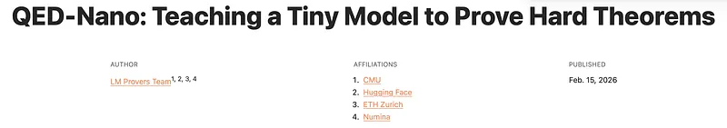
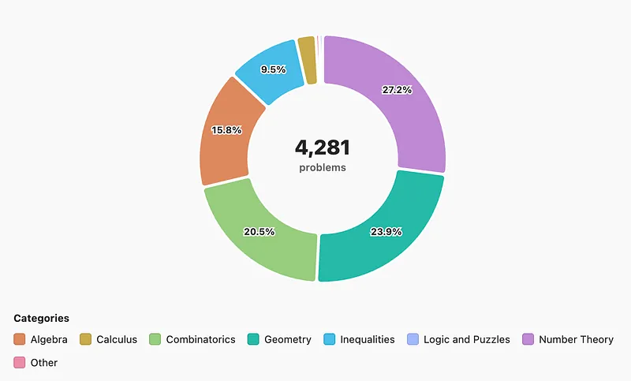
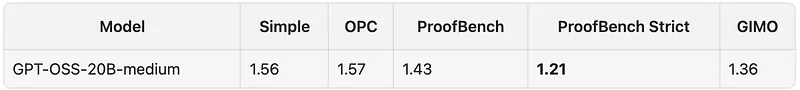
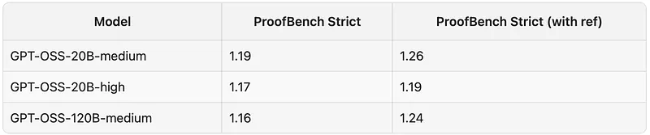
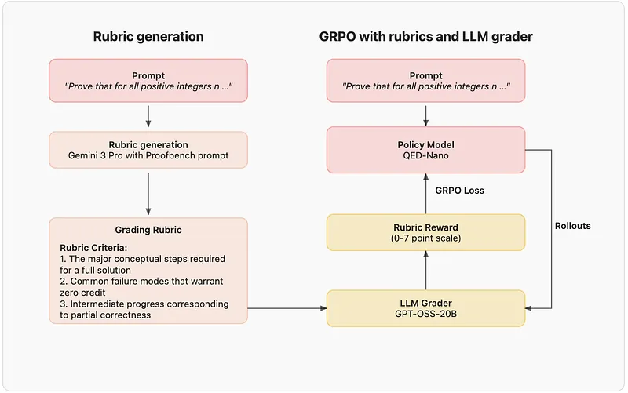
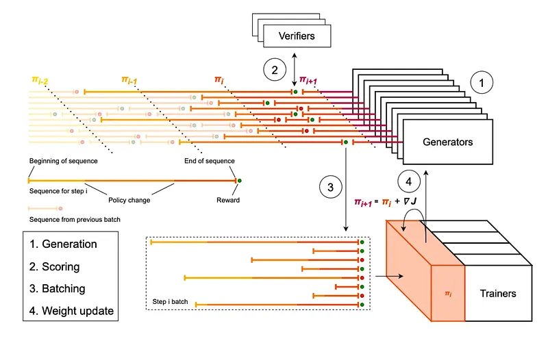
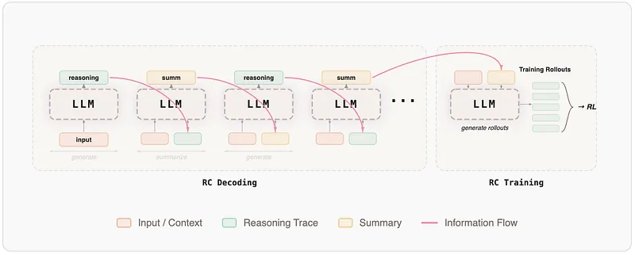
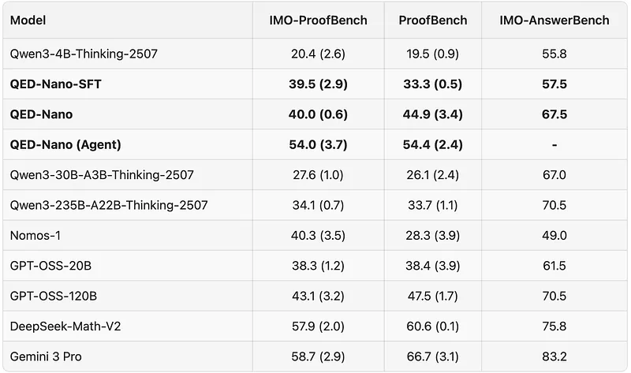
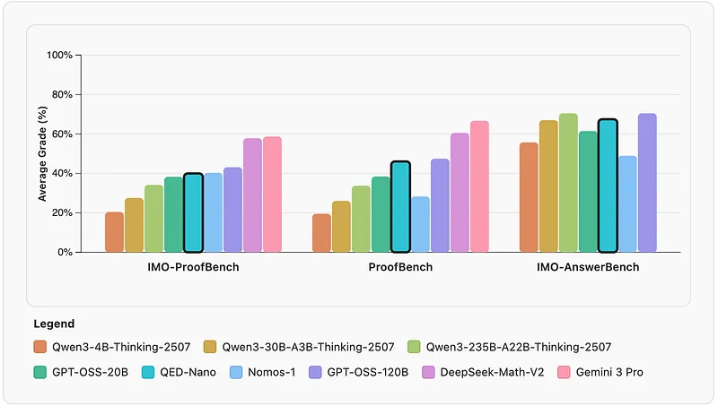

# Papers Explained 551 - QED Nano

QED-Nano is a compact 4B model post-trained to write Olympiad-level mathematical proofs and operates entirely in natural language, with no reliance on Lean or external tools. The recipe has three stages:

This page ingests the source article into the wiki and connects it to [[Papers Explained Corpus]], [[Reasoning Models]], [[Model Compression and Efficiency]], [[Reinforcement Learning Topic]], [[Supervised Fine-Tuning]], [[Reinforcement Learning]], [[Verifier-Bounded Learning]], [[Model Distillation]].

## Source Metadata

- Source file: `raw/2026-03-30_Papers-Explained-551--QED-Nano-dd7f19dec9d7.md`
- Source title: Papers Explained 551: QED Nano
- Published: 2026-03-30
- Canonical: [https://medium.com/@ritvik19/papers-explained-551-qed-nano-dd7f19dec9d7](https://medium.com/@ritvik19/papers-explained-551-qed-nano-dd7f19dec9d7)

## Key Ideas

- Supervised fine-tuning via distillation from DeepSeek-Math-V2
- Reinforcement learning with dense, rubric-based rewards
- Training with a reasoning cache. This cache decomposes long proofs into iterative summarize-and-refine cycles so the model is capable of continual improvement at test time.
- Upon deployment, QED-Nano is paired with agentic scaffolds that scale test-time compute to more than 1.5M tokens per problem, combining horizon extension with self-verification.
- The models and data are available at [HuggingFace](https://huggingface.co/collections/lm-provers/qed-nano/).

## Notes

QED-Nano is a compact 4B model post-trained to write Olympiad-level mathematical proofs and operates entirely in natural language, with no reliance on Lean or external tools. The recipe has three stages:

- Supervised fine-tuning via distillation from DeepSeek-Math-V2

- Reinforcement learning with dense, rubric-based rewards

- Training with a reasoning cache. This cache decomposes long proofs into iterative summarize-and-refine cycles so the model is capable of continual improvement at test time.

Upon deployment, QED-Nano is paired with agentic scaffolds that scale test-time compute to more than 1.5M tokens per problem, combining horizon extension with self-verification.

The models and data are available at [HuggingFace](https://huggingface.co/collections/lm-provers/qed-nano/).

## Data Curation

Training models to generate rigorous Olympiad-level proofs requires carefully curated prompts that are both challenging and clean, with clear criteria for evaluating correctness and mathematical rigor. Therefore, rather than relying on large volumes of loosely curated problem-solution pairs, a compact, high-quality corpus that mirrors the structure and difficulty of competition proofs is constructed.

This corpus begins with two public datasets: AI-MO/aops, which contains problems sourced from the Art of Problem Solving forums, and AI-MO/olympiads, which aggregates official solutions from a wide range of national and international math competitions (e.g., IMO, USAMO, RMM, etc.). While these sources provide coverage, they contain substantial noise, incomplete reasoning, formatting artifacts, and various other issues that prevent them from being seamlessly consumed in any post-training pipeline.

A multi-stage filtering procedure is applied to improve the data quality:

- Problems involving diagrams or images are removed, since models operate purely in text.

- Trivial or ill-posed entries are discarded, including problems where the answer appears directly in the statement, solutions that are implausibly short or purely computational, and materials drawn from easier contests such as AMC or routine exercises. To further enhance solution quality, an automated filtering pass using GPT-5-Nano is done.

- Finally, to avoid any contamination with evaluation benchmarks, problems from 2025 competitions are excluded and a fuzzy string matching algorithm is used to weed out any problems similar to those in the evaluation benchmarks.

*Figure: Problem Category Distribution*

To provide accurate reward signals for training via RL, detailed grading schemes are constructed for each problem. This approach follows the grading framework introduced in ProofBench, which uses Gemini 3 Pro with a custom prompt to generate rubrics that score model solutions from 0 to 7. Each rubric specifies:

- Detailed intermediate checkpoints corresponding to partial correctness

- Common failure modes that warrant zero credit, and

- Specific points where additional deductions are necessary.

As a result, reinforcement learning receives dense, informative feedback instead of sparse success signals, encouraging gradual improvement in long-form reasoning rather than binary outcome optimization.

Each problem is annotated with a difficulty estimate determined by the average performance of the base model (Qwen3–4B-Thinking), computed over 128 parallel attempts, graded by GPT-OSS-20B. These annotations are used to develop a difficulty-based learning curriculum during RL training.

## Training Recipe

The core RL setup combines an efficient asynchronous off-policy implementation with rubric-based grading to provide reward signals for policy learning. A naive approach that trains RL directly on such long chains of thought is challenging both infrastructure-wise and from the perspective of variance control in long-horizon updates. Instead, training occurs at moderate output lengths while explicitly optimizing for behavior that benefits from much larger test-time budgets.

To achieve this, the RL recipe is modified to incorporate an algorithmic extension based on the recently introduced Reasoning Cache (RC) approach. During training, the model uses an iterative decoding process that alternates between summarizing its reasoning and continuing to reason conditioned on the generated summary. Incorporating this into training and optimizing rewards under this scaffold allows for the optimization of behavior that transfers to other test-time scaffolds used during deployment.

After establishing this post-training recipe on top of the Qwen3–4B base model, the same framework is applied to a stronger initialization that is able to write proofs of higher quality, obtained through offline distillation via supervised fine-tuning. Specifically, DeepSeek-Math-V2 (685B parameters) is used to generate a compact, high-quality set of proof-style examples for supervised mid-training before running RL with RC.

### Grading Protocol

The ideal reward signal should accurately reflect human judgment while remaining computationally efficient for large-scale RL training. To identify an effective configuration, a series of experiments were conducted examining grader model choice, system instructions, and reasoning budget.

Two benchmarks are used to evaluate the reward signal:

- MathArena Subset: Aggregated human annotations from 438 solutions across 22 problems.

- Training Distribution: Randomly sampled 60 problems from the training corpus and candidate solutions generated from two different models (4B and 30B).

Gemini 3 Pro, instructed with a prompt adapted from the ProofBench paper, is used as the ground truth reference for grading. A problem-normalized advantage score is used to compare the candidate grader’s performance to the reference. This metric focuses on relative performance rather than absolute scores.

Five different prompts emphasizing various evaluation ideologies are tested.

*Figure: Results on the MathArena grading benchmark. Lower is better.*

GPT-OSS-20B with medium reasoning performs best when paired with the strict ProofBench prompt, which prioritizes adherence to the rubric.

The choice of grader models was compared and the impact of including a reference proof alongside the marking scheme was evaluated.

*Figure: Results on our in-distribution grading benchmark. Lower is better.*

Performance differences between models were observed to be minimal. GPT-OSS-20B with medium reasoning performed on par with the alternatives while being significantly cheaper and faster, leading to its adoption as the grader for training. Including a reference solution slightly degraded performance, resulting in its exclusion from the final grader configuration.

### Outcome-Reward RL with Long Response Lengths

*Figure: An illustration of thepipeline for outcome-reward RL training of QED-Nano*

A prompt set is constructed such that the base model’s pass@1 scores follow a unimodal, heavy-tailed distribution with a peak near difficult problems and a decreasing probability of sampling substantially easier ones. All very easy problems on which the base model can attain a pass@1 score higher than 0.7 are completely removed, as are the extremely hard problems. GRPO is used as the base RL algorithm and PipelineRL is used to implement an asynchronous, streaming variant of this algorithm.

*Figure: An illustration of an asynchronous, streaming variant of GRPO that is employed in the PipelineRL implementation.*

This implementation performs off-policy updates, with a maximum lag of 5 gradient steps between the current policy and the reference policy. A larger number of rollouts n per problem improves performance when sufficient training epochs are run. Based on initial experiments with n = 4, 8, 16, n = 16 was selected because the fraction of problems on which no successful rollout is sampled is merely 2–3% at n = 16, which ensures a stable training signal. The maximum response length is set to 50,000 tokens for RL training, since 95% of responses from the base model terminate within this limit.

### RL for Continual Improvement at Test Time via Reasoning Cache

*Figure: Illustration of the RC algorithm.*

Instead of training on extremely long monolithic responses, an iterative decoding procedure during training is adopted in which the model produces short reasoning segments that can be optimized with standard RL, while still encouraging improvements in long-horizon performance. This idea is implemented using the Reasoning Cache (RC) framework. RC decomposes reasoning into multi-step refinement cycles. At each iteration, the model generates a partial reasoning trace, summarizes its progress into a compact short textual “state representation”, and conditions the next rollout on both the original problem and this summary. Each subsequent summarization step updates the previous summary with any information added in the current reasoning step. Then, the model is trained with RL to improve its summary-conditioned generation capabilities. This structure allows the model to effectively explore reasoning horizons equivalent to hundreds of thousands of tokens while maintaining smaller training rollout lengths.

RL updates are applied across these RC states, training the model to improve conditioned on the summary.

While the same model is used for both reasoning and summarization at test time, during training, a thinking model for summarization is avoided to speed up the training process. Instead, a frozen snapshot of the Qwen3–4B-Instruct-2507 model is used for summarization.

### Initialization via Supervised Fine-Tuning

The SFT recipe fine-tunes the base model on problems paired with proof solutions generated by deepseek-ai/DeepSeek-Math-V2, a 685B model fine-tuned specifically for Olympiad math (with a complex training procedure that involves meta-verifiers). This teacher’s reasoning traces are distilled into a compact dataset of ≈ 7.5k sampled responses suitable for fine-tuning the 4B base model.

The final recipe consists of an initial SFT step to imbue the model with the ability to write high-quality proofs. Then, rubric-based RL training with the reasoning cache approach is performed to make the model capable of effectively thinking longer when used with test-time scaffolds. Finally, the trained model is deployed with a test-time scaffold.

## Evaluation

*Figure: Comparison of QED-Nano (4B) with leading open- and closed-source models.*

*Figure: Performance of QED-Nano (4B) within just a single response turn of 50,000 tokens.*

- QED-Nano, achieves a 40% score on IMO-ProofBench, 45% on ProofBench, and 68% on IMO-AnswerBench, far better than any other 4B model.

- QED-Nano outperforms much larger open models such as Nomos-1 (30B) and Qwen3–235B-A22B-Thinking.

- When allowed to reason for up to 1.5 million tokens per problem by pairing the model with a test-time scaffold, QED-Nano (Agent) achieves 54% on IMO-ProofBench and 54% on ProofBench, attaining a strong cost-performance tradeoff on challenging Olympiad-level problems, very close to Gemini 3 Pro.

## Paper

[QED-Nano: Teaching a Tiny Model to Prove Hard Theorems](https://huggingface.co/spaces/lm-provers/qed-nano-blogpost)

## Figures

Figures from the Medium HTML export (`raw/2026-03-30_Papers-Explained-551--QED-Nano-dd7f19dec9d7.md`); local copies under `wiki/assets/papers-explained-551-qed-nano/` when download succeeded.

| Figure | Caption |
|--------|---------|
|  | Title card: QED Nano. |
|  | Problem Category Distribution. |
|  | Results on the MathArena grading benchmark. Lower is better. |
|  | Results on our in-distribution grading benchmark. Lower is better. |
|  | An illustration of thepipeline for outcome-reward RL training of QED-Nano. |
|  | An illustration of an asynchronous, streaming variant of GRPO that is employed in the PipelineRL implementation. |
|  | Illustration of the RC algorithm. |
|  | Comparison of QED-Nano (4B) with leading open- and closed-source models. |
|  | Performance of QED-Nano (4B) within just a single response turn of 50,000 tokens. |
## Related

- [[Papers Explained Corpus]]
- [[Reasoning Models]]
- [[Model Compression and Efficiency]]
- [[Reinforcement Learning Topic]]
- [[Supervised Fine-Tuning]]
- [[Reinforcement Learning]]
- [[Verifier-Bounded Learning]]
- [[Model Distillation]]
- [[Papers Explained 550 - PPLX Embedding]]
- [[Papers Explained 552 - Nemotron Cascade 2]]

#summary #topic
