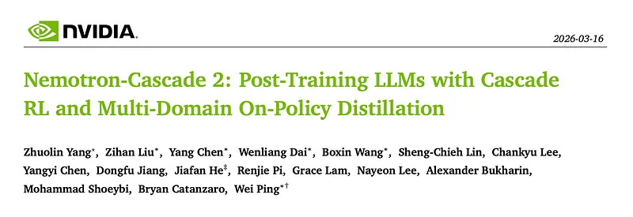
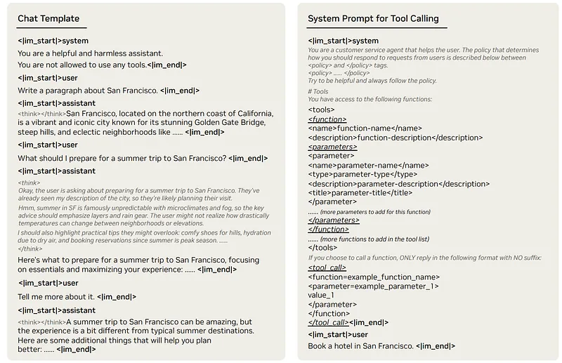
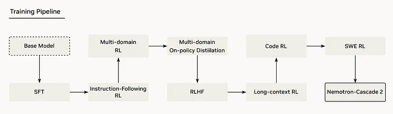
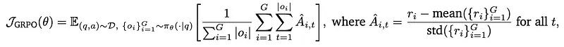
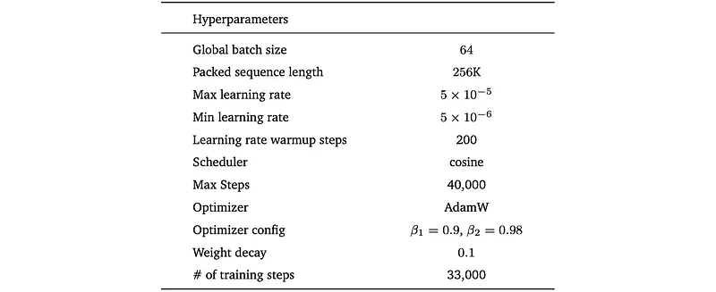
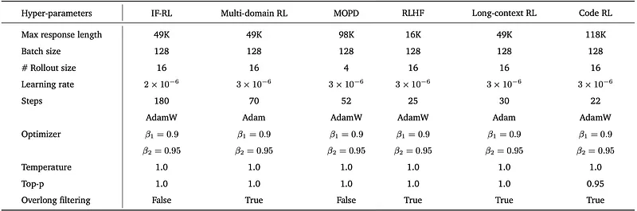
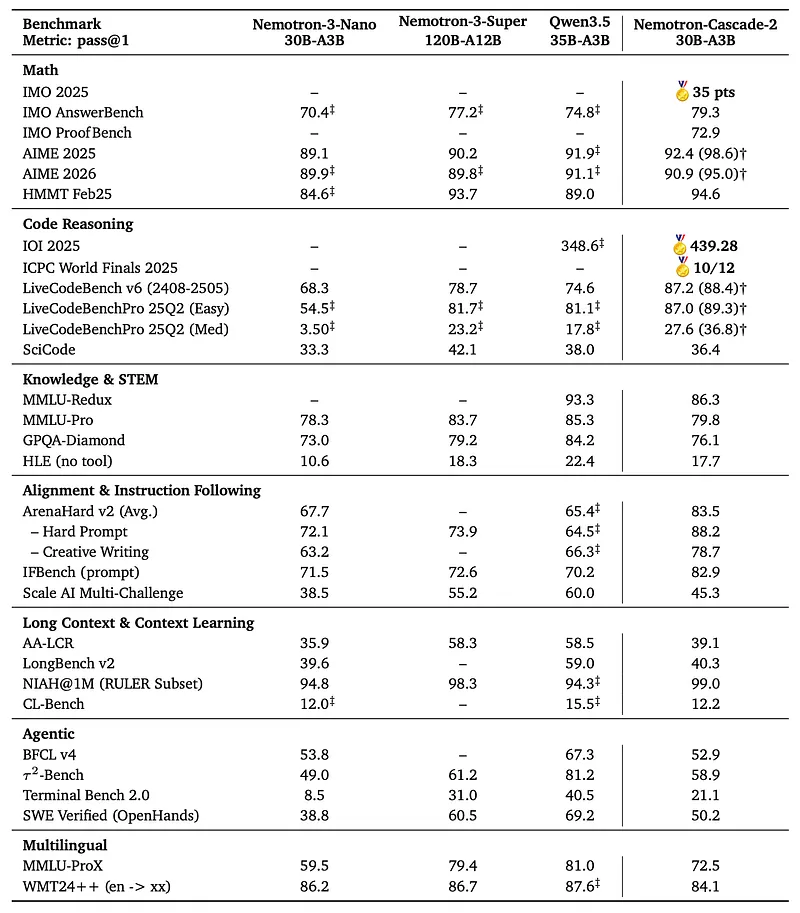
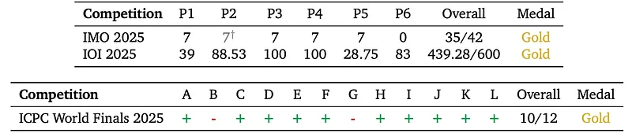

# Papers Explained 552 - Nemotron Cascade 2

Nemotron-Cascade 2 is an open 30B MoE model with 3B activated parameters that delivers mathematical and coding reasoning performance approaches that of frontier open models.

This page ingests the source article into the wiki and connects it to [[Papers Explained Corpus]], [[Large Language Models]], [[Reasoning Models]], [[Agentic AI]], [[Code Models]], [[Mixture of Experts]], [[Supervised Fine-Tuning]], [[On-Policy Distillation]], [[Model Distillation]].

## Source Metadata

- Source file: `raw/2026-03-31_Papers-Explained-552--Nemotron-Cascade-2-1ac869c28c8c.md`
- Source title: Papers Explained 552: Nemotron Cascade 2
- Published: 2026-03-31
- Canonical: [https://medium.com/@ritvik19/papers-explained-552-nemotron-cascade-2-1ac869c28c8c](https://medium.com/@ritvik19/papers-explained-552-nemotron-cascade-2-1ac869c28c8c)

## Key Ideas

- The key technical advancements in Nemotron-Cascade 1 include significant expansions in Cascade RL to encompass a wider range of reasoning and agentic domains following SFT on a meticulously curated dataset.
- The model and data are available at [HuggingFace](https://huggingface.co/collections/nvidia/nemotron-cascade-2).
- SFT data spans a broad range of domains, including mathematics, coding, science, tool use, agentic tasks, and software engineering, as well as more general domains such as multi-turn dialogue, knowledge-intensive question answering, creative writing...
- There are two changes to the chat template compared with Nemotron-Cascade. First, the /think and /no_think tags are removed for simplicity. Second, an empty <think></think> block is prepended to activate the non-thinking mode.
- Sources: Nemotron-Cascade and Nemotron-Math-v2.

## Notes

Nemotron-Cascade 2 is an open 30B MoE model with 3B activated parameters that delivers mathematical and coding reasoning performance approaches that of frontier open models. It is the second open-weight LLM, after DeepSeek-V3.2-Speciale-671B-A37B, to achieve Gold Medal-level performance in the 2025 International Mathematical Olympiad (IMO), the International Olympiad in Informatics (IOI), and the ICPC World Finals.

The key technical advancements in Nemotron-Cascade 1 include significant expansions in Cascade RL to encompass a wider range of reasoning and agentic domains following SFT on a meticulously curated dataset. Additionally, multi-domain on-policy distillation from the strongest intermediate teacher models for each domain during the Cascade RL process enables efficient recovery of benchmark regressions and maintains strong performance gains throughout.

The model and data are available at [HuggingFace](https://huggingface.co/collections/nvidia/nemotron-cascade-2).

## Supervised Fine-Tuning

SFT data spans a broad range of domains, including mathematics, coding, science, tool use, agentic tasks, and software engineering, as well as more general domains such as multi-turn dialogue, knowledge-intensive question answering, creative writing, role-playing, safety, and instruction following. All SFT samples are packed into sequences of up to 256K tokens and the model is trained in a single stage. Empirically, the SFT model reaches optimal performance after approximately 1.5 epochs.

There are two changes to the chat template compared with Nemotron-Cascade. First, the /think and /no_think tags are removed for simplicity. Second, an empty <think></think> block is prepended to activate the non-thinking mode. For the tool calling task, all available tools in the system are specified in the system prompt within the <tools> and </tools> tags, and the model is instructed to perform tool calls wrapped within the <tool_call> and </tool_call> tags.

### STEM

Non-proof math prompts:

- Sources: Nemotron-Cascade and Nemotron-Math-v2.

- 1.8M tool-calling (Python) samples generated by DeepSeek-V3.2.

- 1.9M non-tool samples generated by DeepSeek-V3.2-Speciale.

- Additional data: 676K samples from the generation–selection category (no tool use) of Nemotron-3-Nano, responses generated by GPT-OSS-120B.

Mathematical natural language proofs:

- 98K proof problems from the AOPS split of Nemotron-Math-Proofs-v1.

- Proof generation: 410K samples.

- Proof verification: 400K samples.

- Responses generated by DeepSeek-V3.2-Speciale.

Science

- 1.4M science SFT samples from Nemotron-Cascade.

- 1.3M additional samples from Nemotron-3-Nano.

- Responses in both datasets generated by GPT-OSS-120B.

### Coding

Code Reasoning

- ~165K unique coding prompts from OpenCode-Stage2, OpenCodeReasoning, HardTests.

- Teacher: GPT-OSS-120B, chosen for strong code reasoning.

- For prompts with verifiable test cases: Correctness filtering on reasoning traces; retain only traces that produce correct code.

- For prompts without verifiable test cases: Prefer longer reasoning traces, assuming more thorough analysis.

Software Engineering Agent (Agentic software engineering (SWE) capabilities using various scaffolds)

- Scaffolds include: OpenHands, SWE-Agent, Mini-SWE-Agent, Agentless scaffold SWE-RL.

- Data sources: From Nemotron-3-Nano and Super

- SWE agentic trajectories generated using Qwen3-Coder-480B-A35B-Instruct. Problem instances from: SWE-Gym, SWE-rebench, R2E-Subset.

- SWE agentless data from Nemotron-Cascade 1. Three main tasks: Buggy code localization, Code repair, Test case generation. Code repair data reconstructed using DeepSeek-V3.2.

- Final SWE SFT dataset: 125K agentic samples. 389K agentless samples.

- Training modes: Non-thinking mode on SWE agentic data. Thinking mode on SWE agentless data.

Terminal Agent (Agentic capabilities for terminal use)

- Methodology: Terminal-Task-Gen i.e. Dataset adapters (transform static data into interactive terminal formats) and Synthetic tasks (generated from diverse seed prompts and a structured terminal skill taxonomy).

- Total curated samples: 490K.

- Data adapted from existing high-quality sources: 162K math samples, 32K code samples, 32K SWE-specific samples.

- Synthetic tasks for targeted skill refinement: 120K seed-based tasks and 140K skill-based tasks.

- Generated step-by-step solution traces using DeepSeek-V3.2 via an execution-feedback loop in isolated Docker environments.

- Terminus 2 agent framework provides Underlying scaffolding, Tool-use protocol, and enables interaction with the terminal to complete complex tasks.

### Others

Long Context

- 160K long-context SFT samples from Nemotron-3-Nano. Average sequence length: 128K tokens.

- 74K long-context SFT samples from ChatQA-2. Average length: 29K tokens.

General Chat

- Prompts sourced from Nemotron-Cascade 1.

- 4.9M reasoning-on samples. Generated by GPT-OSS-120B.

- 372K reasoning-off samples. 300K responses from high-quality annotated short answers within the dataset. Additional 330K responses generated by DeepSeek-V3–0324 to improve quality.

Multi-turn dialogue:

~700K synthetic multi-turn conversation samples, generated using two GPT-OSS-120B instances in a role-playing setup:

- One as user, one as assistant.

- The user-side model may terminate the conversation at any point to avoid repetitive exchanges.

Additional chat data:

- 4.6M reasoning-on chat samples from Nemotron-3-Nano.

- Prompts drawn from LMSYS and WildChat.

- Responses generated by: GPT-OSS-120B, Qwen3–235B-A22B-Thinking-2507, Qwen3–235B-A22B-Instruct-2507.

Conversational Agent (multi-turn conversational tool use with multiple tools available)

- 822K conversational tool-use samples from Nemotron-3-Nano.

- Responses generated by: Qwen3–235B-A22B-Thinking-2507, Qwen3–32B, Qwen3–235B-A22B-Instruct-2507, GPT-OSS-120B.

Instruction Following

- Prompts from Nemotron-Cascade 1

- ~230K reasoning-on responses using GPT-OSS-120B.

- 64K reasoning-off responses using DeepSeek-V3–0324.

- Additional 497K instruction-following samples from Nemotron-3-Nano

- 457K reasoning-on generated by: GPT-OSS-120B, Qwen3–235B-A22B-Thinking-2507.

- 40K reasoning-off generated by Qwen3–235B-A22B-Instruct-2507.

Safety

4K safety SFT samples from Nemotron-3-Nano, original prompt sources:

- Nemotron Content Safety v2

- Gretel Safety Alignment v1

- Harmful Tasks

- Red-Team-2K

## Cascade RL and Multi-Domain On-Policy Distillation

Throughout the entire Cascade RL process, the GRPO algorithm with strict on-policy training is used. The KL divergence term is removed entirely, which simplifies the GRPO objective to the standard REINFORCE objective with group-normalized rewards and token-level loss.

### Instruction-Following Reinforcement Learning

This stage utilizes the same instruction-following dataset as NVIDIA Nano-v3 post-training, known for its objective verifiability (e.g., requiring responses under 200 words).

IF-RL is trained exclusively in “thinking mode” without a reward model, as this yields higher accuracy on instruction-following benchmarks.

Rationale for IF-RL as the First Stage:

- Prioritizing Instruction Adherence: IF-RL can negatively impact human alignment (e.g., ArenaHard), while subsequent stages focus on refining human preference alignment.

- Strong Teacher for Distillation: A strong IF-RL foundation serves as an effective teacher for multi-domain on-policy distillation in later stages.

### Multi-domain RL

The stage focuses on three capabilities:

- Multi-choice question answering (MCQA) in STEM

- Agentic tool calling (using the Workplace Assistant setup)

- Structured output for instruction following

The data comes from the NVIDIA Nano-v3 RL training blend, with approximately 55% MCQA, 30% agentic tool calling, and 15% structured output.

Rationale for Multi-Domain Training:

- No performance degradation observed on evaluation benchmarks (MMLU-Pro, 𝜏2-Bench, IF-Bench)

- Consistent improvements across benchmarks

- Similar response lengths and verification times across domains, minimizing training inefficiencies.

### Multi-domain On-Policy Distillation (MOPD)

While Cascade RL effectively reduces catastrophic forgetting, it still suffers from capability drift as the number of training environments increases. Different training stages can negatively impact performance in other areas. MOPD is introduced as a complementary post-training stage to re-balance capabilities.

Advantages of MOPD:

- Diverse Teacher Pool: Teachers are selected from the Cascade RL pipeline, ensuring a diverse set of capabilities without introducing external models.

- Reduced Distribution Shift: Teachers share the same tokenizer and vocabulary as the student, minimizing distribution shift.

- Dense Token-Level Training: MOPD provides a dense token-level advantage compared to sparse outcome rewards, leading to faster training convergence.

MOPD Objective:

Let 𝜋inf denote the student policy used for response generation in the inference engine, and let 𝜋train denote the student policy optimized by the training engine. For each prompt 𝑥, a response 𝑦 is sampled. A domain teacher 𝜋domain𝑖 is then selected for that training example, where 𝑑𝑜𝑚𝑎𝑖𝑛𝑖 indicates the capability domain associated with the chosen teacher. The token-level distillation advantage is defined using reverse-KL as:

This term is positive when the domain teacher assigns a higher probability to the sampled token than the current training policy, and therefore serves as a dense token-level distillation advantage that converges toward 0 during training. The log-probability difference is computed only on the student-sampled token rather than over the full vocabulary.

Because responses are sampled under 𝜋inf but optimized under 𝜋train, truncated importance weighting is applied to account for train–infer mismatch:

where sg[·] denotes stop-gradient. The surrogate objective is then optimized:

where 𝒱(𝑦) is the set of valid response tokens retained by the token mask.

### Reinforcement Learning from Human Feedback

The training dataset is based on NVIDIA Nano-v3, incorporating HelpSteer3 (a subset of arena-human-preference-140k) and a synthetic safety blend.

Qwen3–235B-A22B-Thinking-2507 serves as the generative reward model (GenRM), trained via the HelpSteer3 framework. This GenRM evaluates candidate responses based on helpfulness and ranks them.

Training Recipe:

- Reward scores are aggregated similarly to NVIDIA Nano-v3 RLHF training, incorporating length-normalized reward adjustment and quality-gated conciseness bonus to encourage concise, high-quality responses.

- Unlike Nemotron Cascade, training is exclusive to the “thinking” mode, as incorporating both thinking and non-thinking modes negatively impacts instruction-following performance.

### Long-context RL

The training data is specifically the NVIDIA Nano-v3 RL data blend, but only the long-context datasets are used. This is because incorporating other domains negatively impacts performance on unrelated benchmarks.

Qwen3–235B-A22B-Instruct-2507, is used to evaluate the model’s performance on question answering tasks.

Input sequences are limited to 32K tokens, and the maximum sequence length is 49K tokens without overlength filtering.

### Code RL

The training dataset is derived from the Nemotron-Cascade coding corpus, which includes coding prompts sourced from competitive programming platforms like AtCoder, Codeforces, and AIZU. These prompts come with robust test cases for reward verification.

To enhance training efficiency and promote deep reasoning, the dataset is filtered to exclude prompts that the GPT-OSS-120B model solves correctly in all 8 rollouts. This results in a compact set of 3.5K high-difficulty prompts paired with strong test cases.

- Reward function: Strict binary function to prevent reward hacking and maintain on-policy training stability.

- Reward verification: An asynchronous server with 384 CPU cores processes 2,048 code executions per RL step, completing each batch in 427.2 seconds.

### Software Engineering Reinforcement Learning

Agentless RL:

- Training Data and Model: Utilizes the same data source as Nemotron-Cascade and employs GPTOSS-120B as a reward model to evaluate code repair quality. Prompts are constructed using both golden localization and top-5 retrieved localizations, filtering out easy samples.

Execution-based RL for Agentic SWE Scaffold:

- Training Environment: Utilizes OpenHands frameworks for structured tool usage, repository interaction, and iterative patch generation. Agents operate within fully executable software environments, resolving software issues from benchmarks like SWE-bench.

- Reward Mechanism: Verifiable rewards are derived from compilation results and unit test outcomes, enabling automatic reward computation without human annotation.

## Training Hyperparameters

*Figure: Training hyperparameters for Nemotron-Cascade-2–30B-A3B in SFT.*

*Figure: Training hyperparameters of Nemotron-Cascade-2–30B-A3B in Cascade RL.*

## Evaluation

Best-in-class performance on core reasoning and alignment

- Nemotron-Cascade-2–30B-A3B outperforms both the larger Nemotron-3-Super-120B-A12B and the latest Qwen3.5–35B-A3B on mathematics, code reasoning, alignment, and instruction-following benchmarks, achieving “best-in-class” performance in these areas.

Tool-Integrated Reasoning (TIR) boosts performance

- For several benchmarks, Nemotron-Cascade-2–30B-A3B shows higher scores when using Tool-Integrated Reasoning, indicating that tool use further enhances its reasoning capabilities.

Relative weakness on knowledge-intensive and agentic tasks

- Nemotron-Cascade-2–30B-A3B underperforms Qwen3.5–35B-A3B on knowledge-heavy and agentic benchmarks, suggesting that stronger knowledge-intensive pretraining and more targeted agentic RL are needed to close this gap.

Effectiveness of Cascade RL + MOPD training pipeline

- Nemotron-Cascade-2–30B-A3B consistently outperforms Nemotron-3-Nano-30B-A3B across nearly all benchmarks, despite both being post-trained from the same base model (Nemotron-3-Nano-30B-A3B-Base).

- This performance gain is attributed to the Cascade RL plus Multi-Domain On-Policy Distillation (MOPD) training pipeline, supporting its effectiveness for post-training LLMs.

Gold-medal performance on top competitions

Nemotron-Cascade-2–30B-A3B achieves solid gold-medal performance on:

- IMO 2025 (35/42 points, gold).

- IOI 2025 (439.28/600, gold).

- ICPC World Finals 2025 (10/12 problems solved, gold).

These results match or exceed performance previously thought achievable only by frontier proprietary models (e.g., Gemini Deep Think) and very large open models (e.g., DeepSeek-V3.2-Speciale-671B-A37B).

## Paper

Nemotron-Cascade 2: Post-Training LLMs with Cascade RL and Multi-Domain On-Policy Distillation [2603.19220](https://arxiv.org/abs/2603.19220)

## Figures

Figures from the Medium HTML export (`raw/2026-03-31_Papers-Explained-552--Nemotron-Cascade-2-1ac869c28c8c.md`); local copies under `wiki/assets/papers-explained-552-nemotron-cascade-2/` when download succeeded.

| Figure | Caption |
|--------|---------|
|  | Title card: Nemotron Cascade 2. |
|  | There are two changes to the chat template compared with Nemotron-Cascade. |
|  | 4K safety SFT samples from Nemotron-3-Nano, original prompt sources. |
|  | Throughout the entire Cascade RL process, the GRPO algorithm with strict on-policy training is used. |
|  | MOPD Objective. |
|  | Because responses are sampled under 𝜋inf but optimized under 𝜋train, truncated importance weighting is applied to account for train–infer mismatch. |
|  | where sg[·] denotes stop-gradient. The surrogate objective is then optimized. |
|  | Training hyperparameters for Nemotron-Cascade-2–30B-A3B in SFT. |
|  | Training hyperparameters of Nemotron-Cascade-2–30B-A3B in Cascade RL. |
|  | Execution-based RL for Agentic SWE Scaffold. |
|  | Effectiveness of Cascade RL + MOPD training pipeline. |
## Related

- [[Papers Explained Corpus]]
- [[Large Language Models]]
- [[Reasoning Models]]
- [[Agentic AI]]
- [[Code Models]]
- [[Mixture of Experts]]
- [[Supervised Fine-Tuning]]
- [[On-Policy Distillation]]
- [[Model Distillation]]
- [[Papers Explained 551 - QED Nano]]
- [[Papers Explained 553 - Rubrics as Rewards]]

#summary #topic
