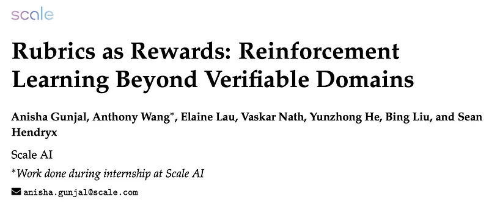
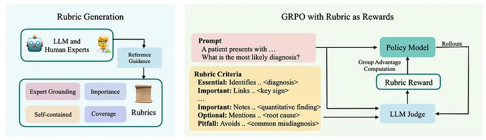
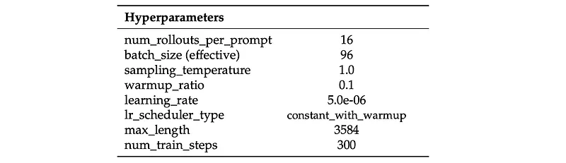
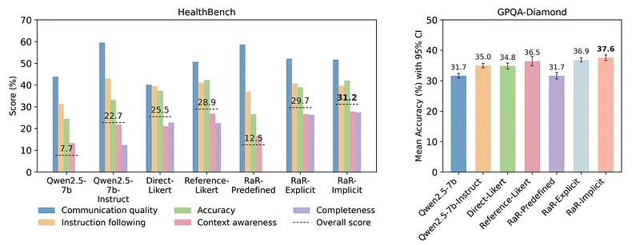
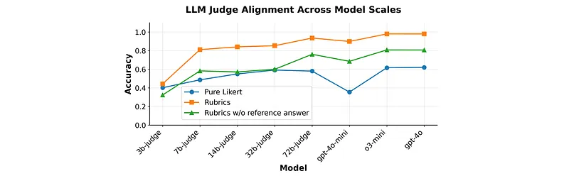

# Papers Explained 553 - Rubrics as Rewards

Explicit Aggregation involves computing the reward as follows: each criterion is independently evaluated using an LLM-as-judge, and the final normalized reward is computed as:

This page ingests the source article into the wiki and connects it to [[Papers Explained Corpus]], [[Evaluation and Benchmarks]], [[Large Language Models]], [[Reinforcement Learning Topic]], [[Reasoning Models]], [[Safety and Alignment]], [[Reinforcement Learning]], [[Verifier-Bounded Learning]], [[On-Policy Distillation]].

## Source Metadata

- Source file: `raw/2026-04-01_Papers-Explained-553--Rubrics-as-Rewards-229ff69f7355.md`
- Source title: Papers Explained 553: Rubrics as Rewards
- Published: 2026-04-01
- Canonical: [https://medium.com/@ritvik19/papers-explained-553-rubrics-as-rewards-229ff69f7355](https://medium.com/@ritvik19/papers-explained-553-rubrics-as-rewards-229ff69f7355)

## Key Ideas

- Normalization makes rewards comparable across prompts that differ in rubric count or weights. Although binary checks for c_j are used in experiments, the formulation can be extended to continuous-valued scores.
- Implicit Aggregation involves passing all rubric criteria along with categorical weights to an LLM-as-judge, delegating the aggregation to the model itself to produce a single scalar reward:
- Here, fϕ denotes an LLM-based judge that takes the prompt x, the response y^, and the set of rubric criteria dj as input. This formulation allows the model to compute a holistic reward score directly, avoiding the need to manually tune rubric weights.
- Grounded in Expert Guidance: Rubrics should reflect domain expertise by capturing the essential facts, reasoning steps, and conclusions necessary for correctness. Ideally, this grounding comes from human experts or their high-quality proxies.
- Comprehensive Coverage: Rubrics should span multiple dimensions of response quality, including factual accuracy, logical coherence, completeness, style, and safety.

## Notes

Rubrics as Rewards is an on-policy reinforcement learning framework that extends RLVR beyond domains like math and code to real-world reasoning tasks (e.g., medicine and science) by using instance-specific, checklist-style rubrics as the core reward mechanism instead of binary correctness or preference models. RaR generates prompt-specific rubrics with a strong LLM (using reference answers as expert proxies), then uses these rubrics to guide an LLM judge that provides structured, multi-criteria reward signals for GRPO training,

[[Papers Explained: Reward Hacking in Rubric-Based RL]] extends this page by stress-testing the same rubric-reward setup. It finds that weak verifiers produce proxy-reward gains that do not fully transfer to stronger reference panels, and that even strong rubric verification can favor RL checkpoints that rubric-free judges rate below the base model on overall quality, factual correctness, conciseness, and relevance.

## Rubrics as Rewards

Let x denote an input prompt and ˆy∼πθ (·|x) be a sampled response from a model parameterized by θ. In domains without single ground-truth answers or automatic correctness signals, a structured reward function is defined using instance-specific rubric criteria. Each prompt x is associated with a set of k rubric items {(wj, cj)}k j=1, where wj ∈R denotes the weight of criterion j, and cj : (x, ˆy) →{0, 1}is a binary correctness function that indicates whether the response ˆy satisfies that criterion given the prompt.

Explicit Aggregation involves computing the reward as follows: each criterion is independently evaluated using an LLM-as-judge, and the final normalized reward is computed as:

Normalization makes rewards comparable across prompts that differ in rubric count or weights. Although binary checks for c_j are used in experiments, the formulation can be extended to continuous-valued scores.

Implicit Aggregation involves passing all rubric criteria along with categorical weights to an LLM-as-judge, delegating the aggregation to the model itself to produce a single scalar reward:

Here, fϕ denotes an LLM-based judge that takes the prompt x, the response y^, and the set of rubric criteria dj as input. This formulation allows the model to compute a holistic reward score directly, avoiding the need to manually tune rubric weights.

*Figure: Overview of Rubrics as Rewards.*

## Rubric Generation

### Desiderata

Grounded in Expert Guidance: Rubrics should reflect domain expertise by capturing the essential facts, reasoning steps, and conclusions necessary for correctness. Ideally, this grounding comes from human experts or their high-quality proxies.

Comprehensive Coverage: Rubrics should span multiple dimensions of response quality, including factual accuracy, logical coherence, completeness, style, and safety. Negative criteria (pitfalls) help identify frequent or high-risk errors that undermine overall quality.

Criterion Importance: Rubrics should reflect that some dimensions of response quality are more critical than others. For example, factual correctness must outweigh secondary aspects such as stylistic clarity. Assigning weights to criteria ensures this prioritization, whether through simple categorical tags, explicit numeric values, or learned weighting schemes.

Self-Contained Evaluation: Each rubric item should be independently actionable, allowing either human annotators or automated judges to assess it in isolation without requiring external context or domain-specific knowledge.

### Rubrics Creation

LLMs are used to generate instance-specific rubrics from golden reference answers. For each prompt, an LLM generates a rubric of 7–20 self-contained items. Each item is assigned both a numeric and a categorical weight reflecting its relative importance. While numeric weights provide fine-grained prioritization, categorical labels (Essential, Important, Optional, Pitfall) are adopted for ease of implementation and interpretability in controlled settings. The resulting rubrics are then used directly as reward functions through either explicit aggregation or implicit aggregation. In practice, rubrics are generated using OpenAI’s o3-mini and GPT-4o, conditioning generation on reference answers from the underlying datasets to approximate expert grounding.

## Experiment Setup

This research investigates the utility of rubrics as rewards across two reasoning domains: medicine and science.

- RaR-Medicine: a dataset of 20,000 prompts drawn from diverse medical reasoning sources, including medical-o1-reasoning-natural_reasoning, SCP-116K, and GeneralThought-430K. Instance-specific rubrics for this dataset are generated with GPT-4o.

- RaR-Science: a dataset of approximately 20,000 prompts curated to align with GPQA-Diamond categories. Prompts are sourced from natural_reasoning, SCP-116K, and GeneralThought-430K, covering a broad range of scientific reasoning tasks. Rubrics for this dataset are synthesized with o3-mini.

All experiments are conducted using on-policy reinforcement learning with the GRPO algorithm, taking Qwen2.5–7B as the base policy.

*Figure: GRPO hyperparameter settings for Medical and Science domains.*

For each prompt q, 16 responses are sampled from the current policy πθ. A context length of 3584 and a sampling temperature of 1.0 are used. gpt-4o-mini is used as the judge model to assign rewards Rq to the sampled responses.

### Baselines:

- OFF-THE-SHELF: For off-the-shelf baselines, performance is evaluated on Qwen2.5–7B. The performance of Qwen2.5–7B-Instruct is also included to compare with an instruction-tuned variant of the base policy.

- DIRECT-LIKERT: An LLM-as-judge provides a direct assessment for each response–prompt pair on a 1–10 Likert scale, normalized to [0, 1]. The resulting score is used directly as the reward signal for training.

- REFERENCE-LIKERT: An LLM-as-judge compares the generated response against a reference answer (written by experts or stronger LLMs) and assigns a 1–10 Likert score, normalized to [0, 1]. This reference-guided score is used as the reward signal for policy updates. The reward for each (prompt, response, reference) triplet is defined as:

Rref(q, x) = Norm(LikertScore(q, x, x∗)), where x∗ denotes the reference answer.

### Rubric-guided Methods

- RaR-PREDEFINED: This method uses a fixed set of generic rubrics for all prompts (e.g. response is concise, response contains correct information). It employs the Explicit Aggregation method with all criteria weighted uniformly.

- RaR-EXPLICIT: This variant also uses Explicit Aggregation using a weighted sum (Equation 1) but applies it to instance-specific rubrics. Numerical weights are manually assigned based on the generated categorical labels: {“Essential”: 1.0, “Important”: 0.7, “Optional”: 0.3, “Pitfall”: 0.9}

- RaR-IMPLICIT: This variant uses the Implicit Aggregation method. It leverages prompt-specific rubrics, where a judge model evaluates the response as a whole to assign a single Likert rating (1–10), avoiding the need for hand-tuned weights. The reward is normalized to the [0, 1] range during training.

## Evaluation

Rubric-based evaluation on HealthBench

- Models trained with RaR-Medicine are evaluated on HealthBench (5,000 clinical conversations) using detailed, physician-authored rubrics.

- Responses are generated with greedy decoding (temperature = 0); both overall and per-axis scores are reported.

Multiple-choice evaluation on GPQA-Diamond

- Each model is run 10 times with greedy decoding (temperature = 0), one response per prompt per run.

- Answer choices are permuted to reduce positional bias; outputs are parsed for boxed answers (e.g., \boxed{A}); if parsing fails, a GPT-4o verifier checks for the correct option.

- Final accuracy is the mean over 10 runs with 95% confidence intervals.

LLM-judge alignment evaluation

- Construct a paired evaluation set from ~3,000 HealthBench prompts: each has a practitioner-approved “preferred” answer and a perturbed alternative created via controlled edits.

- LLM judges of varying sizes score answers on a 1–10 scale under:

- Rubric-guided (RaR-IMPLICIT): prompt + answers + instance-specific rubric.

- Rubric-free (DIRECT-LIKERT): prompt + answers only.

- Metric: pairwise preference accuracy (fraction of pairs where the preferred answer gets the higher score).

### Results

*Figure: Performance of baselines and RaR (Rubrics as Rewards) variants for the medicine and science domains.*

RaR-Implicit improves performance across domains

- RaR-Implicit consistently outperforms Direct-Likert, with up to 31% relative gains on HealthBench and 7% on GPQA-Diamond.

- Both rubric-guided variants (RaR-Implicit, RaR-Explicit/Reference-Likert) outperform base and instruction-tuned policies.

- Gains on GPQA-Diamond indicate that skills learned via rubrics generalize beyond rubric-based evaluation.

Instance-specific rubrics are crucial

- RaR-Predefined, which uses a fixed list of generic rubrics for all prompts, underperforms because generic criteria miss prompt-specific requirements and common failure modes.

- Effective training requires instance-specific rubric synthesis to capture task context and typical failure modes, yielding better-aligned reward signals.

Implicit vs. explicit rubric weighting

- RaR-Implicit achieves the strongest overall results among rubric-guided methods.

- RaR-Explicit (fixed weighted sums of rubric criteria) offers more control and interpretability but is brittle and harder to tune.

- The choice between implicit and explicit weighting is application-dependent; future work could explore learned/dynamic weighting to balance interpretability and adaptability.

*Figure: Alignment Study of LLM Judges across Model Scales.*

Rubrics improve LLM-judge alignment with humans

- Rubric guidance (RaR-IMPLICIT) increases pairwise preference accuracy for all judge sizes compared to direct Likert scoring.

- The largest gains occur for smaller judge models, narrowing the performance gap to larger models.

- Explicit, context-specific criteria help judges detect subtle quality differences better than rubric-free Likert scoring.

Expert grounding and reference answers matter

- Rubrics generated with access to reference (expert) answers achieve higher alignment and performance than rubrics generated without references.

- Synthetic rubrics without expert grounding (no reference answers) still outperform direct Likert baselines but lag behind expert-grounded rubrics.

- Human-authored rubrics and synthetic rubrics with access to references yield comparable performance, indicating that expert-informed synthetic rubrics can substitute for fully human-written ones.

## Paper

Rubrics as Rewards: Reinforcement Learning Beyond Verifiable Domains [2507.17746](https://arxiv.org/abs/2507.17746)

## Figures

Figures from the Medium HTML export (`raw/2026-04-01_Papers-Explained-553--Rubrics-as-Rewards-229ff69f7355.md`); local copies under `wiki/assets/papers-explained-553-rubrics-as-rewards/` when download succeeded.

| Figure | Caption |
|--------|---------|
|  | Title card: Rubrics as Rewards. |
|  | Normalization makes rewards comparable across prompts that differ in rubric count or weights. |
|  | Here, fϕ denotes an LLM-based judge that takes the prompt x, the response y^, and the set of rubric criteria dj as input. |
|  | Overview of Rubrics as Rewards. |
|  | GRPO hyperparameter settings for Medical and Science domains. |
|  | Performance of baselines and RaR (Rubrics as Rewards) variants for the medicine and science domains. |
|  | Alignment Study of LLM Judges across Model Scales. |
## Related

- [[Papers Explained Corpus]]
- [[Evaluation and Benchmarks]]
- [[Large Language Models]]
- [[Reinforcement Learning Topic]]
- [[Reasoning Models]]
- [[Safety and Alignment]]
- [[Reinforcement Learning]]
- [[Verifier-Bounded Learning]]
- [[On-Policy Distillation]]
- [[Papers Explained: Reward Hacking in Rubric-Based RL]]
- [[Papers Explained 581: Rubric-Guided Self-Distillation]]
- [[Papers Explained 579: Policy-Aware Rubric Reward (POW3R)]]
- [[Rubric-Based Reinforcement Learning]]
- [[Reward Hacking]]
- [[Papers Explained 552 - Nemotron Cascade 2]]
- [[Papers Explained 554 - Jina Embeddings v5 Text]]

#summary #topic
