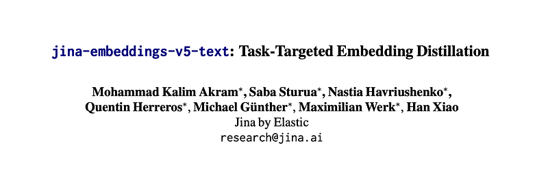
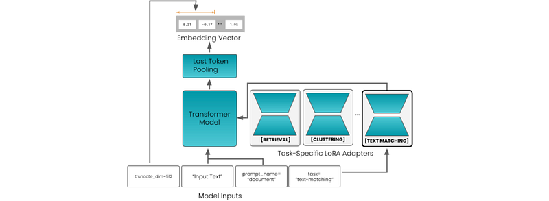
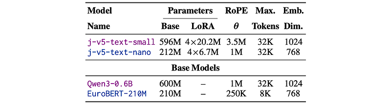
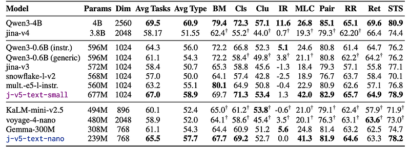
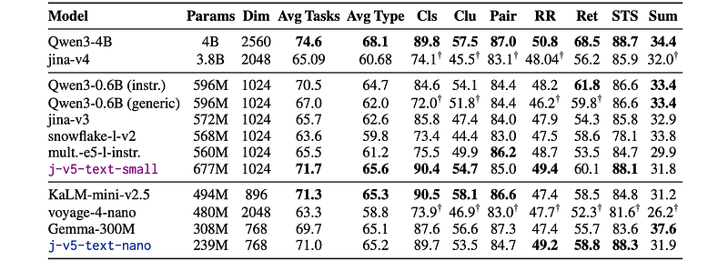
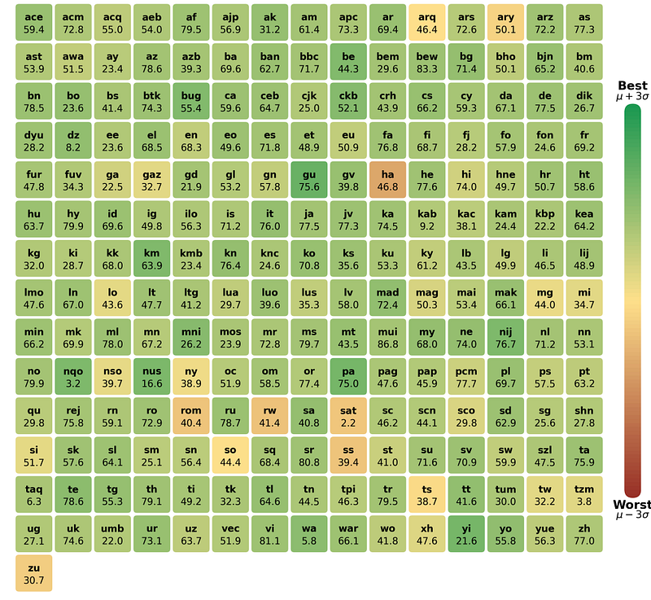
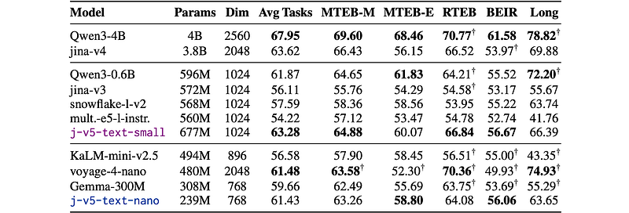

# Papers Explained 554 - Jina Embeddings v5 Text

The paper introduces jina-embeddings-v5-text, a family of compact text embedding models trained with a novel regimen that combines model distillation and task-specific contrastive loss, which the authors show is more effective for small models than using either contrastive learning or distillation alone.

This page ingests the source article into the wiki and connects it to [[Papers Explained Corpus]], [[Embedding and Retrieval]], [[Model Compression and Efficiency]], [[Large Language Models]], [[Document AI]], [[Multilingual Models]], [[Model Distillation]].

## Source Metadata

- Source file: `raw/2026-04-02_Papers-Explained-554--Jina-Embeddings-v5-Text-09ac59ff93b7.html`
- Source title: Papers Explained 554: Jina Embeddings v5 Text
- Published: 2026-04-02
- Canonical: [https://medium.com/@ritvik19/papers-explained-554-jina-embeddings-v5-text-09ac59ff93b7](https://medium.com/@ritvik19/papers-explained-554-jina-embeddings-v5-text-09ac59ff93b7)

## Key Ideas

- The paper introduces jina-embeddings-v5-text, a family of compact text embedding models trained with a novel regimen that combines model distillation and task-specific contrastive loss, which the authors show is more effective for small models than using...
- The models are available on [HuggingFace](https://huggingface.co/collections/jinaai/jina-embeddings-v5-text).
- The model follows a standard transformer architecture similar to other pre-trained language models.
- The model includes LoRA adapters to support multiple tasks that are difficult to optimize for jointly. These tasks are: retrieval, semantic similarity, clustering, and classification.
- To support asymmetric retrieval, jina-embeddings-v5-text distinguishes between query and document inputs by pre-pending a prefix to the input text — either “Query:” or “Document:”. Other tasks use a single “Document:” prefix.

## Notes

The paper introduces jina-embeddings-v5-text, a family of compact text embedding models trained with a novel regimen that combines model distillation and task-specific contrastive loss, which the authors show is more effective for small models than using either contrastive learning or distillation alone.

The models are available on [HuggingFace](https://huggingface.co/collections/jinaai/jina-embeddings-v5-text).

## Model Architecture

*Figure: Model Architecture.*

*Figure: Attributes of the Base Models and the Resulting Embedding Models.*

The model follows a standard transformer architecture similar to other pre-trained language models. The model translates a text input into a single embedding via last-token pooling, i.e., it uses the embedding of the end-of-sequence token produced by the transformer layers.

The model includes LoRA adapters to support multiple tasks that are difficult to optimize for jointly. These tasks are: retrieval, semantic similarity, clustering, and classification. Adapters are loaded together with the model weights, and users select the appropriate one at inference time.

To support asymmetric retrieval, jina-embeddings-v5-text distinguishes between query and document inputs by pre-pending a prefix to the input text — either “Query:” or “Document:”. Other tasks use a single “Document:” prefix. Embeddings can also be truncated for downstream efficiency, enabled by using Matryoshka Representation Learning during training.

For training embedding models, the pre-trained language models EuroBERT-210M for jina-embeddings-v5-text-nano and Qwen3–0.6B-Base for jina-embeddings-v5-text-small are used. Both models are multilingual.

## Training

The training method consists of two main stages:

### Embedding Distillation

Distillation is used to transfer knowledge from the Qwen3-Embedding-4B model, a much larger, trained embedding model. Minimal use is made of instructions during distillation. For the student, only generic query/document prefixes are provided, and for the teacher, the general instruction: “Given a web search query, retrieve relevant passages that answer the query”, which is provided as a default in its sentence transformer configuration.

Positional Information

Rotary positional embeddings (RoPE) are used to inject positional information during attention calculation. This technique uses rotation matrices and a parameter θ, which controls the rotation frequencies. Using a higher θ at inference time and a lower one during training has been shown to improve performance on texts that are longer than those seen during training.

Loss Function

At each training step, the student/teacher model is applied to a batch of pairs (q,d), resulting in two batches of embeddings:

The dimensionality of the teacher embeddings m is higher than the dimensionality of the student embeddings n. A linear projection layer ψ(z) = Wz+b is used to project the student embeddings into the teacher’s embedding space, enabling the use of cosine similarity ϕ to determine similarity scores. The distillation loss Ldistill is a sum of cosine distances between the two sets of embeddings.

Theoretically, it is possible to project the teacher embeddings to the dimensionality of the student embeddings instead. However, it is found to be less effective.

Training Procedure

Distillation proceeds in two phases:

General-Purpose Training: Training is performed using a large, diverse collection of text pairs, drawn from over 300 datasets in over 30 languages.

Long Context Training: This training incorporates a curated collection of materials, including synthetic documents designed to retrieve documents based on specific contents embedded in long, high-density, noisy texts. It also contained natural long texts, such as book chapters and long-form articles, paired with LLM-generated queries. This dataset includes multilingual document-query pairs with texts of 1,000 to 4096 tokens, ensuring that long document performance is robust across languages. Lowering the θ parameter of the positional embeddings and increasing the maximum sequence length facilitates smoother interpolation of frequencies across the extended context window, leading to better performance on long texts.

### Task-Specific Adapter Training

The weights in the distillation-trained model are frozen to train LoRA adapters for specific tasks.

Asymmetric Retrieval Adapter

Asymmetric retrieval is based on the insight that queries and retrieval targets are usually very different from each other. This asymmetry is implemented with prefixes, specifically by pre-pending “Query:” to inputs intended to be used as queries and “Document:” to texts intended to be retrieval targets.

Training data for this adapter consists of triplet datasets containing queries, relevant documents, and hard negatives, as well as the long-context datasets. A combination of three loss functions is used.

Contrastive Loss: InfoNCE loss with hard negatives is used. Given a batch of size B, let xi denote the query embeddings and yi their corresponding relevant document embeddings. For each query embedding xi, a negative set Nxi consisting of all non-matching in-batch document embeddings and additional mined hard negatives, i.e., semantically related but incorrect documents, is defined. Based on the temperature-scaled exponential cosine similarity S(x,y) = exp(ϕ(x,y)/τ), the contrastive loss is defined as follows:

Distillation Loss: The knowledge distillation loss is retained, ensuring that the retrieval adapter preserves the general-purpose embedding quality established by the base model.

Spread-Out Regularizer: A global orthogonal regularizer (GOR) is applied to encourage embeddings to be distributed more uniformly across the embedding space, improving their expressive capacity. This also improves robustness to quantization and enables more efficient retrieval under approximate nearest neighbor (ANN) search. The GOR loss is defined as:

This loss penalizes high pairwise similarity between non-matching embeddings, driving them to behave as if uniformly sampled from the unit sphere.

The final training objective for the retrieval adapter is a linear combination of the three loss functions:

where λNCE, λD, and λS are scalar weights balancing the three objectives.

The final LoRA adapter averages the weights of the last training checkpoint with an earlier checkpoint, employing model averaging to improve performance and robustness.

Text Matching (STS) Adapter

To achieve better symmetric encoding, this adapter uses only the “Document:” prefix during training and inference.

STS12, SICK, and similar datasets are used. The training data is multilingual, including English, German, Spanish, French, and Japanese, among others. For less-resourced languages, machine-translated versions of existing graded annotated datasets are relied upon. High-quality human-annotated STS data is very limited in volume, so the training data is supplemented with text pairs drawn from parallel translations and paired paraphrases of texts.

CoSENT Ranking Loss: For a batch (xi,yi,si) of B training triplets, where xi,yi are embeddings of two text inputs and si is their ground-truth semantic similarity score, the following ranking-based objective is optimized:

The temperature parameter τ′>0 controls the smoothness of the objective.

Combined Objective and Distillation: To optimize the adapter, a hybrid strategy is employed. During each training step, a batch is sampled from a dataset that either contains annotated similarity scores or pairs or triplets without scores. If scores are available, the CoSENT loss Lco is used. If the dataset contains unscored pairs and triplets, a combination of InfoNCE loss Lq→dNCE and the knowledge distillation loss Ldistill is used.

For unranked pairs or triplets, the weight ratio λnce : λd is set to 1 : 2.

Clustering Adapter

While retrieval tasks require distinguishing documents that are relevant from documents that are only related to a query, clustering tasks require an embedding model to group related documents near each other.

The initial distillation training stage is found to be distinctly suboptimal for clustering tasks. New distillation training was done, but with a clustering-specific instruction for the teacher model: “Identify the topic or theme of the given document:”. Training was done on pairs of texts derived from sources that are typically used for clustering tasks, e.g., titles and descriptions of news articles. All texts receive the prefix “Document:” when presented to the student model.

Classification Adapter

Training data comprises standard classification datasets, including multilabel data, which was converted to single-label format. All datasets consist of text-label pairs, which were transformed into a triplet format: each sample includes one “anchor”, one “positive” item that shares the same label as the anchor, and seven “negative” items with different labels.

To adapt contrastive loss for supervised learning, pairs (q,p) of an anchor text and a randomly selected target with the same label are used. Optimization is performed with a bi-directional loss function that aligns the representations.

For Lq→d NCE, the set Nxi includes all other positives and negatives in the batch. In contrast, Ld→q NCE uses only in-batch negatives. A relational knowledge distillation regularizer Lr was also added to prevent feature collapse and enhance the classifier adapter’s zero-shot abilities. The teacher model for this regularization is the base model without the adapter.

where s,t are embeddings from the set of all anchors, positives, and negatives; M is the total number of embeddings (batch size ×9); and µis the scalar mean values of the student and teacher distance matrices.

## Evaluation

*Figure: MTEB (Multilingual, v2) Evaluation Results.*

MMTEB overall performance

- Both jina-embeddings-v5-text models achieve the highest average MMTEB scores in their respective size categories among small multilingual models, though the larger teacher Qwen3–4B still performs best overall.

- KaLM-mini-v2.5 is stronger on clustering; voyage-4-nano is slightly better than j-v5-text-nano on retrieval due to its retrieval-focused training.

- Qwen3–0.6B and Gemma-300M also show strong average MMTEB performance.

*Figure: MTEB(eng, v2) Evaluation Results*

Effect of instruction tuning

- Using task-level instructions improves Qwen3–0.6B performance over the generic version, especially for classification tasks; gains are smaller for other task types and absent where no task-specific instructions are defined (STS, pair classification, bitext mining).

- Similar performance loss without instructions is observed on both MMTEB and English MTEB.

English MTEB (task-level)

- On English MTEB, j-v5-text-small achieves the highest average score among small multilingual models, but is still below Qwen3–4B.

- Qwen3–0.6B with instructions slightly outperforms others on retrieval; multilingual-e5-large-instruct is best on pair classification.

- Among models <500M parameters, KaLM-mini-v2.5 has the highest average English MTEB score, only slightly above j-v5-text-nano despite having more than twice the parameters.

- j-v5-text-nano is the best sub-0.5B model for retrieval, reranking, and STS; Gemma-300M is strongest on summarization.

*Figure: Performance of j-v5-text-small on different languages on MMTEB compared to other models.*

Language-specific performance

- Language-wise analysis across five small multilingual models (Gemma-300M, Qwen3–0.6B, BGE-M3, j-v5-text-small, j-v5-text-nano) shows how j-v5-text-small compares per language; Figure 2 visualizes j-v5-text-small’s relative performance as a heat map.

*Figure: Retrieval Benchmark Results.*

Global retrieval performance across benchmarks

- j-v5-text-small attains the highest task-level average across all retrieval benchmarks (MTEB-M, MTEB-E, RTEB, BeIR, LongEmbed) among the tested non-teacher models, and beats similarly sized Qwen3–0.6B on three of five retrieval benchmarks.

- Qwen3–0.6B performs better on English MTEB retrieval and LongEmbed, indicating an advantage on English and long-document retrieval.

- Both j-v5-text models substantially outperform older or comparable baselines (jina-v3, snowflake-l-v2, multilingual-e5-large-instruct) on retrieval.

- Among <500M-parameter models, j-v5-text-nano is best on BEIR and MTEB English retrieval while being the smallest; voyage-4-nano has slightly higher overall retrieval average but is ~2× larger and uses 2048-d embeddings vs. 768-d for j-v5-text-nano.

- Gemma-300M and KaLM-mini-v2.5 are competitive on some retrieval benchmarks but lag in overall average; Qwen3–4B remains best by a large margin.

## Paper

jina-embeddings-v5-text: Task-Targeted Embedding Distillation [2602.15547](https://arxiv.org/abs/2602.15547)

## Figures

Figures from the Medium HTML export (`raw/2026-04-02_Papers-Explained-554--Jina-Embeddings-v5-Text-09ac59ff93b7.html`); local copies under `wiki/assets/papers-explained-554-jina-embeddings-v5-text/` when download succeeded.

| Figure | Caption |
|--------|---------|
|  | Title card: Jina Embeddings v5 Text. |
|  | Model Architecture. |
|  | Attributes of the Base Models and the Resulting Embedding Models. |
|  | At each training step, the student/teacher model is applied to a batch of pairs (q,d), resulting in two batches of embeddings. |
|  | The dimensionality of the teacher embeddings m is higher than the dimensionality of the student embeddings n. |
|  | Contrastive Loss: InfoNCE loss with hard negatives is used. |
|  | Asymmetric Retrieval Adapter. |
|  | The final training objective for the retrieval adapter is a linear combination of the three loss functions. |
|  | Text Matching (STS) Adapter: The temperature parameter τ′>0 controls the smoothness of the objective. |
|  | Combined Objective and Distillation: To optimize the adapter, a hybrid strategy is employed. |
|  | To adapt contrastive loss for supervised learning, pairs (q,p) of an anchor text and a randomly selected target with the same label are... |
|  | For Lq→d NCE, the set Nxi includes all other positives and negatives in the batch. |
|  | MTEB (Multilingual, v2) Evaluation Results. |
|  | MTEB(eng, v2) Evaluation Results. |
|  | Performance of j-v5-text-small on different languages on MMTEB compared to other models. |
|  | Retrieval Benchmark Results. |
## Related

- [[Papers Explained Corpus]]
- [[Embedding and Retrieval]]
- [[Model Compression and Efficiency]]
- [[Large Language Models]]
- [[Document AI]]
- [[Multilingual Models]]
- [[Model Distillation]]
- [[Papers Explained 553 - Rubrics as Rewards]]
- [[Papers Explained 555 - IH Challenge]]

#summary #topic
