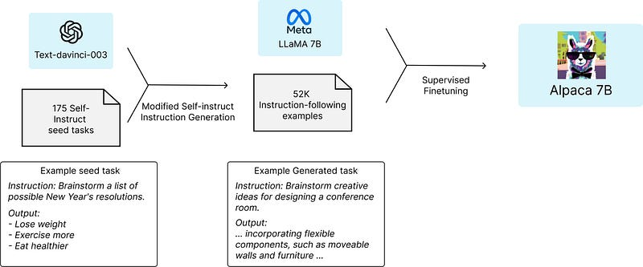

# Papers Explained 56 - Alpaca

Alpaca is fine-tuned from Meta’s LLaMA 7B model. The Alpaca model is trained on 52K instruction-following demonstrations generated in the style of self-instruct using text-davinci-003.

This page ingests the source article into the wiki and connects it to [[Papers Explained Corpus]], [[Large Language Models]], [[Synthetic Data]], [[Safety and Alignment]], [[Evaluation and Benchmarks]].

## Source Metadata

- Source file: `raw/2023-09-18_Papers-Explained-56--Alpaca-933c4d9855e5.html`
- Source title: Papers Explained 56: Alpaca
- Published: 2023-09-18
- Canonical: [https://medium.com/@ritvik19/papers-explained-56-alpaca-933c4d9855e5](https://medium.com/@ritvik19/papers-explained-56-alpaca-933c4d9855e5)

## Key Ideas

- Alpaca is intended only for academic research and any commercial use is prohibited. There are three factors in this decision:
- Alpaca is based on LLaMA, which has a non-commercial license, so we necessarily inherit this decision.
- The instruction data is based on OpenAI’s text-davinci-003, whose terms of use prohibit developing models that compete with OpenAI.
- Adequate safety measures have not been designed, so Alpaca is not ready to be deployed for general use.
- There are two important challenges to training a high-quality instruction-following model under an academic budget: a strong pretrained language model and high-quality instruction-following data.

## Notes

Alpaca is fine-tuned from Meta’s LLaMA 7B model. The Alpaca model is trained on 52K instruction-following demonstrations generated in the style of self-instruct using text-davinci-003. On the self-instruct evaluation set, Alpaca shows many behaviors similar to OpenAI’s text-davinci-003 but is also surprisingly small and easy/cheap to reproduce.

Alpaca is intended only for academic research and any commercial use is prohibited. There are three factors in this decision:

- Alpaca is based on LLaMA, which has a non-commercial license, so we necessarily inherit this decision.

- The instruction data is based on OpenAI’s text-davinci-003, whose terms of use prohibit developing models that compete with OpenAI.

- Adequate safety measures have not been designed, so Alpaca is not ready to be deployed for general use.

## Training

There are two important challenges to training a high-quality instruction-following model under an academic budget: a strong pretrained language model and high-quality instruction-following data.

The first challenge is addressed with the recent release of Meta’s new LLaMA models.

For the second challenge, instruction-following demonstrations were generated by building upon the self-instruct method. The 175 human-written instruction-output pairs from the self-instruct seed set were started with. More instructions were then generated using the seed set as in-context examples, prompted by text-davinci-003. 52K unique instructions and the corresponding outputs resulted from our data generation process using the OpenAI API.

After being equipped with this instruction-following dataset, the LLaMA models were fine-tuned.

## Preliminary Evaluation

Alpaca is evaluated by conducting human evaluations on the inputs from the self-instruct evaluation set. A blind pairwise comparison was performed between text-davinci-003 and Alpaca 7B, and it was found that these two models exhibit very similar performance: 90 comparisons were won by Alpaca against text-davinci-003, compared to 89.

## Known limitations

- Alpaca also exhibits several common deficiencies of language models, including hallucination, toxicity, and stereotypes. Hallucination in particular seems to be a common failure mode for Alpaca, even compared to text-davinci-003.

- Furthermore, Alpaca can be used to generate well-written outputs that spread misinformation.

## Paper

[Alpaca: A Strong, Replicable Instruction-Following Model](https://crfm.stanford.edu/2023/03/13/alpaca.html)

## Figures

Figures from the Medium HTML export (`raw/2023-09-18_Papers-Explained-56--Alpaca-933c4d9855e5.html`); local copies under `wiki/assets/papers-explained-56-alpaca/` when download succeeded.

| Figure | Caption |
|--------|---------|
|  | Title card: Alpaca. |
|  | For the second challenge, instruction-following demonstrations were generated by building upon the self-instruct method. |
## Related

- [[Papers Explained Corpus]]
- [[Large Language Models]]
- [[Synthetic Data]]
- [[Safety and Alignment]]
- [[Evaluation and Benchmarks]]
- [[Papers Explained 55 - LLaMA]]
- [[Papers Explained 57 - LIMA]]

#summary #topic
