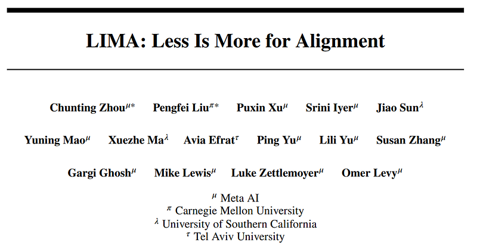
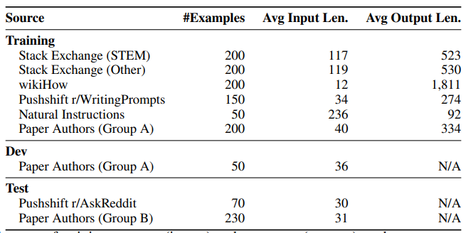
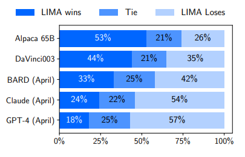
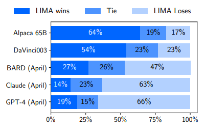
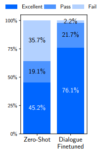

# Papers Explained 57 - LIMA

Large language models are trained in two stages: (1) unsupervised pretraining from raw text, to learn general-purpose representations, and (2) large-scale instruction tuning and reinforcement learning, to better align to end tasks and user preferences.

This page ingests the source article into the wiki and connects it to [[Papers Explained Corpus]], [[Large Language Models]], [[Reinforcement Learning Topic]], [[Safety and Alignment]], [[Synthetic Data]], [[Supervised Fine-Tuning]], [[Reinforcement Learning]].

## Source Metadata

- Source file: `raw/2023-09-25_Papers-Explained-57--LIMA-f9401a5760c3.html`
- Source title: Papers Explained 57: LIMA
- Published: 2023-09-25
- Canonical: [https://medium.com/@ritvik19/papers-explained-57-lima-f9401a5760c3](https://medium.com/@ritvik19/papers-explained-57-lima-f9401a5760c3)

## Key Ideas

- The relative importance of these two stages is measured by training LIMA, a 65B parameter LLaMa language model fine-tuned with the standard supervised loss on only 1,000 carefully curated prompts and responses, without any reinforcement learning or human...
- LIMA demonstrates remarkably strong performance, learning to follow specific response formats. Moreover, the model tends to generalize well to unseen tasks.
- The results strongly suggest that almost all knowledge in large language models is learned during pretraining, and only limited instruction tuning data is necessary to teach models to produce high-quality output.
- A dataset of 1,000 prompts and responses is collected, where the responses are stylistically aligned with each other, but the prompts are diverse. Specifically, outputs are in the style of a helpful AI assistant.
- The total amount of training data is roughly 750,000 tokens, split over exactly 1,000 sequences.

## Notes

Large language models are trained in two stages: (1) unsupervised pretraining from raw text, to learn general-purpose representations, and (2) large-scale instruction tuning and reinforcement learning, to better align to end tasks and user preferences.

The relative importance of these two stages is measured by training LIMA, a 65B parameter LLaMa language model fine-tuned with the standard supervised loss on only 1,000 carefully curated prompts and responses, without any reinforcement learning or human preference modeling.

LIMA demonstrates remarkably strong performance, learning to follow specific response formats. Moreover, the model tends to generalize well to unseen tasks.

The results strongly suggest that almost all knowledge in large language models is learned during pretraining, and only limited instruction tuning data is necessary to teach models to produce high-quality output.

## Data

A dataset of 1,000 prompts and responses is collected, where the responses are stylistically aligned with each other, but the prompts are diverse. Specifically, outputs are in the style of a helpful AI assistant. Additionally, a test set of 300 prompts and a development set of 50 are also collected.

*Figure: Sources of Training Data*

The total amount of training data is roughly 750,000 tokens, split over exactly 1,000 sequences.

## Training

LLaMa 65B is fine-tuned on the 1,000-example alignment training set. To differentiate between each speaker (user and assistant), a special end-of-turn token (EOT) is introduced at the end of each utterance; this token plays the same role as EOS of halting generation but avoids conflation with any other meaning that the pretrained model may have imbued into the preexisting EOS token.

## Experimental Setup

### Baselines

- Alpaca 65B — finetuned LLaMa 65B on the 52,000 examples in the Alpaca training set.

- OpenAI’s DaVinci003, a large language model tuned with reinforcement learning from human feedback (RLHF)

- Google’s Bard, based on PaLM

- Anthropic’s Claude, a 52B parameter model trained with reinforcement learning from AI feedback

- OpenAI’s GPT-4, a large language model trained with RLHF, which is currently considered the state of the art.

Responses from all baselines were sampled throughout April 2023.

### Methodology

At each step, annotators are presented with a single prompt and two possible responses, generated by different models. The annotators are asked to label which response was better, or whether neither response was significantly better than the other.

Parallel annotations are collected by providing GPT-4 with exactly the same instructions and data.

## Results

*Figure: Human preference evaluation, comparing LIMA to 5 different baselines across 300 test prompts*

*Figure: Preference evaluation using GPT-4 as the annotator, given the same instructions provided to humans.*

- Despite training on 52 times more data, Alpaca 65B tends to produce less preferable outputs than LIMA.

- The same is true for DaVinci003, though to a lesser extent, DaVinci003 was trained with RLHF, a supposedly superior alignment method.

- Bard shows the opposite trend to DaVinci003, producing better responses than LIMA 42% of the time; however, this also means that 58% of the time the LIMA response was at least as good as Bard's.

- Claude and GPT-4 generally perform better than LIMA, there is a non-trivial amount of cases where LIMA does actually produce better responses. Perhaps ironically, even GPT-4 prefers LIMA outputs over its own 19% of the time.

## Multi-Turn Dialog

*Figure: Analysis of dialogue turns averaged over 10 test chats.*

- LIMA is tested across 10 live conversations, labeling each response as Fail, Pass, or Excellent.

- LIMA responses are surprisingly coherent for a zero-shot chatbot, referencing information from previous steps in the dialogue. It is clear though that the model is operating out of distribution; in 6 out of 10 conversations, LIMA fails to follow the prompt within 3 interactions.

- To improve its ability to converse, 30 multi-turn dialogue chains are gathered. Among these, 10 dialogues are composed by the authors, while the remaining 20 are based on comment chains from Stack Exchange, which we edit to fit the assistant’s style.

- A new version of LIMA is finetuned from the pretrained LLaMa model using the combined 1,030 examples, and conduct 10 live conversations based on the same prompts used for the zero-shot model.

- Adding conversations substantially improves generation quality, raising the proportion of excellent responses from 45.2% to 76.1%.

## Paper

LIMA: Less Is More for Alignment [2305.11206](https://arxiv.org/abs/2305.11206)

## Figures

Figures from the Medium HTML export (`raw/2023-09-25_Papers-Explained-57--LIMA-f9401a5760c3.html`); local copies under `wiki/assets/papers-explained-57-lima/` when download succeeded.

| Figure | Caption |
|--------|---------|
|  | Title card: LIMA. |
|  | Sources of Training Data. |
|  | Human preference evaluation, comparing LIMA to 5 different baselines across 300 test prompts. |
|  | Preference evaluation using GPT-4 as the annotator, given the same instructions provided to humans. |
|  | Analysis of dialogue turns averaged over 10 test chats. |
## Related

- [[Papers Explained Corpus]]
- [[Large Language Models]]
- [[Reinforcement Learning Topic]]
- [[Safety and Alignment]]
- [[Synthetic Data]]
- [[Supervised Fine-Tuning]]
- [[Reinforcement Learning]]
- [[Papers Explained 56 - Alpaca]]
- [[Papers Explained 58 - PaLM 2]]

#summary #topic
