# Papers Explained 58 - PaLM 2

PaLM 2 is the successor of PaLM. It’s more compute efficient and is pre-trained on a more multilingual & during mixture of data spanning across hundreds of languages and domains. It is trained on a mixture of different pre-training objectives in order to understand different aspects of language.

This page ingests the source article into the wiki and connects it to [[Papers Explained Corpus]], [[Large Language Models]], [[Multilingual Models]], [[Model Compression and Efficiency]], [[Synthetic Data]].

## Source Metadata

- Source file: `raw/2023-10-02_Papers-Explained-58--PaLM-2-1a9a23f20d6c.md`
- Source title: Papers Explained 58: PaLM 2
- Published: 2023-10-02
- Canonical: [https://medium.com/@ritvik19/papers-explained-58-palm-2-1a9a23f20d6c](https://medium.com/@ritvik19/papers-explained-58-palm-2-1a9a23f20d6c)

## Key Ideas

- PaLM 2 is the successor of PaLM. It’s more compute efficient and is pre-trained on a more multilingual & during mixture of data spanning across hundreds of languages and domains.
- PaLM 2 is trained on a dataset that includes a higher percentage of non-English data than previous large language models, apart from the non-English Monolingual data, it is also trained on parallel data covering 100s of languages in the form of source &...
- PaLM 2 was trained to increase the context length of the model significantly beyond that of PaLM.
- Models of different sizes were trained with various computational budgets, using a heuristic formula relating FLOPs to the amount of training data (D) and model size (N) (FLOPs ~ 6ND).
- The results indicate that, as the FLOP budget increases, D and N should grow in equal proportions to achieve optimal performance.

## Notes

PaLM 2 is the successor of PaLM. It’s more compute efficient and is pre-trained on a more multilingual & during mixture of data spanning across hundreds of languages and domains. It is trained on a mixture of different pre-training objectives in order to understand different aspects of language.

## Training Dataset

PaLM 2 is trained on a dataset that includes a higher percentage of non-English data than previous large language models, apart from the non-English Monolingual data, it is also trained on parallel data covering 100s of languages in the form of source & target text pairs, where one side is English.

*Figure: Language distribution of the multilingual web documents (excluding English)*

PaLM 2 was trained to increase the context length of the model significantly beyond that of PaLM.

## Scaling Law Experiments

Models of different sizes were trained with various computational budgets, using a heuristic formula relating FLOPs to the amount of training data (D) and model size (N) (FLOPs ~ 6ND).

*Figure: The scaling law obtained from all 4 compute scales.*

*Figure: Estimated optimal parameter size at a given number of FLOPs.*

The results indicate that, as the FLOP budget increases, D and N should grow in equal proportions to achieve optimal performance.

## Evaluation

### Language proficiency exams

*Figure: Performance of PaLM 2 and PaLM on the latest available professional language proficiency exams.*

- PaLM 2 outperforms PaLM across all exams and achieved passing grades in all evaluated languages.

### Classification and Question Answering

English QA and classification tasks

*Figure: Evaluation on English QA and classification tasks in a 1-shot setting.*

- Large improvements over PaLM across almost all tasks.

- Similar performance on WSC and WinoGrande, which both employ Winograd schemas.

- Particularly strong improvements on the Adversarial NLI (ANLI) datasets, where robustness is important, the ReCoRD commonsense reasoning dataset, and the RACE datasets for reading comprehension.

Multilingual QA

*Figure: F1 scores on the multilingual TyDi QA datasets in a 1-shot setting.*

- PaLM 2 is tested in two settings: Gold Passage (with context) and a more challenging no-context setting.

- All PaLM 2 variants consistently outperform PaLM in both settings.

- In the Gold Passage setting, differences between PaLM 2 variants are small, indicating robust multilingual reading comprehension.

- In the no-context setting, larger PaLM 2 models perform significantly better than other models.

- PaLM 2 shows significant improvements over PaLM, especially for languages with limited data (e.g., Telugu, Swahili, Indonesian) and languages with non-Latin scripts (e.g., Arabic, Korean).

Multilingual toxicity classification

*Figure: Toxicity classification AUC-ROC on Multilingual Jigsaw and English Civil Comments.*

- PaLM 2 outperformed PaLM on toxicity classification in English.

- It also demonstrated improved performance on non-English examples using the Jigsaw multilingual dataset (Jigsaw, 2019b).

- There is a slight drop in performance for PaLM 2 in the Spanish language.

### Reasoning

*Figure: Evaluation on reasoning tasks. The number of exemplars are in brackets. Superscripts denote results from past work: a GPT-4, b PaLM, c PaLM+CoT+SC , d QDGAT , e DeBERTaV3-large+KEAR, f PaLM+CoT, g PaLM+CoT.*

- PaLM 2 outperforms PaLM on all datasets and performs competitively with GPT-4.

- Notably, on the multilingual XCOPA dataset, PaLM 2 shows significant improvements in under-represented languages like Swahili, Quechua, and Haitian, setting a new state of the art.

Beyond the Imitation Game Benchmark (BIG-Bench) Hard

*Figure: BIG-Bench Hard 3-shot results.*

- PaLM 2 shows significant improvements over PaLM on every task.

Mathematical reasoning

*Figure: Evaluation results on MATH, GSM8K, and MGSM with chain-of-thought prompting / self-consistency. a Minerva, b GPT-4, c Flan-PaLM.*

- PaLM 2 outperforms the original PaLM model by a significant margin on all three datasets.

- In the MATH dataset, PaLM 2 is competitive with the performance of the dedicated Minerva model, which is state-of-the-art.

- PaLM 2 also outperforms Minerva and GPT-4 on the GSM8K dataset.

- On the multilingual MGSM dataset, PaLM 2 surpasses the state of the art, even without using self-consistency techniques.

### Coding

PaLM 2-S* is a small, coding-specific model, created for low-latency, high-throughput deployment in developer workflows.

Code Generation

*Figure: Results on coding evaluations from the PaLM and PaLM 2-S* models. a PaLM*

- PaLM 2-S* outperforms PaLM-540B-Coder across all benchmarks, including ARCADE, despite being smaller, more cost-effective, and faster to serve.

Multilingual Evaluation

*Figure: BabelCode-HumanEval results on 12 programming languages in the pass@1 setting.*

- BabelCode translates HumanEval into various programming languages, including C++, Java, Go, Haskell, and Julia.

- PaLM 2-S* outperforms PaLM in most languages, with only two exceptions (C# and Go).

### Translation

WMT21 Experimental Setup

*Figure: Results on WMT21 translation sets.*

- BLEURT is preferred over BLEU for its better correlation with human judgment of translation quality.

- MQM measures errors in translation quality and involves professional translators.

- PaLM 2 outperforms both PaLM and Google Translate in improving translation quality.

Regional translation experimental setup

*Figure: Results on the FRMT (Few-shot Regional Machine Translation) benchmark of dialect-specific translation.*

- Inputs are 5-shot exemplars and scores are computed with BLEURT.

- PaLM 2 outperforms PaLM and Google Translate in all locales.

### Natural language generation

*Figure: One-shot NLG evaluation results.*

- Evaluation metrics include ROUGE-2 for English and SentencePiece-ROUGE-2 (an extension of ROUGE) for other languages, using the mT5 tokenizer.

- Even the smallest versions of PaLM 2 outperform PaLM in multilingual generation, with PaLM 2-L achieving significant improvements ranging from 59.4% to 100.8% on different datasets.

## Memorization

*Figure: PaLM 2 on average, memorizes less training data than PaLM. Analysis is performed on English training data.*

Privacy leakage occurs when an LLM, unintentionally reveals specific information about individuals. This is a significant concern, especially when the disclosed information is sensitive and can lead to various societal and technical harms. This memorization can happen even when the model is trained for just one pass over its training data or when techniques like data deduplication or output filtering are used.

To evaluate the extent of memorization in PaLM 2, a memorization analysis is performed by sampling training sequences and splitting them into a prefix (the first P tokens) and a suffix (the last S tokens). Then the model is queried with the prefix and checked if it generates the corresponding suffix. Greedy decoding is used to generate the suffix.

Verbatim Memorization: The analysis begins by comparing the memorization capabilities of PaLM and PaLM 2 using a shared part of their English pre-training data. 10,000 unique documents are sampled and both models are prompted with the first 50 tokens from each document, expecting the model to generate the next 50 tokens (the suffix). The results show that PaLM 2 memorizes significantly less data on average than PaLM.

Impact of Repetition: The analysis is further refined by considering how often each sequence appears in the training data. When sequences are repeated only a few times, PaLM 2 tends to memorize less than PaLM. However, when n-grams are repeated more frequently, PaLM 2 shows a higher likelihood of memorizing them. This phenomenon may be influenced by the de-duplication process, which can make repeated n-grams rarer and appear in more unique contexts.

Canaries for Memorization Analysis: To gain a deeper understanding of memorization, the authors introduce the concept of “canaries.” Canaries represent rare or outlier data points that may not be captured by training data extraction. They design canaries that are both outliers and have some similarity to natural training data. They propose two types of canaries: interleave canaries, which retain some linguistic properties, and shuffle canaries, which remove sequence-level ordering information.

*Figure: Distribution of canaries across languages.*

Memorization of the Tail: The analysis is extended to assess the risk of memorization for languages that are less represented in the training data (referred to as “tail languages”). Results show that memorization may be more likely to occur in these tail languages, especially when outlier canaries are repeated. However, this trend does not always hold true for real training data, and there is no strong correlation between language size and memorization rates.

## Paper

PaLM 2 Technical Report [2305.10403](https://arxiv.org/abs/2305.10403)

## Figures

Figures from the Medium HTML export (`raw/2023-10-02_Papers-Explained-58--PaLM-2-1a9a23f20d6c.md`); local copies under `wiki/assets/papers-explained-58-palm-2/` when download succeeded.

| Figure | Caption |
|--------|---------|
|  | Title card: PaLM 2. |
| 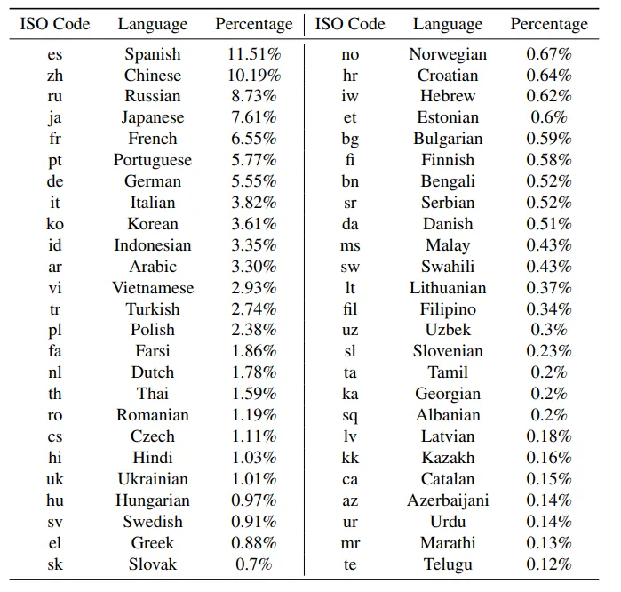 | Language distribution of the multilingual web documents (excluding English). |
| 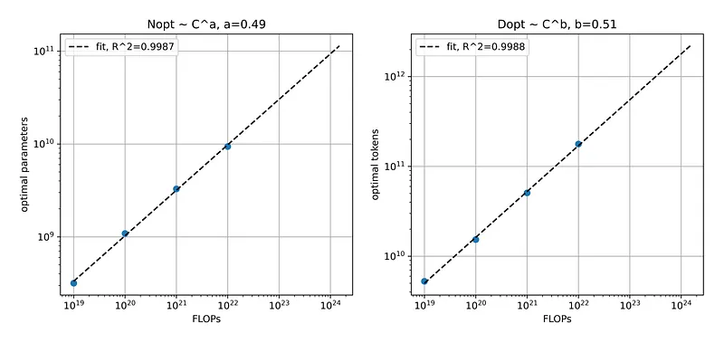 | The scaling law obtained from all 4 compute scales. |
| 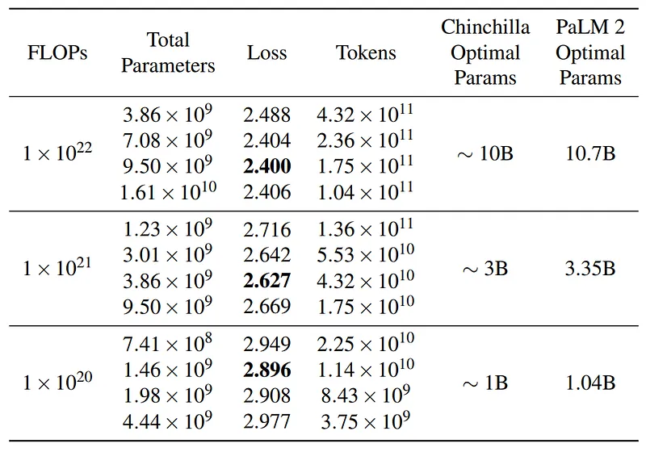 | Estimated optimal parameter size at a given number of FLOPs. |
| 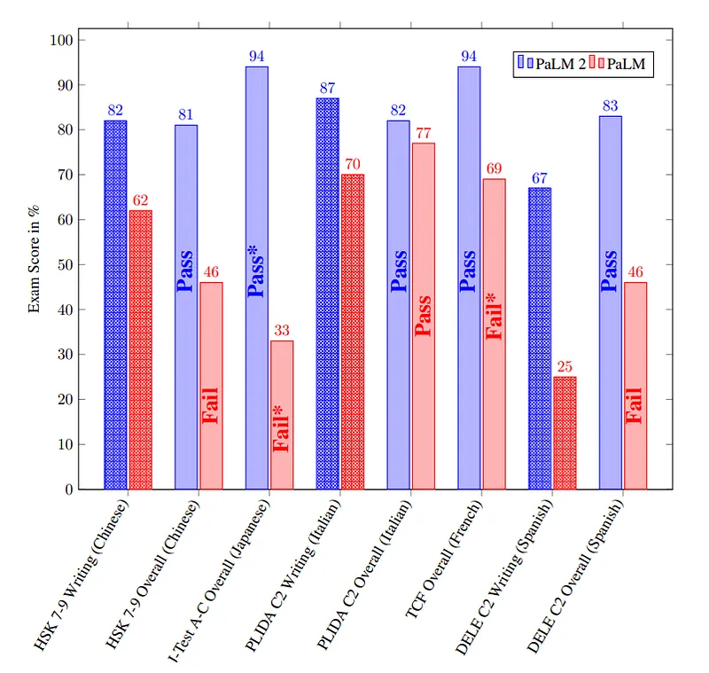 | Performance of PaLM 2 and PaLM on the latest available professional language proficiency exams. |
| 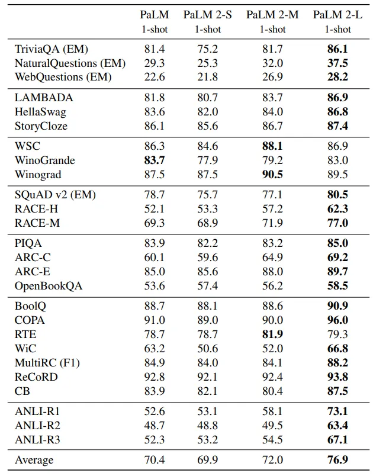 | Evaluation on English QA and classification tasks in a 1-shot setting. |
| 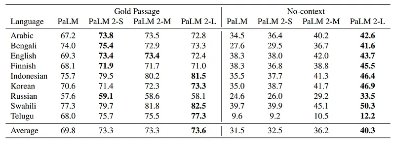 | F1 scores on the multilingual TyDi QA datasets in a 1-shot setting. |
| 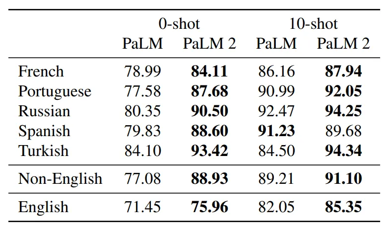 | Toxicity classification AUC-ROC on Multilingual Jigsaw and English Civil Comments. |
| 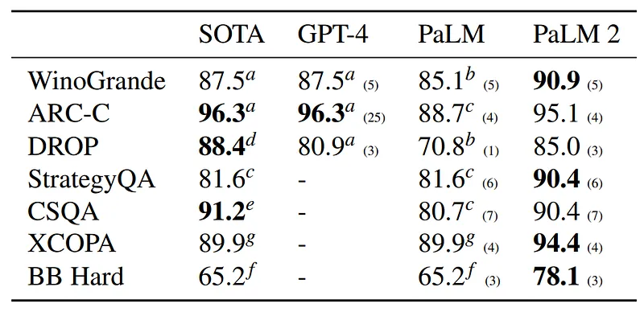 | Evaluation on reasoning tasks. The number of exemplars are in brackets. Superscripts denote results from past work: a GPT-4, b PaLM, c PaLM+CoT+SC, d QDGAT, e DeBERTaV3-large+KEAR, f PaLM+CoT, g PaLM+CoT. |
| 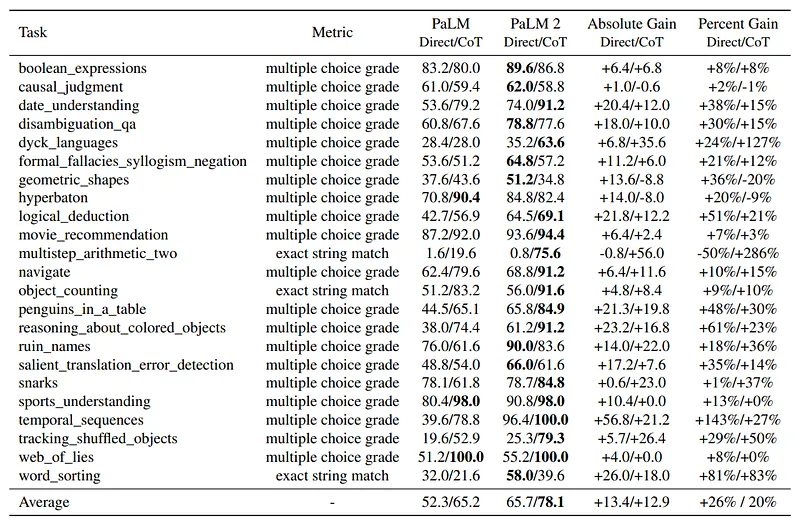 | BIG-Bench Hard 3-shot results. |
| 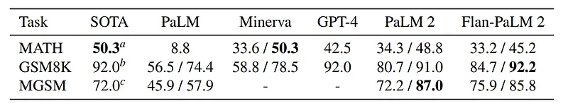 | Evaluation results on MATH, GSM8K, and MGSM with chain-of-thought prompting / self-consistency. a Minerva, b GPT-4, c Flan-PaLM. |
| 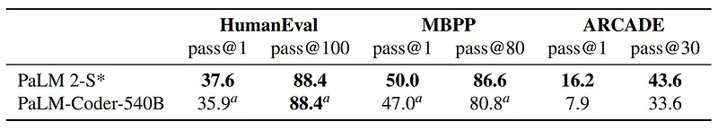 | Results on coding evaluations from the PaLM and PaLM 2-S* models. a PaLM. |
| 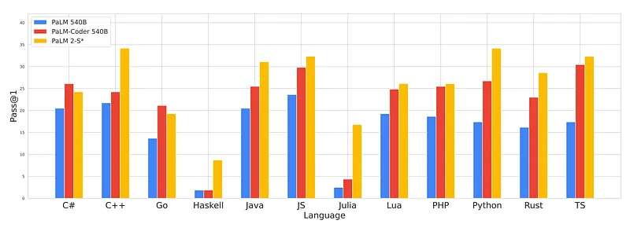 | BabelCode-HumanEval results on 12 programming languages in the pass@1 setting. |
| 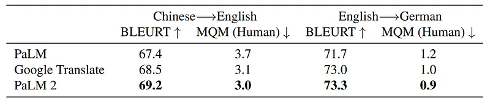 | Results on WMT21 translation sets. |
| 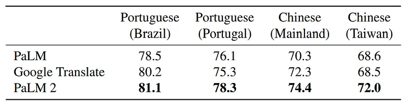 | Results on the FRMT (Few-shot Regional Machine Translation) benchmark of dialect-specific translation. |
| 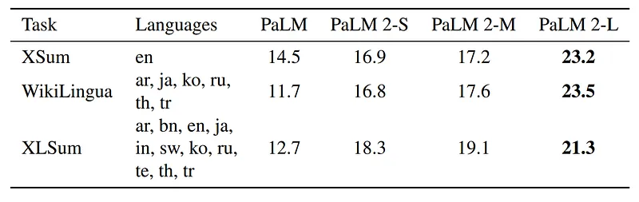 | One-shot NLG evaluation results. |
| 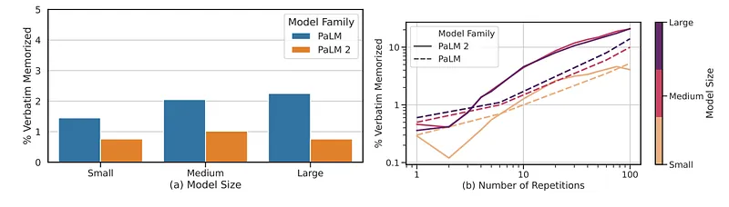 | PaLM 2 on average, memorizes less training data than PaLM. Analysis is performed on English training data. |
| 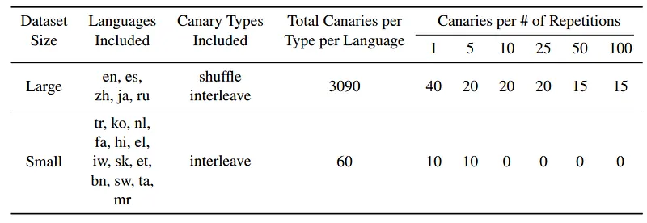 | Distribution of canaries across languages. |
## Related

- [[Papers Explained Corpus]]
- [[Large Language Models]]
- [[Multilingual Models]]
- [[Model Compression and Efficiency]]
- [[Synthetic Data]]
- [[Papers Explained 57 - LIMA]]
- [[Papers Explained 59 - Falcon]]

#summary #topic
