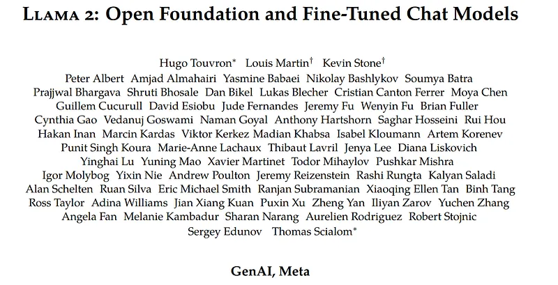
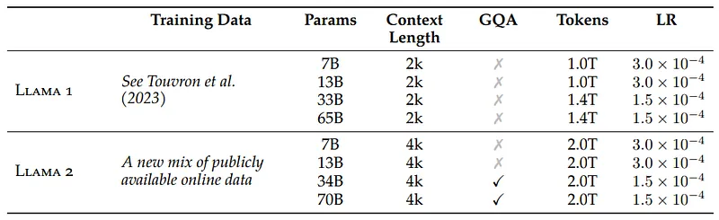
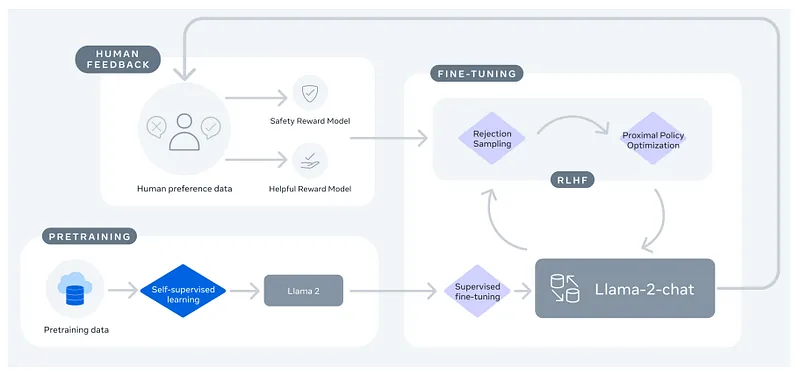
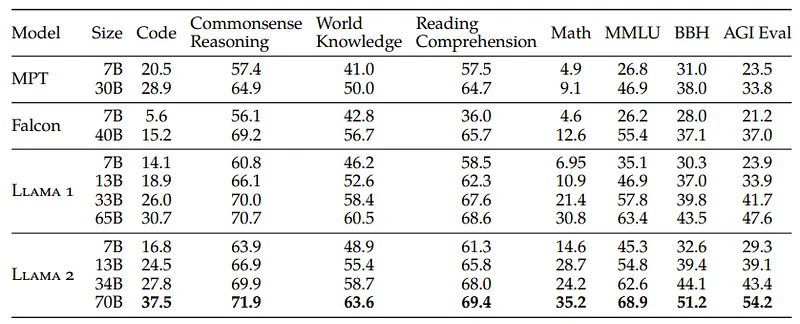
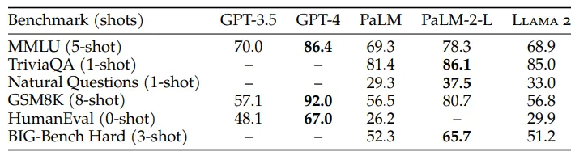
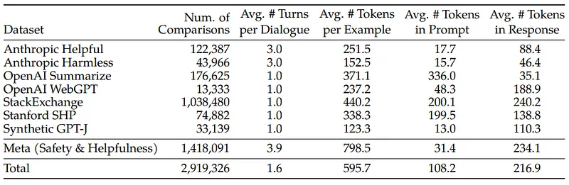
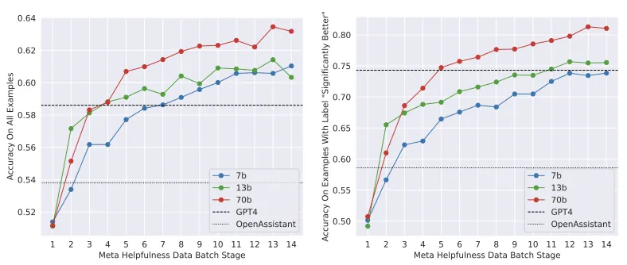
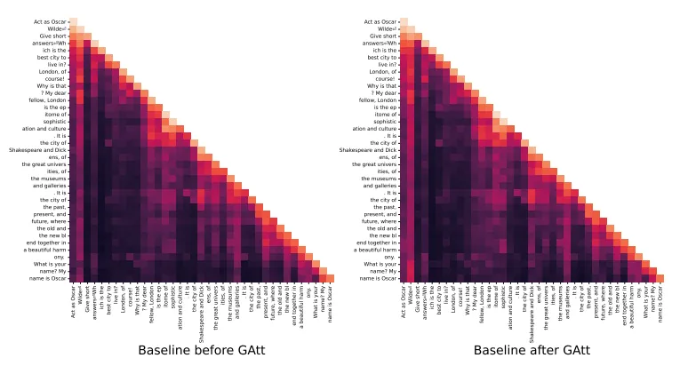
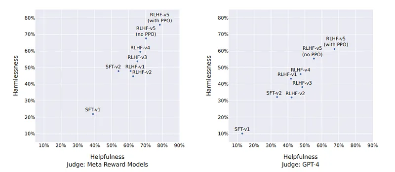
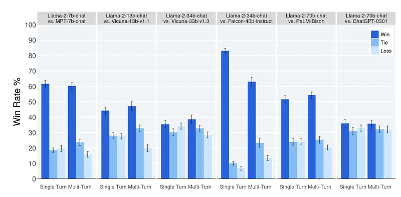

# Papers Explained 60 - Llama 2

Llama 2 is a collection of pretrained and fine-tuned large language models (LLMs) ranging in scale from 7 billion to 70 billion parameters. Their fine-tuned LLMs, called Llama 2-Chat, are optimized for dialogue use cases.

This page ingests the source article into the wiki and connects it to [[Papers Explained Corpus]], [[Large Language Models]], [[Reasoning Models]], [[Embedding and Retrieval]], [[Code Models]].

## Source Metadata

- Source file: `raw/2023-10-09_Papers-Explained-60--Llama-2-3e415c5b9b17.md`
- Source title: Papers Explained 60: Llama 2
- Published: 2023-10-09
- Canonical: [https://medium.com/@ritvik19/papers-explained-60-llama-v2-3e415c5b9b17](https://medium.com/@ritvik19/papers-explained-60-llama-v2-3e415c5b9b17)

## Key Ideas

- Most of the pretraining setting and model architecture is adopted from Llama 1. The standard transformer architecture is used, pre-normalization is applied using RMSNorm, and the SwiGLU activation function and rotary positional embeddings are used.
- The same tokenizer as Llama 1 is used; it employs a bytepair encoding (BPE) algorithm. As with Llama 1, all numbers are split into individual digits and bytes are used to decompose unknown UTF-8 characters. The total vocabulary size is 32k tokens.
- The pretraining approach begins with using an optimized auto-regressive transformer but makes several changes to improve performance as mentioned.
- The training corpus includes a new mix of data from publicly available sources, which does not include data from Meta’s products or services. Data is removed from certain sites known to contain a high volume of personal information about private individuals.
- Code: average pass@1 scores on HumanEval and MBPP.

## Notes

Llama 2 is a collection of pretrained and fine-tuned large language models (LLMs) ranging in scale from 7 billion to 70 billion parameters. Their fine-tuned LLMs, called Llama 2-Chat, are optimized for dialogue use cases.

## Model Overview

Most of the pretraining setting and model architecture is adopted from Llama 1. The standard transformer architecture is used, pre-normalization is applied using RMSNorm, and the SwiGLU activation function and rotary positional embeddings are used. The primary architectural differences from Llama 1 include increased context length and grouped-query attention.

*Figure: Llama 2 family of models.*

### Tokenizer

The same tokenizer as Llama 1 is used; it employs a bytepair encoding (BPE) algorithm. As with Llama 1, all numbers are split into individual digits and bytes are used to decompose unknown UTF-8 characters. The total vocabulary size is 32k tokens.

## Training Overview

*Figure: Training of Llama 2-Chat*

The training process begins with the pretraining of Llama 2 using publicly available online sources. Following this, an initial version of Llama 2-Chat is created through the application of supervised fine-tuning. Subsequently, the model is iteratively refined using Reinforcement Learning with Human Feedback (RLHF) methodologies, specifically through rejection sampling and Proximal Policy Optimization (PPO). Throughout the RLHF stage, the accumulation of iterative reward modeling data in parallel with model enhancements is crucial to ensure the reward models remain within the distribution.

## Pretraining

The pretraining approach begins with using an optimized auto-regressive transformer but makes several changes to improve performance as mentioned.

The training corpus includes a new mix of data from publicly available sources, which does not include data from Meta’s products or services. Data is removed from certain sites known to contain a high volume of personal information about private individuals. Models are trained on 2 trillion tokens of data as this provides a good performance–cost trade-off, up-sampling the most factual sources in an effort to increase knowledge and dampen hallucinations.

### Pretrained Model Evaluation

*Figure: Overall performance on grouped academic benchmarks compared to open-source base models.*

*Figure: Comparison to closed-source models on academic benchmarks.*

- Code: average pass@1 scores on HumanEval and MBPP.

- Commonsense Reasoning: the average of PIQA, SIQA, HellaSwag, WinoGrande, ARC easy and challenge, OpenBookQA, and CommonsenseQA. 7-shot results for CommonSenseQA and 0-shot results are reported for all other benchmarks.

- World Knowledge: average of 5-shot performance on NaturalQuestions and TriviaQA.

- Reading Comprehension: 0-shot average on SQuAD, QuAC, and BoolQ.

- MATH: average of the GSM8K (8 shot) and MATH (4 shot) benchmarks at top 1.

- Popular Aggregated Benchmarks: overall results for MMLU (5 shot), Big Bench Hard (BBH) (3 shot), and AGI Eval (3–5 shot). For AGI Eval, only the English tasks are evaluated.

## Fine Tuning

Llama 2-Chat is the result of several months of research and iterative applications of alignment techniques, including both instruction tuning and RLHF, requiring significant computational and annotation resources.

The SFT stage is started with publicly available instruction tuning data.

Third-party SFT data is available from many different sources, but many of these have insufficient diversity and quality — in particular for aligning LLMs towards dialogue-style instructions. As a result, the first focus was placed on collecting several thousand examples of high-quality SFT data.

SFT annotations in the order of tens of thousands were enough to achieve a high-quality result. SFT annotation was stopped after collecting a total of 27,540 annotations.

For supervised fine-tuning a sequence length of 4096 tokens was used.

For the fine-tuning process, each sample consists of a prompt and an answer. To ensure the model sequence length is properly filled, all the prompts and answers from the training set were concatenated. A special token is utilized to separate the prompt and answer segments. An autoregressive objective and zero-out the loss on tokens from the user prompt are used, so as a result, only answer tokens are backpropagated. The model is fine-tuned for 2 epochs.

### Reinforcement Learning with Human Feedback (RLHF)

RLHF is a model training procedure that is applied to a fine-tuned language model to further align model behavior with human preferences and instruction following. Data representing empirically sampled human preferences is collected, whereby human annotators select which of two model outputs they prefer. This human feedback is subsequently used to train a reward model, which learns patterns in the preferences of the human annotators and can then automate preference decisions.

### Human Preference Data Collection

Annotators are asked to first write a prompt, and then choose between two sampled model responses. In order to maximize the diversity, the two responses to a given prompt are sampled from two different model variants, and varying the temperature hyper-parameter.

In addition to giving participants a forced choice, annotators are asked to label the degree to which they prefer their chosen response over the alternative: either their choice is significantly better, better, slightly better, or negligibly better/ unsure. For our collection of preference annotations, we focus on helpfulness and safety. Helpfulness refers to how well Llama 2-Chat responses fulfill users’ requests and provide the requested information; safety refers to whether Llama 2-Chat’s responses are unsafe.

*Figure: Statistics of human preference data for reward modeling*

### Reward Modeling

The reward model takes a model response and its corresponding prompt (including contexts from previous turns) as inputs and outputs a scalar score to indicate the quality (e.g., helpfulness and safety) of the model generation.

Two separate reward models, one optimized for helpfulness (referred to as Helpfulness RM) and another for safety (Safety RM) are trained.

### Training Details

The model is trained for 1 epoch as earlier experiments suggested that training longer can lead to over-fitting.

### Scaling trends for the reward model.

*Figure: Scaling trends for the reward model.*

- Larger models achieve better performance with similar data volumes.

- Scaling performance has not plateaued with the current data annotations, indicating potential for further improvement.

### GAtt Method

Assume having access to a multi-turn dialogue dataset between two persons (e.g., a user and an assistant), with a list of messages [u1, a1, . . . , un, an], where un and a correspond to the user and assistant messages for turn n, respectively. Then, we define an instruction, inst, that should be respected throughout the dialogue. For example, inst could be “act as.” We can then synthetically concatenate this instruction to all the user messages of the conversation.

GAtt is applied after RLHF V3 and a quantitative analysis indicating that GAtt is consistent up to 20+ turns until the maximum context length is reached is reported.

*Figure: Attention visualization for a dialogue with and without GAtt. We considered the maximum activations across the network and we bin neighboring tokens together.*

### RLHF Results

*Figure: Evolution of Llama 2-Chat.*

- After RLHF-V3, the models outperform ChatGPT on both axes with harmlessness and helpfulness exceeding 50%.

- There is a concern that the in-house reward metric may be biased in favor of Llama 2-Chat, so GPT-4 is also used for a fair comparison.

- Llama 2-Chat has a higher win-rate when compared to ChatGPT, with over 60% win-rate for the latest Llama 2-Chat.

*Figure: Human evaluation results for Llama 2-Chat models compared to open- and closed-source models across ~4,000 helpfulness prompts with three raters per prompt.*

- Llama 2-Chat models outperformed open-source models significantly on both single-turn and multi-turn prompts.

- Llama 2-Chat 7B model outperformed MPT-7B-chat on 60% of prompts.

- Llama 2-Chat 34B had a win rate of over 75% against equivalently sized Vicuna-33B and Falcon 40B models.

- The largest Llama 2-Chat model was competitive with ChatGPT, with a 36% win rate and 31.5% tie rate relative to ChatGPT.

- Llama 2-Chat 70B model outperformed the PaLM-bison chat model by a large percentage on the prompt set.

## Paper

[Llama 2: Open Foundation and Fine-Tuned Chat Models](https://ai.meta.com/research/publications/llama-2-open-foundation-and-fine-tuned-chat-models/)

## Figures

Figures from the Medium HTML export (`raw/2023-10-09_Papers-Explained-60--Llama-2-3e415c5b9b17.md`); local copies under `wiki/assets/papers-explained-60-llama-2/` when download succeeded.

| Figure | Caption |
|--------|---------|
|  | Title card: Llama 2. |
|  | Llama 2 family of models. |
|  | Training of Llama 2-Chat. |
|  | Overall performance on grouped academic benchmarks compared to open-source base models. |
|  | Comparison to closed-source models on academic benchmarks. |
|  | Statistics of human preference data for reward modeling. |
|  | Scaling trends for the reward model. |
|  | Attention visualization for a dialogue with and without GAtt. We considered the maximum activations across the network and we bin neighboring tokens together. |
|  | Evolution of Llama 2-Chat. |
|  | Human evaluation results for Llama 2-Chat models compared to open- and closed-source models across ~4,000 helpfulness prompts with three raters per prompt. |
## Related

- [[Papers Explained Corpus]]
- [[Large Language Models]]
- [[Reasoning Models]]
- [[Embedding and Retrieval]]
- [[Code Models]]
- [[Papers Explained 59 - Falcon]]
- [[Papers Explained 61 - Humpback]]

#summary #topic
