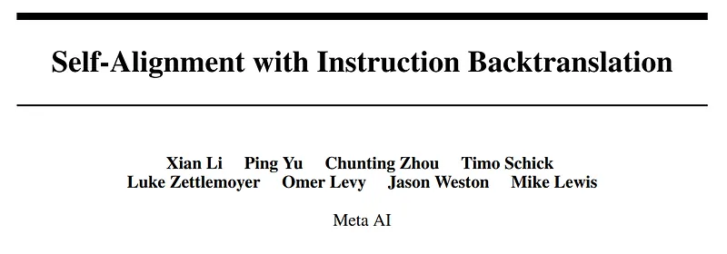
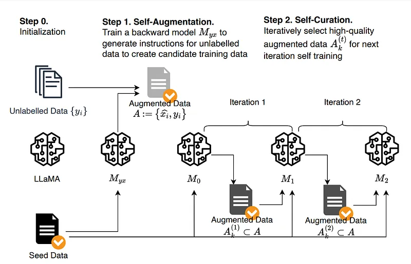
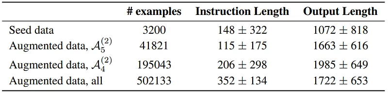
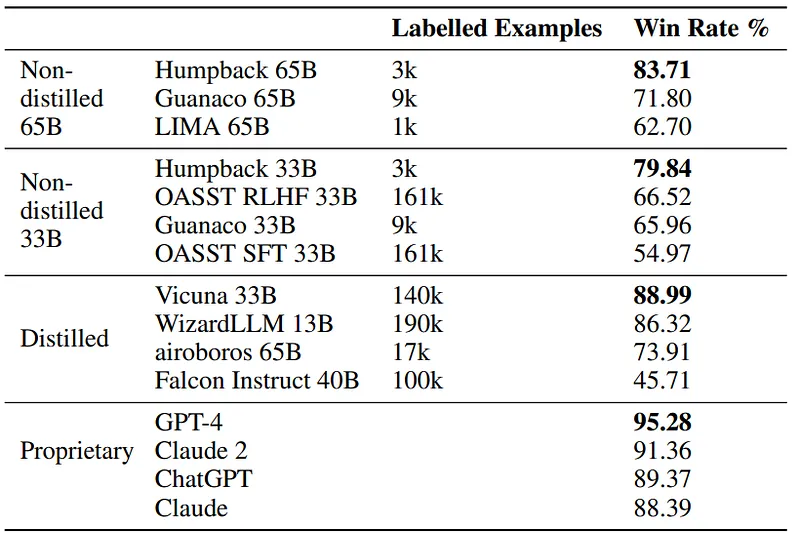
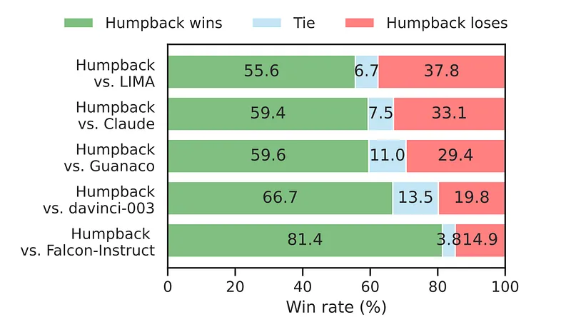

# Papers Explained 61 - Humpback

Instruction back translation is a scalable method to build a high-quality instruction following language model by automatically labeling human written text with corresponding instructions.

This page ingests the source article into the wiki and connects it to [[Papers Explained Corpus]], [[Large Language Models]], [[Multilingual Models]], [[Synthetic Data]], [[Safety and Alignment]], [[Reinforcement Learning Topic]], [[Supervised Fine-Tuning]].

## Source Metadata

- Source file: `raw/2023-10-13_Papers-Explained-61--Humpback-46992374fc34.md`
- Source title: Papers Explained 61: Humpback
- Published: 2023-10-13
- Canonical: [https://medium.com/@ritvik19/papers-explained-61-humpback-46992374fc34](https://medium.com/@ritvik19/papers-explained-61-humpback-46992374fc34)

## Key Ideas

- Starting from a base language model, a small number of seed examples of (instruction, output) pairs, and a collection of unlabelled documents that are considered candidate outputs for unknown instructions, the base model is finetuned with (output...
- Starting from an intermediate instruction-following model M0 fine-tuned from seed examples only, it selects high-quality (instruction, output) pairs A(1)k from the candidates from the previous step.
- Seed Data: 3200 examples from Open Assistant Dataset.
- Base model: LLaMA &B, 33B, 65B. The trained LLama-based instruction backtranslation models are called Humpback.
- Unlabelled data: English portion of the Clueweb corpus.

## Notes

Instruction back translation is a scalable method to build a high-quality instruction following language model by automatically labeling human written text with corresponding instructions. Finetuning LLaMa on two iterations of this approach yields a model that outperforms all other LLaMa-based models on the Alpaca leaderboard, demonstrating highly effective self-alignment.

## Instruction Back Translation

### Self-Augmentation (generating instructions):

Starting from a base language model, a small number of seed examples of (instruction, output) pairs, and a collection of unlabelled documents that are considered candidate outputs for unknown instructions, the base model is finetuned with (output, instruction) pairs from the seed examples as an instruction prediction model Myx, which is used to generate candidate instructions for outputs from the unlabelled data.

### Self-Curation (selecting high-quality examples):

Starting from an intermediate instruction-following model M0 fine-tuned from seed examples only, it selects high-quality (instruction, output) pairs A(1)k from the candidates from the previous step. This is done using prompting, instructing the trained model to rate the quality of a candidate pair on a 5-point scale. These are then used as fine-tuning data for the next intermediate model M1, which is in turn used to select training data for obtaining M2.

*Figure: Statistics of seed, self-augmentation, and self-curation finetuning data. Instruction and output lengths are given as the number of characters.*

## Experimental Setup

Seed Data: 3200 examples from Open Assistant Dataset.

Base model: LLaMA &B, 33B, 65B. The trained LLama-based instruction backtranslation models are called Humpback.

Unlabelled data: English portion of the Clueweb corpus.

Baselines:

- text-davinci-003

- LIMA

- Guanaco

Evaluation Sources:

- Vicuna (80 prompts)

- Self-instruct (252 prompts)

- Open Assistant (188 prompts)

- Koala (156 prompts)

- HH_RLHF (129 prompts)

- LIMA (300 prompts)

- crowdsourced from authors (64 prompts).

## Evaluation

### Alpaca Eval

*Figure: Results on the Alpaca leaderboard (win rate over text-davinci-003 evaluated by GPT-4).*

- Humpback outperforms other methods not relying on distilled data by a wide margin, and closes the gap to proprietary models

### Human Evaluation

- Humpback is preferred to both open-source and proprietary instruction-tuned models in pairwise human preference judgments.

## Paper

Self-Alignment with Instruction Backtranslation [2308.06259](https://arxiv.org/abs/2308.06259)

## Figures

Figures from the Medium HTML export (`raw/2023-10-13_Papers-Explained-61--Humpback-46992374fc34.md`); local copies under `wiki/assets/papers-explained-61-humpback/` when download succeeded.

| Figure | Caption |
|--------|---------|
|  | Title card: Humpback. |
|  | Instruction Back Translation. |
|  | Statistics of seed, self-augmentation, and self-curation finetuning data. Instruction and output lengths are given as the number of characters. |
|  | Results on the Alpaca leaderboard (win rate over text-davinci-003 evaluated by GPT-4). |
|  | Evaluation Sources. |
## Related

- [[Papers Explained Corpus]]
- [[Large Language Models]]
- [[Multilingual Models]]
- [[Synthetic Data]]
- [[Safety and Alignment]]
- [[Reinforcement Learning Topic]]
- [[Supervised Fine-Tuning]]
- [[Papers Explained 60 - Llama 2]]
- [[Papers Explained 62 - Code Llama]]

#summary #topic
