# Papers Explained 62 - Code Llama

Code Llama is a family of large language models for code based on Llama 2 providing state-of-the-art performance among open models, infilling capabilities, support for large input contexts, and zero-shot instruction following ability for programming tasks.

This page ingests the source article into the wiki and connects it to [[Papers Explained Corpus]], [[Large Language Models]], [[Code Models]], [[Synthetic Data]], [[Embedding and Retrieval]], [[Reasoning Models]], [[Supervised Fine-Tuning]].

## Source Metadata

- Source file: `raw/2023-10-16_Papers-Explained-62--Code-Llama-ee266bfa495f.md`
- Source title: Papers Explained 62: Code Llama
- Published: 2023-10-16
- Canonical: [https://medium.com/@ritvik19/papers-explained-62-code-llama-ee266bfa495f](https://medium.com/@ritvik19/papers-explained-62-code-llama-ee266bfa495f)

## Key Ideas

- There are multiple flavors to cover a wide range of applications: foundation models (Code Llama), Python specializations (Code Llama — Python), and instruction-following models (Code Llama — Instruct) with 7B, 13B, and 34B parameters each.
- Code Llama is primarily trained on a dataset of publicly available code that has been nearly deduplicated. Additionally, 8% of our sample data is derived from natural language datasets related to code.
- The data is tokenized using byte pair encoding (BPE), with the same tokenizer as Llama and Llama 2 being employed.
- Code infilling is the task of predicting the missing part of a program given a surrounding context. To train for infilling, the causal masking concept is employed by reordering sequences and predicting them sequentially.
- Code Llama introduces a specialized fine-tuning phase (LCFT) where models are exposed to longer sequences (16,384 tokens), enhancing their long-range capabilities without significantly raising training costs.

## Notes

Code Llama is a family of large language models for code based on Llama 2 providing state-of-the-art performance among open models, infilling capabilities, support for large input contexts, and zero-shot instruction following ability for programming tasks.

There are multiple flavors to cover a wide range of applications: foundation models (Code Llama), Python specializations (Code Llama — Python), and instruction-following models (Code Llama — Instruct) with 7B, 13B, and 34B parameters each. All models are trained on sequences of 16k tokens and show improvements on inputs with up to 100k tokens.

*Figure: The Code Llama specialization pipeline. The different stages of fine-tuning annotated with the number of tokens seen during training. Infilling-capable models are marked with the ⇄ symbol.*

## Dataset

*Figure: Training dataset of Code Llama and Code Llama — Python. Code Llama is trained on 500B additional tokens and Code Llama — Python is further trained on 100B tokens.*

Code Llama is primarily trained on a dataset of publicly available code that has been nearly deduplicated. Additionally, 8% of our sample data is derived from natural language datasets related to code. Within this dataset, there are many discussions about code and code snippets that are included in natural language questions or answers. To maintain natural language understanding skills within the model, a small proportion of our batches are also sampled from a natural language dataset.

The data is tokenized using byte pair encoding (BPE), with the same tokenizer as Llama and Llama 2 being employed. Initial experiments have indicated that the performance of our models on MBPP is improved by the inclusion of batches sampled from our natural language dataset

### Infilling

Code infilling is the task of predicting the missing part of a program given a surrounding context. To train for infilling, the causal masking concept is employed by reordering sequences and predicting them sequentially.

### Long Context Fine Tuning

Code Llama introduces a specialized fine-tuning phase (LCFT) where models are exposed to longer sequences (16,384 tokens), enhancing their long-range capabilities without significantly raising training costs. This approach resembles recent methods like fine-tuning by position interpolation but with the alteration of rotation frequencies in rotary position embeddings.

With rotary embeddings, the query and key vectors xn_ at position n are subject to a linear transformation R^d _Θ,nxn, where R^d _Θ,n is a block diagonal matrix with entries of the form

and d denotes the embedding dimension. Rotation frequencies are computed as θ_i = θ^ −2i/d

By extending the base period θ for these embeddings from 10,000 to 1,000,000 during fine-tuning, Code Llama models demonstrate effective performance in extended sequence lengths, extrapolation capabilities, and stability on sequences up to 100,000 tokens.

## Experiments

For comparison purposes, Code Llama — Python 34B is also finetuned on 15,000 unnatural instructions using the same prompts as for the self-instruct dataset. This model is not released but clear improvements in HumanEval and MBPP are observed which are indicative of the improvements that can be reached with a small set of high-quality coding data.

Unnatural Instructions are unconventional and varied instructions, acquired with minimal human effort, achieved by employing model-generated content rather than human input.

### Python code generation

*Figure: Code Llama pass@ scores on HumanEval and MBPP.*

*Figure: Code Llama pass@ scores on APPS.*

- Model specialization significantly boosts code generation capabilities, evident in performance gains from Llama 2 to Code Llama, and Code Llama to Code Llama — Python.

- Training on smaller additional token sets from a code-heavy dataset yields substantial performance improvements on HumanEval and MBPP benchmarks.

- Larger models specialized for coding outperform their smaller counterparts across various metrics on HumanEval, MBPP, and APPS benchmarks.

- Scaling the number of parameters positively impacts specialized coding models, with larger models showing substantial gains on coding tasks, according to Chinchilla scaling laws.

### Multilingual evaluation

*Figure: Multi-Lingual HE Pass@1 scores.*

*Figure: Correlations between Languages.*

- The Code Llama models outperform Llama 2 models, showing significant improvement. Code Llama 7B even outperforms Llama 2 70B.

- The Code Llama models exhibit strong performance compared to other publicly available models like CodeGen-Multi, StarCoder, and Codex.

- Correlations between model performance on different languages are observed, with high correlations for languages like C++, C#, Java, and PHP, as well as unexpectedly strong correlations between Python and Bash.

- The size and expressiveness of the models positively correlate with performance across different languages, indicating that larger and more expressive models tend to perform better in multilingual scenarios.

### Infilling evaluations

*Figure: Comparison of models with and without FIM (fill-in-the-middle) training.*

*Figure: Multilingual HumanEval single line infilling with MultiPL-E.*

- Previous studies suggest that using an infilling objective in code models can replace traditional next-token prediction with minimal impact on left-to-right autoregressive test losses and only slight degradation in downstream evaluation performance.

- The models achieved state-of-the-art performance in code infilling benchmarks based on HumanEval benchmark, both in random span infilling and other programming languages.

- While models outperformed others, results indicated that random span infilling performed worse in suffix-prefix-middle (SPM) format compared to prefix-suffix-middle (PSM) format, due to unimplemented token healing.

- Translation of the benchmark to other programming languages also showed that the models, including Code Llama 7B, outperformed open-infilling models across multiple languages, with improved performance in SPM format prompts.

### Long context evaluations

*Figure: Code Llama behavior on long sequences. (a) Perplexity on large source files (≥50 kB) from the validation data from the code dataset. The dashed line marks the fine-tuning context length. Perplexity decreases for up to 100K tokens for all Code Llama sizes. (b) Accuracy on a synthetic key retrieval task, with a context of 16K tokens and comparison to gpt-3.5-turbo.*

*Figure: Average single-line completion performance on LCC-balanced.*

- The Code Llama model exhibits a steady decrease in perplexity beyond a sequence length of 16,384 tokens, showing its ability to effectively handle long sequences without the significant perplexity increase that is commonly observed in transformer models during extrapolation.

- The Code Llama models perform well in key retrieval tasks, specifically in completing assert statements in Python code, showing strong performance on the sequence length they were trained on. However, there’s a drop in performance for longer sequences, highlighting challenges in handling extended context.

- Long Context Fine-Tuning (LCFT) significantly improves code completion accuracy on long sequences. Models fine-tuned to handle long contexts generate more meaningful completions, demonstrating that longer contexts provide valuable information for code completion tasks.

- While LCFT enhances performance on long sequences, it slightly decreases performance on shorter sequences in standard code synthesis benchmarks. There is an average reduction in accuracy on HumanEval pass@1 and MBPP metrics.

## Paper

Code Llama: Open Foundation Models for Code [2308.12950](https://arxiv.org/abs/2308.12950)

## Figures

Figures from the Medium HTML export (`raw/2023-10-16_Papers-Explained-62--Code-Llama-ee266bfa495f.md`); local copies under `wiki/assets/papers-explained-62-code-llama/` when download succeeded.

| Figure | Caption |
|--------|---------|
| 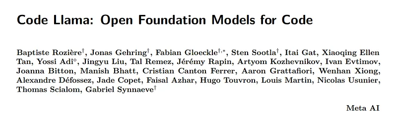 | Title card: Code Llama. |
| 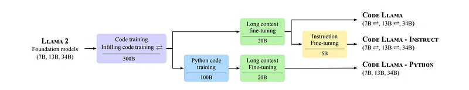 | The Code Llama specialization pipeline. The different stages of fine-tuning annotated with the number of tokens seen during training. Infilling-capable models are marked with the ⇄ symbol. |
| 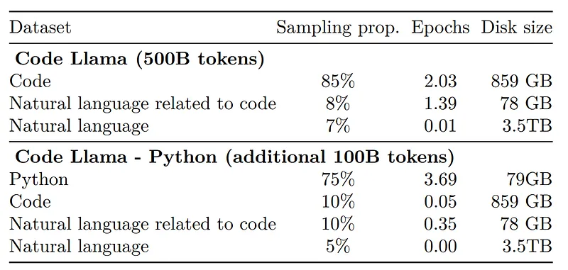 | Training dataset of Code Llama and Code Llama — Python. Code Llama is trained on 500B additional tokens and Code Llama — Python is further trained on 100B tokens. |
| 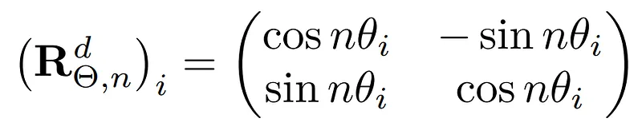 | and d denotes the embedding dimension. |
| 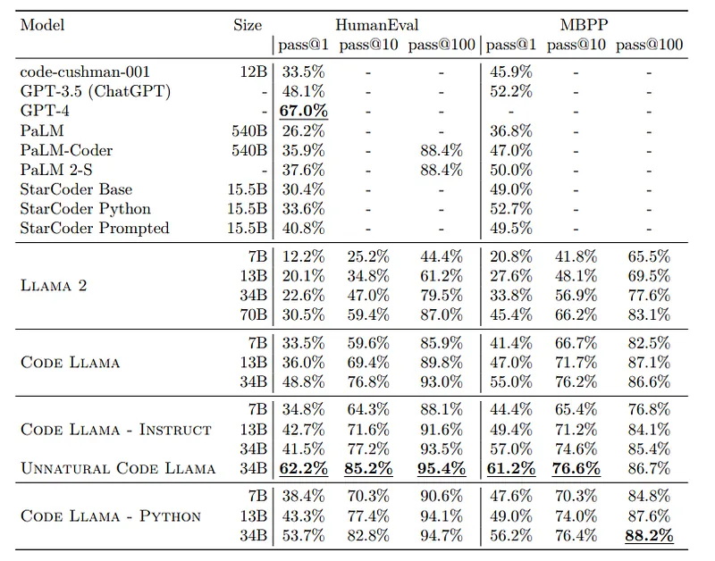 | Code Llama pass@ scores on HumanEval and MBPP. |
| 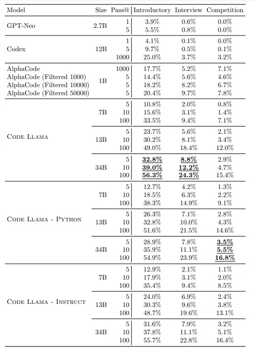 | Code Llama pass@ scores on APPS. |
| 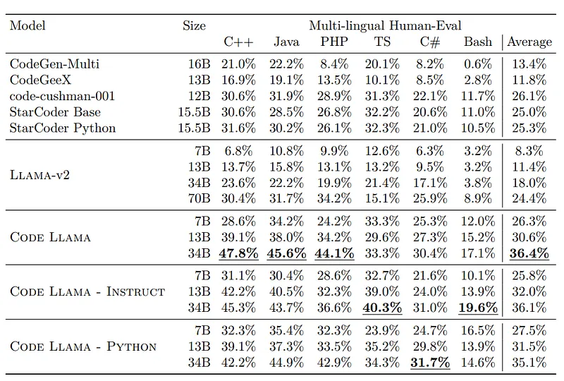 | Multi-Lingual HE Pass@1 scores. |
| 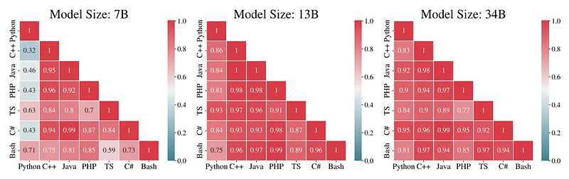 | Correlations between Languages. |
| 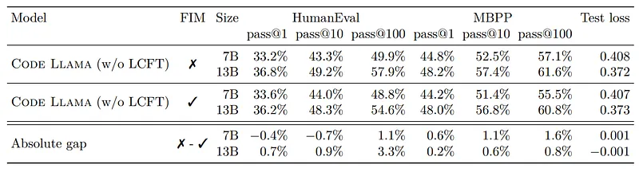 | Comparison of models with and without FIM (fill-in-the-middle) training. |
| 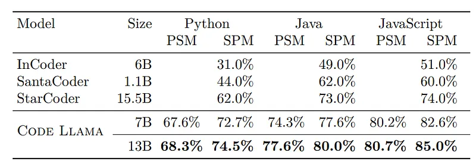 | Multilingual HumanEval single line infilling with MultiPL-E. |
| 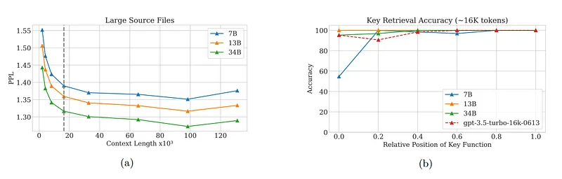 | Code Llama behavior on long sequences. (a) Perplexity on large source files (≥50 kB) from the validation data from the code dataset. The dashed line marks the fine-tuning context length. Perplexity decreases for up to 100K tokens for all Code Llama sizes. (b) Accuracy on a synthetic key retrieval task, with a context of 16K tokens and comparison to gpt-3.5-turbo. |
| 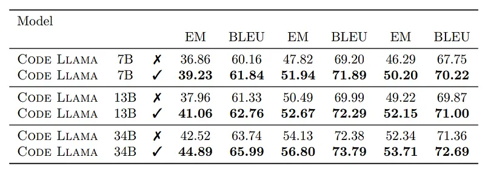 | Average single-line completion performance on LCC-balanced. |
## Related

- [[Papers Explained Corpus]]
- [[Large Language Models]]
- [[Code Models]]
- [[Synthetic Data]]
- [[Embedding and Retrieval]]
- [[Reasoning Models]]
- [[Supervised Fine-Tuning]]
- [[Papers Explained 61 - Humpback]]
- [[Papers Explained 63 - LLaMA 2 Long]]

#summary #topic
