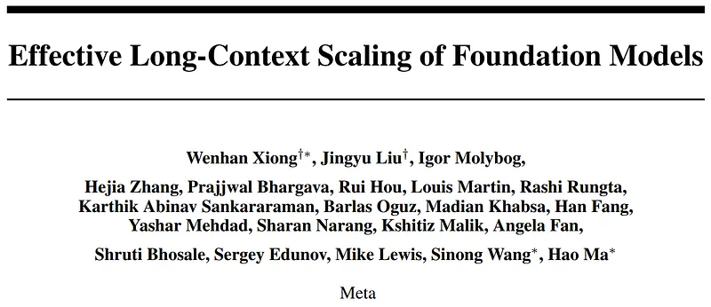
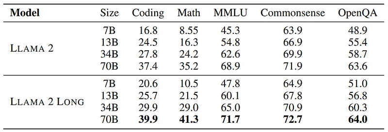
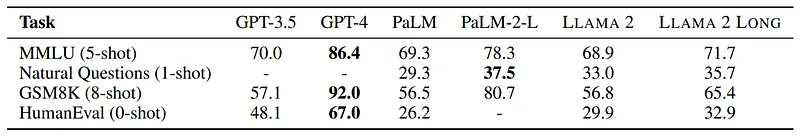
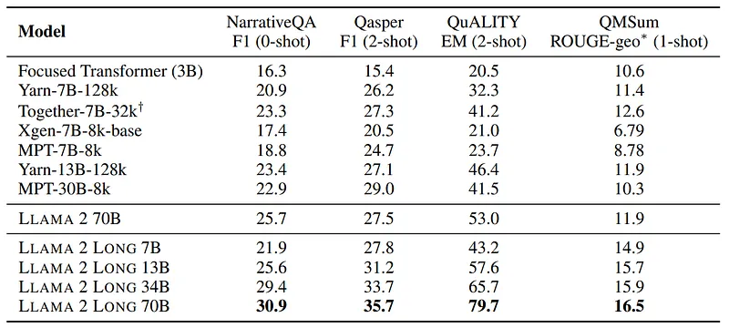
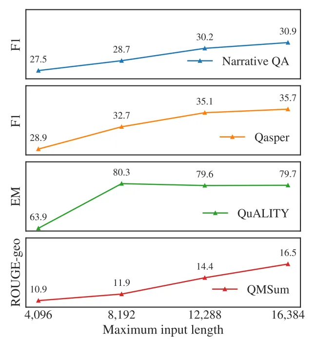
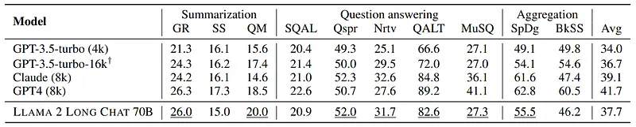
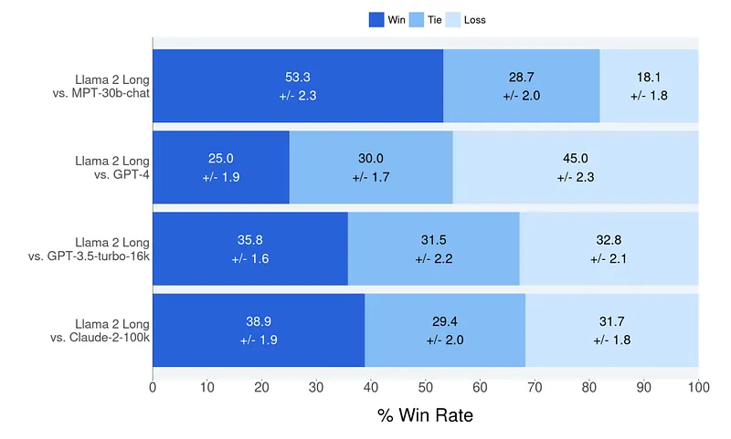

# Papers Explained 63 - LLaMA 2 Long

LLaMA 2 Long is a series of long-context LLMs built through continual pretraining from LLAMA 2 with longer training sequences that support effective context windows of up to 32,768 tokens.

This page ingests the source article into the wiki and connects it to [[Papers Explained Corpus]], [[Large Language Models]], [[Long Context]], [[Reinforcement Learning Topic]].

## Source Metadata

- Source file: `raw/2023-10-20_Papers-Explained-63--LLaMA-2-Long-84d33c26d14a.md`
- Source title: Papers Explained 63: LLaMA 2 Long
- Published: 2023-10-20
- Canonical: [https://medium.com/@ritvik19/papers-explained-63-llama-2-long-84d33c26d14a](https://medium.com/@ritvik19/papers-explained-63-llama-2-long-84d33c26d14a)

## Key Ideas

- Training with longer sequence lengths can introduce significant computational overhead due to the quadratic attention calculations. This is the main motivation for our continual pre-training approach.
- Sparse Attention is not applied, since given LLAMA 2 70B’s model dimension (h = 8192), the cost of attention matrix calculation and value aggregation only becomes a computation bottleneck when the sequence length exceeds 49,152 tokens.
- A minimal yet necessary modification is made on the RoPE positional encoding for long-context modeling — decreasing the rotation angle (controlled by the hyperparameter “base frequency b”), which reduces the decaying effect of RoPE for distant tokens.
- Experiments are done with pretrain data mixes for improving long-context abilities, either by adjusting the ratio of LLAMA 2’s pre-training data or adding new long text data.
- LLAMA 2 checkpoints are continually pretrained with use of FLASH ATTENTION and increased sequence length while keeping the same number of tokens per batch as in LLAMA 2.

## Notes

LLaMA 2 Long is a series of long-context LLMs built through continual pretraining from LLAMA 2 with longer training sequences that support effective context windows of up to 32,768 tokens.

## Continual Pretraining

Training with longer sequence lengths can introduce significant computational overhead due to the quadratic attention calculations. This is the main motivation for our continual pre-training approach. The original Llama 2 architecture is kept nearly intact with only a few necessary modifications to positional encodings, which is crucial for the model to attend longer.

Sparse Attention is not applied, since given LLAMA 2 70B’s model dimension (h = 8192), the cost of attention matrix calculation and value aggregation only becomes a computation bottleneck when the sequence length exceeds 49,152 tokens.

A minimal yet necessary modification is made on the RoPE positional encoding for long-context modeling — decreasing the rotation angle (controlled by the hyperparameter “base frequency b”), which reduces the decaying effect of RoPE for distant tokens.

Experiments are done with pretrain data mixes for improving long-context abilities, either by adjusting the ratio of LLAMA 2’s pre-training data or adding new long text data. It is found that often the quality of the data plays a more critical role than the length of texts for long-context continual pretraining.

LLAMA 2 checkpoints are continually pretrained with use of FLASH ATTENTION and increased sequence length while keeping the same number of tokens per batch as in LLAMA 2.

## Instruction Tuning

Gathering human demonstrations and preference labels ) for aligning the LLM with specific tasks can be a difficult and expensive process.

The challenge becomes more pronounced when dealing with long-context scenarios, as it often involves complex information flow and specialized knowledge, such as processing dense legal or scientific documents.

Hence the RLHF dataset used in LLAMA 2 CHAT is leveraged by augmenting it with synthetic self-instructed long data generated by LLAMA 2 CHAT. The idea is that by using a large amount of short-prompt data, the model can learn various skills and then transfer that knowledge to long-context scenarios through self-instructed data.

The data generation process focuses on question-answer (QA) format tasks. Starting from a long document in their pretraining corpus, a random chunk of text is selected and LLAMA 2 CHAT is prompted to generate question-answer pairs based on the information in that text chunk. Both long and short answers are collected with different prompts. Additionally, a self-critique step is adopted where LLAMA 2 CHAT is prompted to verify the answers it generates.

For short instruction data, the data points are concatenated as sequences of up to 16,384 tokens. For long instruction data, padding tokens are added on the right, allowing the models to process each long instance individually without truncation.

## Results

### Short Tasks

*Figure: Performance on standard short-context benchmarks.*

- The model generally performs on par with or better than LLAMA 2.

- Significant improvements are observed in coding, math, and knowledge-intensive tasks like MMLU.

*Figure: Comparison with closed models on standard short tasks.*

- The model outperforms GPT-3.5 on MMLU and GSM8k.

- The improvements are attributed to additional computational FLOPs and knowledge gained from long data.

### Long Tasks

*Figure: Comparison with open-source long-context models on research benchmarks.*

- The models achieve superior performance compared to the mentioned models.

- “Together-7B 32k” is the only model at the 7B scale that can match the model’s performance.

- Note that “Together-7B 32k” is not purely self-supervised and has been fine-tuned using a large supervised dataset for few-shot improvement.

### Effective Context Utilization

*Figure: Performance on long-context tasks as the maximum context lengths of prompts increase.*

- Increasing the context window improves results on long tasks.

- Language modeling loss follows a power-law plus constant scaling relationship with context length.

- The model shows performance gains on language modeling loss up to 32,768 tokens of text but with diminishing returns.

- Doubling the context length can reduce the loss by a factor of approximately 0.7, plus a model-specific constant.

- Larger models can leverage contexts more effectively, as indicated by the larger β value of the curves.

### Instruction Tuning Results

*Figure: ZeroSCROLLS long-context leaderboard results.*

- Testing was conducted on the instruction-tuned model on the ZeroSCROLLS dataset, consisting of 10 long-context datasets covering summarization, question answering, and multi-document aggregation tasks.

- Results show that the 70B chat model outperforms gpt-3.5-turbo-16k on 7 out of 10 tasks, even without using human-annotated long context data.

- Evaluations were also performed on six new long tasks introduced in LEval, showing strong results, particularly in QA tasks aligned with the self-instruct data theme.

### Human Evaluation

*Figure: Human preference on model responses with multi-turn conversation and multi-document search query answering data.*

- Annotators were asked to compare the generation from the instruction finetuned model with proprietary models (MPT-30B-chat, GPT-4, GPT-3.5-turbo-16k, Claude-2)

- Competitive performance achieved with minimal instruction data against MPT-30B-chat, GPT-3.5-turbo-16k, Claude-2

## Paper

Effective Long-Context Scaling of Foundation Models [2309.16039](https://arxiv.org/abs/2309.16039)

## Figures

Figures from the Medium HTML export (`raw/2023-10-20_Papers-Explained-63--LLaMA-2-Long-84d33c26d14a.md`); local copies under `wiki/assets/papers-explained-63-llama-2-long/` when download succeeded.

| Figure | Caption |
|--------|---------|
|  | Title card: LLaMA 2 Long. |
|  | Performance on standard short-context benchmarks. |
|  | Comparison with closed models on standard short tasks. |
|  | For short instruction data, the data points are concatenated as sequences of up to 16,384 tokens. |
|  | Comparison with open-source long-context models on research benchmarks. |
|  | Performance on long-context tasks as the maximum context lengths of prompts increase. |
|  | ZeroSCROLLS long-context leaderboard results. |
## Related

- [[Papers Explained Corpus]]
- [[Large Language Models]]
- [[Long Context]]
- [[Reinforcement Learning Topic]]
- [[Papers Explained 62 - Code Llama]]
- [[Papers Explained - Mistral 7B]]

#summary #topic
