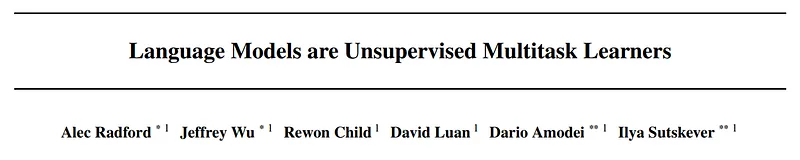
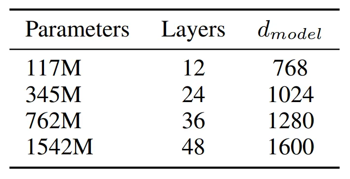
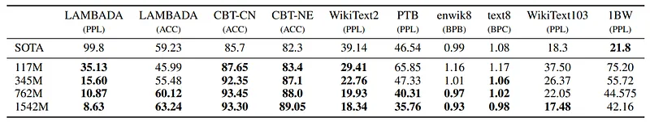
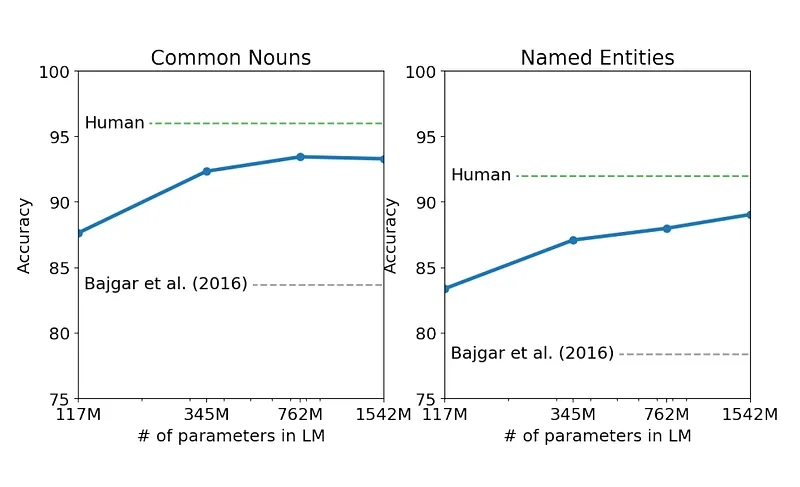
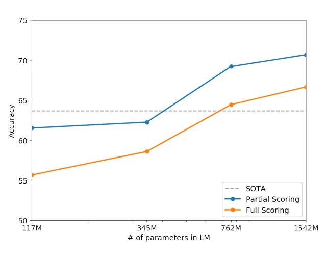
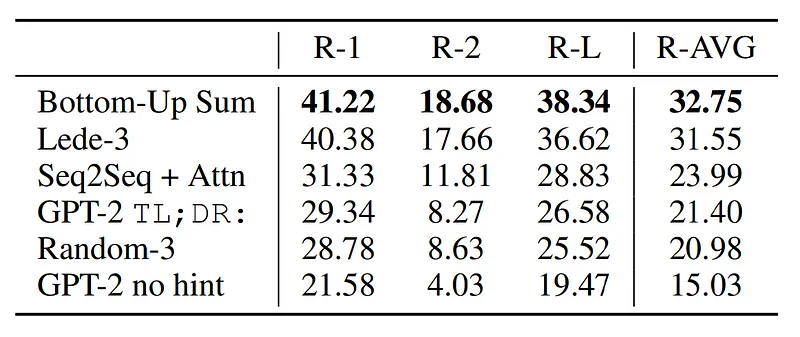

# Papers Explained 65 - GPT-2

GPT-2 demonstrates that language models begin to learn various language processing tasks without any explicit supervision. GPT-2 is trained on a new dataset of millions of web pages called WebText.

This page ingests the source article into the wiki and connects it to [[Papers Explained Corpus]], [[Large Language Models]], [[Synthetic Data]], [[Evaluation and Benchmarks]], [[Document AI]].

## Source Metadata

- Source file: `raw/2023-10-27_Papers-Explained-65--GPT-2-98d0a642e520.md`
- Source title: Papers Explained 65: GPT-2
- Published: 2023-10-27
- Canonical: [https://medium.com/@ritvik19/papers-explained-65-gpt-2-98d0a642e520](https://medium.com/@ritvik19/papers-explained-65-gpt-2-98d0a642e520)

## Key Ideas

- Learning to perform a single task can be expressed in a probabilistic framework as estimating a conditional distribution p(output|input).
- Language provides a flexible way to specify tasks, inputs, and outputs all as a sequence of symbols. Thus making it possible to train a single model to perform many different tasks without the need for explicit supervision.
- Preliminary experiments confirmed that sufficiently large language models are able to perform multitask learning in this toy-ish setup but learning is much slower than in explicitly supervised approaches
- A new web scrape is created, emphasizing on document quality by only scraping those web pages which have been filtered by humans. As a starting point all outbound linking on Reddit having at least 3 karma are scraped.
- All Wikipedia documents are removed from WebText since it is a common data source for other datasets and could complicate analysis due to overlapping training data with test evaluation tasks.

## Notes

GPT-2 demonstrates that language models begin to learn various language processing tasks without any explicit supervision. GPT-2 is trained on a new dataset of millions of web pages called WebText. The experiments show that capacity of the language model is essential to the success of zero-shot transfer and increasing it improves performance in a log-linear fashion across tasks.

## Approach

Learning to perform a single task can be expressed in a probabilistic framework as estimating a conditional distribution p(output|input). Since a general system should be able to perform many different tasks, even for the same input, it should condition not only on the input but also on the task to be performed. That is, it should model p(output|input, task).

Language provides a flexible way to specify tasks, inputs, and outputs all as a sequence of symbols. Thus making it possible to train a single model to perform many different tasks without the need for explicit supervision.

*Figure: Examples of naturally occurring demonstrations of English to French and French to English translation found throughout the WebText training set.*

Preliminary experiments confirmed that sufficiently large language models are able to perform multitask learning in this toy-ish setup but learning is much slower than in explicitly supervised approaches

## Training Dataset

A new web scrape is created, emphasizing on document quality by only scraping those web pages which have been filtered by humans. As a starting point all outbound linking on Reddit having at least 3 karma are scraped. The resulting dataset, WebText, contains the text subset of these 45 million links, which after de-duplication and some heuristic based cleaning contains slightly over 8 million documents for a total of 40 GB of text.

All Wikipedia documents are removed from WebText since it is a common data source for other datasets and could complicate analysis due to overlapping training data with test evaluation tasks.

## Input Representation

Byte Pair Encoding (BPE) is a practical middle ground between character and word level language modeling which effectively interpolates between word level inputs for frequent symbol sequences and character level inputs for infrequent symbol sequences.

However, directly applying BPE to the byte sequence results in suboptimal merges due to BPE using a greedy frequency based heuristic for building the token vocabulary.

Therefore BPE is prevented from merging across character categories for any byte sequence, with an exception for spaces which significantly improves the compression efficiency while adding only minimal fragmentation of words across multiple vocab tokens.

## Model

A transformer based architecture which largely follows details of the GPT model with few modifications.

Layer normalization was moved to the input of each sub-block, and an additional layer normalization was added after the final self attention block.

A modified initialization which accounts for the accumulation on the residual path with model depth is used.

The weights of residual layers at initialization are scaled by a factor of 1/√ N where N is the number of residual layers.

The vocabulary has expanded to 50,257. The context size is also increased from 512 to 1024 tokens and a larger batch size of 512 is used.

## Experiments

*Figure: Architecture hyperparameters for the 4 model sizes.*

- The smallest model is equivalent to the original GPT.

- The second smallest equivalent to the largest model from BERT.

- The largest model has over an order of magnitude more parameters than GPT.

## Evaluation

### Language Modeling

*Figure: Zero-shot results on many datasets.*

- WebText LMs perform well in zero-shot domain transfer, improving state-of-the-art on 7 out of 8 datasets.

- Significant improvements on small datasets like Penn Treebank and WikiText-2, as well as datasets measuring long-term dependencies like LAMBADA and Children’s Book Test.

- The model still performs worse than prior work on the One Billion Word Benchmark, likely due to the dataset’s large size and extensive preprocessing, including sentence-level shuffling that removes long-range structure.

### Children’s Book Test

*Figure: Performance on the Children’s Book Test as a function of model capacity.*

- The Children’s Book Test (CBT) was created to assess the performance of Language Models (LMs) on various word categories, including named entities, nouns, verbs, and prepositions.

- Instead of using perplexity as an evaluation metric, CBT measures accuracy by having LMs predict the correct word choice from 10 options in a cloze test.

- Increasing the model size results in steadily improving performance on the CBT, closing the gap with human performance.

- Data overlap analysis revealed that one of the CBT test set books, “The Jungle Book” by Rudyard Kipling, is in WebText, so results are reported on a validation set with no significant overlap.

- GPT-2 achieves state-of-the-art results of 93.3% accuracy on common nouns and 89.1% accuracy on named entities in the CBT.

### LAMBADA

- The LAMBADA dataset tests systems’ ability to model long-range dependencies in text by predicting the final word of sentences.

- GPT-2 significantly improves the state of the art on this task, reducing perplexity from 99.8 to 8.6 and increasing LM accuracy from 19% to 52.66%.

- Most of GPT-2’s errors involve predictions that are valid sentence continuations but not valid final words.

- Adding a stop-word filter as an approximation increases accuracy to 63.24% and improves the state of the art on this task by 4%.

- Previous state-of-the-art models used a restricted prediction setting, but this restriction is harmful for GPT-2, as 19% of its answers are not in context.

### Winograd Schema Challenge

*Figure: Performance on the Winograd Schema Challenge as a function of model capacity.*

- The Winograd Schema challenge measures a system’s ability to perform commonsense reasoning and resolve ambiguities in text.

- GPT-2 achieved a state-of-the-art accuracy of 70.70%, improving by 7% on the challenge.

### Reading Comprehension

- CoQA is a dataset that contains documents from 7 different domains paired with natural language dialogues between question askers and answerers.

- It evaluates reading comprehension abilities and the capacity of models to answer questions based on conversation history, including “Why?” questions.

- GPT-2, when conditioned on a document, conversation history, and a final token, achieves an F1 score of 55 on the development set.

- This performance matches or surpasses three out of four baseline systems, even without using the 127,000+ manually collected question-answer pairs used by those baselines.

- The supervised state-of-the-art (SOTA) system, based on BERT, approaches human performance with an F1 score of 89.

- GPT-2’s performance is impressive for an unsupervised system, but it often relies on simple retrieval-based heuristics, such as answering “who” questions with names found in the document.

### Summarization

*Figure: Summarization performance as measured by ROUGE F1 metrics on the CNN and Daily Mail dataset.*

- Using “TL;DR:” after the article to induce summarization behavior.

- Generating 100 tokens with Top-k random sampling (k = 2) to reduce repetition and encourage abstractive summaries.

- The first 3 generated sentences in the 100 tokens are considered the summary.

- Qualitatively, the generated summaries resemble summaries but often focus on recent content or confuse specific details.

- GPT-2’s performance drops by 6.4 points on the aggregate metric when the task hint is removed, showing its ability to invoke task-specific behavior in a language model with natural language.

### Translation

- GPT-2 achieves 5 BLEU on WMT-14 English-French test set, slightly worse than word-by-word substitution with a lexicon.

- GPT-2 performs significantly better on WMT-14 French-English test set, achieving 11.5 BLEU.

- Still much worse than the current best unsupervised machine translation approach, which achieves 33.5 BLEU.

- Surprising performance, as non-English webpages were deliberately removed from the training data.

- Byte-level language detector found only 10MB of French data in WebText, 500x smaller than typical monolingual French corpora in previous research on unsupervised machine translation.

### Question Answering

- The Natural Questions dataset introduced in 2019 provides a promising resource for quantitatively evaluating language models.

- GPT-2, when evaluated using exact match metrics, answers 4.1% of questions correctly, which is better than a simple baseline but still relatively low.

- Model capacity appears to be a significant factor in the poor performance of neural systems on factoid-style questions.

- GPT-2’s generated answers have well-calibrated probabilities, and it has an accuracy of 63.1% on the questions it is most confident in.

- GPT-2’s performance is still much worse than open domain question answering systems that combine information retrieval with extractive document question answering, which achieve accuracy in the 30 to 50% range.

## Paper

[Language Models are Unsupervised Multitask Learners](https://d4mucfpksywv.cloudfront.net/better-language-models/language-models.pdf)

## Figures

Figures from the Medium HTML export (`raw/2023-10-27_Papers-Explained-65--GPT-2-98d0a642e520.md`); local copies under `wiki/assets/papers-explained-65-gpt-2/` when download succeeded.

| Figure | Caption |
|--------|---------|
|  | Title card: GPT-2. |
|  | Examples of naturally occurring demonstrations of English to French and French to English translation found throughout the WebText training set. |
|  | Architecture hyperparameters for the 4 model sizes. |
|  | Zero-shot results on many datasets. |
|  | Performance on the Children’s Book Test as a function of model capacity. |
|  | Performance on the Winograd Schema Challenge as a function of model capacity. |
|  | Summarization performance as measured by ROUGE F1 metrics on the CNN and Daily Mail dataset. |
## Related

- [[Papers Explained Corpus]]
- [[Large Language Models]]
- [[Synthetic Data]]
- [[Evaluation and Benchmarks]]
- [[Document AI]]
- [[Papers Explained - Mistral 7B]]
- [[Papers Explained 66 - GPT-3]]

#summary #topic
