# Papers Explained 66 - GPT-3

GPT-3 is an autoregressive language model with 175 billion parameters, 10x more than any previous non-sparse language model. It demonstrates that scaling up language models greatly improves task-agnostic, few-shot performance, sometimes even reaching competitiveness with prior state-of-the-art finetuning approaches.

This page ingests the source article into the wiki and connects it to [[Papers Explained Corpus]], [[Large Language Models]], [[Long Context]], [[Supervised Fine-Tuning]].

## Source Metadata

- Source file: `raw/2023-10-30_Papers-Explained-66--GPT-3-352f5a1b397.html`
- Source title: Papers Explained 66: GPT-3
- Published: 2023-10-30
- Canonical: [https://medium.com/@ritvik19/papers-explained-66-gpt-3-352f5a1b397](https://medium.com/@ritvik19/papers-explained-66-gpt-3-352f5a1b397)

## Key Ideas

- GPT-3 is an autoregressive language model with 175 billion parameters, 10x more than any previous non-sparse language model.
- GPT-3 uses the same model architecture as GPT-2, including the modified initialization, pre-normalization, and reversible tokenization described therein, with the exception that we use alternating dense and locally banded sparse attention patterns in the...
- Here nparams is the total number of trainable parameters, nlayers is the total number of layers, dmodel is the number of units in each bottleneck layer (GPT-3 models always have the feedforward layer four times the size of the bottleneck layer, dff = 4 ∗...
- Unfortunately, a bug in the filtering caused us to ignore some overlaps, and due to the cost of training it was not feasible to retrain the model.
- Largest GPT-3 model achieved a state-of-the-art (SOTA) result on PTB with a perplexity of 20.50 outperforming the previous SOTA by 15 points

## Notes

GPT-3 is an autoregressive language model with 175 billion parameters, 10x more than any previous non-sparse language model. It demonstrates that scaling up language models greatly improves task-agnostic, few-shot performance, sometimes even reaching competitiveness with prior state-of-the-art finetuning approaches.

## Model and Architectures

GPT-3 uses the same model architecture as GPT-2, including the modified initialization, pre-normalization, and reversible tokenization described therein, with the exception that we use alternating dense and locally banded sparse attention patterns in the layers of the transformer, similar to the Sparse Transformer. 8 different sizes of model are trained, ranging over three orders of magnitude from 125 million parameters to 175 billion parameters, with the last being the model we call GPT-3.

*Figure: Sizes, architectures, and learning hyper-parameters (batch size in tokens and learning rate) of the models which we trained. All models were trained for a total of 300 billion tokens.*

Here nparams is the total number of trainable parameters, nlayers is the total number of layers, dmodel is the number of units in each bottleneck layer (GPT-3 models always have the feedforward layer four times the size of the bottleneck layer, dff = 4 ∗ dmodel), and dhead is the dimension of each attention head. All models use a context window of nctx = 2048 tokens.

## Training Dataset

A version of CommonCrawl was downloaded and filtered based on similarity to a range of high-quality reference corpora. Fuzzy deduplication was performed at the document level, both within and across datasets, in order to prevent redundancy and preserve the integrity of the held-out validation set as an accurate measure of overfitting. Additionally, known high-quality reference corpora were added to the training mix to augment CommonCrawl and increase its diversity. Any overlaps with the development and test sets of all benchmarks studied in this paper were searched for and attempts were made to remove them.

Unfortunately, a bug in the filtering caused us to ignore some overlaps, and due to the cost of training it was not feasible to retrain the model.

*Figure: Total compute used during training*

*Figure: Datasets used to train GPT-3.*

## Results

### Language Modeling

*Figure: Zero-shot results on PTB language modeling dataset.*

- Largest GPT-3 model achieved a state-of-the-art (SOTA) result on PTB with a perplexity of 20.50 outperforming the previous SOTA by 15 points

### LAMBADA, HellaSwag, StoryCloze.

*Figure: Performance on cloze and completion tasks.*

- GPT-3 achieved a 76% score on LAMBADA in a zero-shot setting, an 8% gain over the previous state of the art.

- GPT-3 achieved 86.4% accuracy in the few-shot setting, an 18% increase from the previous state of the art on LAMBADA.

- On HellaSwag GPT-3 achieves 78.1% accuracy in the one-shot setting and 79.3% accuracy in the few-shot setting, outperforming the 75.4% accuracy of a fine-tuned 1.5B parameter language model but still a fair amount lower than the overall SOTA of 85.6% achieved by the fine-tuned multi-task model ALUM.

- On StoryCloze GPT-3 achieves 83.2% in the zero-shot setting and 87.7% in the few-shot setting (with K = 70). This is still 4.1% lower than the fine-tuned SOTA using a BERT based model but improves over previous zero-shot results by roughly 10%.

### Closed Book Question Answering

*Figure: Results on three Open-Domain QA tasks.*

- GPT-3’s performance on TriviaQA is 64.3% in zero-shot, 68.0% in one-shot, and 71.2% in few-shot, outperforming fine-tuned T5–11B.

- On WebQuestions, GPT-3 performs at 14.4% in zero-shot, 25.3% in one-shot, and 41.5% in few-shot, approaching the performance of fine-tuned models in the few-shot setting.

- Natural Questions show GPT-3 achieving 14.6% in zero-shot, 23.0% in one-shot, and 29.9% in few-shot, with a large gain from zero-shot to few-shot.

- The performance of GPT-3 scales smoothly with model size on all three datasets.

### Translation

*Figure: Results on Language Translation Tasks.*

- GPT-3’s training data is primarily English (93% by word count) but also includes 7% of text in other languages.

- Zero-shot GPT-3 underperforms recent unsupervised NMT results but improves when given a single example demonstration for each translation task.

- GPT-3’s full few-shot setting further improves performance and approaches the average performance of prior unsupervised NMT work.

- Performance on En-Ro translation is notably worse than prior unsupervised NMT work, possibly due to the tokenizer’s bias towards English.

- For Fr-En and De-En, few-shot GPT-3 outperforms the best supervised results but is not certain if these benchmarks represent the state of the art.

- For Ro-En, few-shot GPT-3 performs within 0.5 BLEU of the state of the art achieved through a combination of unsupervised pretraining, supervised finetuning, and backtranslation.

- There is a consistent trend of improvement with model capacity across all language pairs and settings.

### Common Sense Reasoning

*Figure: GPT-3 results on three commonsense reasoning tasks, PIQA, ARC, and OpenBookQA.*

- On PhysicalQA (PIQA) GPT-3 achieves 81.0% accuracy zero-shot, 80.5% accuracy one-shot, and 82.8% accuracy few-shot.

- GPT-3 sets the state-of-the-art on the PIQA dataset in all evaluation settings.

- On ARC GPT-3 achieves 51.4% accuracy zero-shot, 53.2% one-shot, and 51.5% few-shot on the Challenge version.

- On the Easy version, GPT-3 performs better (68.8%, 71.2%, 70.1%).

- Performance is still below the overall state-of-the-art UnifiedQA.

- OpenBookQA shows improvement in GPT-3’s performance from zero to few-shot settings but falls short of the state-of-the-art.

- In general, GPT-3’s performance in commonsense reasoning tasks is mixed.

### Reading Comprehension

*Figure: Results on reading comprehension tasks. All scores are F1 except results for RACE which report accuracy.*

- GPT-3’s performance varied significantly across these datasets, indicating different capabilities with different answer formats.

- GPT-3 performed best on the CoQA dataset, nearly matching human performance.

- GPT-3 performed worst on the QuAC dataset, significantly below an ELMo baseline, which required modeling structured dialog acts and answer span selections.

- On the DROP dataset, GPT-3 outperformed the fine-tuned BERT baseline in a few-shot setting but was still behind human performance and state-of-the-art approaches.

- On SQuAD 2.0, GPT-3 demonstrated strong few-shot learning capabilities, improving significantly compared to zero-shot performance and slightly outperforming the best fine-tuned result in the original paper.

- On the RACE dataset, which consisted of multiple-choice questions from middle and high school English exams, GPT-3 performed relatively weakly and was only competitive with early work using contextual representations, remaining 45% behind the state-of-the-art.

### SuperGLUE

*Figure: Performance of GPT-3 on SuperGLUE compared to fine-tuned baselines and SOTA.*

- GPT-3 achieved near-SOTA performance on COPA and ReCoRD in one-shot and few-shot settings.

- On WSC, performance was still relatively strong.

- Performance on BoolQ, MultiRC, and RTE was reasonable, roughly matching fine-tuned BERT-Large.

- On CB, GPT-3 showed signs of improvement in the few-shot setting.

- GPT-3 appeared to struggle in tasks involving comparing two sentences or snippets, such as WiC, paraphrasing, or implication.

- For two tasks, GPT-3 was close to the state-of-the-art held by a fine-tuned 11 billion parameter model.

- Few-shot SuperGLUE scores improved with both model size and the number of examples in context.

- Increasing the number of examples in context benefited GPT-3’s performance.

- GPT-3 required less than eight total examples per task to outperform fine-tuned BERT-Large on the overall SuperGLUE score.

### NLI

*Figure: Performance of GPT-3 on ANLI Round 3.*

- SuperGLUE includes an NLI dataset called RTE, where GPT-3 performs better than random only in certain settings.

- In a few-shot setting, GPT-3 performs similarly to a single-task fine-tuned BERT Large on RTE.

- Adversarial Natural Language Inference (ANLI) is a challenging dataset with three rounds (R1, R2, and R3) of adversarially mined NLI questions.

- Models smaller than GPT-3 perform close to random chance on ANLI, even in the few-shot setting.

- GPT-3 shows signs of improvement on ANLI Round 3.

- Overall, both RTE and ANLI results indicate that NLI remains a difficult task for language models, and progress is just beginning.

### Synthetic and Qualitative Tasks

Arithmetic

*Figure: Results on basic arithmetic tasks for GPT-3 175B. {2,3,4,5}D{+,-} is 2, 3, 4, and 5 digit addition or subtraction, 2Dx is 2 digit multiplication. 1DC is 1 digit composite operations.*

- Results become progressively stronger moving from the zero-shot to one-shot to few-shot setting, but even the zero-shot shows significant arithmetic abilities.

Word Scrambling and Manipulation Tasks

*Figure: GPT-3 175B performance on various word unscrambling and word manipulation tasks, in zero-, one-, and few-shot settings. CL is “cycle letters in word”, A1 is anagrams of but the first and last letters, A2 is anagrams of all but the first and last two letters, RI is “Random insertion in word”, RW is “reversed words”.*

- Task performance tends to grow smoothly with model size, with the full GPT-3 model. None of the models can reverse the letters in a word.

## Paper

Language Models are Few-Shot Learners [2005.14165](https://arxiv.org/abs/2005.14165)

## Figures

Figures from the Medium HTML export (`raw/2023-10-30_Papers-Explained-66--GPT-3-352f5a1b397.html`); local copies under `wiki/assets/papers-explained-66-gpt-3/` when download succeeded.

| Figure | Caption |
|--------|---------|
| 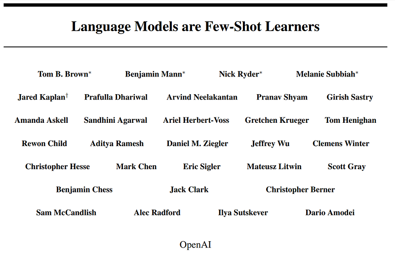 | Title card: GPT-3. |
| 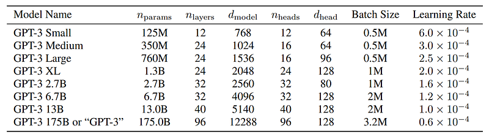 | Sizes, architectures, and learning hyper-parameters (batch size in tokens and learning rate) of the models which we trained. All models were trained for a total of 300 billion tokens. |
| 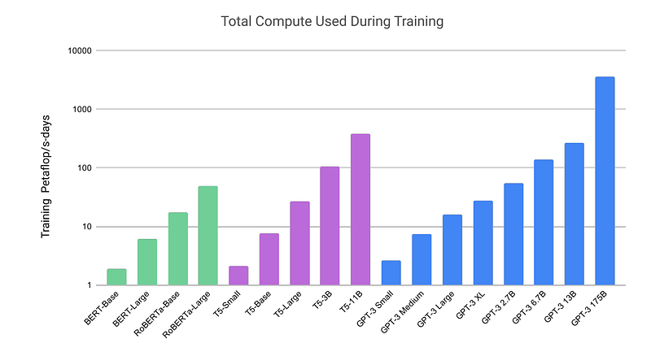 | Total compute used during training. |
| 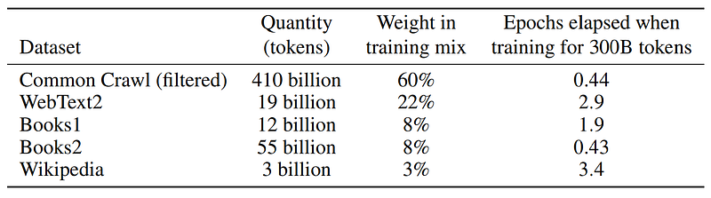 | Datasets used to train GPT-3. |
| 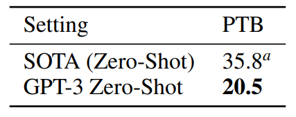 | Zero-shot results on PTB language modeling dataset. |
| 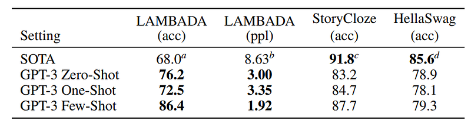 | Performance on cloze and completion tasks. |
| 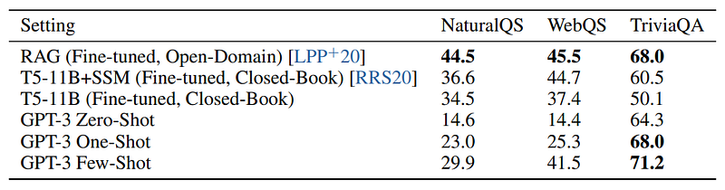 | Results on three Open-Domain QA tasks. |
| 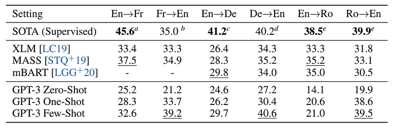 | Results on Language Translation Tasks. |
| 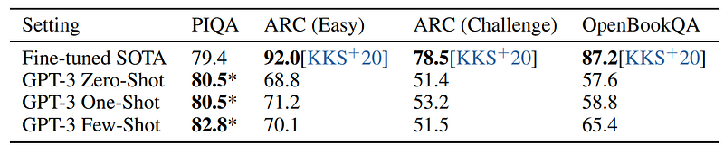 | GPT-3 results on three commonsense reasoning tasks, PIQA, ARC, and OpenBookQA. |
| 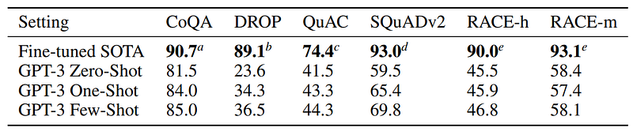 | Results on reading comprehension tasks. All scores are F1 except results for RACE which report accuracy. |
| 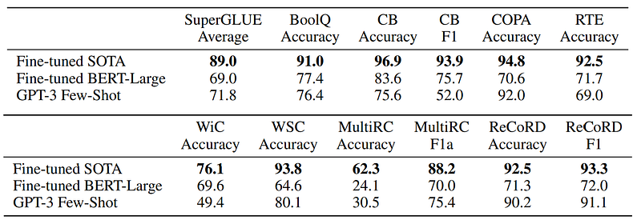 | Performance of GPT-3 on SuperGLUE compared to fine-tuned baselines and SOTA. |
| 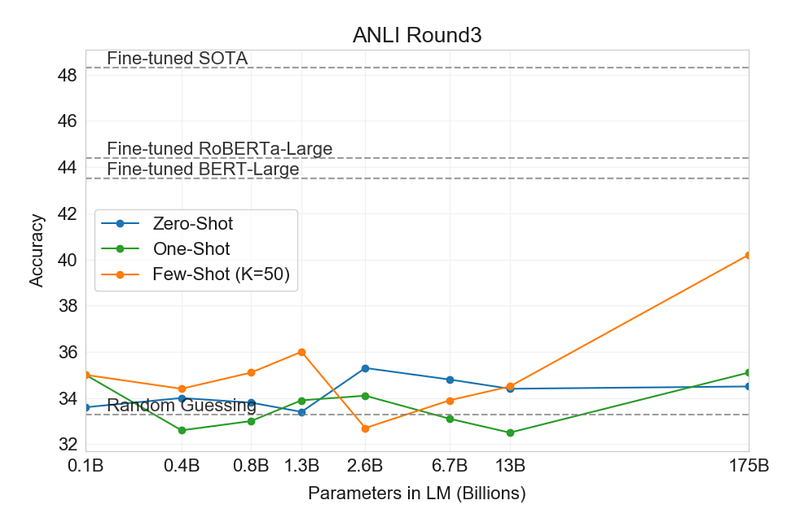 | Performance of GPT-3 on ANLI Round 3. |
| 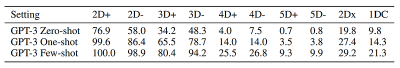 | Results on basic arithmetic tasks for GPT-3 175B. {2,3,4,5}D{+,-} is 2, 3, 4, and 5 digit addition or subtraction, 2Dx is 2 digit multiplication. 1DC is 1 digit composite operations. |
| 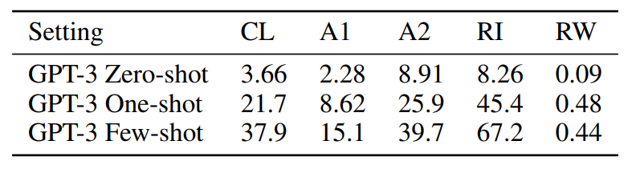 | GPT-3 175B performance on various word unscrambling and word manipulation tasks, in zero-, one-, and few-shot settings. CL is “cycle letters in word”, A1 is anagrams of but the first and last letters, A2 is anagrams of all but the first and last two letters, RI is “Random insertion in word”, RW is “reversed words”. |
## Related

- [[Papers Explained Corpus]]
- [[Large Language Models]]
- [[Long Context]]
- [[Supervised Fine-Tuning]]
- [[Papers Explained 65 - GPT-2]]
- [[Papers Explained 67 - GPT-4]]

#summary #topic
