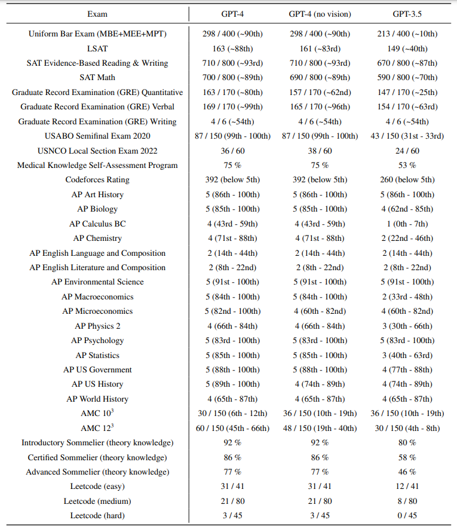
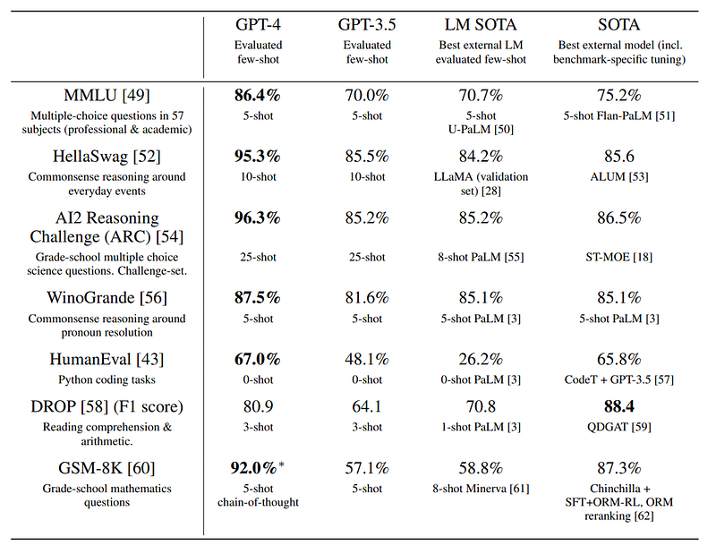
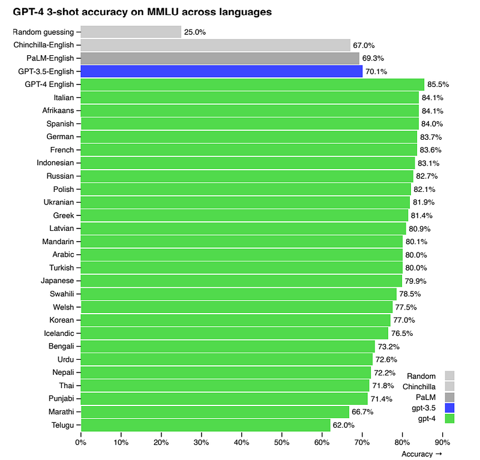
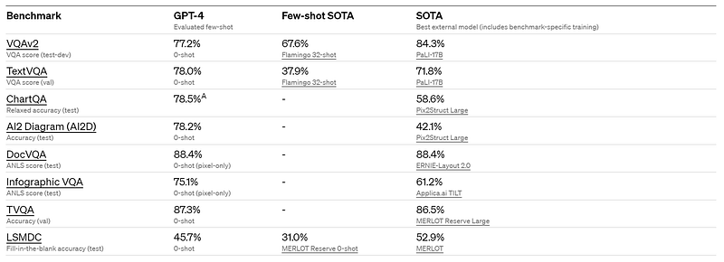
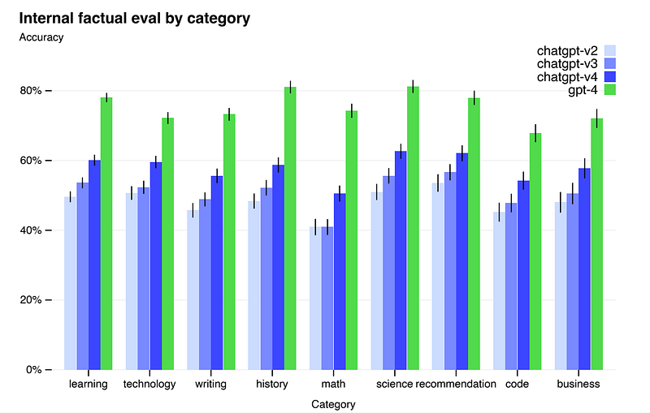
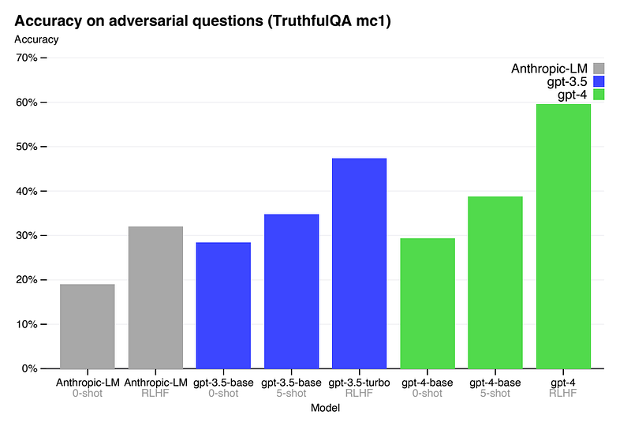
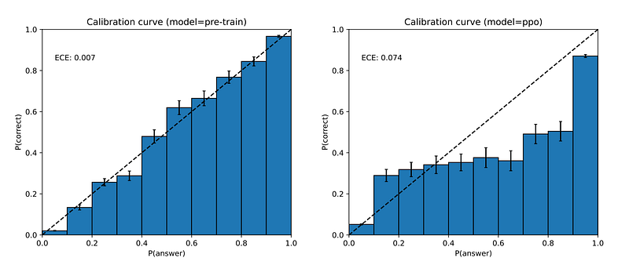

# Papers Explained 67 - GPT-4

GPT-4 is a large-scale, multimodal Transformer based model pre-trained to predict the next token in a document, which can accept image and text inputs and produce text outputs.

This page ingests the source article into the wiki and connects it to [[Papers Explained Corpus]], [[Large Language Models]], [[Reinforcement Learning Topic]], [[Vision Language Models]], [[Safety and Alignment]], [[Document AI]], [[Reinforcement Learning]], [[Supervised Fine-Tuning]].

OpenAI's flagship line continued with [[GPT-5]].

## Source Metadata

- Source file: `raw/2023-11-03_Papers-Explained-67--GPT-4-fc77069b613e.html`
- Source title: Papers Explained 67: GPT-4
- Published: 2023-11-03
- Canonical: [https://medium.com/@ritvik19/papers-explained-67-gpt-4-fc77069b613e](https://medium.com/@ritvik19/papers-explained-67-gpt-4-fc77069b613e)

## Key Ideas

- GPT-4 is trained using both publicly available data (such as internet data) and data licensed from third-party providers.
- The post-training alignment process i.e. fine-tuning using Reinforcement Learning from Human Feedback (RLHF) results in improved performance on measures of factuality and adherence to desired behavior.
- The GPT-4 Technical Report focuses on the capabilities, limitations, and safety properties of GPT-4.
- GPT-4 achieved human-level performance on professional and academic exams, notably excelling on the Uniform Bar Examination.
- The model’s performance on exams is primarily attributed to the pre-training process and is not significantly impacted by RLHF.

## Notes

GPT-4 is a large-scale, multimodal Transformer based model pre-trained to predict the next token in a document, which can accept image and text inputs and produce text outputs.

GPT-4 is trained using both publicly available data (such as internet data) and data licensed from third-party providers.

The post-training alignment process i.e. fine-tuning using Reinforcement Learning from Human Feedback (RLHF) results in improved performance on measures of factuality and adherence to desired behavior. Therefore, it exhibits human-level performance on various professional and academic benchmarks, including passing a simulated bar exam with a score around the top 10% of test takers.

The GPT-4 Technical Report focuses on the capabilities, limitations, and safety properties of GPT-4. Given both the competitive landscape and the safety implications of large-scale models like GPT-4, the report contains no further details about the architecture (including model size), hardware, training compute, dataset construction, training method, or similar.

## Capabilities

*Figure: GPT performance on academic and professional exams.*

- GPT-4 achieved human-level performance on professional and academic exams, notably excelling on the Uniform Bar Examination.

- The model’s performance on exams is primarily attributed to the pre-training process and is not significantly impacted by RLHF.

*Figure: Performance of GPT-4 on academic benchmarks.*

- GPT-4 outperforms existing language models and state-of-the-art systems on various benchmarks.

*Figure: Performance of GPT-4 in a variety of languages compared to prior models in English on MMLU.*

- GPT-4 outperforms GPT 3.5 and other models in multiple languages, including low-resource languages.

### Visual Inputs

*Figure: GPT-4’s performance on standard academic vision benchmarks.*

- GPT-4 can accept prompts containing both images and text, and can generate text outputs from the given inputs.

- It performs well across various domains, including documents with text and images.

- Test-time techniques developed for language models, like few-shot prompting and chain-of-thought, are effective with both images and text inputs.

## Limitations

*Figure: Performance of GPT-4 on nine internal adversarially-designed factuality evaluations.*

- GPT-4, despite its capabilities, shares limitations with earlier GPT models, including unreliability, fact hallucinations, and reasoning errors.

- GPT-4 shows improvement in reducing hallucinations compared to GPT-3.5, scoring 19 percentage points higher on factuality evaluations.

*Figure: Performance of GPT-4 on TruthfulQA.*

- GPT-4 also makes progress on public benchmarks like TruthfulQA, particularly after RLHF post-training.

- GPT-4 struggles with knowledge of events occurring after its pre-training data cutoff in September 2021 and doesn’t learn from experience.

- It can make simple reasoning errors, accept false statements, and fail at complex problems.

*Figure: Left: Calibration plot of the pre-trained GPT-4 model on a subset of the MMLU dataset. Right: Calibration plot of the post-trained GPT-4 model on the same subset of MMLU.*

- On the x-axis are bins according to the model’s confidence (logprob) in each of the A/B/C/D choices for each question; on the y-axis is the accuracy within each bin. The dotted diagonal line represents perfect calibration.

- GPT-4’s calibration decreases after post-training.

- Biases exist in GPT-4’s outputs, efforts are being made to correct them, and customization within broad bounds is aimed for to reflect user values.

## Risks & mitigations

Adversarial Testing with Domain Experts: To assess and mitigate risks associated with GPT-4, over 50 domain experts were engaged in adversarial testing. This testing addressed concerns related to generating harmful advice, erroneous code, and inaccurate information, especially in high-risk areas requiring specialized expertise. Feedback from experts contributed to model improvements, such as enhancing GPT-4’s ability to refuse requests for dangerous chemical synthesis.

Model-Assisted Safety Pipeline: Even after RLHF, the model could exhibit undesired behaviors on both safe and unsafe inputs. To address this, rule-based reward models (RBRMs) were introduced to provide additional reward signals targeting correct behavior, including refusing harmful content and responding appropriately to requests.

Improvements in Safety Metrics: Mitigations applied to GPT-4 led to significant improvements in safety properties. The model’s tendency to respond to requests for disallowed content decreased by 82% compared to GPT-3.5. GPT-4 also exhibited a 29% higher adherence to policies when handling sensitive requests, such as medical advice and self-harm. Additionally, it produced toxic content only 0.73% of the time compared to GPT-3.5’s 6.48% on the RealToxicityPrompts dataset.

Ongoing Challenges and Complementary Safety Techniques: Despite these improvements, challenges remain, and it is still possible to elicit undesirable behavior from the model. “Jailbreaks” and adversarial system messages can generate content that violates usage guidelines. To address this, deployment-time safety techniques and continuous model improvement are emphasized.

## Paper

GPT-4 Technical Report [2303.08774](https://arxiv.org/abs/2303.08774)

GPT-4 [Blog Post](https://openai.com/research/gpt-4)

## Figures

Figures from the Medium HTML export (`raw/2023-11-03_Papers-Explained-67--GPT-4-fc77069b613e.html`); local copies under `wiki/assets/papers-explained-67-gpt-4/` when download succeeded.

| Figure | Caption |
|--------|---------|
|  | Title card: GPT-4. |
|  | GPT performance on academic and professional exams. |
|  | Performance of GPT-4 on academic benchmarks. |
|  | Performance of GPT-4 in a variety of languages compared to prior models in English on MMLU. |
|  | GPT-4’s performance on standard academic vision benchmarks. |
|  | Performance of GPT-4 on nine internal adversarially-designed factuality evaluations. |
|  | Performance of GPT-4 on TruthfulQA. |
|  | Left: Calibration plot of the pre-trained GPT-4 model on a subset of the MMLU dataset. Right: Calibration plot of the post-trained GPT-4 model on the same subset of MMLU. |
## Related

- [[Papers Explained Corpus]]
- [[Large Language Models]]
- [[Reinforcement Learning Topic]]
- [[Vision Language Models]]
- [[Safety and Alignment]]
- [[Document AI]]
- [[Reinforcement Learning]]
- [[Supervised Fine-Tuning]]
- [[Papers Explained 66 - GPT-3]]
- [[Papers Explained 68 - GPT-4V]]

#summary #topic
