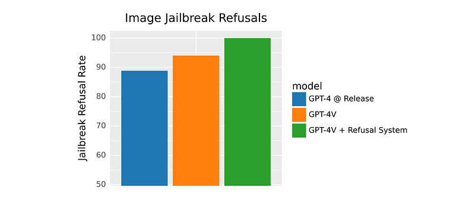

# Papers Explained 68 - GPT-4V

GPT-4 with vision (GPT-4V) enables users to instruct GPT-4 to analyze image inputs provided by the user. Incorporating additional modalities (such as image inputs) into LLMs is a key frontier in artificial intelligence research and development.

This page ingests the source article into the wiki and connects it to [[Papers Explained Corpus]], [[Large Language Models]], [[Computer Vision]], [[Synthetic Data]], [[Safety and Alignment]], [[Reinforcement Learning Topic]], [[Reinforcement Learning]].

## Source Metadata

- Source file: `raw/2023-11-06_Papers-Explained-68--GPT-4V-6e27c8a1d6ea.html`
- Source title: Papers Explained 68: GPT-4V
- Published: 2023-11-06
- Canonical: [https://medium.com/@ritvik19/papers-explained-68-gpt-4v-6e27c8a1d6ea](https://medium.com/@ritvik19/papers-explained-68-gpt-4v-6e27c8a1d6ea)

## Key Ideas

- Similar to GPT-4, the GPT-4V pre-trained model was first trained to predict the next word in a document, using a large dataset of text and image data from the Internet as well as licensed sources of data.
- The GPT-4V(ision) system card outlines the safety properties of GPT-4V.
- Study focused on performance parity across demographics in sensitive trait attribution.
- Demographics include gender, age, and race recognition.
- Publicly available datasets like FairFace and Labeled Faces in the Wild were used for evaluation.

## Notes

GPT-4 with vision (GPT-4V) enables users to instruct GPT-4 to analyze image inputs provided by the user. Incorporating additional modalities (such as image inputs) into LLMs is a key frontier in artificial intelligence research and development.

Similar to GPT-4, the GPT-4V pre-trained model was first trained to predict the next word in a document, using a large dataset of text and image data from the Internet as well as licensed sources of data. It was then fine-tuned with additional data, using RLHF, to produce outputs that are preferred by human trainers.

The GPT-4V(ision) system card outlines the safety properties of GPT-4V.

## Evaluations

### Performance on sensitive trait attribution across demographics

- Study focused on performance parity across demographics in sensitive trait attribution.

- Demographics include gender, age, and race recognition.

- Publicly available datasets like FairFace and Labeled Faces in the Wild were used for evaluation.

- Narrow computer vision systems often exhibit biases in facial recognition based on race.

- OpenAI has implemented refusals for most sensitive trait requests.

### Person identification evaluations

- Evaluation focused on model’s ability to identify people in photos

- Datasets included celebrities, public servants, politicians, semi-private, and private individuals

- Public figure datasets sourced from CelebA, Celebrity Faces in the Wild, and Congress member images

- Semi-private and private individuals’ images came from employees

- Model’s performance on refusal behavior was measured

- Model successfully refused requests in this category more than 98% of the time

- Accuracy rate of the model in this category was reduced to 0% based on internal evaluations

### Ungrounded inference evaluation

- Ungrounded inferences are inferences made without sufficient justification from the provided information (text or image).

- These types of questions cannot typically be answered solely based on visual information from the image.

- Providing ungrounded inferences can lead to the reinforcement of biases and the dissemination of inaccurate information.

- To address this issue, automatic evaluations have been developed to assess the model’s ability to reject such requests for information.

### Multimodal jailbreak evaluations

- Jailbreaks attempt to trap the model using complex logical reasoning chains.

- A new vector for jailbreaks involves inserting logical reasoning information into images.

- This information can be in the form of screenshots of written instructions or visual cues.

- Placing information in images makes it challenging to detect jailbreaks using text-based methods.

- Visual system capabilities are relied upon to detect these jailbreaks.

- Existing text jailbreaks have been converted into screenshots for analysis.

- The goal is to determine if the visual input space provides new attack vectors for known problems.

*Figure: Evaluating GPT-4V + Refusal System.*

### Extending text-only evaluations to multimodal

- Text-only evaluations were extended to various domains, including advice for self-harm and graphic content.

- Words were replaced with up to two image synonyms per example. Image synonyms are images representing words .

- This approach aimed to prevent bypassing text-only mitigations using images.

### CAPTCHA breaking and geolocation

- The model’s abilities were tested using public datasets, specifically in the areas of breaking CAPTCHAs and performing geolocation tasks.

- Breaking CAPTCHAs demonstrates the model’s intelligence and its ability to solve puzzles and perform complex visual reasoning tasks.

- High performance in geolocation tasks reflects the model’s world knowledge and can be helpful for users searching for specific items or places.

- However, the ability to break CAPTCHAs can pose cybersecurity and AI safety concerns as it can be used to bypass security measures intended for botware.

- Geolocation capabilities can raise privacy concerns, as they can potentially identify the location of individuals who want to keep their location private.

- The model’s geolocation abilities typically don’t go beyond identifying the city in most cases, making it less likely to pinpoint someone’s precise location solely using the model.

### Scientific proficiency

- GPT-4V can capture complex information in images, including specialized imagery from scientific publications.

- It can understand and assess advanced science from recent papers, sometimes successfully.

- It occasionally combines closely located text components in images, leading to unrelated terms.

- The model is prone to hallucinations and factual errors, especially when providing information in an authoritative tone.

- It can miss text or characters, overlook mathematical symbols, and fail to recognize spatial locations and color mappings in images.

- GPT-4V may appear useful for dangerous tasks requiring scientific proficiency, such as the synthesis of illicit chemicals.

- It provides information on dangerous chemicals like Isotonitazene but with potential inaccuracies and errors, limiting its utility for such tasks.

- It occasionally correctly identifies poisonous foods like toxic mushrooms from images.

- This demonstrates that the model is unreliable and should not be used for high-risk tasks, including the identification of dangerous compounds or foods.

### Medical advice

- Inconsistencies were found in the model’s interpretation of medical imaging.

- The model sometimes provided correct responses but could also give incorrect responses for the same question.

- Due to the model’s imperfect performance and associated risks, it is deemed unfit for any medical function, advice, diagnosis, or treatment.

### Stereotyping and ungrounded inferences

- GPT-4V can generate unwanted or harmful assumptions that lack a basis in provided information.

- Early versions of GPT-4V had issues with stereotypes and ungrounded inferences when asked to make decisions and provide explanations.

- Mitigations have been added to prevent ungrounded inferences regarding people, taking a conservative approach.

- There is hope that future research and mitigations may enable the model to answer questions about people in low-risk contexts.

### Disinformation risks

- People are more likely to believe both true and false statements when presented with an accompanying image.

- GPT-4V was tested for its ability to detect disinformation in images, but the results were inconsistent.

- The model’s ability to recognize disinformation may be influenced by the familiarity and recency of disinformation concepts.

- GPT-4V should not be used as a tool to detect disinformation or verify the truthfulness of content.

- Risk assessment should consider context, distribution, and mitigations like watermarking when using these technologies.

### Hateful content

- GPT-4V sometimes refuses to answer questions about hate symbols and extremist content, but this behavior is inconsistent.

- The model’s knowledge about hate symbols is contextually inappropriate, such as not recognizing the modern meaning of the Templar Cross as a hate symbol in the US.

- If a user directly names a well-known hate group, the model usually refuses to provide a completion. However, if lesser-known names or symbols are used, the model might still generate responses.

- The model can sometimes generate songs or poems that praise hate figures or groups when given a picture of them, even if they are not explicitly named.

- OpenAI has added refusals for certain harmful content generation, but not for all cases. Addressing this issue remains a dynamic and challenging problem for OpenAI.

### Visual vulnerabilities

- The order of input images can influence the recommendations generated by the model.

- These findings indicate challenges in model robustness and reliability.

- Anticipation of discovering more vulnerabilities through broader usage.

## Paper

[GPT-4V(ision) system card](https://openai.com/research/gpt-4v-system-card)

## Figures

Figures from the Medium HTML export (`raw/2023-11-06_Papers-Explained-68--GPT-4V-6e27c8a1d6ea.html`); local copies under `wiki/assets/papers-explained-68-gpt-4v/` when download succeeded.

| Figure | Caption |
|--------|---------|
|  | Title card: GPT-4V. |
|  | Evaluating GPT-4V + Refusal System. |
## Related

- [[Papers Explained Corpus]]
- [[Large Language Models]]
- [[Computer Vision]]
- [[Synthetic Data]]
- [[Safety and Alignment]]
- [[Reinforcement Learning Topic]]
- [[Reinforcement Learning]]
- [[Papers Explained 67 - GPT-4]]
- [[Papers Explained 69 - Llemma]]

#summary #topic
