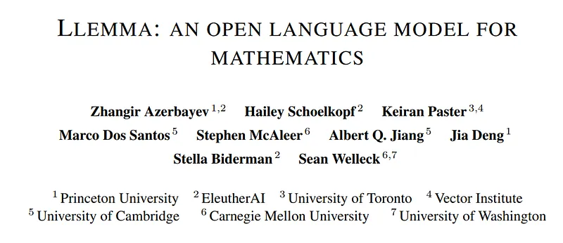
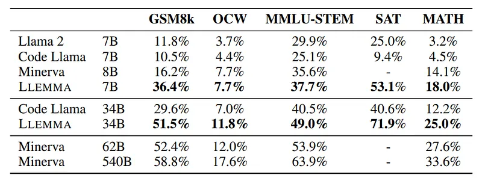
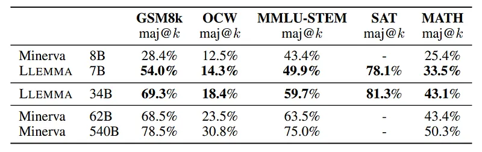
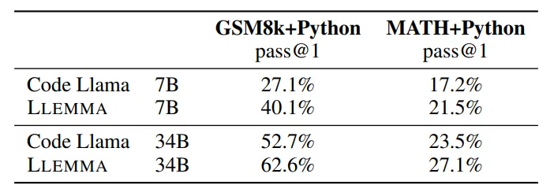
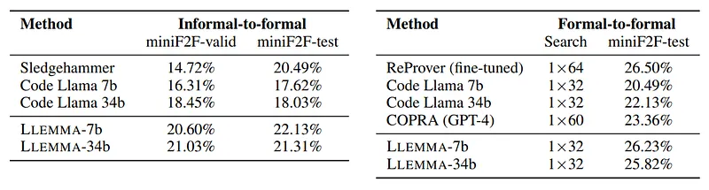

# Papers Explained 69 - Llemma

Llemma is an LLM for mathematics. Formed by continued pretraining of Code Llama on Proof-Pile-2, a mixture of scientific papers, web data containing mathematics, and mathematical code. Llemma is capable of tool use and formal theorem proving without any further finetuning.

This page ingests the source article into the wiki and connects it to [[Papers Explained Corpus]], [[Synthetic Data]], [[Code Models]], [[Reasoning Models]], [[Large Language Models]], [[Agentic AI]], [[Supervised Fine-Tuning]].

## Source Metadata

- Source file: `raw/2023-11-10_Papers-Explained-69--Llemma-0a17287e890a.md`
- Source title: Papers Explained 69: Llemma
- Published: 2023-11-10
- Canonical: [https://medium.com/@ritvik19/papers-explained-69-llemma-0a17287e890a](https://medium.com/@ritvik19/papers-explained-69-llemma-0a17287e890a)

## Key Ideas

- Llemma is an LLM for mathematics. Formed by continued pretraining of Code Llama on Proof-Pile-2, a mixture of scientific papers, web data containing mathematics, and mathematical code.
- Proof-Pile-2, a 55B-token mixture of scientific papers, web data containing mathematics, and mathematical code. With the exception of the Lean proofsteps subset and a knowledge cutoff of April 2023.
- Code: An 11B-token dataset (AlgebraicStack) of source code from 17 languages, spanning numerical, symbolic, and formal math; consisting of filtered code from the Stack, public GitHub repositories, and formal proof step data is created.
- Web Data: OpenWebMath, a 15B-token dataset of high-quality web pages filtered for mathematical content is used.
- Scientific papers: The ArXiv subset of RedPajama, containing 29B tokens is used.

## Notes

Llemma is an LLM for mathematics. Formed by continued pretraining of Code Llama on Proof-Pile-2, a mixture of scientific papers, web data containing mathematics, and mathematical code. Llemma is capable of tool use and formal theorem proving without any further finetuning.

## Data

Proof-Pile-2, a 55B-token mixture of scientific papers, web data containing mathematics, and mathematical code. With the exception of the Lean proofsteps subset and a knowledge cutoff of April 2023.

- Code: An 11B-token dataset (AlgebraicStack) of source code from 17 languages, spanning numerical, symbolic, and formal math; consisting of filtered code from the Stack, public GitHub repositories, and formal proof step data is created.

- Web Data: OpenWebMath, a 15B-token dataset of high-quality web pages filtered for mathematical content is used.

- Scientific papers: The ArXiv subset of RedPajama, containing 29B tokens is used.

- General natural language and code data: The Pile is used as a surrogate training dataset. 95% of the training mixture is set to be the Proof-Pile-2, 2% to be from the Pile, and 3% to be the GitHub subset of RedPajama.

Proof-Pile-2 is publicly released at hf.co/datasets/EleutherAI/proof-pile-2.

## Model

The Code Llama models are continued pre-trained on Proof-Pile-2 using a standard autoregressive language modeling objective. The 7B model is trained for 200B tokens, and the 34B model for 50B tokens. All models are trained in bfloat16 mixed precision.

Before training LLEMMA 7B, the RoPE base period of the Code Llama 7B initialization is contracted from θ = 1, 000, 000 to θ = 10, 000, so that the long context fine tuning procedure can be repeated on the trained LLEMMA 7B.

## Evaluation

### Chain-of-Thought Mathematical Problem Solving

Generating self-contained text solutions to problems using LATEX or natural language. Utilizing various datasets for evaluation:

- MATH dataset: 12.5k problems from high-school math competitions.

- GSM8k dataset: Middle-school level math word problems.

- OCWCourses: Undergraduate-level STEM problems from MIT’s OpenCourseWare.

- MMLU-STEM: Subset of MMLU benchmark subjects.

- SAT: Subset of 32 math questions from the May 2023 College Board SAT examination.

Utilization of example prompts (four or eight-shot) for different datasets, with a focus on exact string match or SymPy equivalence for answer validation.

*Figure: Results on our five chain-of-thought reasoning tasks with samples generated via greedy decoding.*

- LLEMMA’s continued pre-training on Proof-Pile-2 significantly improves few-shot performance on various mathematical benchmarks.

*Figure: Majority voting results for LLEMMA and Minerva.*

- LLEMMA models (e.g., 34B, 7B) showcase improved performance over Code Llama and even outperform the proprietary Minerva model.

### Mathematical Problem Solving with Tool Use

- MATH+Python, the model is prompted to alternately describe a solution step in natural language, then execute that step with code. The final answer is a program that executes to a numeric type or a SymPy object.

- GSM8k+Python, solving a GSM8k word problem by writing a Python program that executes to an integer answer.

*Figure: Mathematical problem solving with tool use.*

- LLEMMA improves over Code Llama on both tasks.

### Formal Mathematics

LLEMMA is evaluated in few shot settings on two tasks:

Informal-to-Formal Proving:

- Task involves generating a formal proof given a formal statement, an informal LATEX statement, and an informal LATEX proof.

- Checked by the Isabelle proof assistant, evaluated on miniF2F benchmark.

- Utilizes 11 examples (formal statement, informal statement, informal proof, formal proof) with a focus on number theory and other problems.

- Single proof generation using greedy decoding.

Formal-to-Formal Proving:

- Task involves proving a formal statement by generating a sequence of proof steps (tactics).

- Utilizes three examples (input state, proof step) and is evaluated using Lean 4 proof assistant on miniF2F benchmark.

- Employs a standard best-first search approach.

*Figure: Formal theorem proving tasks. Left: Informal-to-formal proving in Isabelle, showing the percentage of proven theorems with greedy decoding. Right: Formal-to-formal proving in Lean, showing the percentage of proven theorems with the given number of attempts × generations-periteration of best first search, and a 10-minute timeout.*

Informal-to-Formal Proving:

- LLEMMA-7b closes 22.1% of the theorems, surpassing its Code Llama initialization and Sledgehammer prover.

- Demonstrates complementary proofs in comparison to Sledgehammer, adding 26 new validation proofs and 17 new test proofs.

- First few-shot proof auto formalization demonstration with an open model, distinct from the proprietary Codex model.

Formal-to-Formal Proving (Lean 4):

- LLEMMA-7b improves on its Code Llama initialization and performs similarly to ReProver, a model fine tuned for tactic prediction.

- Notable for being the first demonstration of few-shot tactic prediction for theorem proving by an open model.

## Paper

Llemma: An Open Language Model For Mathematics [2310.10631](https://arxiv.org/abs/2310.10631)

## Figures

Figures from the Medium HTML export (`raw/2023-11-10_Papers-Explained-69--Llemma-0a17287e890a.md`); local copies under `wiki/assets/papers-explained-69-llemma/` when download succeeded.

| Figure | Caption |
|--------|---------|
|  | Title card: Llemma. |
|  | Results on our five chain-of-thought reasoning tasks with samples generated via greedy decoding. |
|  | Majority voting results for LLEMMA and Minerva. |
|  | Mathematical problem solving with tool use. |
|  | Formal theorem proving tasks. Left: Informal-to-formal proving in Isabelle, showing the percentage of proven theorems with greedy decoding. Right: Formal-to-formal proving in Lean, showing the percentage of proven theorems with the given number of attempts × generations-periteration of best first search, and a 10-minute timeout. |
## Related

- [[Papers Explained Corpus]]
- [[Synthetic Data]]
- [[Code Models]]
- [[Reasoning Models]]
- [[Large Language Models]]
- [[Agentic AI]]
- [[Supervised Fine-Tuning]]
- [[Papers Explained 68 - GPT-4V]]
- [[Papers Explained 70 - CodeFusion]]

#summary #topic
