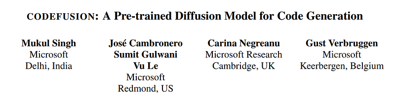
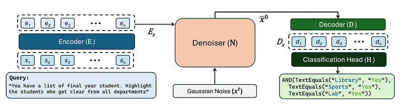
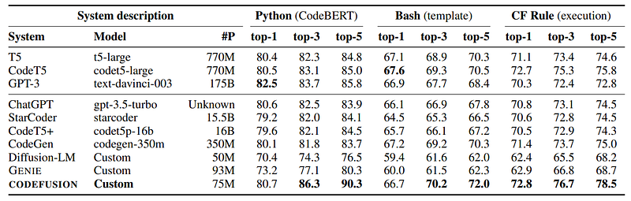
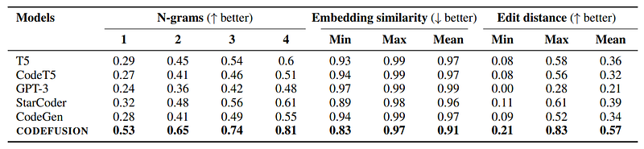
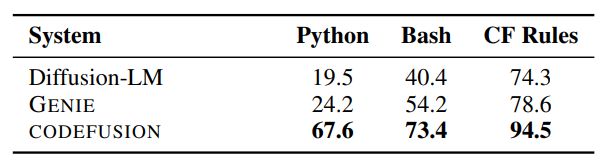
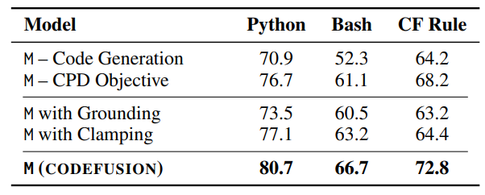
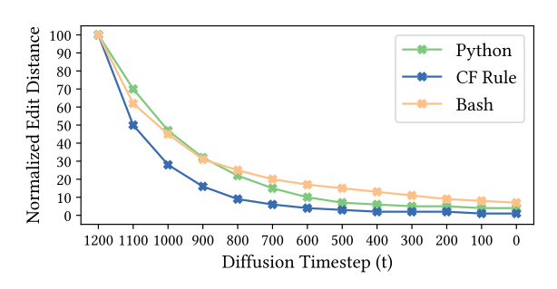

# Papers Explained 70 - CodeFusion

Auto-regressive models for code generation have a limitation: they do not easily allow reconsidering earlier tokens generated. CodeFusion is a 75M pre-trained diffusion code generation model that addresses this limitation by iteratively denoising a complete program conditioned on the encoded natural language.

This page ingests the source article into the wiki and connects it to [[Papers Explained Corpus]], [[Code Models]], [[Embedding and Retrieval]], [[Large Language Models]], [[Agentic AI]], [[Supervised Fine-Tuning]].

## Source Metadata

- Source file: `raw/2023-11-13_Papers-Explained-70--CodeFusion-fee6aba0149a.html`
- Source title: Papers Explained 70: CodeFusion
- Published: 2023-11-13
- Canonical: [https://medium.com/@ritvik19/papers-explained-70-codefusion-fee6aba0149a](https://medium.com/@ritvik19/papers-explained-70-codefusion-fee6aba0149a)

## Key Ideas

- Auto-regressive models for code generation have a limitation: they do not easily allow reconsidering earlier tokens generated.
- The input to CodeFusion is a natural language utterance s and the output is a predicted code snippet ˆy. Both input and output are padded to a fixed dimension n.
- The transformer-based encoder transforms the tokenized utterance s into a vector representation Es = E(s).
- Before projecting the denoised embeddings back to discrete code tokens, we use a decoder (D), this time applying cross-attention to ˆx0 and Es, with full self-attention over ˆx0, to compute a final hidden representation Ds = D(x0, Es).
- Finally, Ds is projected to actual code tokens with a classification head H that computes a distribution over code tokens p(y|di). yˆi = arg maxy p(y|di) is selected for each i, instead of performing a search over these tokens.

## Notes

Auto-regressive models for code generation have a limitation: they do not easily allow reconsidering earlier tokens generated. CodeFusion is a 75M pre-trained diffusion code generation model that addresses this limitation by iteratively denoising a complete program conditioned on the encoded natural language.

## Architecture

*Figure: Architecture diagram for CodeFusion showing the Encoder (E), Denoiser (N) and the Decoder (D) units.*

The input to CodeFusion is a natural language utterance s and the output is a predicted code snippet ˆy. Both input and output are padded to a fixed dimension n. CodeFusion has three main transformer-based components (an encoder E, a denoiser N, a decoder D) and a classification head H.

The transformer-based encoder transforms the tokenized utterance s into a vector representation Es = E(s). Conditioned on the encoded utterance Es and the time t, the denoiser (N) predicts and removes noise ϵt from the noisy program embedding xt to obtain a predicted denoised program embedding xˆ0 = N(xt, t, Es). N is a transformer block with cross-attention between xt and Es and full self attention over xt.

Before projecting the denoised embeddings back to discrete code tokens, we use a decoder (D), this time applying cross-attention to ˆx0 and Es, with full self-attention over ˆx0, to compute a final hidden representation Ds = D(x0, Es).

Finally, Ds is projected to actual code tokens with a classification head H that computes a distribution over code tokens p(y|di). yˆi = arg maxy p(y|di) is selected for each i, instead of performing a search over these tokens.

## Training

CodeFusion is trained in two phases: unsupervised pre-training of the denoiser and decoder on code snippets, and supervised fine-tuning of encoder, denoiser and decoder on (utterance, code snippet) pairs.

A trainable embedding layer L is used to embed a code snippet y into a continuous space where we can add (and remove) noise ϵt at timestep t.

At time step t, the loss is computed as

Lt = ∥ˆϵt − ϵt∥ + ∥Ds − L(y)∥ − log p(y|Ds)

and consists of three parts.

1. minimize the error between the predicted noise ˆϵt and the actual noise ϵt to train N.

2. minimize the error between the Ds and embedded code to train D and L.

3. apply a standard cross-entropy loss over the outputs of the classification head, which produces predicted code tokens given Ds, and the ground truth code snippet y.

To pre-train the denoiser (N) and decoder (D) over a corpus of code snippets, two tasks are used : unsupervised code generation and code-specific continuous paragraph denoising (CPD).

Both pre-training and fine-tuning tasks use Lt. Because there is no natural language utterance in pre-training, there is no input Es to the denoiser N. In the unsupervised code generation task, Es is replaced with Gaussian noise sampled at every denoising time step. In the CPD task, Es is computed by passing the masked code y through encoder E.

## Inference

During inference, xt is initialized with Gaussian noise, and a (scheduler-determined) proportion of the noise is iteratively removed over T time steps to obtain ˆx0. During this iterative denoising, the decoder is not used. After this iterative procedure, the final predicted code ˆy is produced by the decoder. ˆy is post-processed to select the tokens up to the first pad token.

## Training Setup

The encoder (E) is instantiated as a pre-trained CodeT5 encoder. The denoiser (N) as a 10 layer transformer block, the decoder (D) as 6 transformer decoder layers, and the classification head (H) as a single fully connected layer. Tokenizer and vocabulary are utilized from CodeT5 and target code length is 128 tokens.

The diffusion and decoder models are pre-trained on code snippets only.

## Evaluation

### Performance Comparison:

*Figure: Comparison of CodeFusion with baselines on the task of NL to code generation for Python, Bash and CF rules.*

- CodeFusion performs on par with or even better than much larger auto-regressive models in top-1 settings.

- In Python, only GPT-3 (175B) outperforms CodeFusion (75M) in top-1 performance.

- CodeFusion outperforms all baselines in top-3 and top-5 settings.

- Auto-regressive models with high top-1 performance sacrifice diversity in their generations, as observed previously.

### Diversity Results:

*Figure: Comparison of diversity in top-5 code generations for CodeFusion and baselines for Python, Bash and CF rules.*

- CodeFusion generates generations with higher diversity compared to auto-regressive models (T5, CodeT5, StarCoder, CodeGen, GPT-3).

- Other diffusion methods (Diffusion-LM and GENIE) also improve in top-3 and top-5 settings but fall short of CodeFusion due to syntactically invalid program generation.

### Syntactic Validity:

*Figure: % of top-1 generations that are syntactically valid for CodeFusion and text diffusion-based baselines.*

- CodeFusion generates more syntactically valid code compared to diffusion models not designed for code.

- On average across all three languages, CodeFusion produces 33.8% more syntactically valid generations than Diffusion-LM and 26.2% more than GENIE.

### Performance Impact of Changes:

*Figure: Ablations for CodeFusion (M). “–” means the component is removed.*

- Removing either pre-training task significantly reduces CodeFusion’s performance (-10.9% for code generation and -4.6% for CPD on average across three languages).

- Replacing D and H with grounding or clamping shows the benefit of using a decoder before rounding.

### Gradual Improvement:

*Figure: Average normalized edit distance for CodeFusion generations against increasing diffusion timesteps*

- CodeFusion gradually improves its code generation by stopping denoising at different time steps.

- The edit distance decreases as denoising progresses, and it drops faster for simpler CF rules compared to full programs and bash commands.

## Paper

[CodeFusion: A Pre-trained Diffusion Model for Code Generation](https://www.microsoft.com/en-us/research/publication/codefusion-a-pre-trained-diffusion-model-for-code-generation/)

## Figures

Figures from the Medium HTML export (`raw/2023-11-13_Papers-Explained-70--CodeFusion-fee6aba0149a.html`); local copies under `wiki/assets/papers-explained-70-codefusion/` when download succeeded.

| Figure | Caption |
|--------|---------|
|  | Title card: CodeFusion. |
|  | Architecture diagram for CodeFusion showing the Encoder (E), Denoiser (N) and the Decoder (D) units. |
|  | Comparison of CodeFusion with baselines on the task of NL to code generation for Python, Bash and CF rules. |
|  | Comparison of diversity in top-5 code generations for CodeFusion and baselines for Python, Bash and CF rules. |
|  | % of top-1 generations that are syntactically valid for CodeFusion and text diffusion-based baselines. |
|  | Ablations for CodeFusion (M). “–” means the component is removed. |
|  | Average normalized edit distance for CodeFusion generations against increasing diffusion timesteps. |
## Related

- [[Papers Explained Corpus]]
- [[Code Models]]
- [[Embedding and Retrieval]]
- [[Large Language Models]]
- [[Agentic AI]]
- [[Supervised Fine-Tuning]]
- [[Papers Explained 69 - Llemma]]
- [[Papers Explained 71 - Zephyr]]

#summary #topic
