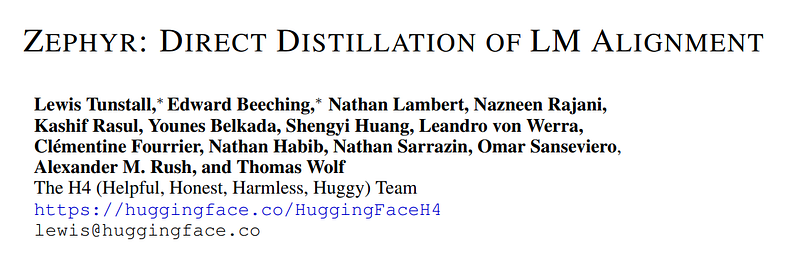
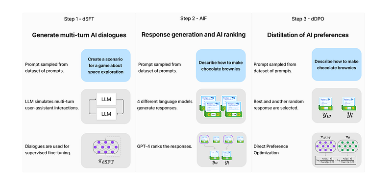
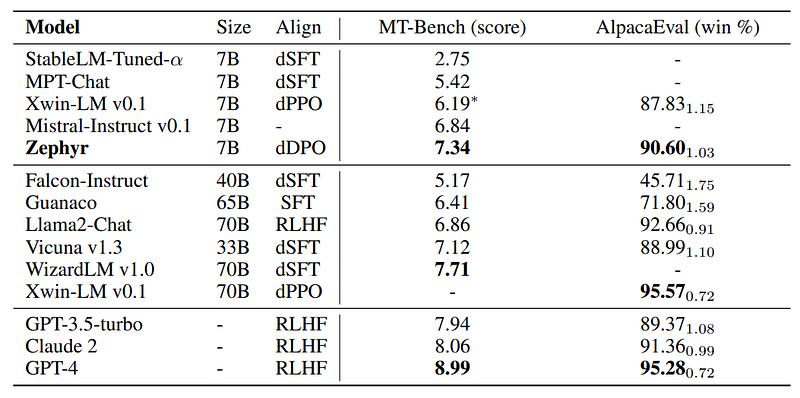
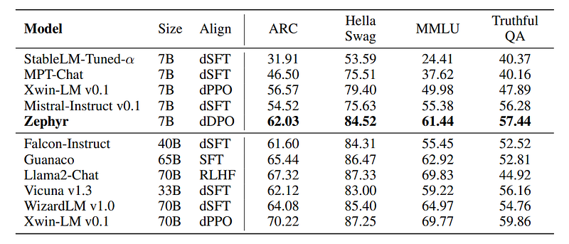
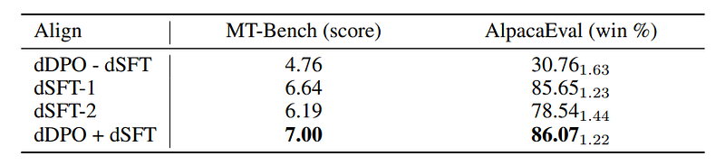

# Papers Explained 71 - Zephyr

Zephyr is 7B LLM that utilizes distilled Direct Preference Optimization (dDPO) that significantly improves intent alignment and AI Feedback (AIF) preference data to achieve superior intent alignment in chat-based language modeling without requiring human annotation.

This page ingests the source article into the wiki and connects it to [[Papers Explained Corpus]], [[Reinforcement Learning Topic]], [[Large Language Models]], [[Safety and Alignment]], [[Synthetic Data]], [[Model Compression and Efficiency]], [[Model Distillation]], [[Supervised Fine-Tuning]].

## Source Metadata

- Source file: `raw/2023-11-17_Papers-Explained-71--Zephyr-7ec068e2f20b.html`
- Source title: Papers Explained 71: Zephyr
- Published: 2023-11-17
- Canonical: [https://medium.com/@ritvik19/papers-explained-71-zephyr-7ec068e2f20b](https://medium.com/@ritvik19/papers-explained-71-zephyr-7ec068e2f20b)

## Key Ideas

- Zephyr is 7B LLM that utilizes distilled Direct Preference Optimization (dDPO) that significantly improves intent alignment and AI Feedback (AIF) preference data to achieve superior intent alignment in chat-based language modeling without requiring human...
- The approach follows similar stages as InstructGPT.
- Starting with a raw LLM, it first needs to be trained to respond to user prompts, traditionally done through SFT.
- Human feedback provides additional signal to align LLMs. For distillation, Ultra Feedback approach is used, where prompts are fed to multiple models, and their responses are assessed by the teacher model to provide a score.
- The goal is to refine the student model (πdSFT) by optimizing a preference model that aims to rank preferred responses over lower-quality responses.

## Notes

Zephyr is 7B LLM that utilizes distilled Direct Preference Optimization (dDPO) that significantly improves intent alignment and AI Feedback (AIF) preference data to achieve superior intent alignment in chat-based language modeling without requiring human annotation.

## Method

The approach follows similar stages as InstructGPT.

### Distilled Supervised Fine-Tuning (dSFT)

Starting with a raw LLM, it first needs to be trained to respond to user prompts, traditionally done through SFT. However, with access to teacher language models, a dataset is constructed through iterative self-prompting where the teacher is used to both respond to an instruction and refine the instruction based on the response. Distillation is performed by SFT. The end point is a final dataset, C = {(x1, y1), . . . ,(xJ , yJ )}

### AI Feedback through Preferences (AIF)

Human feedback provides additional signal to align LLMs. For distillation, Ultra Feedback approach is used, where prompts are fed to multiple models, and their responses are assessed by the teacher model to provide a score. The final feedback dataset D consists of a set of these triples (x, yw, yl). Where yw is the highest scoring response and yl is a random lower scoring prompt.

### Distilled Direct Preference Optimization (dDPO)

The goal is to refine the student model (πdSFT) by optimizing a preference model that aims to rank preferred responses over lower-quality responses.

Starting with the dSFT version of the model,each AIF triple (x, yw, yl) is iterated through to.

- Compute the probability for (x, yw) and (x, yl) from the dSFT model (forward-only).

- Compute the probability for (x, yw) and (x, yl) from the dDPO model.

- Compute the objective and backpropagate to update. Repeat

## Experiment Details

All the fine-tuning experiments are conducted using Mistral 7B.

Two dialogue datasets that have been distilled from a mix of open and proprietary models are used:

- UltraChat, is a self-refinement dataset consisting of 1.47M multi-turn dialogues generated by GPT-3.5-TURBO over 30 topics and 20 different types of text material. After applying truecasing heuristics to fix the grammatical errors, as well as several filters to focus on helpfulness and remove the undesired model responses, the resulting dataset contains approximately 200k examples.

- UltraFeedback consists of 64k prompts, each of which have four LLM responses that are rated by GPT-4 according to criteria like instruction-following, honesty, and helpfulness.

The SFT models are trained for one to three epochs. The DPO models are trained for one to three epochs as well. The final ZEPHYR-7B model was initialized from the SFT model that was trained for one epoch and further optimized for three DPO epochs.

## Evaluation

### dDPO Improves Chat Capabilities

*Figure: Chat benchmark results for open-access and proprietary models on MT-Bench and AlpacaEval.*

- Zephyr-7B showcases superior performance on both MT-Bench and AlpacaEval benchmarks compared to other open 7B models, establishing a new state-of-the-art.

- Outperforms dSFT models significantly across both benchmarks.

- Excels in comparison to XWIN-LM-7B, a model trained with distilled PPO (dPPO).

- When compared to larger open models, Zephyr-7B competes well with Llama2-Chat 70B, scoring better on MT-Bench and within a close range on AlpacaEval, differing by no more than two standard deviations.

- However, it falls short in comparison to WizardLM-70B’s performance.

### dDPO Improves Academic Task Performance

*Figure: Academic benchmark results for open-access models on the Open LLM Leaderboard.*

- Zephyr outperforms all other 7B models, including dSFT models and the Xwin-LM dPPO model.

- Model scale is an important factor in the results, with larger models performing better than Zephyr on knowledge-intensive tasks.

- Despite this, Zephyr does reach the performance of 40B scale models in some aspects.

### Is Preference Optimization Necessary?

*Figure: Ablation of different alignment methods on the base Mistral 7B model.*

> dDPO — dSFT fine-tunes the base model directly with DPO for one epoch on UltraFeedback.

> dSFT-1 fine-tunes the base model with SFT for one epoch on UltraChat.

> dSFT-2 applies dSFT-1 first, followed by one more epoch of SFT on the top-ranked completions of UltraFeedback.

> dDPO + dSFT applies dSFT-1 first, followed by one epoch of DPO on UltraFeedback.

- Without an initial SFT step (dSFT), models perform poorly and cannot learn from feedback effectively.

- Implementing dSFT significantly improves model scores on both chat benchmarks.

- Running dSFT directly on feedback data (dSFT-2) does not lead to a noticeable performance improvement.

- Combining dDPO and dDSFT in the full Zephyr models results in a substantial increase in performance on both benchmarks.

## Zephyr 7B α vs Zephyr 7B β

dSFT was initially ran over the whole corpus of UltraChat, resulting in Zephyr 7B α, but later on it was found that resulting chat model had a tendency to respond with incorrect capitalization and would preface its answers with phrases such as “I don’t have personal experiences”, even for straightforward questions like “How do I clean my car?”.

To handle these issues in the training data, truecasing heuristics were applied to fix the grammatical errors (approximately 5% of the dataset), as well as several filters to focus on helpfulness and remove the undesired model responses. The resulting dataset contains approximately 200k examples, resulting to Zephyr 7B β model.

Source: https://twitter.com/_lewtun/status/1717816585786626550

## Paper

Zephyr: Direct Distillation of LM Alignment [2310.16944](https://arxiv.org/abs/2310.16944)

## Figures

Figures from the Medium HTML export (`raw/2023-11-17_Papers-Explained-71--Zephyr-7ec068e2f20b.html`); local copies under `wiki/assets/papers-explained-71-zephyr/` when download succeeded.

| Figure | Caption |
|--------|---------|
|  | Title card: Zephyr. |
|  | The approach follows similar stages as InstructGPT. |
|  | Chat benchmark results for open-access and proprietary models on MT-Bench and AlpacaEval. |
|  | Academic benchmark results for open-access models on the Open LLM Leaderboard. |
|  | Ablation of different alignment methods on the base Mistral 7B model. |
## Related

- [[Papers Explained Corpus]]
- [[Reinforcement Learning Topic]]
- [[Large Language Models]]
- [[Safety and Alignment]]
- [[Synthetic Data]]
- [[Model Compression and Efficiency]]
- [[Model Distillation]]
- [[Supervised Fine-Tuning]]
- [[Papers Explained 70 - CodeFusion]]
- [[Papers Explained 72 - UniLM]]

#summary #topic
