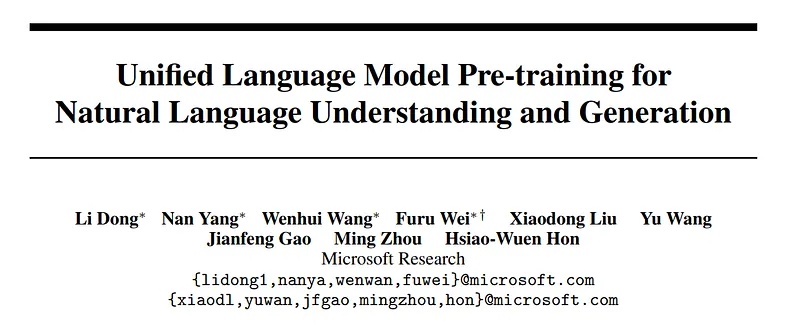
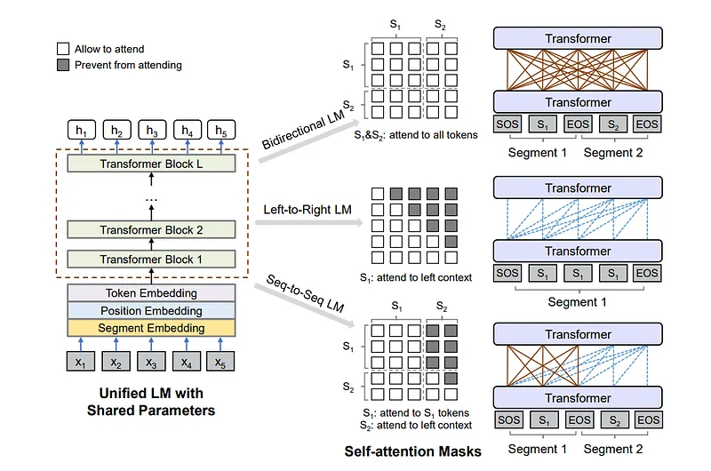
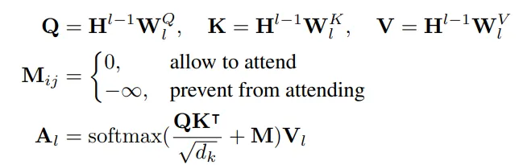
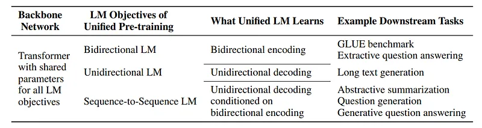
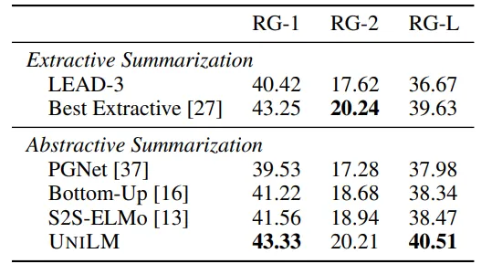
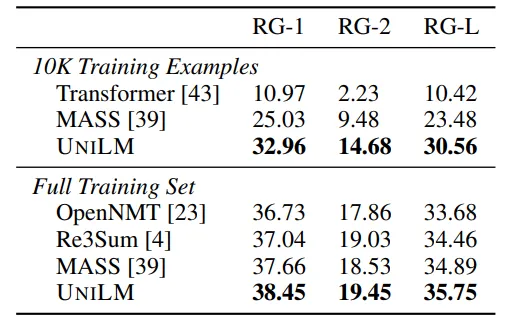
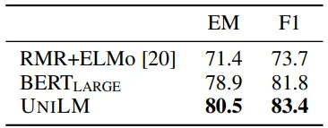
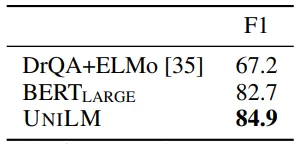
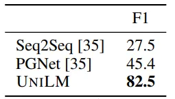
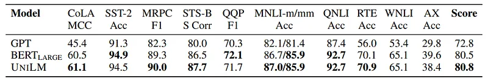

# Papers Explained 72 - UniLM

UNIfied pre-trained Language Model (UNILM)is pre-trained using three types of language modeling tasks: unidirectional, bidirectional, and sequence-to-sequence prediction, by employing a shared Transformer network and utilizing specific self-attention masks to control what context the prediction conditions on, thus can be fine-tuned for...

This page ingests the source article into the wiki and connects it to [[Papers Explained Corpus]], [[Large Language Models]], [[Embedding and Retrieval]].

## Source Metadata

- Source file: `raw/2023-11-20_Papers-Explained-72--UniLM-672f0ecc6a4a.md`
- Source title: Papers Explained 72: UniLM
- Published: 2023-11-20
- Canonical: [https://medium.com/@ritvik19/papers-explained-72-unilm-672f0ecc6a4a](https://medium.com/@ritvik19/papers-explained-72-unilm-672f0ecc6a4a)

## Key Ideas

- UNIfied pre-trained Language Model (UNILM)is pre-trained using three types of language modeling tasks: unidirectional, bidirectional, and sequence-to-sequence prediction, by employing a shared Transformer network and utilizing specific self-attention masks to...
- Given an input sequence x = x1 · · · x|x|, UNILM obtains a contextualized vector representation for each token, using masking to control how much context the token should attend to when computing its contextualized representation.
- The input x is always added with a special start-of-sequence ([SOS]) token at the beginning, and a special end-of-sequence ([EOS]) token at the end of each segment. Texts are tokenized to subword units by WordPiece.
- The input vector x is first packed into H0 and then encoded into contextual representations at different levels of abstract Hl using an L-layer transformer.
- where the previous layer’s output Hl−1 is linearly projected to a triple of queries, keys and values using respective parameter matrices, and the mask matrix M determines whether a pair of tokens can be attended to each other.

## Notes

UNIfied pre-trained Language Model (UNILM)is pre-trained using three types of language modeling tasks: unidirectional, bidirectional, and sequence-to-sequence prediction, by employing a shared Transformer network and utilizing specific self-attention masks to control what context the prediction conditions on, thus can be fine-tuned for both natural language understanding and generation tasks.

## Methodology

*Figure: Overview of unified LM pre-training.*

Given an input sequence x = x1 · · · x|x|, UNILM obtains a contextualized vector representation for each token, using masking to control how much context the token should attend to when computing its contextualized representation.

### Input Representation

The input x is always added with a special start-of-sequence ([SOS]) token at the beginning, and a special end-of-sequence ([EOS]) token at the end of each segment. Texts are tokenized to subword units by WordPiece. For each input token, its vector representation is computed by summing the corresponding token embedding, position embedding, and segment embedding.

### Backbone Network

The input vector x is first packed into H0 and then encoded into contextual representations at different levels of abstract Hl using an L-layer transformer. In each Transformer block, multiple self-attention heads are used to aggregate the output vectors of the previous layer. For the l-th Transformer layer, the output of a self-attention head Al is computed via:

where the previous layer’s output Hl−1 is linearly projected to a triple of queries, keys and values using respective parameter matrices, and the mask matrix M determines whether a pair of tokens can be attended to each other.

### Pre training Objectives

UNILM is pre trained using four cloze tasks designed for different language modeling objectives. In a cloze task, some WordPiece tokens are randomly chosen in the input, and replaced with a special token [MASK]. Then, their corresponding output vectors computed by the Transformer network are fed into a softmax classifier to predict the masked token.

*Figure: The unified LM is jointly pre-trained by multiple language modeling objectives, sharing the same parameters.*

### Pre training Setup

The model architecture of UNILM follows that of BERT LARGE for a fair comparison. GELU activation is used as GPT.

Specifically, It is a 24-layer Transformer with 1, 024 hidden size, and 16 attention heads, which contains about 340M parameters.

The weight matrix of the softmax classifier is tied with token embeddings. UNILM is initialized by BERT LARGE, and then pre-trained using English Wikipedia and BookCorpus, which have been processed in the same way as BERT. The vocabulary size is 28, 996.

The maximum length of input sequence is 512. The token masking probability is 15%. Among masked positions, 80% of the time we replace the token with [MASK], 10% of the time with a random token, and keeping the original token for the rest.

## Evaluation

### Abstractive Summarization

*Figure: Evaluation results on CNN/DailyMail summarization.*

- UniLM outperforms previous abstractive systems and even the best extractive model by 0.88 points in ROUGE-L.

*Figure: : Results on Gigaword abstractive summarization.*

- UNILM achieves better performance compared to previous models. Particularly excels in a low-resource setting, outperforming MASS by 7.08 points in ROUGE-L when using only 10,000 examples as training data.

### Question Answering (QA)

*Figure: Extractive QA results on the SQuAD development set.*

*Figure: Extractive QA results on the CoQA development set.*

*Figure: Generative QA results on the CoQA development set.*

- UNILM consistently outperforms other models across datasets, both in extractive and generative QA tasks.

- Achieves better F1 scores in both SQuAD and CoQA datasets, displaying its adaptability and effectiveness in handling different QA formats.

### GLUE Benchmark

*Figure: GLUE test set results scored using the GLUE evaluation server.*

- UNILM performs comparably with BERTLARGE on the GLUE tasks.

## Paper

Unified Language Model Pre-training for Natural Language Understanding and Generation [1905.03197](https://arxiv.org/abs/1905.03197)

## Figures

Figures from the Medium HTML export (`raw/2023-11-20_Papers-Explained-72--UniLM-672f0ecc6a4a.md`); local copies under `wiki/assets/papers-explained-72-unilm/` when download succeeded.

| Figure | Caption |
|--------|---------|
|  | Title card: UniLM. |
|  | Overview of unified LM pre-training. |
|  | where the previous layer’s output Hl−1 is linearly projected to a triple of queries, keys and values using respective parameter matrices,... |
|  | The unified LM is jointly pre-trained by multiple language modeling objectives, sharing the same parameters. |
|  | Evaluation results on CNN/DailyMail summarization. |
|  | Results on Gigaword abstractive summarization. |
|  | Extractive QA results on the SQuAD development set. |
|  | Extractive QA results on the CoQA development set. |
|  | Generative QA results on the CoQA development set. |
|  | GLUE test set results scored using the GLUE evaluation server. |
## Related

- [[Papers Explained Corpus]]
- [[Large Language Models]]
- [[Embedding and Retrieval]]
- [[Papers Explained 71 - Zephyr]]
- [[Papers Explained 73 - UniLMv2]]

#summary #topic
