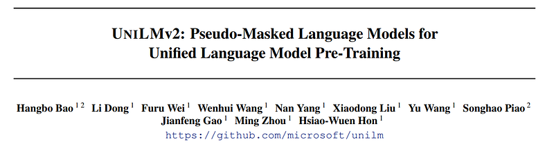
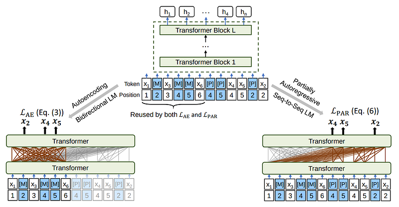
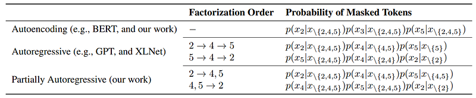
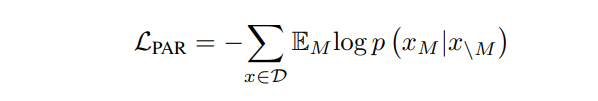
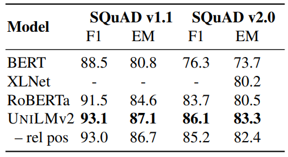
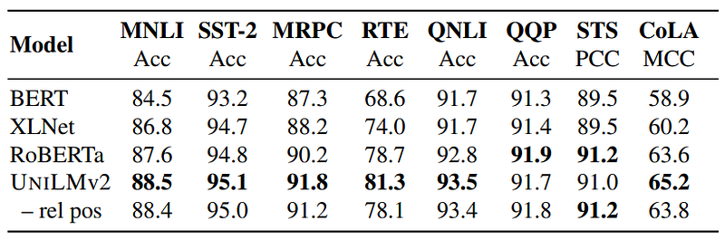
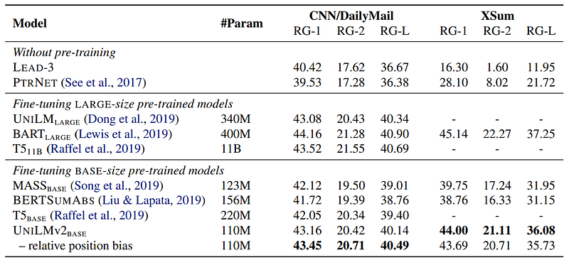
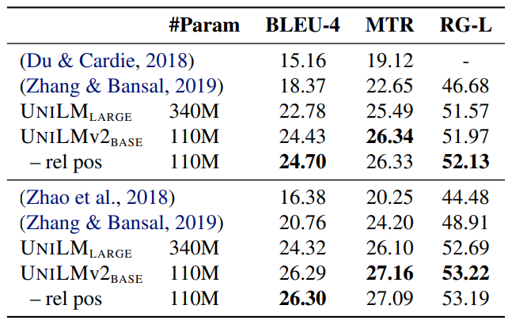

# Papers Explained 73 - UniLMv2

UniLMv2 introduces a novel training procedure, PMLM, which enables efficient learning of inter-relations between corrupted tokens and context via autoencoding, as well as intra-relations between masked spans via partially autoregressive modeling, significantly advancing the capabilities of language models in diverse NLP tasks.

This page ingests the source article into the wiki and connects it to [[Papers Explained Corpus]], [[Large Language Models]], [[Model Compression and Efficiency]], [[Safety and Alignment]], [[Embedding and Retrieval]].

## Source Metadata

- Source file: `raw/2023-11-24_Papers-Explained-73--UniLMv2-5a044ca7c525.html`
- Source title: Papers Explained 73: UniLMv2
- Published: 2023-11-24
- Canonical: [https://medium.com/@ritvik19/papers-explained-unilmv2-5a044ca7c525](https://medium.com/@ritvik19/papers-explained-unilmv2-5a044ca7c525)

## Key Ideas

- UniLMv2 introduces a novel training procedure, PMLM, which enables efficient learning of inter-relations between corrupted tokens and context via autoencoding, as well as intra-relations between masked spans via partially autoregressive modeling...
- Both bidirectional and sequence-to-sequence LMs are jointly pre trained with the same input text and masked positions. Both the special tokens [M] and [P] emit predicted tokens.
- Autoencoding, similar to BERT, predicts tokens based on context. Given an input sequence x with certain masked positions M, the model predicts the masked tokens using the context (all input tokens except the masked ones).
- This method proposes pre-training models that predict tokens in a partially autoregressive manner. It introduces a factorization order M that determines which tokens to predict in each step.
- The masking policy randomly selects 15% of tokens for masking during pre-training. Among these, 40% of the time, it masks a continuous text span, while 60% of the time, it masks a single token. This process is repeated until enough tokens are masked.

## Notes

UniLMv2 introduces a novel training procedure, PMLM, which enables efficient learning of inter-relations between corrupted tokens and context via autoencoding, as well as intra-relations between masked spans via partially autoregressive modeling, significantly advancing the capabilities of language models in diverse NLP tasks.

*Figure: Overview of PMLM pre-training. The model parameters are shared across the LM objectives.*

## Pre Training Tasks

Both bidirectional and sequence-to-sequence LMs are jointly pre trained with the same input text and masked positions. Both the special tokens [M] and [P] emit predicted tokens. The training objective is to maximize the likelihood of correct tokens, which considers both types of LMs in one example.

### Autoencoding Modeling

Autoencoding, similar to BERT, predicts tokens based on context. Given an input sequence x with certain masked positions M, the model predicts the masked tokens using the context (all input tokens except the masked ones). The loss function for training this model is based on the negative log likelihood of predicting the masked tokens.

*Figure: where D is the training corpus.*

### Partially Autoregressive Modeling

This method proposes pre-training models that predict tokens in a partially autoregressive manner. It introduces a factorization order M that determines which tokens to predict in each step. It can predict single tokens or spans of text in each step, unlike fully autoregressive models like GPT. The pre-training loss is defined based on the expectation over different factorization distributions.

*Figure: where EM is the expectation over the factorization distribution.*

Blockwise Masking and Factorization

The masking policy randomly selects 15% of tokens for masking during pre-training. Among these, 40% of the time, it masks a continuous text span, while 60% of the time, it masks a single token. This process is repeated until enough tokens are masked. The randomly sampled factorization orders resemble permutation-based language modeling, as seen in XLNet, but with the ability to generate token spans at each step.

## Pseudo-Masked LM (PMLM)

PMLM is introduced to handle the issue of conditioning on different contexts in partially autoregressive language modeling. Instead of replacing tokens with masks as in typical masked language models, PMLM keeps original tokens unchanged and adds pseudo masks ([Pseudo] or [P]) to the input sequence. These pseudo tokens have the same position embedding as the corresponding original tokens. The model uses the top-layer hidden states of these pseudo tokens for MLM predictions, controlling accessible context for each token according to the factorization order.

Self-Attention Masks

To prevent information leakage during training, self-attention masks are used. These masks control which context a token can attend to when computing its contextualized representation. They prevent both explicit and implicit leakage of information during the prediction steps.

## Experiment Setup

The same model size as BERT Base is used, i.e., a 12-layer Transformer with 12 attention heads. The hidden size is 768, and the inner hidden size of the feed-forward network is 3072. The weight matrix of the softmax classifier is tied with the token embedding matrix. Relative position bias is also added to attention scores.

The 160GB text corpora from English Wikipedia, BookCorpus, OpenWebText, CC-News, and Stories is used for pre-training. Uncased WordPiece tokenization is used. The vocabulary size is 30, 522. The maximum length of input sequence is 512.

### Fine Tuning

For NLU tasks, the PMLM is fine-tuned as a bidirectional Transformer encoder. The input is “[SOS] TEXT [EOS]”.

For sequence-to-sequence generation tasks, the example is concatenated as “[SOS] SRC [EOS] TGT [EOS]”.

For a source sequence, the dependencies between the tokens are bidirectional, i.e., all the source tokens can attend to each other. In contrast, the target sequence is produced in an autoregressive manner. So a pseudo mask [P] is appended for each target token, and self attention masks are used to perform autoregressive generation.

## Evaluation

### Question Answering

*Figure: Results of BASE-size pre-trained models on the SQuAD v1.1/v2.0 development sets.*

- UniLMv2 BASE outperforms other models on both SQuAD datasets.

### GLUE Benchmark

*Figure: Results of BASE-size models on the development set of the GLUE benchmark.*

- UniLMv2 BASE outperforms RoBERTa BASE in 6 out of 8 tasks in terms of accuracy, with MNLI accuracy being 88.4 compared to RoBERTa BASE’s 87.6.

### Abstractive Summarization

*Figure: Abstractive summarization results on CNN/DailyMail and XSum.*

- Despite PMLM having the smallest size among the compared models, UNILMv2BASE outperforms other BASE-size pre-trained models on both datasets.

### Question Generation

*Figure: Results on question generation.*

- UniLMv2 BASE, based on pre-trained models, outperforms UniLM LARGE and several baselines which incorporate additional features or techniques.

## Paper

UniLMv2: Pseudo-Masked Language Models for Unified Language Model Pre-Training [2002.12804](https://arxiv.org/abs/2002.12804)

## Figures

Figures from the Medium HTML export (`raw/2023-11-24_Papers-Explained-73--UniLMv2-5a044ca7c525.html`); local copies under `wiki/assets/papers-explained-73-unilmv2/` when download succeeded.

| Figure | Caption |
|--------|---------|
|  | Title card: UniLMv2. |
|  | Overview of PMLM pre-training. The model parameters are shared across the LM objectives. |
|  | Both bidirectional and sequence-to-sequence LMs are jointly pre trained with the same input text and masked positions. |
|  | where D is the training corpus. |
|  | where EM is the expectation over the factorization distribution. |
|  | Results of BASE-size pre-trained models on the SQuAD v1.1/v2.0 development sets. |
|  | Results of BASE-size models on the development set of the GLUE benchmark. |
|  | Abstractive summarization results on CNN/DailyMail and XSum. |
|  | Results on question generation. |
## Related

- [[Papers Explained Corpus]]
- [[Large Language Models]]
- [[Model Compression and Efficiency]]
- [[Safety and Alignment]]
- [[Embedding and Retrieval]]
- [[Papers Explained 72 - UniLM]]
- [[Papers Explained 74 - T0]]

#summary #topic
