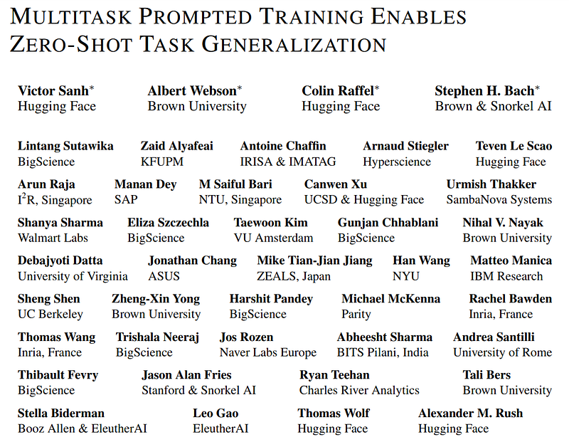
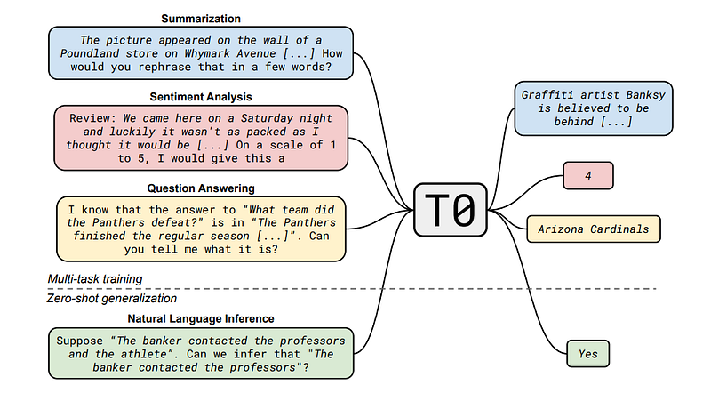
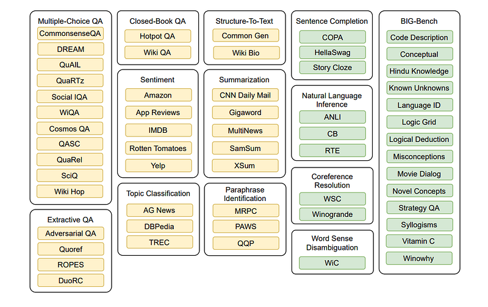
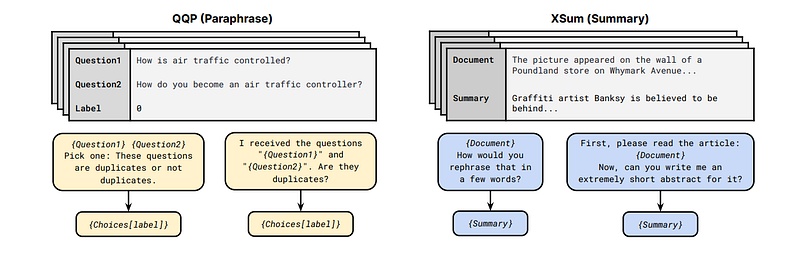
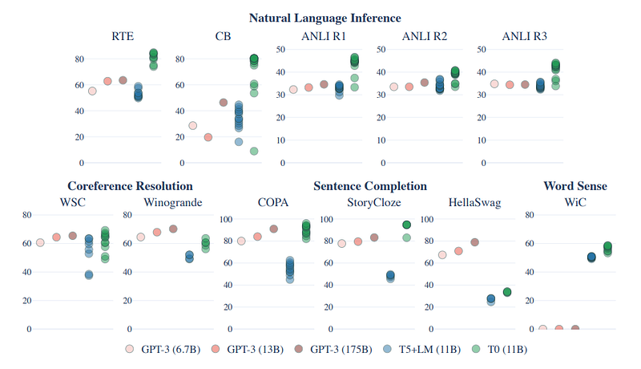
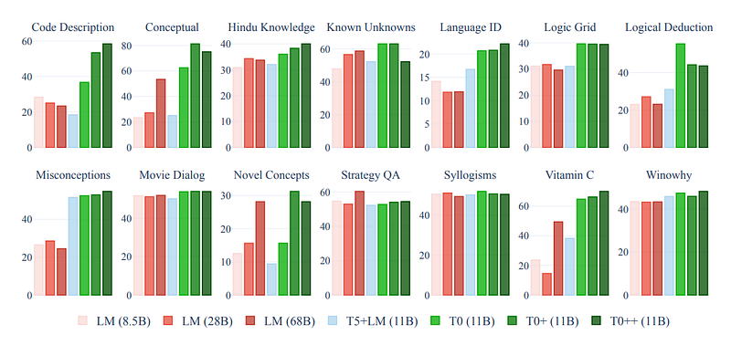
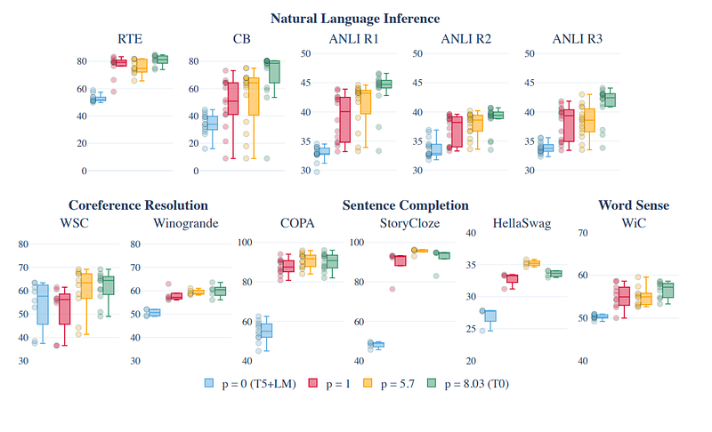
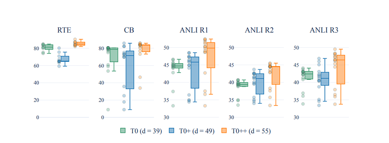

# Papers Explained 74 - T0

T0 is a fine tuned encoder-decoder model on a multitask mixture covering a wide variety of tasks. The model attains strong zero-shot performance on several standard datasets, often outperforming models up to 16× its size. The dataset is created by developing a system to map any natural language task into a human readable form.

This page ingests the source article into the wiki and connects it to [[Papers Explained Corpus]], [[Synthetic Data]], [[Reasoning Models]], [[Evaluation and Benchmarks]], [[Code Models]].

## Source Metadata

- Source file: `raw/2023-11-27_Papers-Explained-74--T0-643a53079fe.html`
- Source title: Papers Explained 74: T0
- Published: 2023-11-27
- Canonical: [https://medium.com/@ritvik19/papers-explained-74-t0-643a53079fe](https://medium.com/@ritvik19/papers-explained-74-t0-643a53079fe)

## Key Ideas

- T0 is a fine tuned encoder-decoder model on a multitask mixture covering a wide variety of tasks. The model attains strong zero-shot performance on several standard datasets, often outperforming models up to 16× its size.
- Various NLP datasets are partitioned into different tasks. To evaluate zero-shot generalization to new tasks, the model is trained on a subset of tasks and evaluated on a held out group of tasks.
- In total 62 datasets with publicly contributed prompts care grouped into 12 tasks
- Also the model is further evaluated on a subset of BIG-Bench which is a community driven benchmark to create a diverse collection of difficult tasks to test the abilities of LLMs.
- All datasets are given to the model in natural language prompted form to enable zero shot experimentation. A prompt consists of an input template and a target template, along with a collection of associated metadata.

## Notes

T0 is a fine tuned encoder-decoder model on a multitask mixture covering a wide variety of tasks. The model attains strong zero-shot performance on several standard datasets, often outperforming models up to 16× its size. The dataset is created by developing a system to map any natural language task into a human readable form.

*Figure: T0 model and prompt format.*

## Approach

Various NLP datasets are partitioned into different tasks. To evaluate zero-shot generalization to new tasks, the model is trained on a subset of tasks and evaluated on a held out group of tasks.

In total 62 datasets with publicly contributed prompts care grouped into 12 tasks

*Figure: T0 datasets and task taxonomy.*

Also the model is further evaluated on a subset of BIG-Bench which is a community driven benchmark to create a diverse collection of difficult tasks to test the abilities of LLMs.

All datasets are given to the model in natural language prompted form to enable zero shot experimentation. A prompt consists of an input template and a target template, along with a collection of associated metadata.

*Figure: Prompt templates from the P3 prompt collection.*

To develop prompts, an interface is built and 36 contributors, affiliated with 24 institutions in d countries participate for interactively writing prompts on datasets.

Prompts are collected for English dataset excluding ones that included potentially harmful content or non-natural language such as programming languages. This collection is referred to as the Public Pool of Prompts (P3), containing 2073 prompts for 177 datasets (11.7 prompts per dataset on average).

Prompts used in experiments are all sourced from P3 except for BIG-bench, the prompts of which are provided by its maintainers.

## Experimental setup

T0, based on T5 uses an encoder-decoder architecture with input text fed to the encoder and target text produced by the decoder. The model is trained to autoregressive generate the target through standard maximum likelihood training. Unlike decoder-only language models such as GPT-3, it is never trained to generate the input.

- T0 is trained on the multitask mixture P3

- T0+ is the same model with identical hyperparameters except trained on a mixture that adds GPT-3’s evaluation datasets.

- T0++ further adds SuperGLUE to the training mixture (except RTE and CB), which leaves NLI and the BIG-bench tasks as the only held-out tasks.

All the T0 variants are initialized from the 11B parameters version of the LM-adapted T5 model (referred to as T5+LM).

## Evaluation

### Generalization to Held-out Tasks

*Figure: Results for T0 task generalization experiments compared to GPT-3.*

- Multitask prompted training (T5+LM) leads to significant gains over the baseline on all datasets.

- T0 matches or exceeds the performance of all GPT-3 models on 9 out of 11 held-out datasets.

- T0 outperforms GPT-3 on all NLI datasets despite not being trained on natural language inference.

*Figure: Results for a subset of BIG-bench which has available baselines.*

- At least one T0 variant outperforms all baseline models on most tasks except for StrategyQA.

- Performance of models generally improves with an increase in the number of training datasets (T0++ > T0+ > T0).

### Prompt Robustness

Effect of More Prompts per Dataset

*Figure: Effect of more prompts per dataset.*

- Analysis focuses on comparing T0 with different numbers of prompts per dataset (p).

- Comparison includes T0, p = 1 (one original-task prompt per dataset), p = 5.7 (all original-task prompts for all datasets), and p = 0 (corresponding to T5+LM without prompted training).

- Performance on held-out tasks can improve with just one prompt per dataset, although the spread (interquartile range) doesn’t consistently improve with p = 1.

- Increasing p from 1 to an average of 5.7 leads to additional improvement in both median and spread for most datasets.

- Training on all prompts, including non-original-task prompts, further improves the median and spread, showing the benefit of non-original-task prompts in training.

Effect of Prompts from More Datasets

*Figure: Effect of prompts from more datasets.*

- Experiment involves fixing p (prompts) and increasing d (dimensionality) from 39 to 49 to 55 (T0, T0+, T0++).

- Median performance of all 5 held-out datasets increases as d increases from 39 to 49.

- Spread in performance decreases for only 1 out of 5 datasets when d increases from 39 to 49.

- Some datasets, like ANLI, have prompts that consistently perform poorly, affecting the spread of performance.

- For datasets like CB, the spread decreases with T0+ (d increasing from 39 to 49).

- As d increases from 49 to 55, median performance increases for all datasets.

- Spread in performance decreases for 2 out of 5 datasets when d increases from 49 to 55.

- Increasing d does not consistently make the model more robust to different prompt wordings.

## Paper

Multitask Prompted Training Enables Zero-Shot Task Generalization [2110.08207](https://arxiv.org/abs/2110.08207)

## Figures

Figures from the Medium HTML export (`raw/2023-11-27_Papers-Explained-74--T0-643a53079fe.html`); local copies under `wiki/assets/papers-explained-74-t0/` when download succeeded.

| Figure | Caption |
|--------|---------|
|  | Title card: T0. |
|  | T0 model and prompt format. |
|  | T0 datasets and task taxonomy. |
|  | Prompt templates from the P3 prompt collection. |
|  | Results for T0 task generalization experiments compared to GPT-3. |
|  | Results for a subset of BIG-bench which has available baselines. |
|  | Effect of more prompts per dataset. |
|  | Effect of prompts from more datasets. |
## Related

- [[Papers Explained Corpus]]
- [[Synthetic Data]]
- [[Reasoning Models]]
- [[Evaluation and Benchmarks]]
- [[Code Models]]
- [[Papers Explained 73 - UniLMv2]]
- [[Papers Explained 75 - Flan T5, Flan PaLM]]

#summary #topic
