# Papers Explained 75 - Flan T5, Flan PaLM

This paper explores instruction fine tuning with a particular focus on (1) scaling the number of tasks, (2) scaling the model size, and (3) fine tuning on chain-of-thought data.

This page ingests the source article into the wiki and connects it to [[Papers Explained Corpus]], [[Large Language Models]], [[Synthetic Data]], [[Reasoning Models]], [[Supervised Fine-Tuning]].

## Source Metadata

- Source file: `raw/2023-12-01_Papers-Explained-75--Flan-T5--Flan-PaLM-caf168b6f76.md`
- Source title: Papers Explained 75: Flan T5, Flan PaLM
- Published: 2023-12-01
- Canonical: [https://medium.com/@ritvik19/papers-explained-75-flan-t5-flan-palm-caf168b6f76](https://medium.com/@ritvik19/papers-explained-75-flan-t5-flan-palm-caf168b6f76)

## Key Ideas

- The instruction finetuning is performed on a collection of data sources with a variety of instruction template types.
- This finetuning procedure is called Flan (Fine Tuning language models), and “Flan” is prepended to the resulting fine tuned models (e.g., Flan-PaLM).
- It is demonstrated that Flan works across several model sizes and architectures.
- Multi-task instruction fine-tuning consistently enhances performance across all three model sizes, with gains ranging from 9.4% to 15.5%.
- Increasing the number of fine-tuning tasks improves performance, with the majority of the improvement occurring up to 282 tasks.

## Notes

This paper explores instruction fine tuning with a particular focus on (1) scaling the number of tasks, (2) scaling the model size, and (3) fine tuning on chain-of-thought data.

The instruction finetuning is performed on a collection of data sources with a variety of instruction template types.

*Figure: The finetuning data comprises 473 datasets, 146 task categories, and 1,836 total tasks.*

This finetuning procedure is called Flan (Fine Tuning language models), and “Flan” is prepended to the resulting fine tuned models (e.g., Flan-PaLM).

*Figure: Combinations of finetuning data formats.*

It is demonstrated that Flan works across several model sizes and architectures.

*Figure: Across several models, instruction finetuning only costs a small amount of compute relative to pre-training.*

## Evaluation

### Scaling to 540B parameters and 1.8K tasks

*Figure: Scaling behavior of multi-task instruction finetuning with respect to model size (# parameters) and number of finetuning tasks.*

- Multi-task instruction fine-tuning consistently enhances performance across all three model sizes, with gains ranging from 9.4% to 15.5%.

- Increasing the number of fine-tuning tasks improves performance, with the majority of the improvement occurring up to 282 tasks.

- There are two potential explanations for the limited gain beyond 282 tasks: a lack of task diversity or diminishing returns due to the model already learning from pretraining data.

- Scaling up the model size by an order of magnitude (e.g., 8B to 62B or 62B to 540B) significantly boosts performance for both fine-tuned and non-fine-tuned models.

*Figure: Individual benchmark results.*

### Finetuning with chain-of-thought annotations

*Figure: CoT prompting abilities of Flan-PaLM*

- Inclusion of nine datasets with chain-of-thought (CoT) annotations in finetuning mixture enhances reasoning ability.

- Flan-PaLM outperforms PaLM in CoT prompting abilities on four held-out evaluation benchmarks.

- CoT prompting combined with self-consistency (SC) achieves new state-of-the-art performance on several benchmarks.

- Flan-PaLM 540B achieves 75.2% on the MMLU benchmark, surpassing prior models.

- Flan-PaLM with CoT + SC significantly improves performance on the MGSM benchmark for multilingual math problems.

- Flan-PaLM with CoT + SC achieves a new state of the art of 83.9% on the GSM8K benchmark.

- Flan-PaLM does not achieve the state of the art compared to specialized models in tasks that require symbolic manipulation.

- While Flan-PaLM outperforms PaLM by 14.9% on one-shot TyDiQA, it still doesn’t match the performance of ByT5 finetuned on the TyDiQA training set.

*Figure: The effect of including CoT datasets in instruction finetuning.*

- Evaluations are stratified into held-out CoT benchmarks (MMLU, BBH, MGSM) and held-out non-CoT benchmarks (MMLU, BBH, TyDiQA).

- Performance on held-out CoT benchmarks is stronger with combined non-CoT and CoT fine-tuning compared to just CoT fine-tuning.

- Fine-tuning on combined CoT and non-CoT does not compromise performance on non-CoT tasks.

- Critical to fine-tune on some CoT examples to maintain reasoning abilities; fine-tuning on only non-CoT degrades CoT performance significantly.

- Both non-CoT and CoT data are needed to improve model ability on all evaluations.

*Figure: Zero-shot performance of PaLM and Flan-PaLM on a set of 23 challenging BIG-Bench tasks.*

- Instruction fine-tuning on CoT data, with or without exemplars, has benefits, as it allows the model to perform CoT reasoning in a zero-shot setting.

- Flan-PaLM models achieve improved performance on the BBH benchmark with 23 unseen challenging BIG-Bench tasks.

- PaLM without fine-tuning cannot generate CoT reasoning to solve these problems.

### Putting it all together

- T5 models benefit the most from instruction finetuning compared to their non-finetuned counterparts.

- The strongest overall model combines instruction finetuning with UL2 continued pre-training, demonstrating the complementary nature of these methods in improving language model performance without increasing model scale.

## Paper

Scaling Instruction-Finetuned Language Models [2210.11416](https://arxiv.org/abs/2210.11416)

## Figures

Figures from the Medium HTML export (`raw/2023-12-01_Papers-Explained-75--Flan-T5--Flan-PaLM-caf168b6f76.md`); local copies under `wiki/assets/papers-explained-75-flan-t5-flan-palm/` when download succeeded.

| Figure | Caption |
|--------|---------|
| 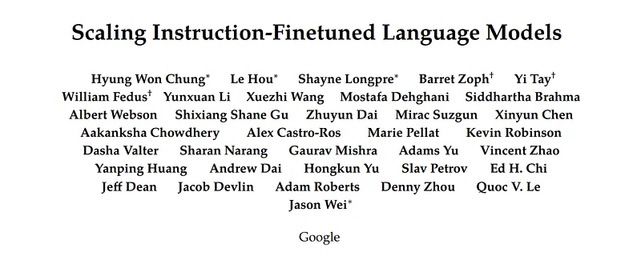 | Title card: Flan T5, Flan PaLM. |
| 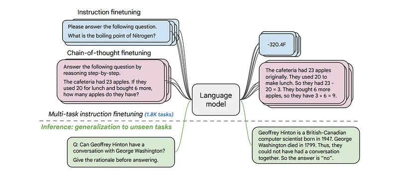 | The instruction finetuning is performed on a collection of data sources with a variety of instruction template types. |
| 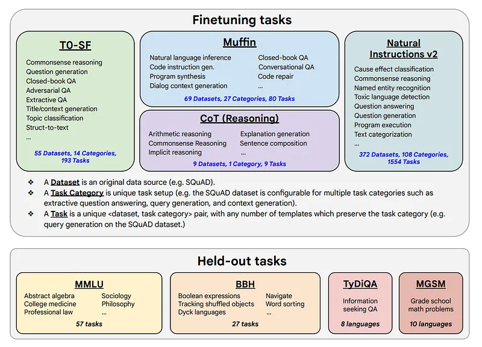 | The finetuning data comprises 473 datasets, 146 task categories, and 1,836 total tasks. |
| 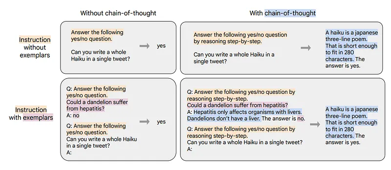 | Combinations of finetuning data formats. |
| 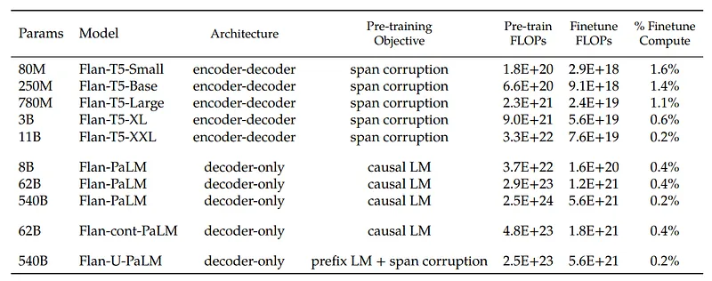 | Across several models, instruction finetuning only costs a small amount of compute relative to pre-training. |
| 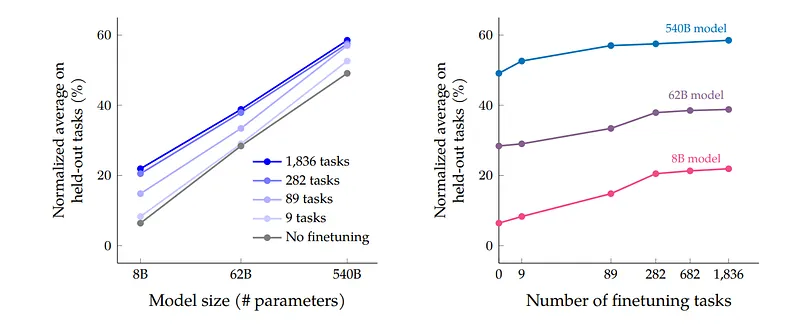 | Scaling behavior of multi-task instruction finetuning with respect to model size (# parameters) and number of finetuning tasks. |
| 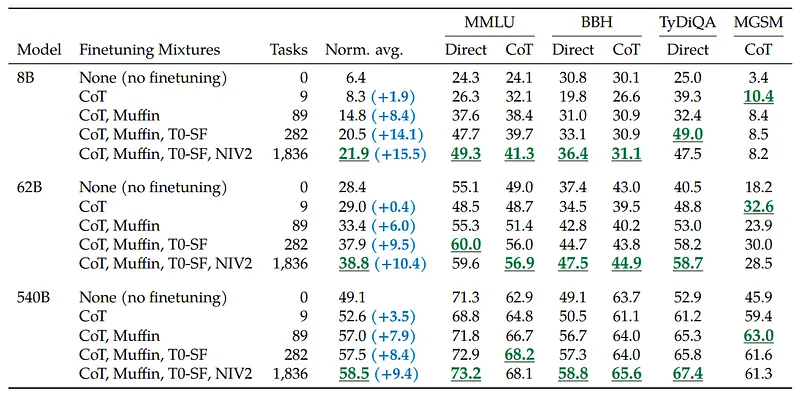 | Individual benchmark results. |
| 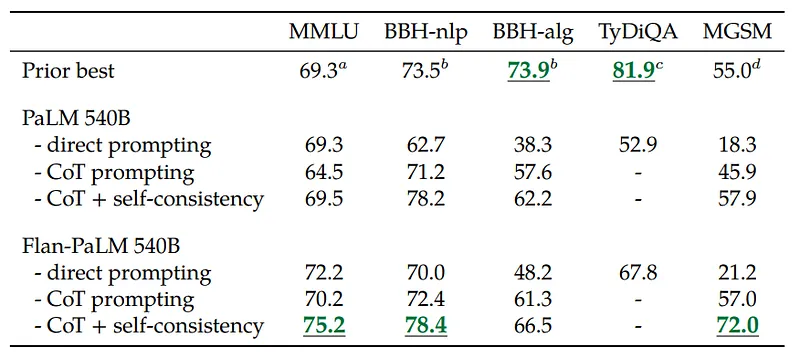 | CoT prompting abilities of Flan-PaLM. |
| 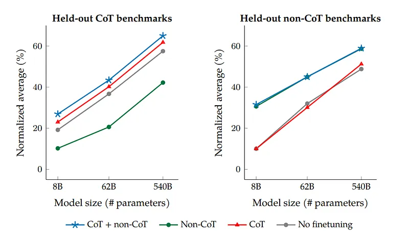 | The effect of including CoT datasets in instruction finetuning. |
| 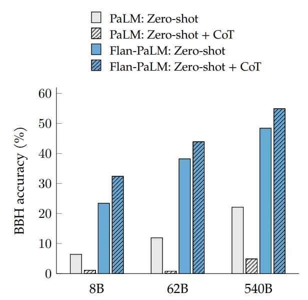 | Zero-shot performance of PaLM and Flan-PaLM on a set of 23 challenging BIG-Bench tasks. |
| 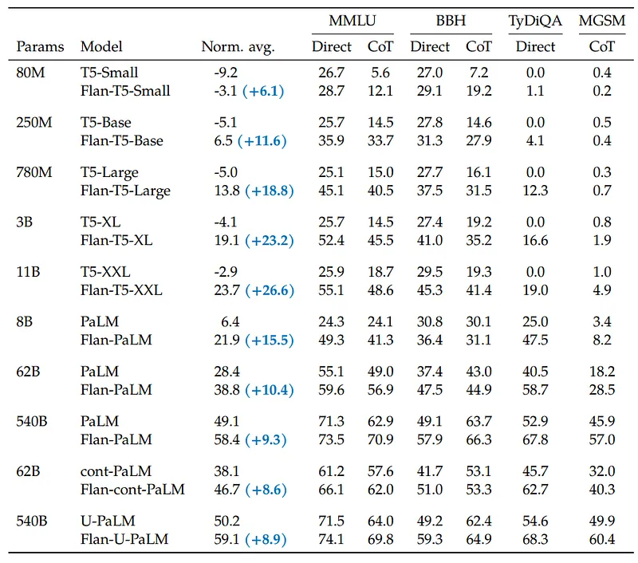 | It is demonstrated that Flan works across several model sizes and architectures. |
## Related

- [[Papers Explained Corpus]]
- [[Large Language Models]]
- [[Synthetic Data]]
- [[Reasoning Models]]
- [[Supervised Fine-Tuning]]
- [[Papers Explained 74 - T0]]
- [[Papers Explained 76 - LaMDA]]

#summary #topic
