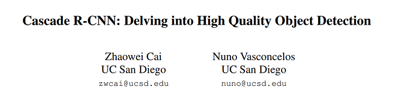
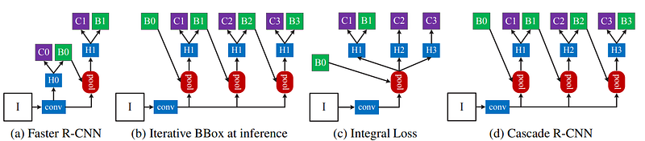
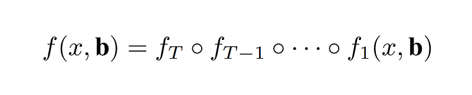
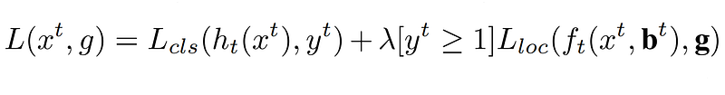

# Papers Explained 77 - Cascade RCNN

In Cascade R-CNN, bounding box regression is framed as a cascaded regression problem, relying on a cascade of specialized regressors.

This page ingests the source article into the wiki and connects it to [[Papers Explained Corpus]], [[Computer Vision]].

## Source Metadata

- Source file: `raw/2023-12-08_Papers-Explained-77--Cascade-RCNN-720b161d86e4.html`
- Source title: Papers Explained 77: Cascade RCNN
- Published: 2023-12-08
- Canonical: [https://medium.com/@ritvik19/papers-explained-77-cascade-rcnn-720b161d86e4](https://medium.com/@ritvik19/papers-explained-77-cascade-rcnn-720b161d86e4)

## Key Ideas

- Where T is the total number of cascade stages. Each regressor f_t in the cascade is optimized w.r.t. tm sample distribution b^t arriving at the corresponding stage, instead of the initial distribution of b¹. This cascade improves hypotheses progressively.
- There is no overfitting, since examples are plentiful at all levels, and the detectors of the deeper stages are optimized for higher IoU thresholds.
- At each stage t, the R-CNN includes a classifier ht and a regressor ft optimized for IoU threshold ut, where ut > ut−1. This is guaranteed by minimizing the loss
- where bt = ft−1(xt−1, bt−1), g is the ground truth object for xt, λ = 1 the trade-off coefficient, [·] the indicator function, and yt is the label of xt given ut.
- Cascade R-CNN: Delving into High Quality Object Detection [1712.00726](https://arxiv.org/abs/1712.00726)

## Notes

The Intersection over Union (IoU) threshold is crucial in object detection for defining positives and negatives. While low IoU thresholds can lead to noisy detections, increasing IoU thresholds can degrade performance due to overfitting and inference-time mismatch. To address this, the Cascade R-CNN architecture proposes a multi-stage approach where detectors are trained with progressively higher IoU thresholds, improving selectivity against false positives. This approach demonstrates superior performance on COCO dataset and is applicable across detector architectures.

*Figure: The architectures of different frameworks. “I” is input image, “conv” backbone convolutions, “pool” region-wise feature extraction, “H” network head, “B” bounding box, and “C” classification. “B0” is proposals in all architectures.*

## Cascaded Bounding Box Regression

In Cascade R-CNN, bounding box regression is framed as a cascaded regression problem, relying on a cascade of specialized regressors.

Where T is the total number of cascade stages. Each regressor f_t in the cascade is optimized w.r.t. tm sample distribution b^t arriving at the corresponding stage, instead of the initial distribution of b¹. This cascade improves hypotheses progressively.

## Cascaded Detection

The distribution of the initial hypotheses, e.g. RPN proposals, are heavily tilted towards low quality. This inevitably induces ineffective learning of higher quality classifiers. The Cascade R-CNN addresses the problem by relying on cascade regression as a resampling mechanism. Starting from a set of examples (xi, bi), cascade regression successively resamples an example distribution (x’i, b’i) of higher IoU. In this manner, it is possible to keep the set of positive examples of the successive stages at a roughly constant size, even when the detector quality (IoU threshold) is increased.

There is no overfitting, since examples are plentiful at all levels, and the detectors of the deeper stages are optimized for higher IoU thresholds.

At each stage t, the R-CNN includes a classifier ht and a regressor ft optimized for IoU threshold ut, where ut > ut−1. This is guaranteed by minimizing the loss

where bt = ft−1(xt−1, bt−1), g is the ground truth object for xt, λ = 1 the trade-off coefficient, [·] the indicator function, and yt is the label of xt given ut.

## Paper

Cascade R-CNN: Delving into High Quality Object Detection [1712.00726](https://arxiv.org/abs/1712.00726)

## Figures

Figures from the Medium HTML export (`raw/2023-12-08_Papers-Explained-77--Cascade-RCNN-720b161d86e4.html`); local copies under `wiki/assets/papers-explained-77-cascade-rcnn/` when download succeeded.

| Figure | Caption |
|--------|---------|
|  | Title card: Cascade RCNN. |
|  | The architectures of different frameworks. “I” is input image, “conv” backbone convolutions, “pool” region-wise feature extraction, “H” network head, “B” bounding box, and “C” classification. “B0” is proposals in all architectures. |
|  | In Cascade R-CNN, bounding box regression is framed as a cascaded regression problem, relying on a cascade of specialized regressors. |
|  | At each stage t, the R-CNN includes a classifier ht and a regressor ft optimized for IoU threshold ut, where ut > ut−1. |
## Related

- [[Papers Explained Corpus]]
- [[Computer Vision]]
- [[Papers Explained 76 - LaMDA]]
- [[Papers Explained 78 - GPT-NeoX-20B]]

#summary #topic
