# Papers Explained 81 - An In-depth Look at Gemini’s Language Abilities

A third-party, objective comparison of the abilities of the OpenAI GPT and Google Gemini models with reproducible code and fully transparent results. Code and data for reproduction can be found at [github](https://github.com/neulab/gemini-benchmark).

This page ingests the source article into the wiki and connects it to [[Papers Explained Corpus]], [[Large Language Models]], [[Code Models]], [[Evaluation and Benchmarks]], [[Reasoning Models]].

## Source Metadata

- Source file: `raw/2023-12-20_Papers-Explained-81--An-In-depth-Look-at-Gemini-s-Language-Abilities-540ca9046d8e.md`
- Source title: Papers Explained 81: An In-depth Look at Gemini’s Language Abilities
- Published: 2023-12-20
- Canonical: [https://medium.com/@ritvik19/papers-explained-81-an-in-depth-look-at-geminis-language-abilities-540ca9046d8e](https://medium.com/@ritvik19/papers-explained-81-an-in-depth-look-at-geminis-language-abilities-540ca9046d8e)

## Key Ideas

- Recommended Reading: [Papers Explained 80: Gemini 1.0](https://ritvik19.medium.com/papers-explained-80-gemini-1-0-97308ef96fcd)
- Across all tasks, as of December 19, 2023 Gemini’s Pro model achieved comparable but slightly inferior accuracy compared to the current version of OpenAI’s GPT 3.5 Turbo.
- Gemini Pro’s accuracy is lower than GPT 3.5 Turbo and notably lower than GPT 4 Turbo.
- Chain-of-thought prompting doesn’t significantly impact performance, suggesting limited benefits for knowledge-based tasks.
- Gemini Pro shows a biased label distribution, favoring the final choice “D” in multiple-choice questions.

## Notes

A third-party, objective comparison of the abilities of the OpenAI GPT and Google Gemini models with reproducible code and fully transparent results. Code and data for reproduction can be found at [github](https://github.com/neulab/gemini-benchmark).

Recommended Reading: [Papers Explained 80: Gemini 1.0](https://ritvik19.medium.com/papers-explained-80-gemini-1-0-97308ef96fcd)

*Figure: Main results of the benchmarking.*

Across all tasks, as of December 19, 2023 Gemini’s Pro model achieved comparable but slightly inferior accuracy compared to the current version of OpenAI’s GPT 3.5 Turbo.

### Knowledge-based QA

*Figure: Overall accuracy on MMLU with 5-shot prompts and chain-of-thought prompts.*

- Gemini Pro’s accuracy is lower than GPT 3.5 Turbo and notably lower than GPT 4 Turbo.

- Chain-of-thought prompting doesn’t significantly impact performance, suggesting limited benefits for knowledge-based tasks.

*Figure: Ratio of multiple-choice answers being predicted by models.*

- Gemini Pro shows a biased label distribution, favoring the final choice “D” in multiple-choice questions.

*Figure: Accuracy by each subtask on MMLU.*

*Figure: Tasks where Gemini Pro and GPT 3.5 prevail on MMLU.*

- Gemini Pro underperforms on most tasks compared to GPT 3.5, particularly in social sciences, humanities, STEM, and specialized domains.

- Gemini Pro Failure to return answers in some cases (notably in moral_scenarios and human_sexuality tasks).

- Poor performance in basic mathematical reasoning tasks like formal_logic and elementary_mathematics.

*Figure: Analysis of output length on MMLU.*

- Stronger models tend to output longer responses indicating complex reasoning.

- Gemini Pro’s accuracy is less influenced by output length, outperforming GPT 3.5 with longer responses.

- Gemini Pro and GPT 3.5 Turbo rarely produce long reasoning chains compared to GPT 4 Turbo.

### General-purpose Reasoning

*Figure: Overall accuracy on BIG-BenchHard.*

- Gemini Pro slightly underperforms compared to GPT 3.5 Turbo and significantly to GPT 4 Turbo.

- Mixtral model shows notably lower accuracy.

*Figure: Accuracy by question length on BIGBench-Hard.*

- Gemini Pro underperforms on longer, complex questions.

- GPT models, especially GPT 4 Turbo, exhibit robustness with minimal accuracy degradation on longer queries.

*Figure: Tasks where GPT 3.5 Turbo excels over Gemini Pro.*

- Gemini Pro notably struggles with ‘tracking_shuffled_objects’ tasks due to difficulty in maintaining object order.

*Figure: Tasks where Gemini Pro excels over GPT 3.5 Turbo.*

- Gemini Pro outperforms GPT 3.5 Turbo in tasks involving world knowledge, symbol manipulation, word sorting, and table parsing.

*Figure: Accuracy by answer types.*

- Gemini Pro performs poorly in Valid/Invalid answers for formal fallacies tasks.

- Excels in word rearrangement and symbol order tasks but struggles with multiple-choice questions.

- No distinct trend in task performance superiority between Gemini and GPT models for general-purpose reasoning.

- Suggestion to consider both Gemini and GPT models before choosing for such tasks.

### Mathematics

*Figure: Overall accuracy across four mathematical reasoning tasks.*

- Gemini Pro achieved slightly lower accuracy than GPT 3.5 Turbo and significantly lower accuracy than GPT 4 Turbo on benchmarks like GSM8K, SVAMP, and ASDIV, which involve diverse language patterns.

- All models performed well on the MAWPS benchmark, with over 90% accuracy, though Gemini Pro lagged slightly behind GPT models. Notably, GPT 3.5 Turbo outperformed GPT 4 Turbo on this benchmark.

- Mixtral model showed significantly lower accuracy compared to others.

*Figure: Accuracy by question length across four mathematical reasoning tasks.*

- Longer questions led to decreased accuracy for all models, similar to the trend observed in reasoning tasks on BIG-Bench Hard.

- GPT 3.5 Turbo outperformed Gemini Pro on shorter questions but dropped off more quickly. Gemini Pro showed comparable accuracy on longer questions.

*Figure: GSM8K accuracy by chain-of-thought length.*

- GPT 4 Turbo demonstrated robustness even with longer chains of thought compared to GPT 3.5 Turbo, Gemini Pro, and Mixtral.

- Gemini Pro outperformed GPT 3.5 Turbo in the most complex examples with chain-of-thought lengths exceeding 100 but performed worse in shorter examples.

*Figure: Accuracy by number of digits in the answer across four mathematical reasoning tasks.*

- Models’ performance varied concerning the number of digits in the answers.

- GPT 3.5 Turbo appeared more robust with multi-digit math problems, while Gemini Pro degraded more on problems with more digits.

## Code Generation

*Figure: Overall accuracy on code generation tasks.*

- Gemini Pro’s Pass@1 is lower than GPT 3.5 Turbo and much lower than GPT 4 Turbo on both tasks.

- Indicates that Gemini’s code generation capabilities need improvement.

*Figure: Comparison of Pass@1 w.r.t. gold solution length.*

- Gemini Pro compares favourably with GPT 3.5 on easier cases (solution length below 100).

- Falls significantly behind as the solution length increases.

- Contrast to previous sections where Gemini Pro performed well with longer inputs and outputs in English language tasks.

*Figure: Comparison of Pass@1 w.r.t. the libraries used by gold solution.*

- Gemini Pro performs worse than GPT 3.5 on most library-used cases like mock, pandas, numpy, and datetime.

- Outperforms GPT 3.5 and GPT 4 on matplotlib cases, showcasing stronger capabilities in drawing visualization via code.

- Gemini Pro performs worse than GPT 3.5 in choosing functions and arguments from the Python API.

## Machine Translation

*Figure: Machine translation performance (chRF (%) scores) across models for all languages using 0-shot prompt. Best scores are bolded, second best underlined.*

*Figure: Machine translation performance (chRF (%) scores) models for all languages using 5-shot prompt. Best scores are bolded, second best underlined.*

- Compared Gemini Pro, GPT 3.5 Turbo, and GPT 4 Turbo against Google Translate and NLLB-MoE.

- Google Translate generally outperformed, followed by NLLB in specific settings.

- Gemini Pro outperformed GPT 3.5 Turbo and GPT 4 Turbo in some languages but exhibited blocking tendencies.

*Figure: Number of samples that are blocked by Gemini Pro.*

*Figure: Performance in chrf (%) on blocked and unblocked samples.*

- Gemini Pro demonstrated lower performance due to a tendency to block responses in some language pairs.

- Performance outperformed GPT 3.5 Turbo and GPT 4 Turbo in unblocked samples with higher confidence.

- GPT 4 Turbo and GPT 3.5 Turbo faced challenges in translating specific samples.

- Gemini Pro’s subpar performance noted when 0-shot blocked responses, but 5-shot did not, and vice versa.

- Few-shot prompts generally led to a modest enhancement in average performance.

- Increasing variance pattern observed: GPT 4 Turbo < GPT 3.5 Turbo < Gemini Pro.

### Web Agents

*Figure: Performances on WebArena.*

- Gemini-Pro performed slightly worse overall compared to GPT-3.5-Turbo.

- Outperformed GPT-3.5-Turbo on multi-site tasks but worse on gitlab and maps.

- Showed similar performance to GPT-3.5-Turbo on shopping admin and reddit tasks.

*Figure: UA prediction count.*

- Gemini-Pro tended to predict tasks as unachievable more often, especially when given a UA hint.

- Predicted over 80.6% of tasks as unachievable with a UA hint, compared to GPT-3.5-Turbo’s 47.7%.

- Both models significantly over-predicted unachievable tasks (4.4% actual).

*Figure: Model behaviors on WebArena.*

- Gemini-Pro tended to respond with shorter phrases and fewer steps to reach conclusions.

- More than half of Gemini trajectories were under ten steps, while others typically ranged between 10 and 30 steps for GPT 3.5 Turbo and GPT 4 Turbo.

- Majority of Gemini responses were less than 100 characters, whereas other models produced responses over 300 characters.

### Conclusion

> The Gemini Pro model, which is comparable to GPT 3.5 Turbo in model size and class, generally achieves accuracy that is comparable but somewhat inferior to GPT 3.5 Turbo, and much worse than GPT 4. It outperforms Mixtral on every task that we examined.

> In particular, we find that Gemini Pro was somewhat less performant than GPT 3.5 Turbo on average, but in particular had issues of bias to response order in multiple-choice questions, mathematical reasoning with large digits, premature termination of agentive tasks, as well as failed responses due to aggressive content filtering.

> On the other hand, there were bright points: Gemini performed better than GPT 3.5 Turbo on particularly long and complex reasoning tasks, and also was adept multilingually in tasks where responses were not filtered.

## Paper

An In-depth Look at Gemini’s Language Abilities [2312.11444](https://arxiv.org/abs/2312.11444)

## Figures

Figures from the Medium HTML export (`raw/2023-12-20_Papers-Explained-81--An-In-depth-Look-at-Gemini-s-Language-Abilities-540ca9046d8e.md`); local copies under `wiki/assets/papers-explained-81-an-in-depth-look-at-gemini-s-language-abilities/` when download succeeded.

| Figure | Caption |
|--------|---------|
| 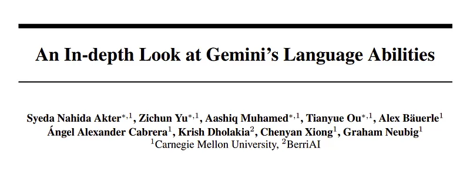 | Title card: An In-depth Look at Gemini’s Language Abilities. |
| 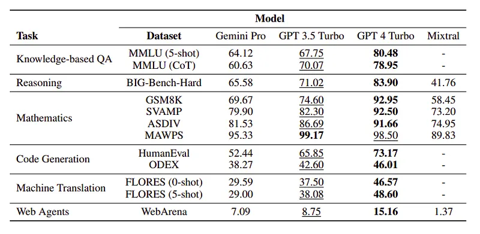 | Main results of the benchmarking. |
| 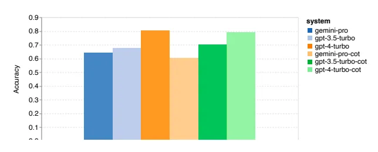 | Overall accuracy on MMLU with 5-shot prompts and chain-of-thought prompts. |
| 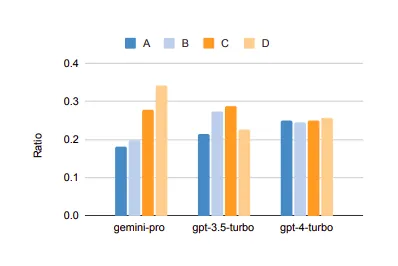 | Ratio of multiple-choice answers being predicted by models. |
| 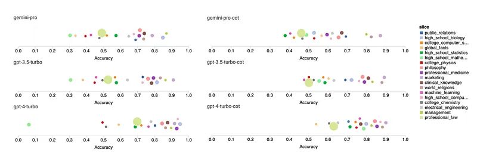 | Accuracy by each subtask on MMLU. |
| 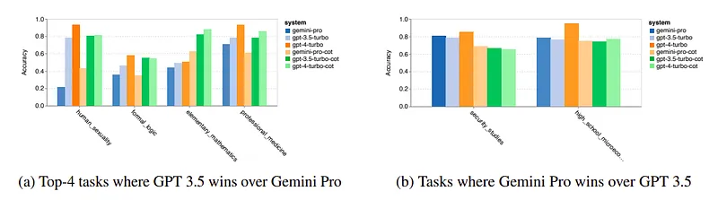 | Tasks where Gemini Pro and GPT 3.5 prevail on MMLU. |
| 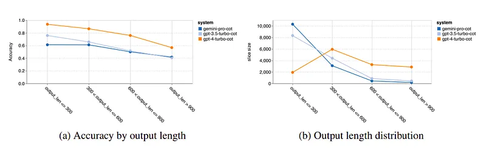 | Analysis of output length on MMLU. |
| 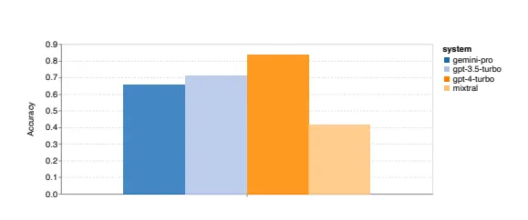 | Overall accuracy on BIG-BenchHard. |
| 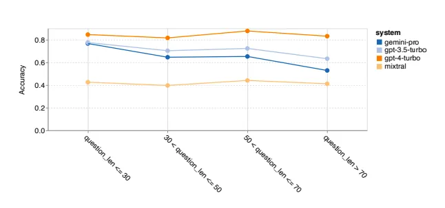 | Accuracy by question length on BIGBench-Hard. |
| 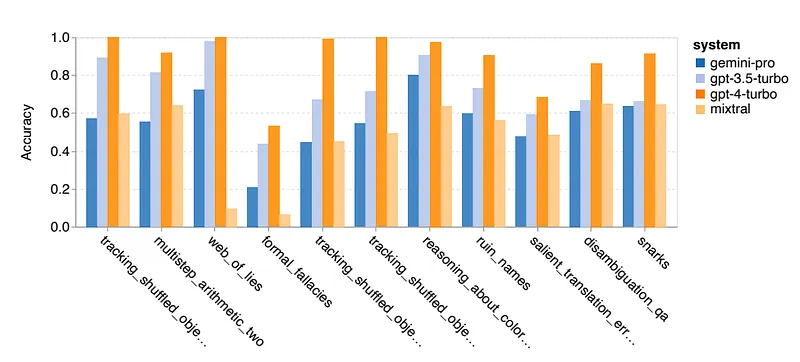 | Tasks where GPT 3.5 Turbo excels over Gemini Pro. |
| 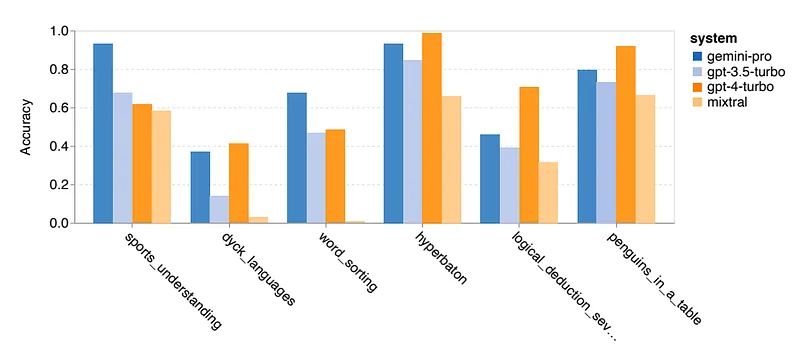 | Tasks where Gemini Pro excels over GPT 3.5 Turbo. |
| 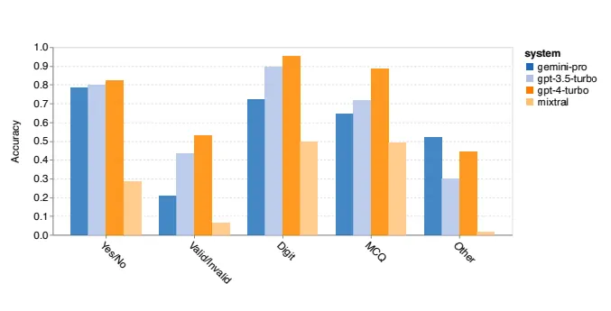 | Accuracy by answer types. |
| 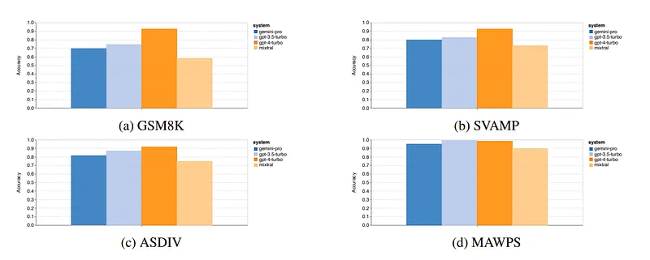 | Overall accuracy across four mathematical reasoning tasks. |
| 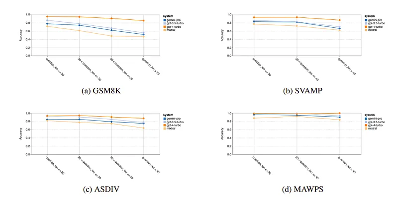 | Accuracy by question length across four mathematical reasoning tasks. |
| 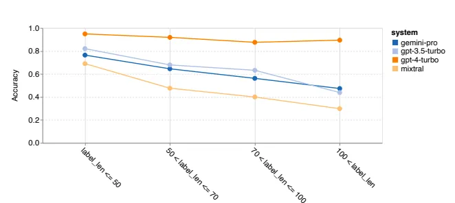 | GSM8K accuracy by chain-of-thought length. |
| 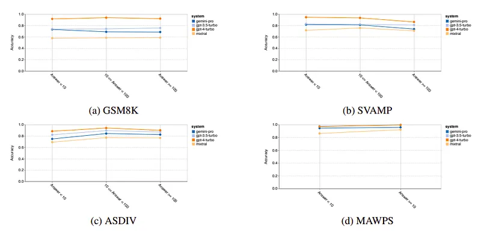 | Accuracy by number of digits in the answer across four mathematical reasoning tasks. |
| 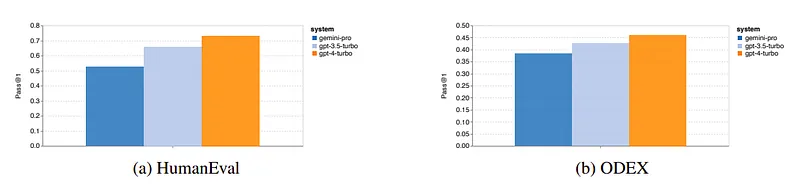 | Overall accuracy on code generation tasks. |
| 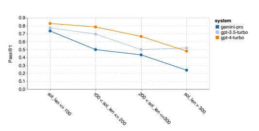 | Comparison of Pass@1 w.r.t. gold solution length. |
| 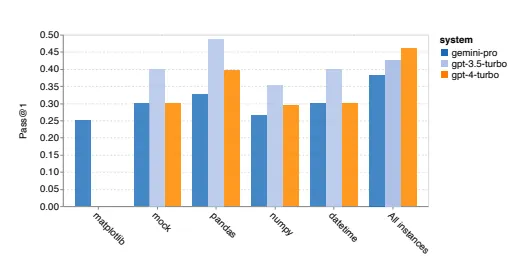 | Comparison of Pass@1 w.r.t. the libraries used by gold solution. |
| 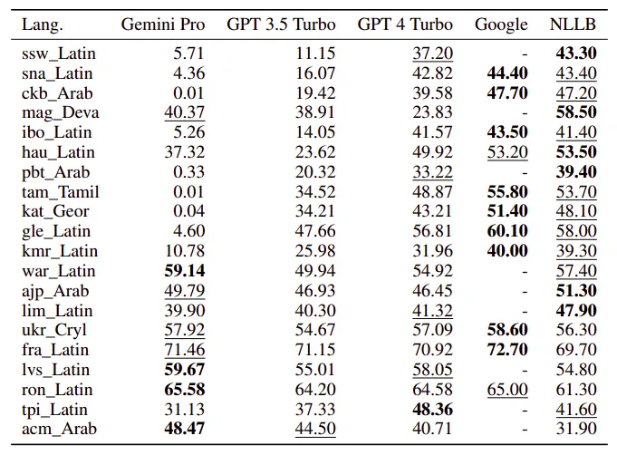 | Machine translation performance (chRF (%) scores) across models for all languages using 0-shot prompt. Best scores are bolded, second best underlined. |
| 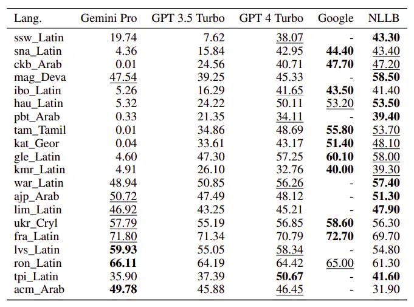 | Machine translation performance (chRF (%) scores) models for all languages using 5-shot prompt. Best scores are bolded, second best underlined. |
| 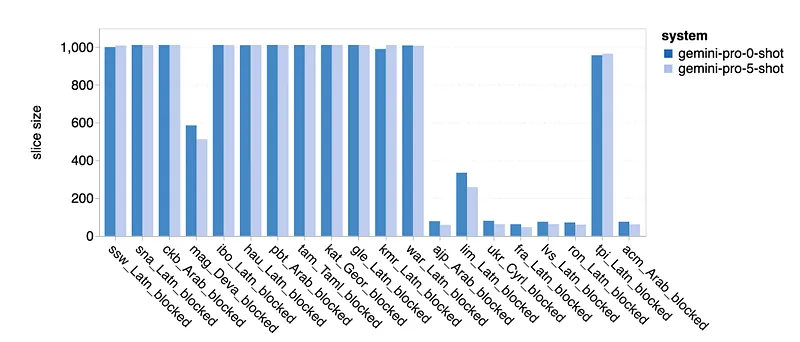 | Number of samples that are blocked by Gemini Pro. |
| 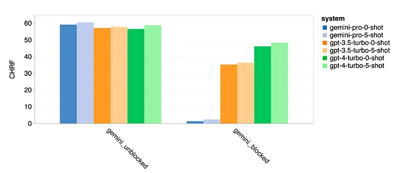 | Performance in chrf (%) on blocked and unblocked samples. |
| 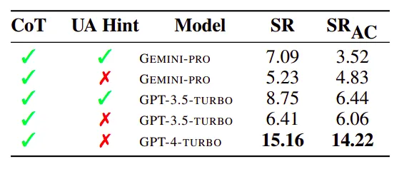 | Performances on WebArena. |
| 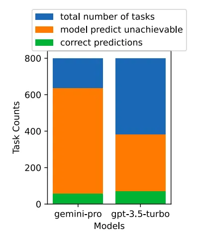 | UA prediction count. |
| 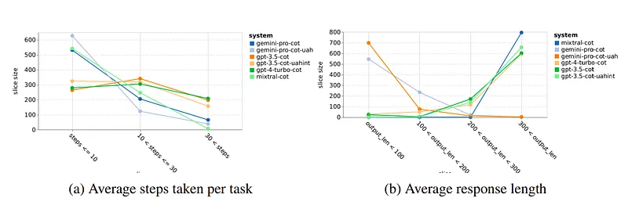 | Model behaviors on WebArena. |
## Related

- [[Papers Explained Corpus]]
- [[Large Language Models]]
- [[Code Models]]
- [[Evaluation and Benchmarks]]
- [[Reasoning Models]]
- [[Papers Explained 80 - Gemini 1.0]]
- [[Papers Explained 82 - Flamingo]]

#summary #topic
